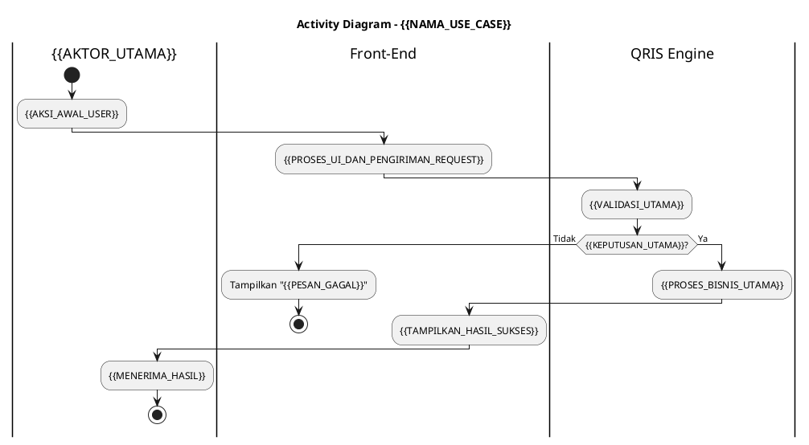
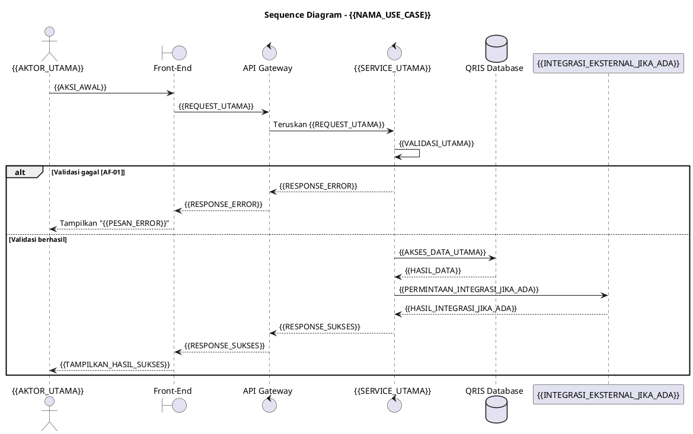

---
name: generate-fsd-use-case
description: Menyusun dan merapikan spesifikasi use case Functional Specification Document (FSD) dalam Markdown berbahasa Indonesia. Gunakan saat pengguna memberikan requirement, business flow, API flow, contoh use case, atau dokumen FSD dan meminta spesifikasi use case, main flow, alternative flow, status front-end, response code, diagram PlantUML, atau desain antarmuka dengan struktur yang konsisten, ringkas, dan siap ditempel ke dokumen.
---

# Generate FSD Use Case

Susun satu use case FSD dengan format baku di bawah. Pertahankan urutan bagian, nama kolom, gaya istilah, serta pola penomoran pada setiap keluaran.

## Prinsip Utama

1. Gunakan Bahasa Indonesia formal, teknis, ringkas, dan operasional.
2. Tulis dari sudut pandang fungsi sistem. Gunakan kalimat aktif.
3. Gunakan istilah `User`, `Front-End`, `Sistem`, `Service`, dan nama aktor secara konsisten.
4. Hindari penjelasan arsitektur yang tidak memengaruhi fungsi use case.
5. Jangan membuat fakta teknis yang tidak diberikan, termasuk endpoint, nama tabel, threshold, timeout, role, atau nama service. Gunakan `[TBD]` jika informasi belum tersedia. Khusus response code, gunakan pola kode otomatis yang ditetapkan pada bagian Response Code dan jangan menggunakan `[TBD]`.
6. Jangan menambah bagian di luar struktur baku.
7. Jangan menulis pembuka, kesimpulan, catatan pengerjaan, atau komentar setelah keluaran FSD.
8. Gunakan `-` untuk daftar di luar tabel dan ` ` untuk daftar di dalam sel tabel.
9. Jangan menggunakan em dash.

## Normalisasi Input

Sebelum menulis, identifikasi informasi berikut dari input:

- ID dan nama use case
- tujuan dan trigger
- aktor utama dan aktor pendukung
- pre-condition dan post-condition
- data atau tabel yang digunakan
- integrasi eksternal
- asumsi, keterbatasan, dan aturan bisnis
- alur utama dan kondisi gagal
- status yang benar-benar ditampilkan atau digunakan Front-End
- response code yang diterima Front-End
- referensi mockup atau desain antarmuka

Jika data tidak lengkap, tetap susun dokumen dan isi bagian tersebut dengan `[TBD]`, kecuali kolom Response Code. Ajukan pertanyaan hanya jika identitas atau tujuan utama use case tidak dapat ditentukan.

## Aturan Kompleksitas

### Main Flow

- Buat 6 sampai 15 langkah.
- Satu langkah memuat satu aktivitas utama.
- Gabungkan proses teknis internal yang berurutan menjadi satu langkah jika hasilnya sama bagi User.
- Mulai aktivitas dengan kata kerja, seperti `Membuka`, `Memilih`, `Memvalidasi`, `Memuat`, `Menyimpan`, atau `Menampilkan`.
- Akhiri dengan hasil yang dilihat User atau kondisi use case selesai.

### Alternative Flow

- Buat hanya kondisi yang mengubah hasil atau tampilan Front-End.
- Gunakan kode berurutan `AF-01`, `AF-02`, dan seterusnya.
- Tautkan setiap alternative flow ke nomor langkah main flow.
- Batasi 3 sampai 7 alternative flow, kecuali requirement secara eksplisit membutuhkan lebih banyak.
- Sertakan tindakan sistem dan pesan atau hasil yang diterima User.

### Status Front-End

- Cantumkan hanya status yang digunakan atau terlihat pada Front-End.
- Batasi 2 sampai 5 status.
- Gunakan nama status singkat dalam `UPPER_SNAKE_CASE`.
- Status yang lazim: `IDLE`, `LOADING`, `SUCCESS`, `ERROR`, `EMPTY`, `BLOCKED`, atau status bisnis yang benar-benar ditampilkan.
- Jangan mencantumkan status internal backend, audit, token, session, database, queue, atau integrasi jika Front-End tidak menggunakannya.
- Jangan menggunakan status proses internal seperti `TOKEN_VERIFIED`, `SESSION_CREATED`, `AUTHENTICATED`, atau `AUDIT_RECORDED` hanya karena proses tersebut ada di backend.

### Diagram

- Gunakan PlantUML.
- Activity diagram maksimal memiliki 5 swimlane dan 4 decision node utama. Swimlane backend service pada Activity Diagram wajib dinamai `QRIS Engine` (`|QRIS Engine|`). Buat Activity Diagram secara ringkas/high-level, sedangkan detail alur teknis dan interaksi lengkap cukup dijelaskan pada Sequence Diagram.
- Sequence diagram maksimal memiliki 6 participant dan 18 interaksi.
- Jika sequence diagram memiliki interaksi Front-End, tambahkan participant `API Gateway` di antara `Front-End` dan service.
- Front-End tidak boleh terhubung langsung ke service. Gunakan alur `Front-End -> API Gateway -> Service` dan respons `Service -> API Gateway -> Front-End`.
- Jika proses tidak melibatkan Front-End, jangan menambahkan Front-End atau API Gateway kecuali disebutkan dalam requirement.
- Beri nama participant database tepat `QRIS Database` dengan alias `db`.
- Tampilkan interaksi yang relevan terhadap fungsi, validasi utama, dan hasil Front-End.
- Gabungkan validasi teknis yang sejenis.
- Pastikan semua alternative flow penting tercermin tanpa mengulang detail response code.

### Validasi PlantUML

- Validasi activity diagram dan sequence diagram sebelum memberikan hasil.
- Pastikan setiap diagram memiliki tepat satu `@startuml` dan satu `@enduml`.
- Pastikan activity diagram memiliki `start`, kondisi `if/else/endif` yang seimbang, dan terminal `stop` atau `end` pada setiap jalur akhir.
- Pastikan sequence diagram mendeklarasikan seluruh participant dan alias sebelum digunakan.
- Pastikan blok `alt/else/end`, `opt/end`, dan `loop/end` berpasangan dengan benar.
- Pastikan tidak ada panah sequence yang mengarah ke alias yang belum dideklarasikan.
- Pastikan tidak ada placeholder `{{...}}` yang tersisa pada kode PlantUML final.
- Jika PlantUML renderer tersedia, render kedua diagram dan perbaiki seluruh syntax error sampai berhasil. Jangan mengklaim diagram berhasil dirender jika renderer tidak dijalankan.
- Jika renderer tidak tersedia, lakukan validasi struktural berdasarkan aturan di atas.
- Jangan menampilkan laporan validasi. Tampilkan hanya kode PlantUML yang sudah valid.

### Response Code

- Cantumkan hanya response code yang diterima Front-End dan memengaruhi alur atau tampilan.
- Batasi 5 sampai 10 response code.
- Gunakan satu kode sukses utama dan satu kode untuk setiap kelompok kegagalan yang berbeda di UI.
- Gabungkan kode yang menghasilkan tindakan dan pesan UI yang sama.
- Jangan membuat kode untuk setiap langkah internal.
- Selaraskan HTTP status dengan maknanya:
  - `200` untuk berhasil
  - `400` untuk request tidak valid
  - `401` untuk autentikasi gagal
  - `403` untuk akses ditolak
  - `404` untuk data utama tidak ditemukan
  - `422` untuk validasi bisnis gagal
  - `429` untuk batas percobaan
  - `500` untuk gangguan internal
  - `504` untuk timeout integrasi
- Selalu gunakan pola response code `HTTPXXNN` dengan ketentuan:
  - `HTTP` adalah tiga digit HTTP status, seperti `200`, `400`, atau `401`.
  - `XX` adalah karakter tetap dan harus ditulis apa adanya.
  - `NN` adalah nomor urut dua digit mulai dari `00`.
- Gunakan contoh pola `200XX00`, `200XX01`, `400XX00`, `401XX00`, dan seterusnya.
- Mulai kembali nomor urut dari `00` untuk setiap kelompok HTTP status.
- Pastikan setiap response code unik dalam satu use case.
- Jika pengguna memberikan response code resmi, pertahankan kode tersebut.
- Jangan pernah mengisi kolom Response Code dengan `[TBD]`, placeholder, atau kode tanpa `XX`.

## Konsistensi Antarbagian

Lakukan pemeriksaan berikut sebelum memberikan hasil:

1. Nama use case, aktor, sistem, service, tabel, dan integrasi harus sama di semua bagian.
2. Setiap `AF-xx` harus mengacu pada langkah main flow yang tersedia.
3. Setiap kegagalan utama pada alternative flow harus memiliki response code jika Front-End menerima respons API.
4. Setiap status harus memiliki kondisi pemicu yang terlihat pada main flow atau alternative flow.
5. Post-condition harus menggambarkan hasil akhir, bukan mengulang langkah proses.
6. Diagram tidak boleh memperkenalkan aktor, tabel, endpoint, atau aturan baru.
7. Pesan UI harus singkat, jelas, dan berorientasi pada tindakan User.
8. Gunakan istilah `login`, `User`, `Front-End`, dan istilah produk sesuai konvensi yang sudah ada pada input.
9. Setiap response code harus mengikuti pola `HTTPXXNN` dan tidak boleh berisi `[TBD]`.
10. Urutan konten wajib: Deskripsi Use Case, Main Flow, Alternative Flow, Status Frontend, Activity Diagram, Sequence Diagram, Response Code, lalu Desain Antarmuka.
11. Sequence yang memakai Front-End wajib melewati API Gateway dan database wajib bernama `QRIS Database`.
12. Activity diagram dan sequence diagram wajib lolos validasi PlantUML sebelum ditampilkan.

## Penomoran

- Jika pengguna memberikan nomor dasar bab atau subbab, gunakan nilai tersebut sebagai `{{BASE_SECTION}}` dan pertahankan penomorannya.
- Gunakan urutan subbagian tetap: `.1` Deskripsi Use Case, `.2` Main Flow, `.3` Alternative Flow, `.4` Status Frontend, `.5` Activity Diagram, `.6` Sequence Diagram, `.7` Response Code, dan `.8` Desain Antarmuka.
- Jika pengguna tidak memberikan nomor dasar bab atau subbab, hapus `{{BASE_SECTION}}` beserta titik pemisahnya sehingga heading menggunakan urutan `1` sampai `8`.
- Jika pengguna memberikan nomor tabel, pertahankan dan lanjutkan urutannya. Jika tidak, mulai dari `Tabel 1`.
- Jangan melompati nomor tabel.
- Jangan mengubah ID use case yang sudah diberikan.

## Format Keluaran Baku

Gunakan struktur berikut secara persis. Ganti seluruh placeholder `{{...}}` dengan data dari input atau `[TBD]`. Khusus kolom Response Code, hasilkan kode konkret dengan pola `HTTPXXNN` dan jangan gunakan `[TBD]`.

## {{BASE_SECTION}}.1 Deskripsi Use Case

**Tabel {{NO_TABEL_1}}: Deskripsi Use Case {{NAMA_USE_CASE}}**

| Elemen Spesifikasi | Deskripsi Detail |
| --- | --- |
| ID Use Case | {{ID_USE_CASE}} |
| Nama Use Case | {{NAMA_USE_CASE}} |
| Penjelasan Singkat | {{RINGKASAN_TUJUAN_DAN_CAKUPAN}} |
| Aktor Utama | {{AKTOR_UTAMA}} |
| Aktor Pendukung | {{AKTOR_PENDUKUNG}} |
| Deskripsi Singkat | {{DESKRIPSI_PROSES_DARI_TRIGGER_SAMPAI_HASIL}} |
| Pre-condition | 1. {{PRECONDITION_1}} 2. {{PRECONDITION_2}} |
| Post-condition | 1. {{POSTCONDITION_1}} 2. {{POSTCONDITION_2}} |
| Trigger | {{TRIGGER}} |
| Nama Tabel | {{NAMA_TABEL_ATAU_TIDAK_ADA}} |
| Integrasi | 1. {{INTEGRASI_1_DAN_FUNGSINYA}} 2. {{INTEGRASI_2_DAN_FUNGSINYA}} |
| Asumsi | 1. {{ASUMSI_1}} 2. {{ASUMSI_2}} |
| Keterbatasan | 1. {{KETERBATASAN_1}} 2. {{KETERBATASAN_2}} |
| Aturan Bisnis/Sistem | 1. **{{NAMA_ATURAN_1}}:** {{DESKRIPSI_ATURAN_1}} 2. **{{NAMA_ATURAN_2}}:** {{DESKRIPSI_ATURAN_2}} |

## {{BASE_SECTION}}.2 Main Flow

**Tabel {{NO_TABEL_2}}: Main Flow {{NAMA_USE_CASE}}**

| No. | Aktivitas | Deskripsi |
| ---: | --- | --- |
| 1 | {{AKTIVITAS_1}} | {{DESKRIPSI_1}} |
| 2 | {{AKTIVITAS_2}} | {{DESKRIPSI_2}} |
| 3 | {{AKTIVITAS_3}} | {{DESKRIPSI_3}} |
| ... | ... | ... |
| {{N}} | Use Case Selesai | {{HASIL_AKHIR_YANG_DITERIMA_USER}} |

## {{BASE_SECTION}}.3 Alternative Flow

**Tabel {{NO_TABEL_3}}: Alternative Flow {{NAMA_USE_CASE}}**

| Kode | Alternative Flow | Deskripsi |
| --- | --- | --- |
| AF-01 | {{NAMA_KONDISI_1}} | Pada langkah {{NO_LANGKAH}}, apabila {{KONDISI}}, Sistem {{TINDAKAN}} dan Front-End menampilkan `{{PESAN_ATAU_HASIL_UI}}`. |
| AF-02 | {{NAMA_KONDISI_2}} | Pada langkah {{NO_LANGKAH}}, apabila {{KONDISI}}, Sistem {{TINDAKAN}} dan Front-End menampilkan `{{PESAN_ATAU_HASIL_UI}}`. |

## {{BASE_SECTION}}.4 Status Frontend

**Tabel {{NO_TABEL_4}}: Status Frontend {{NAMA_USE_CASE}}**

| No. | Nama Status | Deskripsi Tampilan Front-End |
| ---: | --- | --- |
| 1 | {{STATUS_UI_1}} | {{KONDISI_DAN_TAMPILAN_YANG_DILIHAT_USER}} |
| 2 | {{STATUS_UI_2}} | {{KONDISI_DAN_TAMPILAN_YANG_DILIHAT_USER}} |

## {{BASE_SECTION}}.5 Activity Diagram {{NAMA_USE_CASE}}

## {{BASE_SECTION}}.6 Sequence Diagram {{NAMA_USE_CASE}}

Hapus participant database, participant eksternal, dan interaksinya jika tidak digunakan. Jika database digunakan, namanya wajib tetap `QRIS Database`. Jika use case tidak melibatkan Front-End, hapus aktor User, Front-End, dan API Gateway yang tidak relevan, lalu mulai diagram dari sistem atau service pemicu yang sebenarnya. Jangan menyisakan placeholder yang tidak relevan.

## {{BASE_SECTION}}.7 Response Code

**Tabel {{NO_TABEL_5}}: Response Code {{NAMA_USE_CASE}}**

| No. | HTTP Status | Response Code | Nama Response | Deskripsi | Respons Front-End |
| ---: | ---: | --- | --- | --- | --- |
| 1 | 200 | 200XX00 | {{NAMA_RESPONS_SUKSES}} | {{HASIL_SUKSES}} | {{AKSI_ATAU_TAMPILAN_UI}} |
| 2 | {{HTTP_ERROR}} | {{HTTP_ERROR}}XX00 | {{NAMA_RESPONS_ERROR}} | {{PENYEBAB_RINGKAS}} | {{PESAN_ATAU_AKSI_UI}} |

## {{BASE_SECTION}}.8 Desain Antarmuka

**Tabel {{NO_TABEL_6}}: Desain Antarmuka {{NAMA_USE_CASE}}**

| Halaman | Komponen dan State Utama |
| --- | --- |
| {{NAMA_HALAMAN}} | {{KOMPONEN_UI_DAN_STATE_FRONT_END}} |

## Pemeriksaan Akhir

Sebelum mengirim keluaran, hapus instruksi, placeholder, participant yang tidak digunakan, dan baris contoh. Pastikan seluruh tabel dapat dirender sebagai Markdown, seluruh diagram dapat diproses oleh PlantUML, dan tidak ada `[TBD]` pada kolom Response Code.
