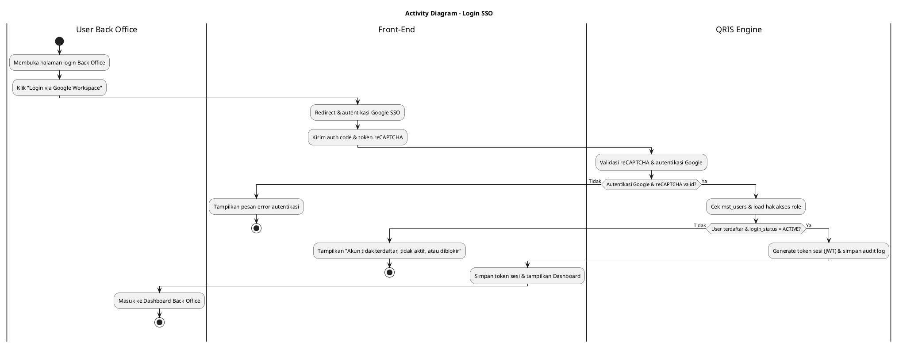
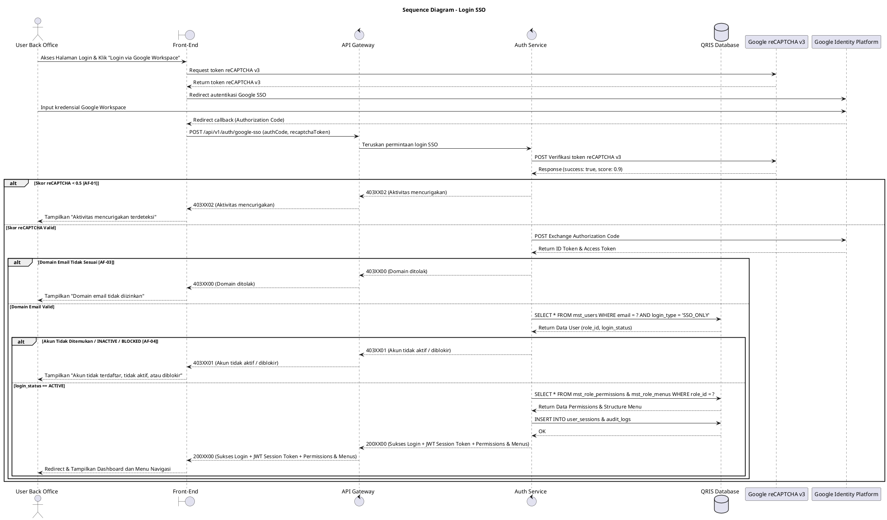

# 1 Deskripsi Use Case

**Tabel 1: Deskripsi Use Case Login SSO**

| Elemen Spesifikasi | Deskripsi Detail |
| --- | --- |
| ID Use Case | UC-BOH-001 |
| Nama Use Case | Login SSO |
| Penjelasan Singkat | Proses autentikasi masuk (login) User Back Office Hibank menggunakan akun Google Workspace melalui Google Identity Platform (GCP) yang dilindungi oleh verifikasi skor risiko Google reCAPTCHA v3. |
| Aktor Utama | User Back Office |
| Aktor Pendukung | Google Identity Platform, Google reCAPTCHA v3 |
| Deskripsi Singkat | User membuka halaman login Back Office Hibank, sistem mendapatkan token reCAPTCHA v3, lalu User melakukan login via SSO Google Workspace. Sistem memvalidasi skor reCAPTCHA v3 serta identitas, domain email, dan atribut akun User pada `mst_users` serta memuat hak akses dari `mst_role_permissions` dan `mst_role_menus` sebelum memberikan izin akses dan token sesi. |
| Pre-condition | 1. User Back Office membuka peramban dan mengakses URL Halaman Login Back Office Hibank. 2. Akun Google Workspace User telah terdaftar di tabel `mst_users` dengan `login_type = 'SSO_ONLY'` dan `login_status = 'ACTIVE'`. |
| Post-condition | 1. User Back Office berhasil diautentikasi dan menerima token sesi (JWT/Session) yang memuat `role_id`, hak akses, dan struktur menu User. 2. Front-End menampilkan Halaman Utama (Dashboard) dan menu navigasi Back Office Hibank sesuai hak akses `role_id` User. |
| Trigger | User menekan tombol "Login via Google Workspace" pada Halaman Login. |
| Nama Tabel | mst_users, mst_role_permissions, mst_role_menus, user_sessions, audit_logs |
| Integrasi | 1. **Google Identity Platform (GCP SSO):** Autentikasi OAuth2/OpenID Connect (OIDC) untuk verifikasi akun Google Workspace. 2. **Google reCAPTCHA v3:** API verifikasi skor risiko pemicu bot atau aktivitas mencurigakan pada Front-End. |
| Asumsi | 1. Peramban web User mendukung eksekusi JavaScript untuk pembuatan token reCAPTCHA v3. 2. Domain email Google Workspace User sesuai dengan domain resmi yang didaftarkan pada Sistem Back Office Hibank. |
| Keterbatasan | 1. User tanpa domain Google Workspace resmi tidak dapat mengakses Sistem. 2. Skor verifikasi reCAPTCHA v3 di bawah ambang batas (threshold 0.5) otomatis ditolak oleh Sistem. |
| Aturan Bisnis/Sistem | 1. **Domain Whitelist:** Autentikasi hanya diizinkan bagi pengguna dengan alamat email berdomain resmi Google Workspace perusahaan. 2. **reCAPTCHA Risk Score Threshold:** Token reCAPTCHA v3 wajib memiliki skor di atas atau sama dengan 0.5 untuk dianggap valid. 3. **SSO Only Mechanism:** Akun pengguna pada `mst_users` wajib memiliki `login_type = 'SSO_ONLY'`. 4. **Role Access & Menu Mapping:** User wajib memiliki `role_id` yang terdefinisi aktif, dan Sistem memuat daftar hak akses (`mst_role_permissions`) serta navigasi menu (`mst_role_menus`) yang terasosiasi dengannya. 5. **User Login Status:** Status login pengguna pada `mst_users` (`login_status`) wajib berstatus `ACTIVE`. Jika berstatus `INACTIVE` atau `BLOCKED`, proses autentikasi ditolak. |
| Session Idle | 15 Menit |

# 2 Main Flow

**Tabel 2: Main Flow Login SSO**

| No. | Aktivitas | Deskripsi |
| ---: | --- | --- |
| 1 | Membuka Halaman Login | User membuka halaman login Back Office Hibank pada peramban web. |
| 2 | Memuat Script reCAPTCHA | Front-End menginisialisasi SDK Google reCAPTCHA v3 dan membuat token risiko untuk aksi login. |
| 3 | Memilih Login SSO Google | User menekan tombol "Login via Google Workspace". |
| 4 | Meredireksi ke Google SSO | Front-End mengarahkan User ke halaman autentikasi Google Identity Platform (GCP). |
| 5 | Mengotentikasi Akun Google | User memasukkan kredensial akun Google Workspace dan menyetujui izin akses pada Google Identity Platform. |
| 6 | Memproses OIDC Callback | Google Identity Platform meredireksi kembali ke Front-End dengan membawa authorization code Google. |
| 7 | Mengirim Kredensial & Token | Front-End mengirimkan authorization code Google dan token reCAPTCHA v3 ke Auth Service melalui API Gateway. |
| 8 | Memvalidasi reCAPTCHA v3 | Auth Service memvalidasi token reCAPTCHA v3 ke API Google reCAPTCHA v3 dan memeriksa skor risiko (score >= 0.5). |
| 9 | Memvalidasi Token Google | Auth Service menukarkan authorization code dengan ID Token ke Google Identity Platform serta memvalidasi domain email. |
| 10 | Memvalidasi Data User & Akses | Auth Service mengecek data akun pada `mst_users` (`login_type = 'SSO_ONLY'`, `login_status = 'ACTIVE'`) serta memuat data kewenangan dari `mst_role_permissions` dan `mst_role_menus`. |
| 11 | Membuat Sesi & Token | Auth Service membuat token sesi (JWT) beserta klaim `role_id`, data permission, dan struktur menu, mencatat audit log login, serta mengembalikan data sesi ke Front-End. |
| 12 | Use Case Selesai | Front-End menyimpan token sesi dan menampilkan Halaman Utama (Dashboard) serta menu navigasi Back Office Hibank kepada User sesuai hak akses `role_id`. |

# 3 Alternative Flow

**Tabel 3: Alternative Flow Login SSO**

| Kode | Alternative Flow | Deskripsi |
| --- | --- | --- |
| AF-01 | Skor reCAPTCHA di Bawah Threshold | Pada langkah 8, apabila skor risiko reCAPTCHA v3 di bawah 0.5 (terdeteksi sebagai bot), Sistem menolak permintaan autentikasi dan Front-End menampilkan `Aktivitas mencurigakan terdeteksi. Silakan coba beberapa saat lagi.`. |
| AF-02 | Autentikasi Google Gagal | Pada langkah 5 atau 9, apabila User membatalkan login atau token Google tidak valid, Sistem membatalkan proses dan Front-End menampilkan `Gagal melakukan autentikasi dengan Google Workspace.`. |
| AF-03 | Domain Email Tidak Sesuai | Pada langkah 9, apabila domain email Google Workspace User tidak terdaftar dalam whitelist perusahaan, Sistem menolak akses dan Front-End menampilkan `Domain email tidak memiliki izin untuk mengakses Back Office Hibank.`. |
| AF-04 | User Tidak Terdaftar, Inaktif, atau Diblokir | Pada langkah 10, apabila akun User tidak ditemukan di `mst_users`, `login_type` bukan `SSO_ONLY`, atau `login_status` bernilai `INACTIVE` atau `BLOCKED`, Sistem menolak login dan Front-End menampilkan `Akun Anda tidak terdaftar, tidak aktif, atau diblokir. Hubungi Administrator.`. |
| AF-05 | Timeout Integrasi Google API | Pada langkah 8 atau 9, apabila koneksi ke API Google mengalami timeout atau error, Sistem menghentikan proses dan Front-End menampilkan `Gagal terhubung ke layanan Google. Silakan coba kembali.`. |

# 4 Status Front-End

**Tabel 4: Status Front-End Login SSO**

| No. | Nama Status | Deskripsi Tampilan Front-End |
| ---: | --- | --- |
| 1 | IDLE | Tampilan default halaman login dengan tombol "Login via Google Workspace" aktif dan terisi widget reCAPTCHA v3. |
| 2 | LOADING | Tampilan indikator memuat (spinner) saat proses penukaran token dan verifikasi autentikasi berlangsung. |
| 3 | SUCCESS | Status sukses autentikasi sebelum halaman dialihkan secara otomatis ke Dashboard Back Office Hibank. |
| 4 | ERROR | Tampilan pesan kesalahan (toast/banner alert) saat terjadi kegagalan verifikasi reCAPTCHA, domain, atau status akun. |
| 5 | BLOCKED | Tampilan blokir akses ketika skor reCAPTCHA mencurigakan atau `login_status` User bernilai `BLOCKED`. |

# 5 Activity Diagram Login SSO

# 6 Sequence Diagram Login SSO

# 7 Response Code

**Tabel 5: Response Code Login SSO**

| No. | HTTP Status | Response Code | Nama Response | Deskripsi | Respons Front-End |
| ---: | ---: | --- | --- | --- | --- |
| 1 | 200 | 200XX00 | AUTH_SSO_SUCCESS | Autentikasi SSO Google Workspace dan reCAPTCHA v3 berhasil. | Menyimpan token sesi JWT (dengan klaim `role_id`, permissions, & menus) dan mengarahkan User ke Dashboard. |
| 2 | 400 | 400XX00 | INVALID_RECAPTCHA_TOKEN | Token reCAPTCHA v3 yang dikirimkan tidak valid atau kadaluarsa. | Menampilkan pesan error dan meminta User melakukan refresh halaman. |
| 3 | 401 | 401XX00 | GOOGLE_AUTH_FAILED | Verifikasi Authorization Code ke Google Identity Platform gagal. | Menampilkan pesan kegagalan autentikasi Google. |
| 4 | 403 | 403XX00 | INVALID_EMAIL_DOMAIN | Domain email Google Workspace tidak terdaftar pada whitelist. | Menampilkan pesan bahwa domain email ditolak oleh sistem. |
| 5 | 403 | 403XX01 | USER_INACTIVE_OR_BLOCKED | Data pengguna tidak ditemukan di `mst_users`, `login_type` bukan `SSO_ONLY`, atau `login_status` bernilai `INACTIVE` / `BLOCKED`. | Menampilkan pesan akun tidak terdaftar, tidak aktif, atau diblokir. |
| 6 | 403 | 403XX02 | RECAPTCHA_SCORE_TOO_LOW | Skor risiko Google reCAPTCHA v3 di bawah ambang batas minimum (0.5). | Menampilkan pesan blokir akses karena terdeteksi aktivitas bot. |
| 7 | 500 | 500XX00 | INTERNAL_AUTH_ERROR | Gangguan internal pada layanan autentikasi Back Office. | Menampilkan pesan kesalahan sistem internal. |
| 8 | 504 | 504XX00 | GOOGLE_SERVICE_TIMEOUT | Koneksi verifikasi ke API Google mengalami batas waktu (timeout). | Menampilkan pesan gagal terhubung ke layanan Google. |

# 8 Desain Antarmuka

**Tabel 6: Desain Antarmuka Login SSO**

| Halaman | Komponen dan State Utama |
| --- | --- |
| Halaman Login Back Office | - Tombol **"Login via Google Workspace"** (`IDLE` / `LOADING`). - Badge & Script **Google reCAPTCHA v3** (Hidden / Bottom Right). - Alert Banner Pesan Error (`ERROR` / `BLOCKED`). |
| Halaman Utama (Dashboard) | - Header Profile User (Menampilkan Nama, Email Google Workspace, dan Hak Akses `role_id`). - Sidebar Menu Navigasi Back Office Hibank (Dikelola berdasarkan `mst_role_menus` dan `mst_role_permissions`). |
