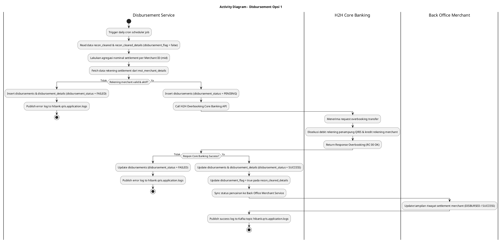
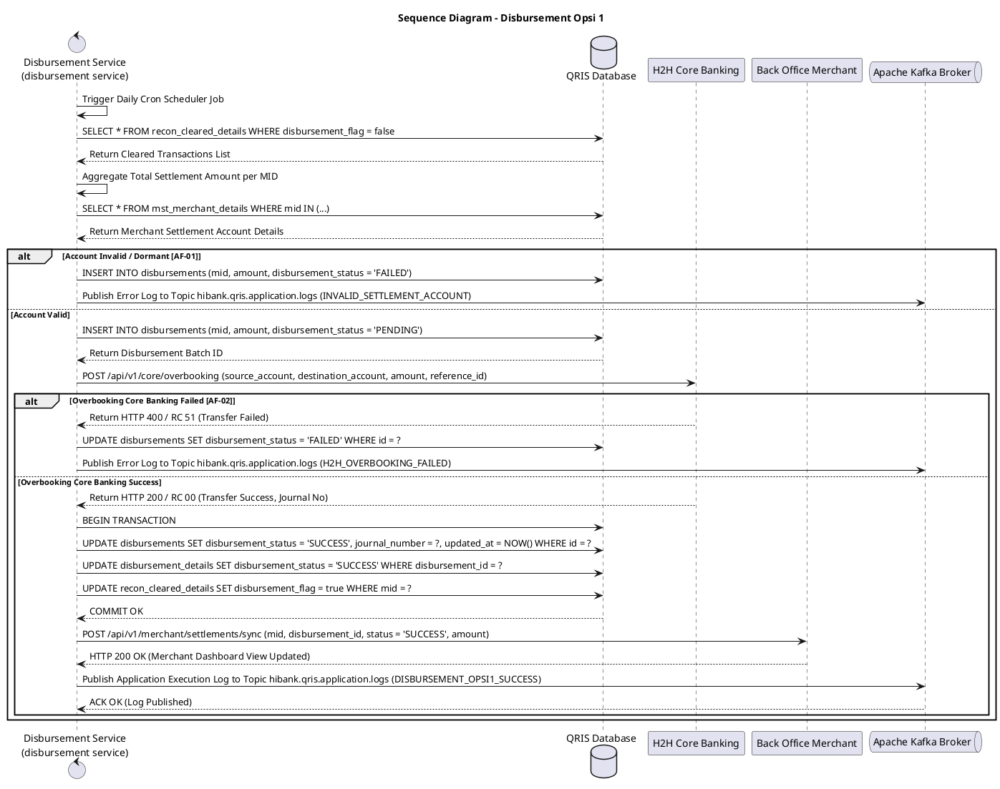

# 1 Deskripsi Use Case

**Tabel 1: Deskripsi Use Case Disbursement Opsi 1**

| Elemen Spesifikasi | Deskripsi Detail |
| --- | --- |
| ID Use Case | UC-BOH-010A |
| Nama Use Case | Disbursement Opsi 1 |
| Penjelasan Singkat | Proses otomatisasi pemindahbukuan (*overbooking*) dana settlement merchant Opsi 1. `disbursement service` secara scheduler membaca data transaksi `recon_cleared`, melakukan agregasi nominal per merchant, mengambil rekening settlement merchant dari `mst_merchant_details`, mengeksekusi H2H overbooking ke Core Banking Hibank, menyimpan riwayat ke tabel `disbursements` dan `disbursement_details`, serta menyinkronkan status pencairan ke Back Office Merchant. |
| Aktor Utama | Sistem (Disbursement Service - Scheduler Worker) |
| Aktor Pendukung | H2H Core Banking Engine Hibank, Back Office Merchant Service, Apache Kafka Broker |
| Deskripsi Singkat | **`disbursement service`** (Disbursement Microservice) menjalankan job penjadwalan otomatis (*scheduler timer*) pada jadwal pencairan H+1 settlement. Service membaca seluruh transaksi berstatus *cleared* pada tabel **`recon_cleared`** dan **`recon_cleared_details`** yang belum diproses. Service melakukan **agregasi total nominal settlement** per Merchant ID (`mid`), kemudian mengambil informasi data rekening settlement merchant (nomor rekening, nama pemilik rekening, kode bank) dari tabel **`mst_merchant_details`** dan **`mst_merchants`**. Selanjutnya, `disbursement service` memanggil REST API **Host-to-Host (H2H) Overbooking Core Banking Hibank** untuk mengeksekusi transfer dana pencairan secara otomatis dari rekening penampung QRIS ke rekening settlement merchant. Hasil respon H2H disimpan ke tabel **`disbursements`** (ringkasan agregat) dan **`disbursement_details`** (rincian itemized transaksi) dengan nilai status `disbursement_status = 'SUCCESS'`, `'FAILED'`, atau `'PENDING'`. Sesaat setelah status `disbursement_status = 'SUCCESS'`, `disbursement service` memperbarui tampilan status pencairan di **Back Office Merchant** (Portal Merchant / Web POS / Mobile App) sehingga merchant dapat melihat riwayat dana settlement yang telah berhasil ditransfer. Log transaksi dan error aplikasi dipublikasikan ke Kafka Topic **`hibank.qris.application.logs`**. |
| Pre-condition | 1. Terdapat data transaksi settlement hasil rekonsiliasi yang telah *cleared* pada tabel `recon_cleared` dan `recon_cleared_details`. 2. Data rekening settlement merchant pada `mst_merchant_details` terdaftar valid berstatus aktif. 3. Endpoint H2H Overbooking Core Banking Hibank beroperasi normal. |
| Post-condition | 1. Dana settlement berhasil dipindahbukukan ke rekening settlement merchant via H2H Overbooking Core Banking. 2. Record pencairan tersimpan utuh pada tabel `disbursements` dan `disbursement_details` dengan status `disbursement_status = 'SUCCESS'` (atau `FAILED`/`PENDING`). 3. Status pencairan dana pada Dashboard Back Office Merchant / Web POS ter-update secara *real-time* menjadi `DISBURSED` / `SUCCESS`. 4. Log pemrosesan disbursement dipublikasikan ke Kafka Topic `hibank.qris.application.logs`. |
| Trigger | Penjadwalan otomatis harian (*daily cron scheduler*) pada `disbursement service` (misal: pukul 06:00 WIB). |
| Nama Tabel | recon_cleared, recon_cleared_details, mst_merchants, mst_merchant_details, disbursements, disbursement_details, audit_logs |
| Integrasi | 1. **Disbursement Service (`disbursement service`):** Core microservice pemrosesan agregasi dana dan eksekusi pencairan. 2. **H2H Core Banking API Hibank:** Interface pemindahbukuan (*overbooking transfer*) dari rekening penampung QRIS ke rekening merchant. 3. **Back Office Merchant Service:** Interface pemutakhiran tampilan riwayat pencairan pada portal merchant. 4. **Apache Kafka Message Broker:** Centralized event broker log aplikasi topic `hibank.qris.application.logs`. |
| Asumsi | 1. Rekening penampung QRIS Hibank memiliki kecukupan saldo untuk memenuhi seluruh nilai agregasi disbursement harian. 2. Rekening tujuan merchant di `mst_merchant_details` menggunakan rekening internal Hibank atau terintegrasi dengan jaringan pemindahbukuan antarbank. |
| Keterbatasan | 1. Transaksi disbursement berstatus `FAILED` (akibat rekening merchant dormant / invald) akan ditahan pada `disbursements` dengan status `FAILED` untuk ditindaklanjuti secara manual oleh Ops Settlement Bank. 2. Eksekusi H2H overbooking bergantung pada ketersediaan koneksi ke Host Core Banking. |
| Aturan Bisnis/Sistem | 1. **Automated Batch Aggregation:** `disbursement service` mengekstrak data dari `recon_cleared` & `recon_cleared_details` yang memiliki `disbursement_flag = false`, lalu mengelompokkan (*group by `mid`*) dan menjumlahkan nominal settlement net per merchant. 2. **Merchant Settlement Account Verification:** `disbursement service` mengambil nomor rekening settlement merchant dari `mst_merchant_details`. Apabila nomor rekening tidak valid atau terblokir, status disbursement di-set `FAILED` dan tidak dikirim ke H2H Core Banking. 3. **H2H Overbooking Execution:** Transfer dilakukan via H2H Overbooking API Core Banking Hibank membawa parameter: `source_account` (Rekening Penampung QRIS), `destination_account` (Rekening Merchant), `amount` (Nominal Agregasi Net), `reference_number` (Disbursement Batch ID). 4. **Disbursement Status Lifecycle (`disbursement_status`):** &nbsp;&nbsp;- **`PENDING`**: State awal saat `disbursement service` menginisialisasi batch transfer ke Core Banking. &nbsp;&nbsp;- **`SUCCESS`**: State akhir saat Core Banking mengembalikan respon sukses (HTTP 200 / RC 00). Rekord di-insert ke `disbursements` & `disbursement_details`, dan `disbursement_flag` di `recon_cleared_details` di-update `true`. &nbsp;&nbsp;- **`FAILED`**: State saat Core Banking menolak overbooking (misal rekening terblokir/inaktif) atau terjadi timeout jaringan. 5. **Back Office Merchant Real-Time Synchronization:** Setelah status di-update `SUCCESS`, `disbursement service` memicu event pemutakhiran status pada Back Office Merchant Service sehingga tampilan dashboard merchant secara *real-time* memperlihatkan status pencairan `DISBURSED / SUCCESS` beserta nomor referensi overbooking. 6. **Centralized Kafka Application Logging:** `disbursement service` WAJIB memublikasikan seluruh log aktivitas eksekusi (total nominal agregasi, total merchant diproses, total sukses, total gagal, serta stacktrace error) ke Kafka Topic `hibank.qris.application.logs`. |
| Session Idle | 15 Menit |

# 2 Main Flow

**Tabel 2: Main Flow Disbursement Opsi 1**

| No. | Aktivitas | Deskripsi |
| ---: | --- | --- |
| 1 | Pemicu Daily Disbursement Scheduler | `disbursement service` memicu job harian otomatis pada jadwal pencairan settlement (misal: pukul 06:00 WIB). |
| 2 | Membaca Data `recon_cleared` | `disbursement service` membaca data transaksi berstatus *cleared* dari tabel `recon_cleared` & `recon_cleared_details` yang belum di-disburse (`disbursement_flag = false`). |
| 3 | Mengagregasi Nominal per Merchant | `disbursement service` mengelompokkan data transaksi berdasarkan `mid` dan menghitung total nominal settlement agregat per merchant. |
| 4 | Mengambil Data Rekening Merchant | `disbursement service` membaca nomor rekening settlement merchant dari tabel `mst_merchant_details` dan `mst_merchants`. |
| 5 | Menginisialisasi Record Status PENDING | `disbursement service` meng-insert record awal ke tabel `disbursements` dan `disbursement_details` dengan `disbursement_status = 'PENDING'`. |
| 6 | Memanggil API H2H Overbooking Core Banking | `disbursement service` memanggil API H2H Overbooking Core Banking Hibank untuk mengeksekusi transfer dari rekening penampung ke rekening merchant. |
| 7 | Memproses Respon H2H Core Banking | Core Banking memproses pemindahbukuan dan mengembalikan respon transaksi (RC 00 - Transfer Success). |
| 8 | Memperbarui Status Table `disbursements` | `disbursement service` memperbarui status pada tabel `disbursements` dan `disbursement_details` menjadi `disbursement_status = 'SUCCESS'`, serta meng-update `disbursement_flag = true` pada `recon_cleared_details`. |
| 9 | Menyinkronkan Tampilan Back Office Merchant | `disbursement service` memicu pembaruan status pada Back Office Merchant Service sehingga merchant melihat tampilan riwayat pencairan berstatus `SUCCESS`. |
| 10 | Memublikasikan Log ke Kafka Broker | `disbursement service` memublikasikan log eksekusi dan ringkasan pencairan harian ke Kafka Topic `hibank.qris.application.logs`. |
| 11 | Use Case Selesai | Seluruh alur disbursement Opsi 1 per merchant selesai sepenuhnya dan dana telah masuk ke rekening merchant. |

# 3 Alternative Flow

**Tabel 3: Alternative Flow Disbursement Opsi 1**

| Kode | Alternative Flow | Deskripsi |
| --- | --- | --- |
| AF-01 | Rekening Settlement Merchant Inaktif / Invalis | Pada langkah 4, apabila nomor rekening settlement merchant pada `mst_merchant_details` tidak valid atau berstatus dormant, `disbursement service` melewatin transaksi overbooking merchant tersebut, meng-update status `disbursement_status = 'FAILED'`, mencatat alasan gagal pada `disbursement_details`, dan memublikasikan log error ke `hibank.qris.application.logs`. |
| AF-02 | Penolakan / Timeout API H2H Core Banking | Pada langkah 6, apabila API Core Banking menolak overbooking (misal RC 51 Insufficient Balance / RC 91 System Malfunction) atau mengalami timeout, `disbursement service` meng-update status `disbursement_status = 'FAILED'` (atau `'PENDING'` jika timeout) dan mendaftarkan batch ke antrean *disbursement retry*. |
| AF-03 | Kegagalan Pemutakhiran Tampilan Back Office Merchant | Pada langkah 9, apabila service Back Office Merchant mengalami kendala jaringan saat sinkronisasi tampilan, status transaksi pada database Hibank tetap `SUCCESS` dan `disbursement service` menjadwalkan ulang push notification ke portal merchant. |

# 4 Status Front-End

**Tabel 4: Status Front-End / Service Execution Status Disbursement Opsi 1**

| No. | Nama Status | Deskripsi Status Eksekusi Disbursement Service |
| ---: | --- | --- |
| 1 | AGGREGATING | `disbursement service` sedang membaca data `recon_cleared` dan menghitung nominal total per merchant. |
| 2 | DISBURSE_PENDING | State awal saat permintaan H2H Overbooking sedang dikirim ke Core Banking. |
| 3 | DISBURSE_SUCCESS | Flag `disbursement_status = 'SUCCESS'` setelah Core Banking mengonfirmasi pemindahbukuan berhasil dan status ter-update di Back Office Merchant. |
| 4 | DISBURSE_FAILED | Flag `disbursement_status = 'FAILED'` jika terjadi kegagalan pemindahbukuan rekening. |
| 5 | MERCHANT_VIEW_UPDATED | Tampilan saldo & riwayat pencairan pada portal Back Office Merchant / Web POS telah ter-update secara *real-time*. |

# 5 Activity Diagram Disbursement Opsi 1

# 6 Sequence Diagram Disbursement Opsi 1

# 7 Response Code

**Tabel 5: Response Code / Disbursement Service Response Code**

| No. | HTTP Status | Response Code | Nama Response | Deskripsi | Respons System / Merchant App |
| ---: | ---: | --- | --- | --- | --- |
| 1 | 200 | 200XX00 | DISBURSEMENT_OPSI1_SUCCESS | Overbooking H2H ke rekening merchant berhasil (`disbursement_status = 'SUCCESS'`), dan tampilan Back Office Merchant ter-update. | Service menyelesaikan alur disbursement merchant dengan sukses. |
| 2 | 200 | 200XX01 | DISBURSEMENT_OPSI1_PARTIAL_FAILED | Sebagian merchant berhasil di-disburse dan sebagian gagal akibat kendala rekening. | Status per merchant dicatat di `disbursements` (`SUCCESS` / `FAILED`). |
| 3 | 400 | 400XX00 | INVALID_MERCHANT_ACCOUNT_ERROR | Nomor rekening settlement merchant tidak terdaftar atau terblokir. | Set `disbursement_status = 'FAILED'` & publish log error. |
| 4 | 500 | 500XX00 | H2H_CORE_BANKING_TIMEOUT | Endpoint H2H Overbooking Core Banking mengalami timeout atau gangguan jaringan. | Set `disbursement_status = 'PENDING'`/`FAILED` & daftarkan ke antrean retry. |

# 8 Desain Antarmuka

**Tabel 6: Desain Antarmuka / Monitor Disbursement Dashboard & Back Office Merchant View**

| Halaman | Komponen dan State Utama |
| --- | --- |
| Dashboard Monitoring Disbursement (Back Office Hibank) | - Card Summary: **Total Batch Agregasi**, **Total Nominal Disbursed**, **Total Status SUCCESS (Hijau)**, **Total FAILED (Merah)**, **Total PENDING (Kuning)**. - Tabel Monitoring Disbursement (`disbursements` & `disbursement_details`): &nbsp;&nbsp;* Kolom: Date, Batch ID, Merchant ID, Nama Merchant, Rekening Tujuan, Total Nominal Agregat, Journal Number Core, Status (`disbursement_status`). - Indicator Badges: &nbsp;&nbsp;* `disbursement_status`: `SUCCESS` (Green), `FAILED` (Red), `PENDING` (Yellow). - Tombol **"Re-trigger Failed Disbursement"** & **"Export Batch Excel"**. |
| Tampilan Portal Back Office Merchant / Web POS (Merchant Side) | - Halaman **Riwayat Pencairan Dana (Disbursement History)**: &nbsp;&nbsp;* Card Total Dana Dicairkan. &nbsp;&nbsp;* Tabel Riwayat: Tanggal Pencairan, Nominal Settlement, Nomor Referensi Journal, Status (`DISBURSED / SUCCESS`). &nbsp;&nbsp;* Indicator Badges: `SUCCESS` (Hijau). |
