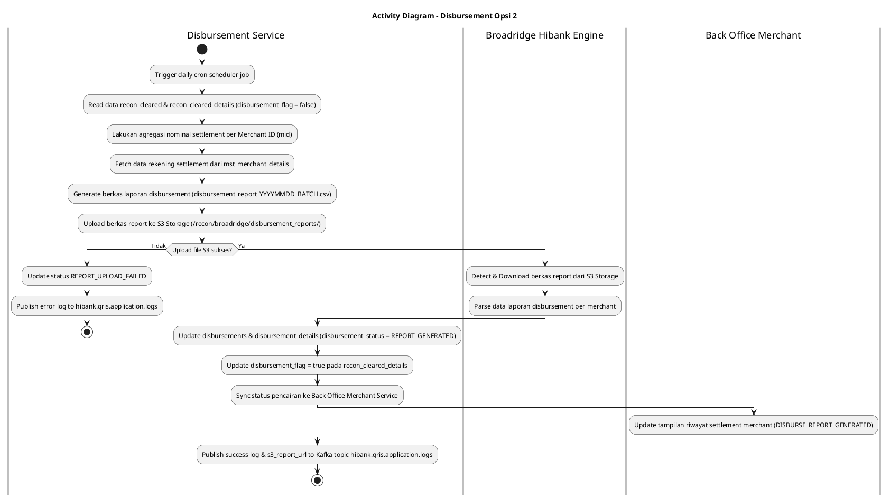
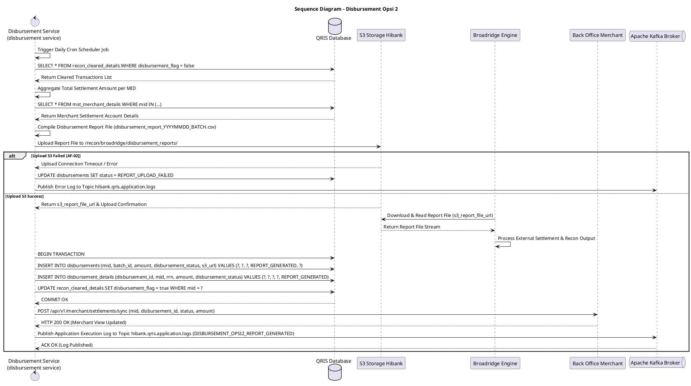

# 1 Deskripsi Use Case

**Tabel 1: Deskripsi Use Case Disbursement Opsi 2**

| Elemen Spesifikasi | Deskripsi Detail |
| --- | --- |
| ID Use Case | UC-BOH-010B |
| Nama Use Case | Disbursement Opsi 2 |
| Penjelasan Singkat | Proses otomatisasi oleh `disbursement service` untuk menghitung agregasi dana pencairan merchant Opsi 2, menyusun berkas laporan disbursement (*disbursement report*), dan mengunggah berkas tersebut ke Hibank S3 Object Storage (`/recon/broadridge/disbursement_reports/`) untuk dibaca dan diunduh oleh sistem Broadridge Hibank Engine. |
| Aktor Utama | Sistem (`disbursement service` / Disbursement Report Worker) |
| Aktor Pendukung | Broadridge Hibank Engine, Hibank S3 Object Storage, QRIS Database, Back Office Merchant Service, Apache Kafka Broker |
| Deskripsi Singkat | **`disbursement service`** (Disbursement Microservice) menjalankan job penjadwalan otomatis (*daily cron scheduler*) pada jadwal pencairan H+1 settlement. Service membaca seluruh transaksi berstatus *cleared* pada tabel **`recon_cleared`** dan **`recon_cleared_details`** yang belum diproses (`disbursement_flag = false`). Service melakukan **agregasi total nominal settlement** per Merchant ID (`mid`), kemudian mengambil informasi data rekening settlement merchant (nomor rekening, nama pemilik rekening, kode bank) dari tabel **`mst_merchant_details`** dan **`mst_merchants`**. Selanjutnya, `disbursement service` menyusun (*generate*) berkas laporan pencairan (*disbursement report file* - contoh: `disbursement_report_YYYYMMDD_BATCH.csv`). Service mengunggah berkas laporan tersebut ke **Hibank S3 Object Storage** pada direktori `/recon/broadridge/disbursement_reports/`. Sistem **Broadridge Hibank Engine** membaca dan mengunduh berkas laporan disbursement dari S3 Storage untuk dieksekusi pada alur pemrosesan pencairan / rekonsiliasi eksternal. Hasil respon pemrosesan disimpan ke tabel **`disbursements`** (ringkasan agregat) dan **`disbursement_details`** (rincian itemized transaksi) dengan status `disbursement_status = REPORT_GENERATED`. Sesaat setelah status ter-update, `disbursement service` memperbarui tampilan status pencairan di **Back Office Merchant** (Portal Merchant / Web POS / Mobile App) sehingga merchant dapat melihat riwayat dana settlement. Log transaksi dan error aplikasi dipublikasikan ke Kafka Topic **`hibank.qris.application.logs`**. |
| Pre-condition | 1. Terdapat data transaksi settlement hasil rekonsiliasi yang telah *cleared* pada tabel `recon_cleared` dan `recon_cleared_details`. 2. Data rekening settlement merchant pada `mst_merchant_details` terdaftar valid berstatus aktif. 3. `disbursement service` terhubung aktif dengan Hibank S3 Object Storage, QRIS Database, dan Kafka Broker. |
| Post-condition | 1. Berkas laporan disbursement (`disbursement_report_YYYYMMDD_BATCH.csv`) berhasil di-generate dan tersimpan di S3 Storage (`/recon/broadridge/disbursement_reports/`). 2. Berkas laporan siap diunduh dan dibaca oleh sistem Broadridge. 3. Record pencairan tersimpan utuh pada tabel `disbursements` dan `disbursement_details` dengan status `disbursement_status = REPORT_GENERATED`. 4. Status pencairan dana pada Dashboard Back Office Merchant / Web POS ter-update secara *real-time* menjadi `DISBURSE_REPORT_GENERATED`. 5. Log pemrosesan disbursement dipublikasikan ke Kafka Topic `hibank.qris.application.logs`. |
| Trigger | Penjadwalan otomatis harian (*daily cron scheduler*) pada `disbursement service` (misal: pukul 06:00 WIB). |
| Nama Tabel | recon_cleared, recon_cleared_details, mst_merchants, mst_merchant_details, disbursements, disbursement_details, audit_logs |
| Integrasi | 1. **Disbursement Service (`disbursement service`):** Core microservice generator laporan disbursement dan pengunggah berkas S3. 2. **Hibank S3 Storage:** Repository penyimpanan berkas laporan disbursement (`/recon/broadridge/disbursement_reports/`). 3. **Broadridge Hibank Engine:** Engine eksternal pembaca dan pengunduh berkas laporan disbursement dari S3 Storage. 4. **Back Office Merchant Service:** Interface pemutakhiran tampilan riwayat pencairan pada portal merchant. 5. **Apache Kafka Message Broker:** Centralized event broker log aplikasi topic `hibank.qris.application.logs`. |
| Asumsi | 1. Berkas laporan disbursement disusun dengan format baku CSV/TXT yang dipahami oleh Sistem Broadridge Hibank Engine. 2. Akses IAM bucket S3 Storage diatur dengan permission read/write untuk `disbursement service` dan read-only untuk Broadridge worker. |
| Keterbatasan | 1. Apabila koneksi S3 Object Storage mengalami kerusakkan, pembentukan dan pengunggahan berkas laporan disbursement akan ditunda dan dijadwalkan ulang. 2. Broadridge membaca berkas laporan secara polling asynchronous dari direktori S3 Storage. |
| Aturan Bisnis/Sistem | 1. **Automated Batch Report Aggregation:** `disbursement service` mengekstrak data dari `recon_cleared` & `recon_cleared_details` yang memiliki `disbursement_flag = false`, lalu mengelompokkan (*group by `mid`*) dan menjumlahkan nominal settlement net per merchant. 2. **Disbursement Report File Generation:** `disbursement service` membentuk berkas laporan `disbursement_report_YYYYMMDD_BATCH.csv` memuat header dan baris rincian: `mid`, `merchant_name`, `settlement_account`, `bank_code`, `total_net_amount`, `transaction_count`, `batch_id`. 3. **S3 Storage Upload (`/recon/broadridge/disbursement_reports/`):** Berkas laporan di-upload ke Hibank S3 Object Storage pada path `/recon/broadridge/disbursement_reports/` dan mengembalikan URL `s3_report_file_url`. 4. **Broadridge Reading Interface:** System Broadridge Hibank Engine mengunduh dan membaca berkas laporan dari S3 Storage berbasis notifikasi event S3 ObjectCreated atau scheduler polling. 5. **Disbursement Status Lifecycle (`disbursement_status`):** &nbsp;&nbsp;- **`AGGREGATING`**: State awal saat `disbursement service` membaca data `recon_cleared`. &nbsp;&nbsp;- **`REPORT_GENERATED`**: State setelah berkas report terbentuk dan sukses terunggah di S3 Storage. Record di-insert ke `disbursements` & `disbursement_details`, dan `disbursement_flag` di `recon_cleared_details` di-update `true`. &nbsp;&nbsp;- **`REPORT_UPLOAD_FAILED`**: State apabila terjadi kegagalan jaringan saat mengunggah berkas ke S3 Storage. 6. **Centralized Kafka Application Logging:** `disbursement service` WAJIB memublikasikan seluruh log aktivitas eksekusi (nama file S3, total nominal agregasi, total merchant diproses, URL file S3, serta stacktrace error) ke Kafka Topic `hibank.qris.application.logs`. |
| Session Idle | 15 Menit |

# 2 Main Flow

**Tabel 2: Main Flow Disbursement Opsi 2**

| No. | Aktivitas | Deskripsi |
| ---: | --- | --- |
| 1 | Pemicu Daily Disbursement Scheduler | `disbursement service` memicu job harian otomatis pada jadwal pencairan settlement (misal: pukul 06:00 WIB). |
| 2 | Membaca Data `recon_cleared` | `disbursement service` membaca data transaksi berstatus *cleared* dari tabel `recon_cleared` & `recon_cleared_details` yang belum di-disburse (`disbursement_flag = false`). |
| 3 | Mengagregasi Nominal per Merchant | `disbursement service` mengelompokkan data transaksi berdasarkan `mid` dan menghitung total nominal settlement agregat per merchant. |
| 4 | Mengambil Data Rekening Merchant | `disbursement service` membaca nomor rekening settlement merchant dari tabel `mst_merchant_details` dan `mst_merchants`. |
| 5 | Menyusun Berkas Disbursement Report | `disbursement service` menyusun berkas laporan pencairan `disbursement_report_YYYYMMDD_BATCH.csv` sesuai spesifikasi Broadridge. |
| 6 | Mengunggah Berkas Report ke S3 Storage | `disbursement service` mengunggah berkas laporan ke Hibank S3 Storage pada direktori `/recon/broadridge/disbursement_reports/`. |
| 7 | Broadridge Membaca & Mengunduh Berkas S3 | Sistem Broadridge Hibank Engine mengunduh dan membaca berkas laporan disbursement dari S3 Storage untuk diproses eksternal. |
| 8 | Memperbarui Status Table `disbursements` | `disbursement service` memperbarui status pada tabel `disbursements` dan `disbursement_details` menjadi `disbursement_status = REPORT_GENERATED`, serta meng-update `disbursement_flag = true` pada `recon_cleared_details`. |
| 9 | Menyinkronkan Tampilan Back Office Merchant | `disbursement service` memicu pembaruan status pada Back Office Merchant Service sehingga merchant melihat tampilan riwayat pencairan berstatus `DISBURSE_REPORT_GENERATED`. |
| 10 | Memublikasikan Log ke Kafka Broker | `disbursement service` memublikasikan log eksekusi dan URL berkas S3 laporan pencairan ke Kafka Topic `hibank.qris.application.logs`. |
| 11 | Use Case Selesai | Seluruh alur pembuatan dan pengunggahan laporan disbursement Opsi 2 ke S3 Storage untuk Broadridge selesai sepenuhnya. |

# 3 Alternative Flow

**Tabel 3: Alternative Flow Disbursement Opsi 2**

| Kode | Alternative Flow | Deskripsi |
| --- | --- | --- |
| AF-01 | Rekening Settlement Merchant Inaktif / Invalid | Pada langkah 4, apabila nomor rekening settlement merchant pada `mst_merchant_details` tidak valid atau berstatus dormant, `disbursement service` melewatin transaksi merchant tersebut dari laporan, meng-update status `disbursement_status = FAILED`, mencatat alasan pada `disbursement_details`, dan memublikasikan log error ke `hibank.qris.application.logs`. |
| AF-02 | Kegagalan Upload Berkas Report ke S3 Storage | Pada langkah 6, apabila koneksi ke S3 Object Storage mengalami kegagalan/timeout, `disbursement service` meng-update status `disbursement_status = REPORT_UPLOAD_FAILED`, memublikasikan log error ke Kafka, dan mendaftarkan batch ke antrean upload retry. |
| AF-03 | Broadridge Gagal Mengakses Berkas Report S3 | Pada langkah 7, apabila sistem Broadridge mengalami kendala akses ke S3 Storage, `disbursement service` menyediakan endpoint re-trigger notifikasi S3 untuk memicu ulang pembacaan berkas oleh Broadridge. |

# 4 Status Front-End

**Tabel 4: Status Front-End / Service Execution Status Disbursement Opsi 2**

| No. | Nama Status | Deskripsi Status Eksekusi Disbursement Service |
| ---: | --- | --- |
| 1 | AGGREGATING | `disbursement service` sedang membaca data `recon_cleared` dan menghitung nominal total per merchant. |
| 2 | REPORT_GENERATING | `disbursement service` sedang membentuk berkas laporan disbursement `disbursement_report_YYYYMMDD_BATCH.csv`. |
| 3 | REPORT_S3_UPLOADED | Berkas laporan disbursement berhasil diunggah ke S3 Storage `/recon/broadridge/disbursement_reports/`. |
| 4 | BROADRIDGE_READING | Berkas laporan disbursement sedang diunduh dan dibaca oleh Sistem Broadridge Hibank Engine. |
| 5 | REPORT_PROCESSED_SUCCESS | Flag `disbursement_status = REPORT_GENERATED` setelah berkas laporan sukses diunggah dan terindeks oleh Broadridge. |
| 6 | REPORT_UPLOAD_FAILED | Flag `disbursement_status = REPORT_UPLOAD_FAILED` apabila terjadi gangguan koneksi ke S3 Storage. |

# 5 Activity Diagram Disbursement Opsi 2

# 6 Sequence Diagram Disbursement Opsi 2

# 7 Response Code

**Tabel 5: Response Code / Disbursement Service Response Code**

| No. | HTTP Status | Response Code | Nama Response | Deskripsi | Respons System / Merchant App |
| ---: | ---: | --- | --- | --- | --- |
| 1 | 200 | 200XX00 | DISBURSEMENT_OPSI2_SUCCESS | Berkas report berhasil di-generate, di-upload ke S3 (`/recon/broadridge/disbursement_reports/`), dan status `disbursements` di-update `REPORT_GENERATED`. | Service menyelesaikan pembentukan laporan disbursement batch masal. |
| 2 | 200 | 200XX01 | DISBURSEMENT_OPSI2_PARTIAL_FAILED | Sebagian merchant dilewati akibat rekening inaktif/invalid. | Status per merchant dicatat pada `disbursement_details`. |
| 3 | 500 | 500XX00 | REPORT_FILE_GENERATION_ERROR | Gagal menyusun format data baris berkas laporan. | Service memublikasikan log error ke `hibank.qris.application.logs`. |
| 4 | 500 | 500XX01 | S3_UPLOAD_ERROR | Gagal mengunggah berkas laporan ke Hibank S3 Storage. | Service mencoba upload retry dan memublikasikan log error. |

# 8 Desain Antarmuka

**Tabel 6: Desain Antarmuka / Monitor Disbursement Dashboard Batch & Back Office Merchant View**

| Halaman | Komponen dan State Utama |
| --- | --- |
| Dashboard Monitoring Disbursement Batch Opsi 2 (Back Office Hibank) | - Card Summary: **Total Disbursement Reports Generated**, **Total Merchant Included**, **Total Nominal Settlement**, **Status Report Upload S3 (Hijau)**. - Status File Badges: &nbsp;&nbsp;* Report File S3: `REPORT_S3_UPLOADED` (Blue) &nbsp;&nbsp;* Broadridge Status: `BROADRIDGE_READING` (Yellow) / `PROCESSED` (Green) - Tabel Monitoring Disbursement (`disbursements` & `disbursement_details`): &nbsp;&nbsp;* Kolom: Date, Report File Name, Merchant ID, Rekening Tujuan, Total Nominal Net, Status (`disbursement_status`). - Indicator Badges: `REPORT_GENERATED` (Green), `REPORT_UPLOAD_FAILED` (Red). - Tombol **"Download Report File S3"** & **"Re-trigger Upload to S3"**. |
| Tampilan Portal Back Office Merchant / Web POS (Merchant Side) | - Halaman **Riwayat Pencairan Dana (Disbursement History)**: &nbsp;&nbsp;* Card Total Dana Dicairkan. &nbsp;&nbsp;* Tabel Riwayat: Tanggal Pencairan, Nominal Settlement, Batch Reference ID, Status (`DISBURSE_REPORT_GENERATED`). &nbsp;&nbsp;* Indicator Badges: `REPORT_GENERATED` (Hijau). |
