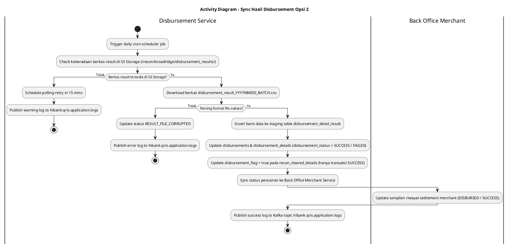
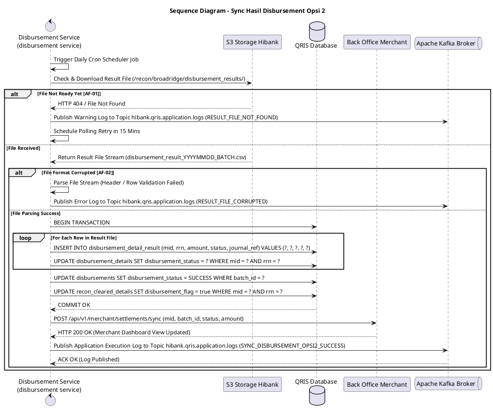

# 1 Deskripsi Use Case

**Tabel 1: Deskripsi Use Case Sync Hasil Disbursement Opsi 2**

| Elemen Spesifikasi | Deskripsi Detail |
| --- | --- |
| ID Use Case | UC-BOH-011 |
| Nama Use Case | Sync Hasil Disbursement Opsi 2 |
| Penjelasan Singkat | Proses otomatisasi oleh `disbursement service` untuk mengunduh dan membaca berkas laporan hasil pencairan dana (*disbursement result file*) yang diunggah oleh Broadridge pada S3 Storage (`/recon/broadridge/disbursement_results/`), menyimpan rincian ke tabel `disbursement_detail_result`, membandingkan data terhadap tabel `disbursements` dan `disbursement_details`, memperbarui kolom `disbursement_status` (`SUCCESS` / `FAILED`), meng-update `disbursement_flag = true` pada `recon_cleared_details`, serta menyinkronkan status pencairan secara *real-time* ke portal Back Office Merchant. |
| Aktor Utama | Sistem (`disbursement service` / Disbursement Result Synchronization Worker) |
| Aktor Pendukung | Broadridge Hibank Engine, Hibank S3 Object Storage, QRIS Database, Back Office Merchant Service, Apache Kafka Broker |
| Deskripsi Singkat | Sistem **Broadridge Hibank Engine** menyelesaikan pemrosesan pencairan eksternal dan menyimpan berkas hasil pencairan (*disbursement result file* - contoh: `disbursement_result_YYYYMMDD_BATCH.csv`) ke Hibank S3 Object Storage pada direktori `/recon/broadridge/disbursement_results/`. **`disbursement service`** mengunduh berkas hasil tersebut dan melakukan parsing baris data hasil transfer, lalu menyimpan seluruh data ke tabel **`disbursement_detail_result`**. Selanjutnya, `disbursement service` memperbarui status pencairan pada tabel **`disbursements`** dan **`disbursement_details`** berbasis `batch_id` dan `mid`/`rrn` (bernilai `disbursement_status = SUCCESS` atau `FAILED`). Untuk seluruh transaksi yang berstatus `SUCCESS`, `disbursement service` memperbarui flag **`disbursement_flag = true`** pada tabel **`recon_cleared_details`**. Sesaat setelah status ter-update, `disbursement service` memicu event pemutakhiran status pada **Back Office Merchant Service** sehingga tampilan riwayat pencairan di portal Back Office Merchant (Portal Merchant / Web POS / Mobile App) ter-update secara *real-time* menjadi `DISBURSED` / `SUCCESS` (atau `FAILED`). Seluruh aktivitas dan ringkasan pemrosesan dipublikasikan ke Kafka Topic **`hibank.qris.application.logs`**. |
| Pre-condition | 1. Broadridge telah selesai memproses pencairan dan menerbitkan berkas hasil pada S3 Object Storage (`/recon/broadridge/disbursement_results/`). 2. Berkas permintaan disbursement (`disbursements` & `disbursement_details`) telah berstatus `REPORT_GENERATED`. 3. `disbursement service` terhubung aktif dengan S3 Storage, QRIS Database, dan Kafka Broker. |
| Post-condition | 1. Data hasil pencairan dari Broadridge berhasil di-parse dan tersimpan pada tabel `disbursement_detail_result`. 2. Kolom `disbursement_status` pada `disbursements` dan `disbursement_details` ter-update secara akurat (`SUCCESS` / `FAILED`). 3. Kolom `disbursement_flag` pada `recon_cleared_details` ter-update `true` untuk transaksi sukses. 4. Tampilan status pencairan di Back Office Merchant ter-update secara *real-time* (`DISBURSED / SUCCESS`). 5. Log sinkronisasi dipublikasikan ke Kafka Topic `hibank.qris.application.logs`. |
| Trigger | Penjadwalan polling otomatis (*daily cron timer*) atau notifikasi event S3 (*ObjectCreated*) saat berkas hasil Broadridge tersedia. |
| Nama Tabel | disbursements, disbursement_details, disbursement_detail_result, recon_cleared, recon_cleared_details, audit_logs |
| Integrasi | 1. **Broadridge Hibank Engine:** Engine eksternal penyedia berkas laporan hasil pencairan. 2. **Hibank S3 Storage:** Repository penyimpanan berkas hasil pencairan Broadridge (`/recon/broadridge/disbursement_results/`). 3. **Disbursement Service (`disbursement service`):** Microservice pembaca file S3, pengelola simpanan `disbursement_detail_result`, eksekutor update status `disbursements`, dan pemicu sync Back Office Merchant. 4. **Back Office Merchant Service:** Interface pemutakhiran tampilan riwayat pencairan pada portal merchant. 5. **Apache Kafka Message Broker:** Centralized event broker log aplikasi topic `hibank.qris.application.logs`. |
| Asumsi | 1. Berkas hasil pencairan Broadridge menggunakan format nama file `disbursement_result_YYYYMMDD_BATCH.csv` dengan struktur kolom terstandarisasi (`mid`, `rrn`, `account_no`, `amount`, `status`, `journal_ref`, `error_code`). 2. Broadridge mengunggah file ke direktori `/recon/broadridge/disbursement_results/` secara otomatis setelah siklus batch overbooking bank selesai. |
| Keterbatasan | 1. Apabila berkas hasil Broadridge belum diunggah ke S3 Storage, `disbursement service` mempertahankan status `REPORT_GENERATED` dan menjadwalkan polling retry. 2. Berkas hasil terkorupsi akan memicu alert exception log ke tim Ops Settlement Bank. |
| Aturan Bisnis/Sistem | 1. **Automated S3 Result File Ingestion:** `disbursement service` mengunduh berkas `disbursement_result_YYYYMMDD_BATCH.csv` dari path `/recon/broadridge/disbursement_results/` berbasis scheduler polling harian atau event listener S3. 2. **Staging Result Ingestion (`disbursement_detail_result`):** Setiap baris respon di-insert ke tabel staging `disbursement_detail_result` menyimpan `mid`, `rrn`, `amount`, `status_code`, `journal_ref`, `processed_at`. 3. **Status Update Execution (`disbursements` & `disbursement_details`):** Service mencocokkan `batch_id` dan `mid`/`rrn`, meng-update `disbursement_status = SUCCESS` (jika status Broadridge `00`/`SUCCESS`) atau `disbursement_status = FAILED` (jika ditolak). 4. **Recon Cleared Flag Synchronization:** Untuk transaksi sukses, `disbursement service` meng-update `disbursement_flag = true` pada `recon_cleared_details`. 5. **Back Office Merchant Real-Time Push Sync:** Service memanggil endpoint POST `/api/v1/merchant/settlements/sync` untuk memperbarui tampilan riwayat pencairan merchant secara *real-time* (`DISBURSED / SUCCESS`). 6. **Centralized Kafka Application Logging:** Service WAJIB memublikasikan log sinkronisasi (total record diproses, total sukses, total gagal, URL S3 result) ke Kafka Topic `hibank.qris.application.logs`. |
| Session Idle | 15 Menit |

# 2 Main Flow

**Tabel 2: Main Flow Sync Hasil Disbursement Opsi 2**

| No. | Aktivitas | Deskripsi |
| ---: | --- | --- |
| 1 | Trigger Scheduler / Event Polling S3 Result | `disbursement service` mengeksekusi job penjadwalan polling harian untuk memeriksa berkas hasil Broadridge. |
| 2 | Memeriksa Keberadaan Berkas Hasil di S3 Storage | `disbursement service` memeriksa direktori `/recon/broadridge/disbursement_results/` pada Hibank S3 Object Storage. |
| 3 | Mengunduh Berkas Result dari S3 Storage | `disbursement service` mengunduh berkas `disbursement_result_YYYYMMDD_BATCH.csv`. |
| 4 | Menyimpan Baris Respon ke Staging Table | `disbursement service` mem-parsing baris data hasil transfer dan menyimpannya ke tabel `disbursement_detail_result`. |
| 5 | Memperbarui Status Table `disbursements` | `disbursement service` mencocokkan record dan memperbarui `disbursement_status = SUCCESS` atau `FAILED` pada `disbursements` dan `disbursement_details`. |
| 6 | Memperbarui `disbursement_flag = true` | `disbursement service` meng-update `disbursement_flag = true` pada `recon_cleared_details` khusus untuk transaksi sukses. |
| 7 | Menyinkronkan Tampilan Back Office Merchant | `disbursement service` memicu pembaruan tampilan riwayat pencairan berstatus `SUCCESS` / `DISBURSED` pada Back Office Merchant Service. |
| 8 | Memublikasikan Log Sinkronisasi ke Kafka Broker | `disbursement service` memublikasikan log ringkasan sinkronisasi ke Kafka Topic `hibank.qris.application.logs`. |
| 9 | Use Case Selesai | Seluruh alur sinkronisasi hasil pencairan dana Opsi 2 dari Broadridge selesai sepenuhnya. |

# 3 Alternative Flow

**Tabel 3: Alternative Flow Sync Hasil Disbursement Opsi 2**

| Kode | Alternative Flow | Deskripsi |
| --- | --- | --- |
| AF-01 | Berkas Result Belum Diterbitkan Broadridge di S3 | Pada langkah 2, apabila berkas hasil belum tersedia di S3 Storage, `disbursement service` mempertahankan status `REPORT_GENERATED`, menjadwalkan retry 15 menit kemudian, dan mencatat log warning. |
| AF-02 | Format File Result Corrupted / Invalid Header | Pada langkah 4, apabila berkas result mengalami kerusakkan format baris, `disbursement service` menghentikan parsing, meng-set status `RESULT_FILE_CORRUPTED`, dan memicu alert error log ke tim Ops Bank. |
| AF-03 | Kegagalan Pemutakhiran Tampilan Back Office Merchant | Pada langkah 7, apabila terjadi gangguan jaringan saat sinkronisasi tampilan portal merchant, status di database Hibank tetap `SUCCESS` dan service menjadwalkan ulang push sync. |

# 4 Status Front-End

**Tabel 4: Status Front-End / Service Execution Status Sync Hasil Disbursement Opsi 2**

| No. | Nama Status | Deskripsi Status Eksekusi Disbursement Service |
| ---: | --- | --- |
| 1 | S3_RESULT_POLLING | `disbursement service` sedang memeriksa keberadaan berkas hasil Broadridge di S3 Storage. |
| 2 | RESULT_FILE_DOWNLOADING | `disbursement service` sedang mengunduh berkas `disbursement_result_YYYYMMDD_BATCH.csv` dari S3 Storage. |
| 3 | RESULT_STAGING_INSERTED | Seluruh data hasil berhasil di-insert ke tabel staging `disbursement_detail_result`. |
| 4 | STATUS_SYNC_SUCCESS | Status pencairan pada `disbursements`, `disbursement_details`, `recon_cleared_details`, dan Back Office Merchant sukses ter-update (`SUCCESS`). |
| 5 | STATUS_SYNC_PARTIAL_FAILED | Sebagian transaksi pada berkas result berstatus gagal transfer (`FAILED`). |
| 6 | RESULT_FILE_NOT_FOUND | Berkas result Broadridge belum ditemukan di S3 Storage (penjadwalan retry diaktifkan). |
| 7 | RESULT_FILE_CORRUPTED | Berkas result S3 mengalami kerusakkan format baris data. |

# 5 Activity Diagram Sync Hasil Disbursement Opsi 2

# 6 Sequence Diagram Sync Hasil Disbursement Opsi 2

# 7 Response Code

**Tabel 5: Response Code / Disbursement Service Response Code**

| No. | HTTP Status | Response Code | Nama Response | Deskripsi | Respons System / Merchant App |
| ---: | ---: | --- | --- | --- | --- |
| 1 | 200 | 200XX00 | SYNC_DISBURSEMENT_OPSI2_SUCCESS | Berkas result Broadridge berhasil di-parse, status `disbursements` di-update `SUCCESS`, dan tampilan Back Office Merchant ter-update. | Service menyelesaikan alur sinkronisasi hasil disbursement batch. |
| 2 | 200 | 200XX01 | SYNC_DISBURSEMENT_OPSI2_PARTIAL_FAILED | Sebagian transaksi pada berkas result berstatus gagal transfer. | Status per merchant dicatat di `disbursements` (`SUCCESS` / `FAILED`). |
| 3 | 404 | 404XX00 | RESULT_FILE_NOT_FOUND | Berkas result dari Broadridge belum tersedia di S3 Storage. | Service menjadwalkan polling retry. |
| 4 | 500 | 500XX00 | RESULT_FILE_PARSING_ERROR | Berkas result S3 terkorupsi atau format baris tidak dapat di-parse. | Service memublikasikan log error ke `hibank.qris.application.logs`. |

# 8 Desain Antarmuka

**Tabel 6: Desain Antarmuka / Monitor Sync Disbursement Dashboard Batch & Back Office Merchant View**

| Halaman | Komponen dan State Utama |
| --- | --- |
| Dashboard Monitoring Disbursement Batch Opsi 2 (Back Office Hibank) | - Card Summary: **Total Result Files Downloaded**, **Total Record Processed**, **Total Nominal Disbursed**, **Total Status SUCCESS (Hijau)**, **Total FAILED (Merah)**. - Status File Badges: &nbsp;&nbsp;* Result File S3: `S3_RESULT_RECEIVED` (Green) &nbsp;&nbsp;* Sync Status: `STATUS_SYNC_SUCCESS` (Green) - Tabel Monitoring Disbursement (`disbursements` & `disbursement_details`): &nbsp;&nbsp;* Kolom: Date, Result File Name, Merchant ID, Rekening Tujuan, Total Nominal Net, Status (`disbursement_status`). - Indicator Badges: `SUCCESS` (Green), `FAILED` (Red), `PENDING` (Yellow). - Tombol **"Download Result File S3"** & **"Re-sync Batch Status"**. |
| Tampilan Portal Back Office Merchant / Web POS (Merchant Side) | - Halaman **Riwayat Pencairan Dana (Disbursement History)**: &nbsp;&nbsp;* Card Total Dana Dicairkan. &nbsp;&nbsp;* Tabel Riwayat: Tanggal Pencairan, Nominal Settlement, Nomor Referensi Journal, Status (`DISBURSED / SUCCESS`). &nbsp;&nbsp;* Indicator Badges: `SUCCESS` (Hijau). |
