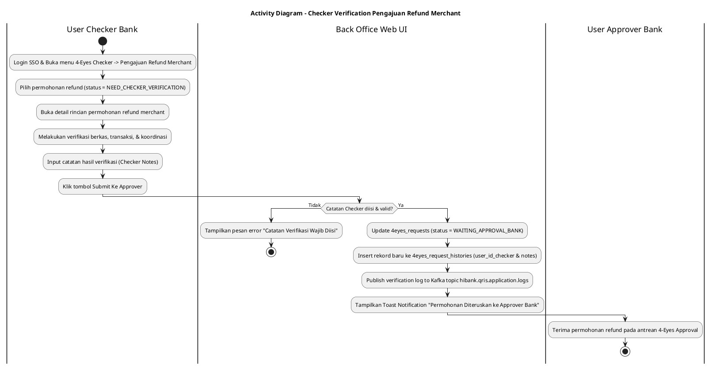
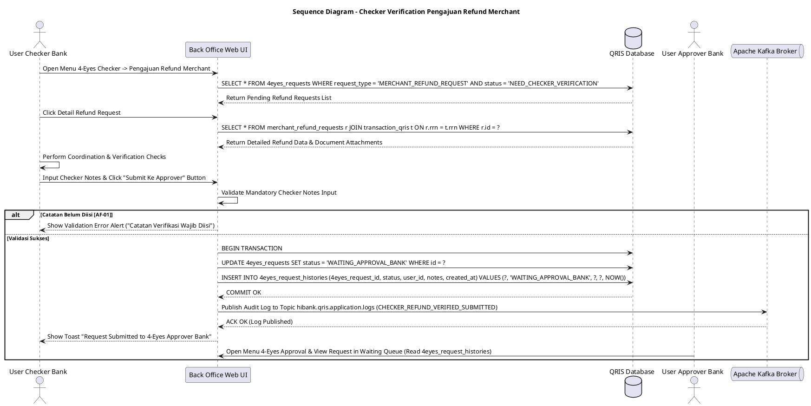

# 1 Deskripsi Use Case

**Tabel 1: Deskripsi Use Case Checker Verification Pengajuan Refund Merchant**

| Elemen Spesifikasi | Deskripsi Detail |
| --- | --- |
| ID Use Case | UC-BOH-012 |
| Nama Use Case | Checker Verification Pengajuan Refund Merchant |
| Penjelasan Singkat | Fitur Back Office Hibank untuk User Checker dalam melakukan pengecekan, koordinasi, dan verifikasi berkas permohonan refund transaksi QRIS yang diajukan merchant, memberikan catatan verifikasi (*checker notes*), dan mencatat riwayat pemrosesan ke `4eyes_requests` dan `4eyes_request_histories`. Checker tidak melakukan penolakan/reject. |
| Aktor Utama | User Checker Bank (Back Office Hibank Staff) |
| Aktor Pendukung | User Approver Bank, 4-Eyes Workflow Engine, Apache Kafka Broker |
| Deskripsi Singkat | User Checker Bank melakukan otentikasi login SSO dan mengakses menu **4-Eyes Checker** -> **Pengajuan Refund Merchant**. Sistem menampilkan daftar permohonan pengajuan refund transaksi QRIS dari merchant yang memerlukan verifikasi (`request_type = 'MERCHANT_REFUND_REQUEST'`, `status = 'NEED_CHECKER_VERIFICATION'`). User Checker memilih dan membuka detail pengajuan. Sistem menampilkan rincian data permohonan refund, memuat: Nomor Pengajuan Refund, Merchant ID (MID), Nama Merchant, RRN, STAN, Nominal Transaksi Asli, Nominal Refund yang Diminta, Alasan Refund, serta Dokumen Bukti Pendukung dari Merchant. User Checker melakukan verifikasi data dan koordinasi internal/eksternal (memeriksa keabsahan bukti pembayaran, validasi transaksi pada `transaction_qris`, dan memeriksa ketersediaan saldo merchant). User Checker **tidak melakukan aksi penolakan (reject)**. Tugas Checker adalah memberikan catatan hasil verifikasi (*checker notes*) dan mengklik tombol **Submit Ke Approver**. Sistem memperbarui status pada tabel **`4eyes_requests`** dan meng-insert log riwayat ke tabel **`4eyes_request_histories`** dengan status `WAITING_APPROVAL_BANK`, serta meneruskan permohonan refund ke antrean kerja User Approver Bank untuk keputusan Setujui/Tolak oleh Approver. Log aktivitas pengecekan dipublikasikan ke Kafka Topic **`hibank.qris.application.logs`**. |
| Pre-condition | 1. User Checker Bank telah berhasil login SSO dan memiliki otoritas peran *4-Eyes Checker Refund*. 2. Terdapat permohonan refund merchant berstatus `status = 'NEED_CHECKER_VERIFICATION'` pada tabel `4eyes_requests`. |
| Post-condition | 1. Catatan hasil verifikasi checker tersimpan pada tabel `4eyes_requests` dan `4eyes_request_histories`. 2. Status permohonan refund diperbarui menjadi `WAITING_APPROVAL_BANK`. 3. Permohonan refund berhasil diteruskan ke antrean kerja 4-Eyes Approver Bank. 4. Log aktivitas verifikasi checker dipublikasikan ke Kafka Topic `hibank.qris.application.logs`. |
| Trigger | User Checker Bank memilih permohonan refund pada menu 4-Eyes Checker, memasukkan catatan verifikasi, dan mengklik tombol **Submit Ke Approver**. |
| Nama Tabel | 4eyes_requests, 4eyes_request_histories, merchant_refund_requests, transaction_qris |
| Integrasi | 1. **Back Office Hibank Web UI:** Antarmuka verifikasi 4-Eyes Checker pengajuan refund merchant. 2. **4-Eyes Workflow Engine:** Engine pengelola status persetujuan berjenjang (Checker & Approver). 3. **Apache Kafka Message Broker:** Centralized event broker log aplikasi topic `hibank.qris.application.logs`. |
| Asumsi | 1. Merchant telah melampirkan berkas bukti transaksi dan alasan refund yang valid pada saat pengajuan di portal merchant. 2. Pengecekan oleh User Checker memastikan bahwa transaksi belum pernah dilakukan pengembalian dana (*duplicate refund protection*). |
| Keterbatasan | 1. User Checker **TIDAK memiliki tombol/opsi penolakan (reject)**. Seluruh permohonan yang diverifikasi wajib diteruskan ke User Approver Bank dengan catatan pendukung. 2. Keputusan akhir persetujuan atau penolakan pengajuan refund dilakukan sepenuhnya oleh User Approver Bank pada usecase terpisah. |
| Aturan Bisnis/Sistem | 1. **Checker Verification Scope (No Reject Action):** Peran User Checker berfokus sepenuhnya pada verifikasi keabsahan data, koordinasi internal/eksternal, dan pemberian catatan. User Checker **DILARANG dan TIDAK memfasilitasi aksi penolakan (reject)**. 2. **Pre-Check Transaction Validation:** User Checker WAJIB memverifikasi bahwa status transaksi pada `transaction_qris` berstatus `SETTLED` / `SUCCESS` dan nominal refund tidak melebihi nominal transaksi original. 3. **Mandatory Checker Notes:** Pengisian catatan hasil verifikasi (*checker notes*) bersifat WAJIB sebelum tombol **Submit Ke Approver** dapat diklik. 4. **4-Eyes Workflow Table Storage Standard:** &nbsp;&nbsp;- **`4eyes_requests`**: Diperbarui status pengajuannya (`request_type = 'MERCHANT_REFUND_REQUEST'`) menjadi `WAITING_APPROVAL_BANK`. &nbsp;&nbsp;- **`4eyes_request_histories`**: Ditambahkan rekord riwayat baru yang memuat `4eyes_request_id`, status `WAITING_APPROVAL_BANK`, `user_id` User Checker, `notes` (catatan checker), dan timestamp transaksi. 5. **Centralized Kafka Application Logging:** Seluruh tindakan verifikasi checker dipublikasikan secara asinkron ke Kafka Topic `hibank.qris.application.logs`. |
| Session Idle | 15 Menit |

# 2 Main Flow

**Tabel 2: Main Flow Checker Verification Pengajuan Refund Merchant**

| No. | Aktivitas | Deskripsi |
| ---: | --- | --- |
| 1 | Membuka Menu 4-Eyes Checker | User Checker Bank melakukan otentikasi login SSO dan mengklik menu **4-Eyes Checker** -> **Pengajuan Refund Merchant**. |
| 2 | Menampilkan List Pengajuan Refund | Sistem melakukan query ke tabel `4eyes_requests` memfilter `request_type = 'MERCHANT_REFUND_REQUEST'` dan `status = 'NEED_CHECKER_VERIFICATION'`, lalu menampilkan daftar pengajuan. |
| 3 | Membuka Detail Pengajuan Refund | User Checker mengklik tombol **"Detail"** pada salah satu permohonan refund merchant. |
| 4 | Menampilkan Detail Refund & Bukti | Sistem mengambil rincian dari `merchant_refund_requests` dan `transaction_qris`, serta menampilkan data transaksi, nominal refund, alasan, dan berkas dokumen pendukung. |
| 5 | Melakukan Pengecekan & Koordinasi | User Checker meneliti keabsahan berkas, memverifikasi riwayat transaksi pada `transaction_qris`, serta melakukan koordinasi internal/eksternal yang diperlukan. |
| 6 | Memasukkan Catatan & Mengklik Submit | User Checker memasukkan catatan verifikasi pada kolom *Checker Notes* dan mengklik tombol **"Submit Ke Approver"**. |
| 7 | Validasi Catatan & Update Status 4-Eyes | Sistem memvalidasi ketersediaan catatan checker, memperbarui `4eyes_requests` (`status = 'WAITING_APPROVAL_BANK'`), dan memasukkan rekord histori ke tabel `4eyes_request_histories`. |
| 8 | Memublikasikan Log ke Kafka Broker | Sistem memublikasikan log aktivitas verifikasi checker ke Kafka Topic `hibank.qris.application.logs`. |
| 9 | Meneruskan Request ke 4-Eyes Approver | Permohonan refund otomatis muncul pada antrean kerja User Approver Bank untuk tahap persetujuan/penolakan final. |
| 10 | Use Case Selesai | Proses verifikasi checker selesai dan pengajuan refund berada pada antrean persetujuan User Approver Bank. |

# 3 Alternative Flow

**Tabel 3: Alternative Flow Checker Verification Pengajuan Refund Merchant**

| Kode | Alternative Flow | Deskripsi |
| --- | --- | --- |
| AF-01 | Catatan Checker Kosong | Pada langkah 6, apabila User Checker mengklik tombol **Submit Ke Approver** tanpa mengisi catatan verifikasi, Sistem menolak pemrosesan dan menampilkan alert *"Catatan Verifikasi Checker Wajib Diisi"*. |
| AF-02 | Transaksi Sudah Pernah Di-refund (Duplicate Refund) | Pada langkah 5, apabila sistem mendeteksi transaksi RRN terkait telah memiliki riwayat refund sukses, Sistem menampilkan peringatan *"Transaksi Ini Sudah Pernah Di-refund"* dan mengunci tombol submit. |
| AF-03 | Kegagalan Jaringan / Database Update | Pada langkah 7, apabila terjadi kendala koneksi ke database atau Kafka Broker saat meng-insert ke `4eyes_request_histories`, Sistem menampilkan error modal dan memublikasikan error stacktrace ke `hibank.qris.application.logs`. |

# 4 Status Front-End

**Tabel 4: Status Front-End / UI Control & 4-Eyes Checker State**

| No. | Nama Status / Component State | Deskripsi Tampilan Antarmuka Back Office |
| ---: | --- | --- |
| 1 | CHECKER_REFUND_LIST | Grid tabel daftar permohonan refund dengan filter `status = NEED_CHECKER_VERIFICATION`. |
| 2 | REFUND_DETAIL_VERIFICATION_VIEW | Halaman detail rincian pengajuan refund merchant memuat data RRN, STAN, Nominal, Dokumen Bukti, dan Form Catatan Checker. |
| 3 | CHECKER_SUBMITTED_SUCCESS | Toast notification sukses *"Permohonan Refund Berhasil Diverifikasi & Diteruskan ke Approver"*. |
| 4 | WAITING_APPROVAL_BANK | Badge status baru yang ditampilkan setelah permohonan sukses di-submit ke alur 4-Eyes Approver dan tersimpan di `4eyes_request_histories`. |

# 5 Activity Diagram Checker Verification Pengajuan Refund Merchant

# 6 Sequence Diagram Checker Verification Pengajuan Refund Merchant

# 7 Response Code

**Tabel 5: Response Code / API Checker Refund Verification Response Code**

| No. | HTTP Status | Response Code | Nama Response | Deskripsi | Respons System / Web UI |
| ---: | ---: | --- | --- | --- | --- |
| 1 | 200 | 200XX00 | CHECKER_REFUND_VERIFIED_SUBMITTED | Pengecekan checker berhasil disimpan, status `4eyes_requests` di-update `WAITING_APPROVAL_BANK`, rekord histori di-insert ke `4eyes_request_histories`, dan request diteruskan ke Approver. | UI menampilkan Toast Sukses & menyegarkan antrean kerja. |
| 2 | 400 | 400XX00 | CHECKER_NOTES_REQUIRED | Catatan verifikasi checker belum diisi pada form. | UI menahan transaksi & menampilkan pesan validasi. |
| 3 | 400 | 400XX01 | DUPLICATE_REFUND_DETECTED | Transaksi RRN terdeteksi telah memiliki riwayat refund sukses. | UI mengunci tombol submit. |
| 4 | 500 | 500XX00 | CHECKER_VERIFICATION_ERROR | Terjadi kesalahan eksekusi pada server saat memperbarui status 4-Eyes. | UI menampilkan error modal & memublikasikan log ke `hibank.qris.application.logs`. |

# 8 Desain Antarmuka

**Tabel 6: Desain Antarmuka / Screen Detail Verification Refund Merchant**

| Halaman | Komponen dan State Utama |
| --- | --- |
| Menu 4-Eyes Checker Pengajuan Refund (Back Office Hibank) | - Tabel Antrean Pengecekan Refund (`4eyes_requests`): &nbsp;&nbsp;* Filter: Status (`NEED_CHECKER_VERIFICATION`). &nbsp;&nbsp;* Kolom: Date, Request ID, Merchant ID, Nama Merchant, RRN, Nominal Refund, Status (`NEED_CHECKER_VERIFICATION` - Badge Kuning). &nbsp;&nbsp;* Tombol Aksi **"Verifikasi Detail"**. |
| Halaman Detail Verification Pengajuan Refund Merchant | - Header Info Request: Request ID, Tanggal Pengajuan, Status 4-Eyes. - Section Detail Transaksi & Refund: &nbsp;&nbsp;* Merchant ID & Nama Merchant. &nbsp;&nbsp;* RRN & STAN Transaksi Asli. &nbsp;&nbsp;* Nominal Transaksi Original vs Nominal Refund yang Diminta. &nbsp;&nbsp;* Alasan Refund & Link **"Download Bukti Transaksi Merchant"**. - Form Verifikasi Checker: &nbsp;&nbsp;* Text Area: **Catatan Hasil Verifikasi Checker (Checker Notes)** (Wajib). - Tabel Riwayat 4-Eyes (`4eyes_request_histories`): &nbsp;&nbsp;* Menampilkan riwayat aksi sebelumnya, User ID pengubah, status, dan catatan. - Tombol Aksi: &nbsp;&nbsp;* Tombol **"Submit Ke Approver"** (Primary Blue Button). |
