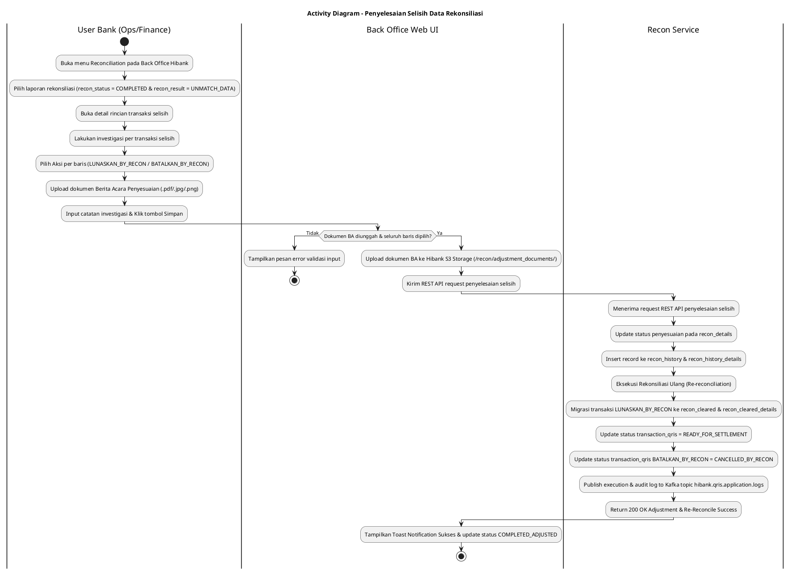
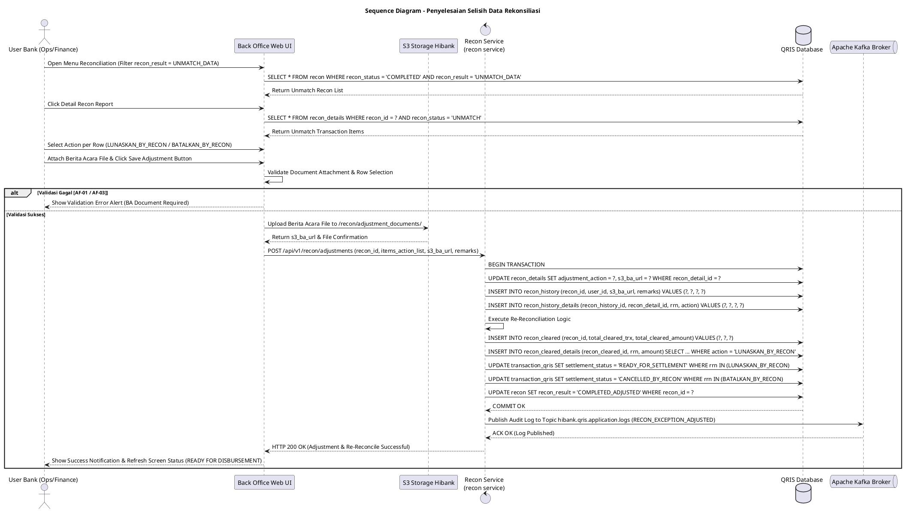

# 1 Deskripsi Use Case

**Tabel 1: Deskripsi Use Case Penyelesaian Selisih Data Rekonsiliasi**

| Elemen Spesifikasi | Deskripsi Detail |
| --- | --- |
| ID Use Case | UC-BOH-012 |
| Nama Use Case | Penyelesaian Selisih Data Rekonsiliasi |
| Penjelasan Singkat | Fitur Back Office Hibank untuk User Finance/Ops Bank dalam melakukan investigasi dan penyelesaian selisih data transaksi rekonsiliasi (`recon_result = 'UNMATCH_DATA'`) melalui aksi `LUNASKAN_BY_RECON` atau `BATALKAN_BY_RECON` serta unggah Berita Acara Penyesuaian dengan riwayat tersimpan pada `recon_history` & `recon_history_details` sebelum proses settlement & disbursement dapat dijalankan. |
| Aktor Utama | User Bank (Finance / Settlement / Operational Staff) |
| Aktor Pendukung | Recon Service (`recon service`), Hibank S3 Object Storage, Apache Kafka Broker |
| Deskripsi Singkat | Sebelum proses *settlement* dan *disbursement* dapat dilakukan pada transaksi yang mengalami selisih, User Bank WAJIB melakukan aksi penyelesaian selisih data (*reconciliation exception resolution*). User Bank membuka menu **Reconciliation** pada Back Office Hibank. Sistem menampilkan daftar laporan rekonsiliasi berstatus `recon_status = 'COMPLETED'` dan `recon_result = 'UNMATCH_DATA'`. User membuka detail laporan dan meneliti daftar transaksi selisih. Setelah melakukan investigasi manual, User memilih aksi penyesuaian pada tiap baris transaksi selisih: **`LUNASKAN_BY_RECON`** (melunaskan/menyetujui transaksi selisih) atau **`BATALKAN_BY_RECON`** (membatalkan transaksi selisih). User wajib mengunggah dokumen bukti **Berita Acara Penyesuaian** (.pdf / .jpg / .png), menginputkan catatan penyesuaian, dan mengklik tombol **Simpan**. Sistem mengunggah dokumen Berita Acara ke S3 Storage Hibank, memperbarui record pada `recon_details`, menyimpan riwayat penyelesaian ke tabel **`recon_history`** dan **`recon_history_details`**, serta secara otomatis memicu **Rekonsiliasi Ulang (*re-reconciliation*)**. Data transaksi yang disetujui (`LUNASKAN_BY_RECON`) dimasukkan ke tabel **`recon_cleared`** dan **`recon_cleared_details`**, serta status settlement pada **`transaction_qris`** diperbarui menjadi `READY_FOR_SETTLEMENT` agar dapat diproses pada alur *disbursement* dan *settlement*. Log eksekusi dan audit dipublikasikan ke Kafka Topic **`hibank.qris.application.logs`**. |
| Pre-condition | 1. User Bank telah melakukan otentikasi login SSO dan memiliki hak akses *Reconciliation Exception Settlement*. 2. Terdapat laporan rekonsiliasi harian berstatus `recon_status = 'COMPLETED'` dan `recon_result = 'UNMATCH_DATA'`. |
| Post-condition | 1. Dokumen Berita Acara Penyesuaian tersimpan aman pada Hibank S3 Object Storage. 2. Perubahan aksi per baris transaksi (`LUNASKAN_BY_RECON` / `BATALKAN_BY_RECON`) tersimpan pada `recon_details`, `recon_history`, dan `recon_history_details`. 3. Rekonsiliasi ulang otomatis berhasil dieksekusi oleh `recon service`. 4. Transaksi yang dilunaskan dimigrasikan ke tabel `recon_cleared` dan `recon_cleared_details`. 5. Status transaksi pada `transaction_qris` diperbarui menjadi `READY_FOR_SETTLEMENT`. 6. Log aktivitas investigasi dan penyelesaian dipublikasikan ke Kafka Topic `hibank.qris.application.logs`. |
| Trigger | User Bank mengklik baris laporan rekonsiliasi selisih pada menu Reconciliation dan mengklik tombol **Simpan** setelah memilih aksi penyelesaian. |
| Nama Tabel | recon, recon_details, recon_cleared, recon_cleared_details, transaction_qris, recon_history, recon_history_details |
| Integrasi | 1. **Back Office Hibank Web UI:** Antarmuka investigasi selisih dan aksi per baris transaksi. 2. **Recon Service (`recon service`):** Microservice eksekutor rekonsiliasi ulang dan migrasi ke tabel `recon_cleared`. 3. **Hibank S3 Storage:** Repository penyimpanan dokumen Berita Acara Penyesuaian. 4. **Apache Kafka Message Broker:** Centralized event broker log aplikasi topic `hibank.qris.application.logs`. |
| Asumsi | 1. Dokumen Berita Acara Penyesuaian yang diunggah telah ditandatangani oleh pejabat otoritas Bank yang berwenang. 2. Rekonsiliasi ulang yang dipicu sistem hanya mengevaluasi kembali baris transaksi yang diikutsertakan dalam penyelesaian selisih. |
| Keterbatasan | 1. Transaksi selisih yang ditandai `BATALKAN_BY_RECON` tidak akan dimigrasikan ke `recon_cleared` dan status settlement pada `transaction_qris` diubah menjadi `CANCELLED_BY_RECON`. 2. Ukuran maksimal dokumen Berita Acara Penyesuaian yang diunggah adalah 10 MB. |
| Aturan Bisnis/Sistem | 1. **Prerequisite Mandatory Exception Clearing:** Seluruh transaksi berstatus `UNMATCH` DILARANG diproses ke alur *disbursement* & *settlement* sebelum dilakukan aksi penyelesaian selisih data di menu Reconciliation. 2. **Itemized Action Selection:** User WAJIB memilih salah satu aksi penyesuaian untuk setiap baris transaksi selisih: &nbsp;&nbsp;- **`LUNASKAN_BY_RECON`**: Transaksi dinyatakan valid/dilunaskan oleh Bank. Sistem memindahkan data ke `recon_cleared` & `recon_cleared_details` dan meng-update `transaction_qris` (`settlement_status = 'READY_FOR_SETTLEMENT'`). &nbsp;&nbsp;- **`BATALKAN_BY_RECON`**: Transaksi dinyatakan batal/gagal. Sistem meng-update `transaction_qris` (`settlement_status = 'CANCELLED_BY_RECON'`). 3. **Mandatory Adjustment Document Attachment:** Pengunggahan dokumen Berita Acara Penyesuaian (.pdf/.jpg/.png) bersifat WAJIB. Berkas disimpan ke S3 path: `/recon/adjustment_documents/YYYY/MM/DD/ba_recon_ID_TIMESTAMP.pdf`. 4. **Automated Re-Reconciliation Trigger:** Setelah tombol Simpan diklik, sistem secara atomis memicu pemicuan fungsi **Rekonsiliasi Ulang (*re-reconciliation*)** pada `recon service` untuk memperbarui agregasi total `recon` dan memindahkan rekord sukses ke `recon_cleared`. 5. **Audit Trail Logging to `recon_history` & `recon_history_details`:** Setiap perubahan aksi penyelesaian selisih WAJIB dicatat pada tabel **`recon_history`** (ringkasan batch penyelesaian selisih memuat User ID, Timestamp, S3 BA File URL, Catatan Investigasi) dan tabel **`recon_history_details`** (rincian aksi per baris transaksi `LUNASKAN_BY_RECON` / `BATALKAN_BY_RECON`), serta dipublikasikan ke Kafka Topic `hibank.qris.application.logs`. |
| Session Idle | 15 Menit |

# 2 Main Flow

**Tabel 2: Main Flow Penyelesaian Selisih Data Rekonsiliasi**

| No. | Aktivitas | Deskripsi |
| ---: | --- | --- |
| 1 | Membuka Menu Reconciliation | User Bank menguji otentikasi login SSO dan mengklik menu **Reconciliation** pada portal Back Office Hibank. |
| 2 | Menampilkan List Recon UNMATCH | Sistem melakukan query ke tabel `recon` memfilter `recon_status = 'COMPLETED'` dan `recon_result = 'UNMATCH_DATA'`, lalu menampilkan daftar laporan rekonsiliasi. |
| 3 | Membuka Detail Laporan Rekonsiliasi | User Bank mengklik tombol **"Detail"** pada salah satu baris laporan rekonsiliasi selisih. |
| 4 | Menampilkan Detail Transaksi Selisih | Sistem mengambil data dari `recon_details` dan menampilkan daftar rincian transaksi berstatus `UNMATCH` beserta data pembanding (RRN, STAN, MID, Nominal). |
| 5 | Menginvestigasi & Memilih Aksi per Baris | User Bank melakukan investigasi manual, kemudian memilih aksi per baris transaksi: `LUNASKAN_BY_RECON` atau `BATALKAN_BY_RECON`. |
| 6 | Mengunggah Berita Acara & Catatan | User Bank mengunggah berkas **Berita Acara Penyesuaian** (.pdf/.jpg/.png) dan menginputkan catatan investigasi pada kolom ringkasan. |
| 7 | Mengklik Tombol Simpan | User Bank mengklik tombol **"Simpan Penyelesaian Selisih"**. |
| 8 | Validasi Data & Upload BA ke S3 | Sistem memvalidasi ketersediaan file Berita Acara dan pilihan aksi per baris, lalu mengunggah berkas BA ke Hibank S3 Storage (`/recon/adjustment_documents/`). |
| 9 | Memperbarui Database `recon_history` & Details | Sistem memperbarui status aksi penyesuaian pada `recon_details` serta mencatat ringkasan ke tabel `recon_history` dan rincian per baris ke `recon_history_details`. |
| 10 | Eksekusi Rekonsiliasi Ulang Service | Sistem memicu REST API `recon service` (`POST /api/v1/recon/re-reconcile`) untuk memproses rekonsiliasi ulang secara atomis. |
| 11 | Migrasi Data Cleared & Status Settlement | `recon service` memindahkan transaksi `LUNASKAN_BY_RECON` ke tabel `recon_cleared` & `recon_cleared_details`, serta meng-update status `transaction_qris` menjadi `READY_FOR_SETTLEMENT`. |
| 12 | Memublikasikan Log ke Kafka Broker | `recon service` memublikasikan log aktivitas penyelesaian selisih ke Kafka Topic `hibank.qris.application.logs`. |
| 13 | Use Case Selesai | Tampilan antarmuka memperbarui status laporan menjadi `COMPLETED_ADJUSTED` dan transaksi yang dilunaskan siap diproses ke alur *disbursement* & *settlement*. |

# 3 Alternative Flow

**Tabel 3: Alternative Flow Penyelesaian Selisih Data Rekonsiliasi**

| Kode | Alternative Flow | Deskripsi |
| --- | --- | --- |
| AF-01 | File Berita Acara Belum Diunggah | Pada langkah 7, apabila User belum mengunggah dokumen Berita Acara Penyesuaian, Sistem menolak penyimpanan, menampilkan pesan error *"Dokumen Berita Acara Penyesuaian Wajib Diunggah"*, dan menahan alur. |
| AF-02 | Format / Ukuran File Berita Acara Tidak Sesuai | Pada langkah 6, apabila file yang diunggah bukan format PDF/JPG/PNG atau ukurannya melebihi 10 MB, Sistem menampilkan alert format/ukuran invalid dan meminta re-upload. |
| AF-03 | Aksi Per Baris Transaksi Belum Lengkap Dipilih | Pada langkah 7, apabila terdapat baris transaksi selisih yang belum dipilih aksinya (`LUNASKAN_BY_RECON` / `BATALKAN_BY_RECON`), Sistem menampilkan pesan peringatan untuk melengkapi seluruh baris selisih. |
| AF-04 | Kegagalan Rekonsiliasi Ulang / Upload S3 | Pada langkah 8 atau 10, apabila upload S3 timeout atau `recon service` gagal melakukan rekonsiliasi ulang, Sistem melakukan rollback transaksi DB, mengembalikan tampilan ke state sebelum simpan, dan memublikasikan log error ke `hibank.qris.application.logs`. |

# 4 Status Front-End

**Tabel 4: Status Front-End / UI Control & State List**

| No. | Nama Status / Component State | Deskripsi Tampilan Antarmuka Back Office |
| ---: | --- | --- |
| 1 | RECON_UNMATCH_LIST | Grid tabel daftar rekonsiliasi harian dengan filter `recon_status = COMPLETED` & `recon_result = UNMATCH_DATA`. |
| 2 | INVESTIGATION_DETAIL_VIEW | Halaman detail rincian transaksi selisih memuat data RRN, STAN, Nominal, dan kontrol Aksi per baris. |
| 3 | ACTION_LUNASKAN_SELECTED | Indicator Badge hijau pada baris transaksi saat opsi `LUNASKAN_BY_RECON` dipilih. |
| 4 | ACTION_BATALKAN_SELECTED | Indicator Badge merah pada baris transaksi saat opsi `BATALKAN_BY_RECON` dipilih. |
| 5 | UPLOADING_BA_FILE | State progress bar saat dokumen Berita Acara Penyesuaian sedang diunggah ke S3 Storage. |
| 6 | RE_RECONCILING_PROCESS | Overlay spinner saat `recon service` sedang mengeksekusi rekonsiliasi ulang dan mencatat `recon_history` & `recon_history_details`. |
| 7 | ADJUSTMENT_SUCCESS | Toast notification sukses *"Penyelesaian Selisih Berhasil Disimpan & Rekonsiliasi Ulang Selesai"*. |

# 5 Activity Diagram Penyelesaian Selisih Data Rekonsiliasi

# 6 Sequence Diagram Penyelesaian Selisih Data Rekonsiliasi

# 7 Response Code

**Tabel 5: Response Code / API Settlement Adjustment Response Code**

| No. | HTTP Status | Response Code | Nama Response | Deskripsi | Respons System / Web UI |
| ---: | ---: | --- | --- | --- | --- |
| 1 | 200 | 200XX00 | RECON_ADJUSTMENT_SUCCESS | Penyelesaian selisih berhasil disimpan, riwayat tersimpan di `recon_history` & `recon_history_details`, rekonsiliasi ulang selesai, data `LUNASKAN_BY_RECON` dimigrasikan ke `recon_cleared`, dan status `transaction_qris` di-update `READY_FOR_SETTLEMENT`. | UI menampilkan Toast Sukses dan menyegarkan tampilan data. |
| 2 | 400 | 400XX00 | BA_DOCUMENT_REQUIRED | Dokumen Berita Acara Penyesuaian belum diunggah. | UI menahan transaksi & menampilkan pesan validasi. |
| 3 | 400 | 400XX01 | UNCOMPLETE_ROW_ACTION | Terdapat baris transaksi selisih yang belum ditentukan aksi penyesuaiannya. | UI menyoroti baris transaksi yang belum dipilih. |
| 4 | 500 | 500XX00 | RE_RECONCILE_EXECUTION_ERROR | Terjadi kesalahan eksekusi pada `recon service` saat rekonsiliasi ulang atau migrasi database. | UI menampilkan error modal & memublikasikan log ke `hibank.qris.application.logs`. |

# 8 Desain Antarmuka

**Tabel 6: Desain Antarmuka / Screen Detail Investigation & Action Modal**

| Halaman | Komponen dan State Utama |
| --- | --- |
| Menu Rekonsiliasi Selisih (Back Office Hibank) | - Tabel Rekonsiliasi Selisih Data (`recon`): &nbsp;&nbsp;* Filter: Status (`COMPLETED`), Hasil Recon (`UNMATCH_DATA`). &nbsp;&nbsp;* Kolom: Date, Recon ID, Total Trx, Total Match, Total Unmatch, Status (`UNMATCH_DATA` - Badge Merah). &nbsp;&nbsp;* Tombol Aksi **"Investigasi Selisih"**. |
| Halaman Detail Investigasi & Aksi Penyesuaian | - Header Info Recon: Recon ID, Tanggal Recon, Total Nominal Selisih. - Tabel Detail Selisih Data (`recon_details`): &nbsp;&nbsp;* Kolom: RRN, STAN, MID, Nominal Switching, Nominal Hibank, Selisih, **Pilih Aksi**. &nbsp;&nbsp;* Dropdown / Radio Button Aksi per baris: `[LUNASKAN_BY_RECON]` (Hijau) / `[BATALKAN_BY_RECON]` (Merah). - Section Unggah Dokumen Pendukung: &nbsp;&nbsp;* Input File: **"Upload Berita Acara Penyesuaian (.pdf/.jpg/.png)"** (Wajib). &nbsp;&nbsp;* Text Area: **Catatan Hasil Investigasi**. - Tabel Riwayat Penyesuaian (`recon_history` & `recon_history_details`): &nbsp;&nbsp;* Menampilkan riwayat aksi sebelumnya, User ID pengubah, URL Berita Acara S3, dan tanggal penyesuaian. - Tombol **"Simpan & Rekonsiliasi Ulang"** (Primary Blue Button). |
