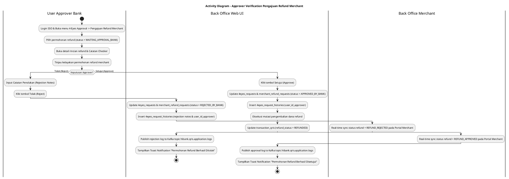
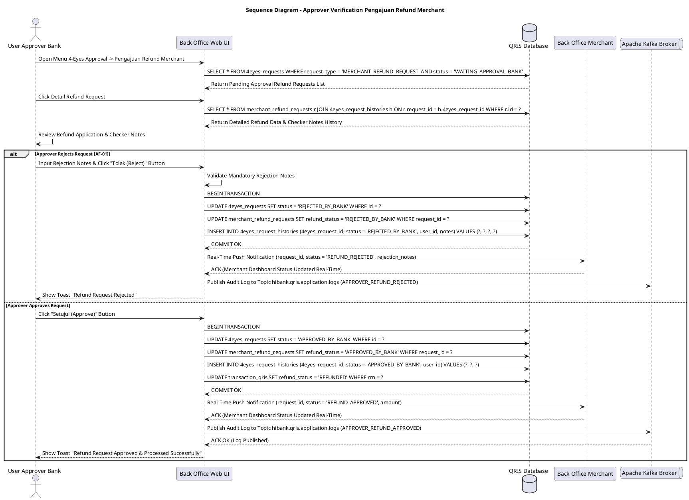

# 1 Deskripsi Use Case

**Tabel 1: Deskripsi Use Case Approver Verification Pengajuan Refund Merchant**

| Elemen Spesifikasi | Deskripsi Detail |
| --- | --- |
| ID Use Case | UC-BOH-013 |
| Nama Use Case | Approver Verification Pengajuan Refund Merchant |
| Penjelasan Singkat | Fitur Back Office Hibank untuk User Approver Bank dalam meninjau detail pengajuan refund merchant beserta catatan verifikasi dari Checker, mengambil keputusan aksi **Setujui (Approve)** atau **Tolak (Reject)**, serta menyinkronkan status pengajuan secara *real-time* ke portal Back Office Merchant. |
| Aktor Utama | User Approver Bank (Back Office Hibank Staff) |
| Aktor Pendukung | User Checker Bank, 4-Eyes Workflow Engine, Back Office Merchant Service, Apache Kafka Broker |
| Deskripsi Singkat | User Approver Bank melakukan otentikasi login SSO dan mengakses menu **4-Eyes Approval** -> **Pengajuan Refund Merchant**. Sistem menampilkan daftar permohonan pengajuan refund transaksi QRIS merchant berstatus `request_type = 'MERCHANT_REFUND_REQUEST'` dan `status = 'WAITING_APPROVAL_BANK'`. User Approver memilih satu permohonan dari antrean. Sistem menampilkan rincian data permohonan refund, bukti dokumen transaksi, dan **Catatan Hasil Verifikasi Checker** dari `4eyes_request_histories`. User Approver meninjau kelayakan pengajuan dan memilih salah satu aksi keputusan: 1. **Setujui (Approve)**: Sistem memperbarui status pada `4eyes_requests` dan `merchant_refund_requests` menjadi `APPROVED_BY_BANK`, mengeksekusi mutasi pengembalian dana refund, serta meng-update `transaction_qris` (`refund_status = 'REFUNDED'`). 2. **Tolak (Reject)**: User Approver wajib memasukkan catatan penolakan (*rejection notes*), lalu sistem memperbarui status pada `4eyes_requests` dan `merchant_refund_requests` menjadi `REJECTED_BY_BANK`. Setelah aksi diambil, sistem secara **real-time** memublikasikan event notifikasi dan memperbarui tampilan status pengajuan di portal **Back Office Merchant** (Merchant Portal / Web POS / Mobile App) menjadi `REFUND_APPROVED` atau `REFUND_REJECTED`. Log aktivitas persetujuan dipublikasikan ke Kafka Topic **`hibank.qris.application.logs`**. |
| Pre-condition | 1. Permohonan refund merchant telah lolos verifikasi User Checker dan berstatus `status = 'WAITING_APPROVAL_BANK'` pada `4eyes_requests`. 2. User Approver Bank telah berhasil login SSO dan memiliki wewenang *4-Eyes Approver Refund*. |
| Post-condition | 1. Status pengajuan pada `4eyes_requests` dan `merchant_refund_requests` diperbarui menjadi `APPROVED_BY_BANK` (jika disetujui) atau `REJECTED_BY_BANK` (jika ditolak). 2. Log histori keputusan Approver dan catatan tersimpan pada tabel `4eyes_request_histories`. 3. Jika disetujui, mutasi pengembalian dana refund dieksekusi dan status transaksi di `transaction_qris` diperbarui (`refund_status = 'REFUNDED'`). 4. Tampilan status pengajuan refund pada Back Office Merchant ter-update secara *real-time*. 5. Log pemrosesan dipublikasikan ke Kafka Topic `hibank.qris.application.logs`. |
| Trigger | User Approver Bank meninjau pengajuan refund merchant pada menu 4-Eyes Approval dan mengklik tombol **Setujui (Approve)** atau **Tolak (Reject)**. |
| Nama Tabel | 4eyes_requests, 4eyes_request_histories, merchant_refund_requests, transaction_qris |
| Integrasi | 1. **Back Office Hibank Web UI:** Antarmuka persetujuan 4-Eyes Approver pengajuan refund merchant. 2. **4-Eyes Workflow Engine:** Engine pengelola otorisasi persetujuan berjenjang. 3. **Back Office Merchant Service:** Portal interface penerima pemutakhiran status refund *real-time* merchant. 4. **Apache Kafka Message Broker:** Centralized event broker log aplikasi topic `hibank.qris.application.logs`. |
| Asumsi | 1. Catatan verifikasi yang diberikan User Checker pada `4eyes_request_histories` menjadi acuan utama bagi Approver dalam mengambil keputusan. 2. Eksekusi pengembalian dana refund yang disetujui dilakukan secara otomatis via pemindahbukuan rekening/saldo. |
| Keterbatasan | 1. Pengajuan yang telah disetujui (`APPROVED_BY_BANK`) atau ditolak (`REJECTED_BY_BANK`) tidak dapat diubah kembali parameternya. 2. Apabila User Approver memilih aksi **Tolak (Reject)**, pengisian catatan alasan penolakan bersifat WAJIB. |
| Aturan Bisnis/Sistem | 1. **Final Decision Authority:** User Approver Bank memiliki wewenang penuh mengambil keputusan akhir **Setujui (Approve)** atau **Tolak (Reject)** terhadap permohonan refund merchant. 2. **Mandatory Rejection Reason:** Apabila Approver memilih tombol **Tolak (Reject)**, sistem WAJIB mengharuskan pengisian *rejection notes* sebelum transaksi ditolak. 3. **Real-Time Merchant Portal Synchronization:** Sesaat setelah keputusan diambil, sistem WAJIB mengirimkan event pemutakhiran secara *real-time* (WebSocket / Webhook) ke Back Office Merchant Service sehingga merchant melihat status pengajuan `APPROVED` / `REJECTED` beserta rincian catatan secara instan. 4. **Atomic Refund Execution:** Saat pengajuan disetujui (`APPROVED_BY_BANK`), sistem secara atomis meng-update status `refund_status = 'REFUNDED'` pada tabel `transaction_qris` dan mencatat jurnal pemindahbukuan refund. 5. **Centralized Kafka Application Logging:** Seluruh aktivitas persetujuan/penolakan Approver dipublikasikan ke Kafka Topic `hibank.qris.application.logs`. |
| Session Idle | 15 Menit |

# 2 Main Flow

**Tabel 2: Main Flow Approver Verification Pengajuan Refund Merchant**

| No. | Aktivitas | Deskripsi |
| ---: | --- | --- |
| 1 | Membuka Menu 4-Eyes Approval | User Approver Bank melakukan otentikasi login SSO dan mengklik menu **4-Eyes Approval** -> **Pengajuan Refund Merchant**. |
| 2 | Menampilkan List Antrean Approval | Sistem melakukan query ke tabel `4eyes_requests` memfilter `request_type = 'MERCHANT_REFUND_REQUEST'` dan `status = 'WAITING_APPROVAL_BANK'`, lalu menampilkan daftar pengajuan. |
| 3 | Membuka Detail Pengajuan Refund | User Approver mengklik tombol **"Detail"** pada salah satu permohonan refund merchant. |
| 4 | Menampilkan Detail Data & Catatan Checker | Sistem menampilkan rincian transaksi refund dari `merchant_refund_requests` & `transaction_qris` beserta histori catatan verifikasi Checker dari `4eyes_request_histories`. |
| 5 | Meninjau Permohonan & Memilih Aksi | User Approver meneliti kelayakan permohonan refund, lalu memilih aksi **Setujui (Approve)** atau **Tolak (Reject)**. |
| 6 | Memproses Persetujuan (Approve) | Jika memilih **Setujui**, sistem memperbarui status `4eyes_requests` & `merchant_refund_requests` menjadi `APPROVED_BY_BANK`, memasukkan histori ke `4eyes_request_histories`, dan meng-update `transaction_qris` (`refund_status = 'REFUNDED'`). |
| 7 | Memproses Penolakan (Reject) | Jika memilih **Tolak**, User Approver mengisi catatan penolakan. Sistem memperbarui status `4eyes_requests` & `merchant_refund_requests` menjadi `REJECTED_BY_BANK` dan memasukkan histori ke `4eyes_request_histories`. |
| 8 | Real-Time Sync ke Back Office Merchant | Sistem memublikasikan event pemutakhiran status secara *real-time* ke Back Office Merchant Service sehingga tampilan dashboard merchant langsung memperlihatkan status `REFUND_APPROVED` atau `REFUND_REJECTED`. |
| 9 | Memublikasikan Log ke Kafka Broker | Sistem memublikasikan log aktivitas persetujuan/penolakan Approver ke Kafka Topic `hibank.qris.application.logs`. |
| 10 | Use Case Selesai | Proses persetujuan/penolakan pengajuan refund merchant selesai sepenuhnya. |

# 3 Alternative Flow

**Tabel 3: Alternative Flow Approver Verification Pengajuan Refund Merchant**

| Kode | Alternative Flow | Deskripsi |
| --- | --- | --- |
| AF-01 | Catatan Penolakan Kosong saat Reject | Pada langkah 7, apabila User Approver memilih aksi **Tolak (Reject)** tanpa mengisi catatan penolakan, Sistem menolak pemrosesan dan menampilkan alert *"Catatan Alasan Penolakan Wajib Diisi"*. |
| AF-02 | Gagal Mutasi Pemindahbukuan Refund | Pada langkah 6, apabila terjadi gangguan sistem saat eksekusi mutasi pengembalian dana refund, Sistem melakukan rollback transaksi, menahan status `WAITING_APPROVAL_BANK`, dan memublikasikan error stacktrace ke `hibank.qris.application.logs`. |
| AF-03 | Kegagalan Sinkronisasi Real-Time Merchant | Pada langkah 8, apabila service Back Office Merchant mengalami timeout saat pemutakhiran *real-time*, status persetujuan pada database Hibank tetap `APPROVED_BY_BANK` / `REJECTED_BY_BANK` dan sistem menjadwalkan ulang push event notification. |

# 4 Status Front-End

**Tabel 4: Status Front-End / UI Control & 4-Eyes Approver State**

| No. | Nama Status / Component State | Deskripsi Tampilan Antarmuka Back Office |
| ---: | --- | --- |
| 1 | APPROVER_REFUND_LIST | Grid tabel daftar permohonan refund dengan filter `status = WAITING_APPROVAL_BANK`. |
| 2 | REFUND_DETAIL_APPROVAL_VIEW | Halaman detail permohonan refund memuat data transaksi, Bukti Dokumen, Catatan Verifikasi Checker, dan Tombol Setujui/Tolak. |
| 3 | APPROVED_BY_BANK | Status pengajuan disetujui Approver, mutasi refund dieksekusi, dan status di Back Office Merchant ter-update *real-time*. |
| 4 | REJECTED_BY_BANK | Status pengajuan ditolak Approver, dan status di Back Office Merchant ter-update *real-time* menjadi ditolak. |
| 5 | REALTIME_MERCHANT_SYNCED | State saat event pemutakhiran status refund sukses terkirim ke portal Back Office Merchant. |

# 5 Activity Diagram Approver Verification Pengajuan Refund Merchant

# 6 Sequence Diagram Approver Verification Pengajuan Refund Merchant

# 7 Response Code

**Tabel 5: Response Code / API Approver Refund Response Code**

| No. | HTTP Status | Response Code | Nama Response | Deskripsi | Respons System / Web UI |
| ---: | ---: | --- | --- | --- | --- |
| 1 | 200 | 200XX00 | APPROVER_REFUND_APPROVED_SUCCESS | Persetujuan refund berhasil disimpan, `4eyes_requests` di-update `APPROVED_BY_BANK`, mutasi refund dieksekusi, dan status di Back Office Merchant ter-update *real-time*. | UI menampilkan Toast Sukses & menyegarkan antrean kerja. |
| 2 | 200 | 200XX01 | APPROVER_REFUND_REJECTED_SUCCESS | Permohonan refund ditolak oleh Approver, `4eyes_requests` di-update `REJECTED_BY_BANK`, dan status di Back Office Merchant ter-update *real-time*. | UI menyegarkan tampilan antrean kerja. |
| 3 | 400 | 400XX00 | REJECTION_NOTES_REQUIRED | Catatan alasan penolakan belum diisi saat memilih aksi Tolak (Reject). | UI menahan transaksi & menampilkan pesan validasi. |
| 4 | 500 | 500XX00 | APPROVER_EXECUTION_ERROR | Terjadi kesalahan eksekusi pada server saat mutasi refund atau update database. | UI menampilkan error modal & memublikasikan log ke `hibank.qris.application.logs`. |

# 8 Desain Antarmuka

**Tabel 6: Desain Antarmuka / Screen Detail Approver Refund & Back Office Merchant Real-Time Status View**

| Halaman | Komponen dan State Utama |
| --- | --- |
| Menu 4-Eyes Approval Pengajuan Refund (Back Office Hibank) | - Tabel Antrean Approval Refund (`4eyes_requests`): &nbsp;&nbsp;* Filter: Status (`WAITING_APPROVAL_BANK`). &nbsp;&nbsp;* Kolom: Date, Request ID, Merchant ID, Nama Merchant, RRN, Nominal Refund, Status (`WAITING_APPROVAL_BANK` - Badge Biru). &nbsp;&nbsp;* Tombol Aksi **"Review & Otorisasi"**. |
| Halaman Detail Approval Pengajuan Refund Merchant | - Header Info Request: Request ID, Tanggal Pengajuan, Status 4-Eyes. - Section Detail Transaksi & Refund: &nbsp;&nbsp;* Merchant ID & Nama Merchant. &nbsp;&nbsp;* RRN & STAN Transaksi Asli. &nbsp;&nbsp;* Nominal Transaksi Original vs Nominal Refund. - Panel Catatan Verification Checker (`4eyes_request_histories`): &nbsp;&nbsp;* User ID Checker, Tanggal Verifikasi, **Catatan Verifikasi Checker**. - Form Otorisasi Approver: &nbsp;&nbsp;* Text Area: **Catatan Alasan Penolakan** (Wajib jika Tolak). - Tombol Aksi: &nbsp;&nbsp;* Tombol **"Setujui (Approve)"** (Primary Green Button). &nbsp;&nbsp;* Tombol **"Tolak (Reject)"** (Danger Red Button). |
| Tampilan Back Office Merchant / Web POS (Merchant Side) | - Halaman **Riwayat Pengajuan Refund Merchant**: &nbsp;&nbsp;* Tabel Pengajuan Refund: &nbsp;&nbsp;&nbsp;&nbsp;- Nomor Request, RRN, Nominal Refund, Tanggal Pengajuan. &nbsp;&nbsp;&nbsp;&nbsp;- **Status Refund Real-Time**: &nbsp;&nbsp;&nbsp;&nbsp;&nbsp;&nbsp;+ `REFUND_APPROVED` (Badge Hijau - Refund Berhasil). &nbsp;&nbsp;&nbsp;&nbsp;&nbsp;&nbsp;+ `REFUND_REJECTED` (Badge Merah - Refund Ditolak & Catatan Penolakan). |
