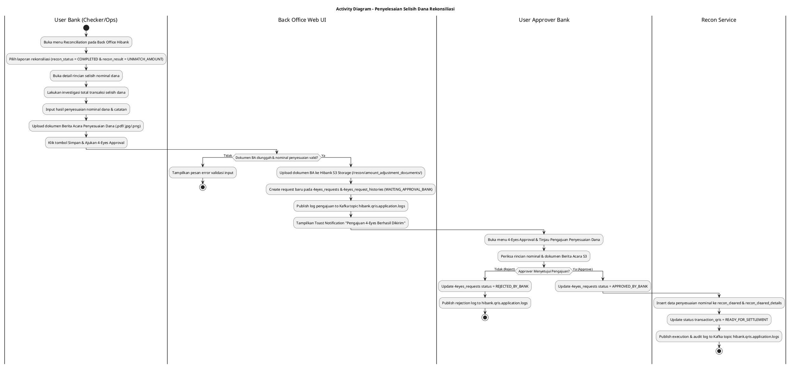
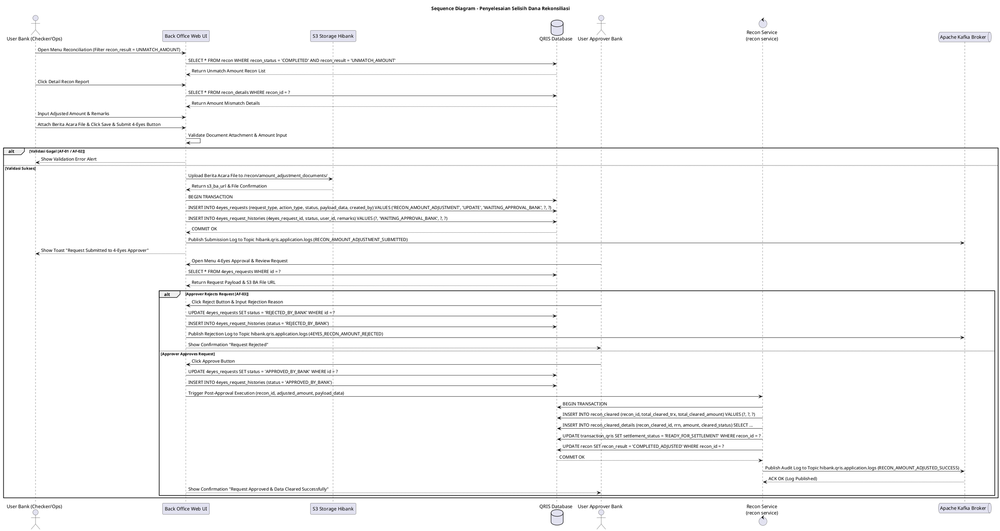

# 1 Deskripsi Use Case

**Tabel 1: Deskripsi Use Case Penyelesaian Selisih Dana Rekonsiliasi**

| Elemen Spesifikasi | Deskripsi Detail |
| --- | --- |
| ID Use Case | UC-BOH-013 |
| Nama Use Case | Penyelesaian Selisih Dana Rekonsiliasi |
| Penjelasan Singkat | Fitur Back Office Hibank untuk User Finance/Ops Bank dalam menginputkan penyesuaian selisih nominal dana rekonsiliasi (`recon_result = 'UNMATCH_AMOUNT'`), mengunggah Berita Acara Penyesuaian, dan mengajukan permintaan persetujuan ke workflow 4-Eyes Approver (`4eyes_requests`, `4eyes_request_histories`) sebelum data dapat dipindahkan ke `recon_cleared` untuk alur settlement & disbursement. |
| Aktor Utama | User Bank (Finance / Settlement / Checker Staff) |
| Aktor Pendukung | User Approver Bank, 4-Eyes Approval Engine, Hibank S3 Object Storage, Apache Kafka Broker |
| Deskripsi Singkat | Sebelum alur *disbursement* dan *settlement* dapat dijalankan untuk transaksi yang mengalami selisih nominal dana (*amount mismatch*), User Bank WAJIB melakukan pengajuan penyelesaian selisih dana (*reconciliation amount exception resolution*). User Bank membuka menu **Reconciliation** pada Back Office Hibank. Sistem menampilkan daftar laporan rekonsiliasi berstatus `recon_status = 'COMPLETED'` dan `recon_result = 'UNMATCH_AMOUNT'`. User membuka detail laporan dan meneliti rincian total transaksi selisih dana. Setelah melakukan investigasi total transaksi secara menyeluruh, User menginputkan nilai penyesuaian nominal (*adjusted amount*) dan catatan penyesuaian, serta mengunggah dokumen bukti **Berita Acara Penyesuaian** (.pdf / .jpg / .png). User mengklik tombol **Simpan & Ajukan Persetujuan**. Sistem mengunggah dokumen Berita Acara ke S3 Storage Hibank, lalu membuat *request* pengajuan persetujuan baru ke alur **4-Eyes Approval Workflow** pada tabel **`4eyes_requests`** dan **`4eyes_request_histories`** dengan `request_type = 'RECON_AMOUNT_ADJUSTMENT'` dan status `status = 'WAITING_APPROVAL_BANK'`. Setelah permintaan disetujui oleh User Approver Bank pada alur 4-Eyes, data penyesuaian dana secara otomatis dicatat ke tabel **`recon_cleared`** (dan `recon_cleared_details`) serta status transaksi pada **`transaction_qris`** di-update menjadi `READY_FOR_SETTLEMENT`. Log eksekusi pengajuan dipublikasikan ke Kafka Topic **`hibank.qris.application.logs`**. |
| Pre-condition | 1. User Bank telah melakukan otentikasi SSO dan memiliki wewenang pengajuan penyesuaian dana rekonsiliasi. 2. Terdapat laporan rekonsiliasi harian berstatus `recon_status = 'COMPLETED'` dan `recon_result = 'UNMATCH_AMOUNT'`. |
| Post-condition | 1. Dokumen Berita Acara Penyesuaian Dana tersimpan aman pada Hibank S3 Object Storage. 2. Request pengajuan persetujuan baru terbentuk pada tabel `4eyes_requests` dan `4eyes_request_histories` (`status = 'WAITING_APPROVAL_BANK'`). 3. Pasca persetujuan User Approver Bank, data penyesuaian nominal tersimpan di tabel `recon_cleared` dan `recon_cleared_details`. 4. Status transaksi pada `transaction_qris` diperbarui menjadi `READY_FOR_SETTLEMENT`. 5. Log aktivitas pengajuan dipublikasikan ke Kafka Topic `hibank.qris.application.logs`. |
| Trigger | User Bank menginputkan penyesuaian nominal dana selisih, mengunggah Berita Acara, dan mengklik tombol **Simpan & Ajukan Persetujuan**. |
| Nama Tabel | recon, recon_details, recon_cleared, recon_cleared_details, transaction_qris, 4eyes_requests, 4eyes_request_histories |
| Integrasi | 1. **Back Office Hibank Web UI:** Antarmuka penginputan penyesuaian dana selisih dan unggah dokumen. 2. **4-Eyes Approval Engine:** Engine verifikasi ganda persetujuan penyesuaian nominal selisih dana oleh Approver Bank. 3. **Hibank S3 Storage:** Repository penyimpanan dokumen Berita Acara Penyesuaian Dana. 4. **Apache Kafka Message Broker:** Centralized event broker log aplikasi topic `hibank.qris.application.logs`. |
| Asumsi | 1. Penyesuaian selisih nominal dana membutuhkan otorisasi berjenjang (4-Eyes Workflow) untuk mencegah potensi manipulasi saldo settlement. 2. Dokumen Berita Acara Penyesuaian Dana memuat rincian perhitungan selisih dan persetujuan manajemen Bank. |
| Keterbatasan | 1. Sebelum permintaan persetujuan pada `4eyes_requests` disetujui oleh User Approver Bank, data TIDAK AKAN dimasukkan ke `recon_cleared` dan status settlement transaksi tetap tertahan. 2. Ukuran maksimal dokumen Berita Acara Penyesuaian yang diunggah adalah 10 MB. |
| Aturan Bisnis/Sistem | 1. **Mandatory 4-Eyes Approval Requirement:** Seluruh pengajuan penyelesaian selisih nominal dana (`UNMATCH_AMOUNT`) WAJIB melalui persetujuan 4-Eyes Workflow (`4eyes_requests` & `4eyes_request_histories`) sebelum data dapat dimasukkan ke tabel `recon_cleared`. 2. **Prerequisite Settlement Block:** Transaksi berstatus `UNMATCH_AMOUNT` DILARANG diproses ke alur *disbursement* & *settlement* sebelum mendapatkan status *Approved* dari User Approver Bank. 3. **Mandatory Amount Adjustment Document Attachment:** Pengunggahan dokumen Berita Acara Penyesuaian Dana (.pdf/.jpg/.png) bersifat WAJIB. Berkas disimpan ke S3 path: `/recon/amount_adjustment_documents/YYYY/MM/DD/ba_amount_recon_ID_TIMESTAMP.pdf`. 4. **4-Eyes Workflow Integration Table Rules:** &nbsp;&nbsp;- **`4eyes_requests`**: Disimpan record request baru dengan `request_type = 'RECON_AMOUNT_ADJUSTMENT'`, `status = 'WAITING_APPROVAL_BANK'`, `payload_data` (memuat rincian nominal penyesuaian & S3 BA File URL). &nbsp;&nbsp;- **`4eyes_request_histories`**: Mencatat log aktivitas pengajuan diawali oleh User Maker/Checker. 5. **Execution Upon Approver Consent:** Saat User Approver Bank menyetujui request (`status = 'APPROVED_BY_BANK'`), sistem secara atomis meng-insert ringkasan penyesuaian nominal ke tabel **`recon_cleared`** & **`recon_cleared_details`**, serta memperbarui `settlement_status = 'READY_FOR_SETTLEMENT'` pada **`transaction_qris`**. 6. **Centralized Kafka Application Logging:** Seluruh alur pengajuan 4-Eyes dan eksekusi pencatatan `recon_cleared` WAJIB dipublikasikan ke Kafka Topic `hibank.qris.application.logs`. |
| Session Idle | 15 Menit |

# 2 Main Flow

**Tabel 2: Main Flow Penyelesaian Selisih Dana Rekonsiliasi**

| No. | Aktivitas | Deskripsi |
| ---: | --- | --- |
| 1 | Membuka Menu Reconciliation | User Bank (Checker/Ops) menguji otentikasi login SSO dan mengklik menu **Reconciliation** pada portal Back Office Hibank. |
| 2 | Menampilkan List Recon UNMATCH_AMOUNT | Sistem melakukan query ke tabel `recon` memfilter `recon_status = 'COMPLETED'` dan `recon_result = 'UNMATCH_AMOUNT'`, lalu menampilkan daftar laporan rekonsiliasi. |
| 3 | Membuka Detail Laporan Selisih Dana | User Bank mengklik tombol **"Detail"** pada salah satu baris laporan rekonsiliasi selisih dana. |
| 4 | Menampilkan Detail & Total Transaksi Selisih | Sistem mengambil data dari `recon_details` dan menampilkan total transaksi, rincian nominal selisih Switching Artajasa vs Internal Hibank. |
| 5 | Menginvestigasi & Menginput Penyesuaian | User Bank melakukan investigasi total transaksi secara menyeluruh, lalu menginputkan hasil penyesuaian nominal dana (*adjusted total amount*) dan catatan penjelasan. |
| 6 | Mengunggah Berita Acara Penyesuaian | User Bank mengunggah berkas **Berita Acara Penyesuaian Dana** (.pdf/.jpg/.png) sebagai bukti otorisasi. |
| 7 | Mengklik Tombol Simpan & Ajukan 4-Eyes | User Bank mengklik tombol **"Simpan & Ajukan 4-Eyes Approval"**. |
| 8 | Validasi Data & Upload BA ke S3 | Sistem memvalidasi ketersediaan file Berita Acara dan nominal penyesuaian, lalu mengunggah berkas BA ke Hibank S3 Storage (`/recon/amount_adjustment_documents/`). |
| 9 | Membentuk Request 4-Eyes Workflow | Sistem memasukkan record pengajuan baru ke tabel `4eyes_requests` dan `4eyes_request_histories` dengan status `WAITING_APPROVAL_BANK`. |
| 10 | Memublikasikan Log Pengajuan Kafka | Sistem memublikasikan log pengajuan penyesuaian dana ke Kafka Topic `hibank.qris.application.logs`. |
| 11 | Approval oleh User Approver Bank | User Approver Bank meninjau pengajuan pada menu 4-Eyes Approval, mengecek rincian nominal & Berita Acara, lalu mengklik **Setujui (Approve)**. |
| 12 | Mencatat ke `recon_cleared` & Settlement | Sesaat setelah disetujui, sistem secara otomatis memasukkan record hasil penyesuaian dana ke tabel `recon_cleared` & `recon_cleared_details` dan meng-update status `transaction_qris` menjadi `READY_FOR_SETTLEMENT`. |
| 13 | Use Case Selesai | Status pengajuan pada `4eyes_requests` menjadi `APPROVED_BY_BANK` dan data nominal yang disesuaikan siap diproses pada alur *disbursement* & *settlement*. |

# 3 Alternative Flow

**Tabel 3: Alternative Flow Penyelesaian Selisih Dana Rekonsiliasi**

| Kode | Alternative Flow | Deskripsi |
| --- | --- | --- |
| AF-01 | File Berita Acara Penyesuaian Dana Belum Diunggah | Pada langkah 7, apabila User belum mengunggah dokumen Berita Acara Penyesuaian Dana, Sistem menolak pengajuan, menampilkan pesan error *"Dokumen Berita Acara Penyesuaian Dana Wajib Diunggah"*, dan menahan alur. |
| AF-02 | Nominal Penyesuaian Dana Invalid / Kosong | Pada langkah 5 atau 7, apabila User menginputkan nilai penyesuaian nominal bernilai 0 atau format tidak valid, Sistem menampilkan pesan peringatan input nominal invalid. |
| AF-03 | Pengajuan Ditolak oleh User Approver Bank | Pada langkah 11, apabila User Approver Bank menolak pengajuan (*Reject*) pada alur 4-Eyes, status pada `4eyes_requests` diubah menjadi `REJECTED_BY_BANK`, data TIDAK dimasukkan ke `recon_cleared`, dan log penolakan dipublikasikan ke `hibank.qris.application.logs`. |
| AF-04 | Kegagalan Upload S3 / DB Transaction | Pada langkah 8 atau 9, apabila terjadi timeout S3 atau kegagalan koneksi DB, Sistem melakukan rollback transaksi, menampilkan error modal, dan mencatat log error ke `hibank.qris.application.logs`. |

# 4 Status Front-End

**Tabel 4: Status Front-End / UI Control & 4-Eyes Request State**

| No. | Nama Status / Component State | Deskripsi Tampilan Antarmuka Back Office |
| ---: | --- | --- |
| 1 | RECON_UNMATCH_AMOUNT_LIST | Grid tabel daftar rekonsiliasi harian dengan filter `recon_status = COMPLETED` & `recon_result = UNMATCH_AMOUNT`. |
| 2 | AMOUNT_INVESTIGATION_VIEW | Halaman detail rincian nominal selisih dana memuat total nominal Switching vs Internal Hibank dan form penyesuaian. |
| 3 | UPLOADING_BA_AMOUNT_FILE | State progress bar saat dokumen Berita Acara Penyesuaian Dana sedang diunggah ke S3 Storage. |
| 4 | WAITING_APPROVAL_BANK | Badge status pada menu 4-Eyes Approval yang menandakan pengajuan penyesuaian dana sedang menunggu persetujuan Approver. |
| 5 | APPROVED_BY_BANK | Status pengajuan disetujui Approver, data berhasil dimasukkan ke `recon_cleared` & `recon_cleared_details`. |
| 6 | REJECTED_BY_BANK | Status pengajuan ditolak Approver, penyesuaian dana dibatalkan. |

# 5 Activity Diagram Penyelesaian Selisih Dana Rekonsiliasi

# 6 Sequence Diagram Penyelesaian Selisih Dana Rekonsiliasi

# 7 Response Code

**Tabel 5: Response Code / API Amount Adjustment Request Response Code**

| No. | HTTP Status | Response Code | Nama Response | Deskripsi | Respons System / Web UI |
| ---: | ---: | --- | --- | --- | --- |
| 1 | 200 | 200XX00 | 4EYES_AMOUNT_ADJUSTMENT_SUBMITTED | Request penyesuaian dana berhasil dibuat pada `4eyes_requests` dan `4eyes_request_histories` berstatus `WAITING_APPROVAL_BANK`. | UI menampilkan Toast Sukses Pengajuan ke Approver. |
| 2 | 200 | 200XX01 | RECON_CLEARED_AMOUNT_APPROVED | Request disetujui Approver, data penyesuaian nominal berhasil dicatat ke `recon_cleared` & `recon_cleared_details`, dan status `transaction_qris` di-update `READY_FOR_SETTLEMENT`. | UI 4-Eyes menyegarkan tampilan status menjadi `APPROVED_BY_BANK`. |
| 3 | 400 | 400XX00 | BA_AMOUNT_DOCUMENT_REQUIRED | Dokumen Berita Acara Penyesuaian Dana belum diunggah. | UI menahan pengajuan & menampilkan pesan validasi. |
| 4 | 400 | 400XX01 | INVALID_ADJUSTED_AMOUNT | Nilai penyesuaian nominal dana yang diinputkan invalid atau bernilai 0. | UI menyoroti input field nominal. |
| 5 | 500 | 500XX00 | 4EYES_SUBMISSION_ERROR | Terjadi kesalahan eksekusi saat membuat request 4-Eyes atau mengunggah berkas ke S3. | UI menampilkan error modal & memublikasikan log ke `hibank.qris.application.logs`. |

# 8 Desain Antarmuka

**Tabel 6: Desain Antarmuka / Screen Detail Amount Investigation & 4-Eyes Submission Modal**

| Halaman | Komponen dan State Utama |
| --- | --- |
| Menu Rekonsiliasi Selisih Dana (Back Office Hibank) | - Tabel Rekonsiliasi Selisih Nominal (`recon`): &nbsp;&nbsp;* Filter: Status (`COMPLETED`), Hasil Recon (`UNMATCH_AMOUNT`). &nbsp;&nbsp;* Kolom: Date, Recon ID, Total Trx, Total Nominal Switching, Total Nominal Hibank, Selisih Nominal, Status (`UNMATCH_AMOUNT` - Badge Kuning/Merah). &nbsp;&nbsp;* Tombol Aksi **"Investigasi Selisih Dana"**. |
| Halaman Detail Investigasi & Pengajuan 4-Eyes | - Header Info Recon: Recon ID, Tanggal Recon, Nominal Total Switching vs Internal Hibank. - Form Input Penyesuaian Dana: &nbsp;&nbsp;* Input Field: **Hasil Penyesuaian Nominal Dana (Adjusted Amount)**. &nbsp;&nbsp;* Text Area: **Catatan Hasil Investigasi Selisih Dana**. &nbsp;&nbsp;* Input File: **"Upload Berita Acara Penyesuaian Dana (.pdf/.jpg/.png)"** (Wajib). - Tabel Riwayat Pengajuan 4-Eyes (`4eyes_requests` & `4eyes_request_histories`): &nbsp;&nbsp;* Menampilkan Request ID, Tanggal Pengajuan, User Maker, User Approver, Status (`WAITING_APPROVAL_BANK` / `APPROVED_BY_BANK` / `REJECTED_BY_BANK`). - Tombol **"Simpan & Ajukan 4-Eyes Approval"** (Primary Blue Button). |
