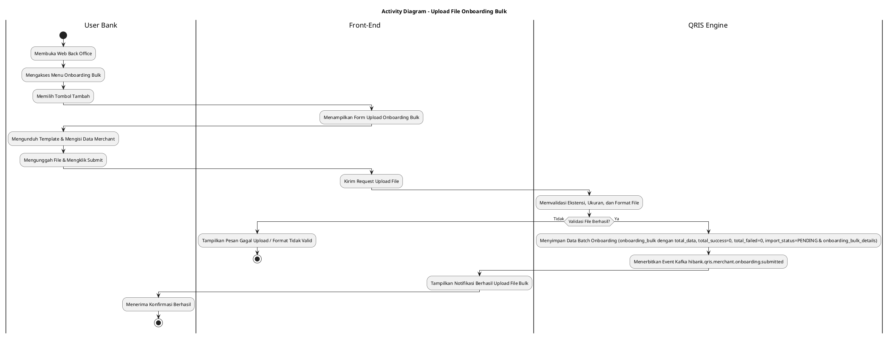
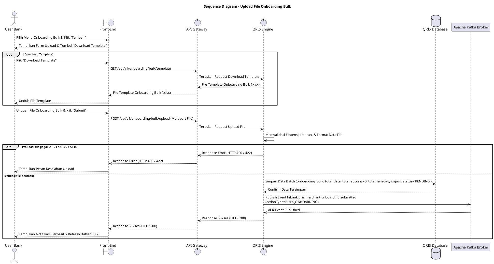

# 1 Deskripsi Use Case

**Tabel 1: Deskripsi Use Case Upload File Onboarding Bulk**

| Elemen Spesifikasi | Deskripsi Detail |
| --- | --- |
| ID Use Case | UC-BOH-014 |
| Nama Use Case | Upload File Onboarding Bulk |
| Penjelasan Singkat | Fitur Web Back Office Hibank yang memungkinkan User Hibank mengunduh template onboarding, mengisi data calon merchant secara masal, mengunggah file template, dan sistem memvalidasi serta mengemisikan event pendaftaran bulk merchant ke Kafka broker. |
| Aktor Utama | User Bank (Back Office Hibank Staff) |
| Aktor Pendukung | QRIS Engine, Apache Kafka Broker |
| Deskripsi Singkat | User Bank melakukan otentikasi login ke Web Back Office Hibank dan mengakses menu **Merchant Onboarding** -> **Onboarding Bulk**. User memilih tombol **"Tambah"** sehingga sistem menampilkan form pengunggahan file beserta tombol **"Download Template"**. User mengunduh file template, mengisi data calon merchant sesuai ketentuan format, dan mengunggah berkas tersebut pada form. Sistem memvalidasi ekstensi, ukuran file, serta format isian data calon merchant. Setelah validasi berhasil, sistem menyimpan data batch onboarding ke database `onboarding_bulk` (memuat `total_data`, `total_success = 0`, `total_failed = 0`, `import_status = 'PENDING'`) dan `onboarding_bulk_details`, lalu mempublikasikan event Kafka `hibank.qris.merchant.onboarding.submitted` dengan payload utama mencakup `actionType=BULK_ONBOARDING`. Front-End kemudian menampilkan notifikasi bahwa pengunggahan file onboarding bulk berhasil diproses. |
| Pre-condition | 1. User Bank telah berhasil login SSO ke Web Back Office Hibank dan memiliki kewenangan peran *Onboarding Bulk Administrator*. 2. Template berkas onboarding bulk calon merchant (.xlsx) telah tersedia pada sistem Web Back Office. |
| Post-condition | 1. Berkas data onboarding bulk calon merchant berhasil diunggah dan disimpan ke tabel `onboarding_bulk` (dengan `total_data`, `total_success = 0`, `total_failed = 0`, dan `import_status = 'PENDING'`) serta `onboarding_bulk_details`. 2. Sistem menerbitkan event Kafka ke topic `hibank.qris.merchant.onboarding.submitted` dengan payload memuat `actionType=BULK_ONBOARDING`. 3. Front-End menampilkan notifikasi sukses pengunggahan berkas dan memperbarui daftar riwayat onboarding bulk. |
| Trigger | User Bank memilih opsi Tambah pada menu Onboarding Bulk, mengunggah berkas template onboarding yang berisi data calon merchant, dan mengklik tombol **"Submit"**. |
| Nama Tabel | onboarding_bulk, onboarding_bulk_details |
| Integrasi | 1. **Web Back Office Hibank UI:** Antarmuka pengunggahan berkas dan pengelolaan onboarding bulk. 2. **Apache Kafka Message Broker:** Centralized event broker pengemisi event topic `hibank.qris.merchant.onboarding.submitted`. |
| Asumsi | 1. Data calon merchant dalam file yang diunggah disusun sesuai petunjuk dan format kolom pada template resmi. 2. Pengisian data calon merchant tidak melanggar batasan karakter dan format tipe data kolom mandatori. |
| Keterbatasan | 1. Ekstensi file yang didukung terbatas pada format spreadsheet `.xlsx` atau `.csv`. 2. Ukuran file maksimal diimbangi batas maksimal baris data calon merchant per unggahan berkas (contoh: maks 10MB atau 1.000 record per file). |
| Aturan Bisnis/Sistem | 1. **Mandatory Template Standard:** User WAJIB menggunakan template berkas resmi yang diunduh langsung dari sistem Web Back Office Hibank. 2. **Strict File Validation:** Sistem memvalidasi format ekstensi file (`.xlsx` / `.csv`), batas ukuran berkas, serta ketersediaan data pada kolom mandatori sebelum data disimpan. 3. **Kafka Event Emission Standard:** Setelah berkas valid dan tersimpan, QRIS Engine WAJIB mendistribusikan pesan event ke Kafka Topic `hibank.qris.merchant.onboarding.submitted` dengan menyertakan objek payload wajib berupa `actionType=BULK_ONBOARDING`, `batch_id`, `total_data`, `uploaded_by`, dan timestamp pendaftaran. 4. **Batch Storage Standard:** &nbsp;&nbsp;- **`onboarding_bulk`**: Menyimpan header batch pengunggahan mencakup `batch_id`, `file_name`, `total_data`, `total_success` (default 0), `total_failed` (default 0), `import_status = 'PENDING'`, dan `created_by`. &nbsp;&nbsp;- **`onboarding_bulk_details`**: Menyimpan rincian data setiap calon merchant dari baris file bulk dengan `import_status = 'PENDING'`. |
| Session Idle | 15 Menit |

# 2 Main Flow

**Tabel 2: Main Flow Upload File Onboarding Bulk**

| No. | Aktivitas | Deskripsi |
| ---: | --- | --- |
| 1 | Membuka Web Back Office | User Bank melakukan login SSO dan membuka dashboard Web Back Office Hibank. |
| 2 | Mengakses Menu Onboarding Bulk | User Bank mengklik menu **Merchant Onboarding** -> sub-menu **Onboarding Bulk**. |
| 3 | Menampilkan Daftar Onboarding Bulk | Sistem menampilkan daftar riwayat pendaftaran onboarding bulk dan tombol **"Tambah"**. |
| 4 | Memilih Tombol Tambah | User Bank mengklik tombol **"Tambah"** pada halaman Onboarding Bulk. |
| 5 | Menampilkan Form Upload Bulk | Sistem menampilkan modal form pendaftaran Onboarding Bulk yang memuat tombol **"Download Template"** dan area upload berkas. |
| 6 | Mendownload Template Berkas | User Bank mengklik tombol **"Download Template"** untuk memperoleh file acuan format data calon merchant. |
| 7 | Mengisi Template Calon Merchant | User Bank mengunduh file template, kemudian mengisikan data calon merchant sesuai ketentuan format. |
| 8 | Mengunggah Berkas & Submit | User Bank memilih berkas template yang telah diisi pada area upload, lalu mengklik tombol **"Submit"**. |
| 9 | Memvalidasi File & Data | Sistem memvalidasi ekstensi berkas, ukuran berkas, serta struktur kelengkapan data calon merchant. |
| 10 | Menyimpan Batch & Menerbitkan Event | Sistem menyimpan data ke `onboarding_bulk` (`total_data`, `total_success = 0`, `total_failed = 0`, `import_status = 'PENDING'`) dan `onboarding_bulk_details`, serta menerbitkan event ke Kafka Topic `hibank.qris.merchant.onboarding.submitted` dengan payload `actionType=BULK_ONBOARDING`. |
| 11 | Menampilkan Notifikasi Sukses | Front-End menampilkan pesan notifikasi bahwa berkas onboarding bulk berhasil diunggah dan sedang diproses sistem. |
| 12 | Use Case Selesai | Pengunggahan file onboarding bulk selesai dilakukan dan event pendaftaran telah terpublikasi. |

# 3 Alternative Flow

**Tabel 3: Alternative Flow Upload File Onboarding Bulk**

| Kode | Alternative Flow | Deskripsi |
| --- | --- | --- |
| AF-01 | Ekstensi Berkas Tidak Valid | Pada langkah 9, apabila berkas yang diunggah bukan berformat `.xlsx` atau `.csv`, Sistem menolak proses pengunggahan dan Front-End menampilkan `Format file tidak valid. Gunakan format .xlsx atau .csv`. |
| AF-02 | Ukuran Berkas Melebihi Batas Maximum | Pada langkah 9, apabila ukuran berkas yang diunggah melebihi batas maksimum (10MB), Sistem batalkan pengunggahan dan Front-End menampilkan `Ukuran file melebihi batas maksimum 10MB`. |
| AF-03 | Format Kolom atau Data Mandatori Kosong | Pada langkah 9, apabila struktur kolom berkas tidak sesuai template atau kolom mandatori calon merchant kosong, Sistem membatalkan simpan dan Front-End menampilkan `Format data template tidak valid atau terdapat kolom mandatori yang kosong`. |
| AF-04 | Gagal Publikasi Event ke Kafka Broker | Pada langkah 10, apabila pengiriman pesan event ke Kafka Topic `hibank.qris.merchant.onboarding.submitted` mengalami kendala/timeout, Sistem mencatat status gagal pengiriman event dan Front-End menampilkan `Gagal mempublikasikan event onboarding bulk ke Kafka broker`. |

# 4 Status Front-End

**Tabel 4: Status Front-End Upload File Onboarding Bulk**

| No. | Nama Status | Deskripsi Tampilan Front-End |
| ---: | --- | --- |
| 1 | IDLE | Tampilan form pendaftaran Onboarding Bulk siap menerima berkas unggahan dan siap memproses unduh template. |
| 2 | LOADING | Indikator proses (*spinner/progress bar*) ditampilkan saat file sedang diunggah dan divalidasi oleh sistem. |
| 3 | SUCCESS | Modal/toast konfirmasi menampilkan pesan bahwa berkas onboarding bulk berhasil diunggah dan event pendaftaran terbit. |
| 4 | ERROR | Pesan peringatan kesalahan ditampilkan pada antarmuka akibat validasi berkas gagal atau gangguan koneksi server/Kafka. |

# 5 Activity Diagram Upload File Onboarding Bulk

# 6 Sequence Diagram Upload File Onboarding Bulk

# 7 Response Code

**Tabel 5: Response Code Upload File Onboarding Bulk**

| No. | HTTP Status | Response Code | Nama Response | Deskripsi | Respons Front-End |
| ---: | ---: | --- | --- | --- | --- |
| 1 | 200 | 200XX00 | SUCCESS_UPLOAD_BULK_ONBOARDING | Berkas onboarding bulk berhasil diunggah dan event pendaftaran berhasil terbit. | Menampilkan pesan notifikasi sukses dan memperbarui tabel riwayat bulk. |
| 2 | 400 | 400XX00 | INVALID_FILE_FORMAT | Format ekstensi berkas yang diunggah bukan .xlsx atau .csv. | Menampilkan pesan kesalahan `Format file tidak valid. Gunakan format .xlsx atau .csv`. |
| 3 | 400 | 400XX01 | FILE_SIZE_EXCEEDED | Ukuran berkas yang diunggah melebihi batas batas maksimum 10MB. | Menampilkan pesan kesalahan `Ukuran file melebihi batas maksimum 10MB`. |
| 4 | 422 | 422XX00 | INVALID_TEMPLATE_DATA | Baris data calon merchant atau kolom mandatori pada template tidak valid / kosong. | Menampilkan pesan kesalahan `Format data template tidak valid atau terdapat kolom mandatori yang kosong`. |
| 5 | 500 | 500XX00 | SYSTEM_INTERNAL_ERROR | Terjadi kegagalan internal pada server saat memproses data pendaftaran bulk. | Menampilkan pesan kesalahan `Terjadi kendala internal pada sistem`. |
| 6 | 504 | 504XX00 | KAFKA_EVENT_TIMEOUT | Koneksi publikasi event ke Kafka Broker mengalami batas waktu habis (timeout). | Menampilkan pesan kesalahan `Gagal mempublikasikan event onboarding bulk ke Kafka broker`. |

# 8 Desain Antarmuka

**Tabel 6: Desain Antarmuka Upload File Onboarding Bulk**

| Halaman | Komponen dan State Utama |
| --- | --- |
| Form Upload Onboarding Bulk | 1. **Tombol "Download Template":** Memicu pengunduhan berkas `.xlsx` acuan. 2. **Area File Drag & Drop / Browse:** Komponen pengunggah berkas yang menampilkan nama file terpilih. 3. **Tombol "Submit":** Tombol pemicu validasi dan pengiriman berkas ke backend. 4. **State Indicator:** Mengubah tampilan antara IDLE, LOADING, SUCCESS, dan ERROR. |
