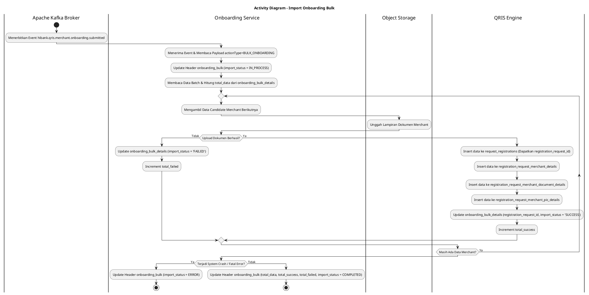
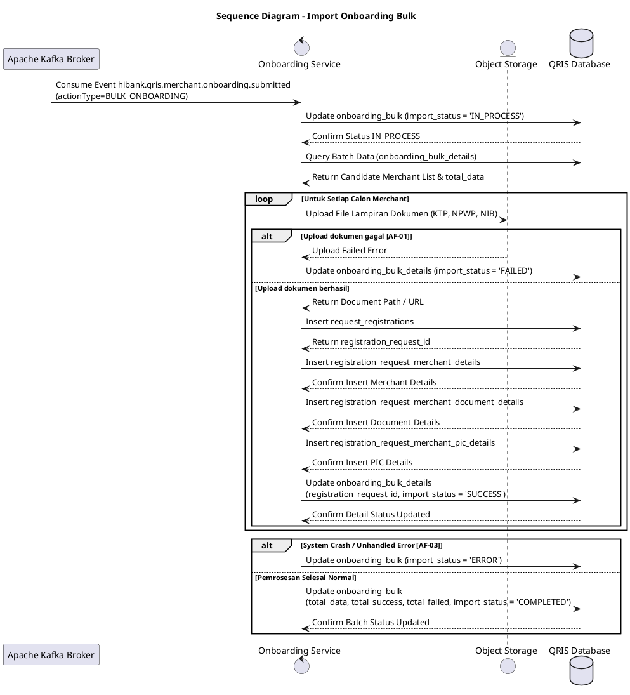

# 1 Deskripsi Use Case

**Tabel 1: Deskripsi Use Case Import Onboarding Bulk**

| Elemen Spesifikasi | Deskripsi Detail |
| --- | --- |
| ID Use Case | UC-BOH-015 |
| Nama Use Case | Import Onboarding Bulk |
| Penjelasan Singkat | Proses latar belakang (*asynchronous backend process*) oleh Onboarding Service untuk mendengarkan event Kafka `hibank.qris.merchant.onboarding.submitted` dengan `actionType=BULK_ONBOARDING`, mengekstrak data calon merchant dari berkas batch, mengunggah lampiran dokumen ke Object Storage, meng-insert data ke tabel pendaftaran merchant, serta meng-update status impor beserta penghitung `total_data`, `total_success`, dan `total_failed` secara bulk pada tabel `onboarding_bulk` dan `onboarding_bulk_details`. |
| Aktor Utama | Apache Kafka Broker (Event Producer / Trigger) |
| Aktor Pendukung | Onboarding Service, Object Storage (Doc Repository) |
| Deskripsi Singkat | Apache Kafka Broker mendistribusikan event `hibank.qris.merchant.onboarding.submitted` dengan payload `actionType=BULK_ONBOARDING` ke event stream. Onboarding Service mengomsumsi event tersebut dan **pada awal pemrosesan langsung meng-update status header batch pada tabel `onboarding_bulk` menjadi `import_status = 'IN_PROCESS'`**. Selanjutnya, service membaca data batch pendaftaran bulk dari `onboarding_bulk_details`. Untuk setiap calon merchant, Onboarding Service melakukan pengunggahan berkas lampiran dokumen (KTP, NPWP, NIB, foto lokasi) ke Object Storage dan memperoleh referensi URL/path dokumen. Service kemudian menyimpan record pendaftaran ke tabel **`request_registrations`**, rincian profil ke **`registration_request_merchant_details`**, rincian lampiran ke **`registration_request_merchant_document_details`**, dan rincian penanggung jawab ke **`registration_request_merchant_pic_details`**. Setelah data pendaftaran terbentuk, service meng-insert `registration_request_id` ke tabel **`onboarding_bulk_details`** dengan memperbarui `import_status = 'SUCCESS'` (atau `import_status = 'FAILED'` jika gagal pada baris tersebut). Selama dan/atau di akhir pemrosesan batch, service mengalkulasi serta memperbarui jumlah **`total_data`**, **`total_success`**, dan **`total_failed`** pada tabel **`onboarding_bulk`**. Setelah seluruh baris dalam batch selesai diproses (baik terdapat baris yang gagal maupun berhasil), Onboarding Service meng-update status batch pada tabel **`onboarding_bulk`** menjadi **`import_status = 'COMPLETED'`**. Apabila sistem mengalami kendala fatal / crash di tengah pemrosesan, sistem meng-update status batch menjadi **`import_status = 'ERROR'`**. |
| Pre-condition | 1. Event `hibank.qris.merchant.onboarding.submitted` dengan payload `actionType=BULK_ONBOARDING` telah terpublikasi pada Kafka Broker. 2. Data batch onboarding bulk dan berkas lampiran pendukung telah tersedia pada temporary storage sistem dan tercatat pada tabel `onboarding_bulk` & `onboarding_bulk_details` dengan `import_status = 'PENDING'`. |
| Post-condition | 1. Data pendaftaran calon merchant berhasil disimpan ke tabel `request_registrations`, `registration_request_merchant_details`, `registration_request_merchant_document_details`, dan `registration_request_merchant_pic_details`. 2. Berkas lampiran dokumen calon merchant berhasil diunggah ke Object Storage. 3. Kolom `registration_request_id` pada tabel `onboarding_bulk_details` terisi dan status per baris diperbarui menjadi `import_status = 'SUCCESS'` atau `'FAILED'`. 4. Kolom `total_data`, `total_success`, dan `total_failed` pada tabel `onboarding_bulk` ter-update sesuai jumlah riil hasil impor. 5. Status pemrosesan batch pada tabel `onboarding_bulk` diperbarui menjadi `import_status = 'COMPLETED'` (jika alur impor selesai) atau `import_status = 'ERROR'` (jika sistem mengalami crash). |
| Trigger | Apache Kafka Broker menerbitkan event `hibank.qris.merchant.onboarding.submitted` dengan payload `actionType=BULK_ONBOARDING`. |
| Nama Tabel | request_registrations, registration_request_merchant_details, registration_request_merchant_document_details, registration_request_merchant_pic_details, onboarding_bulk, onboarding_bulk_details |
| Integrasi | 1. **Apache Kafka Message Broker:** Centralized event broker sumber pemicu event `hibank.qris.merchant.onboarding.submitted`. 2. **Object Storage / Doc Repository:** Media penyimpanan berkas lampiran dokumen pendaftaran merchant. |
| Asumsi | 1. Payload event Kafka memuat `batch_id` yang valid dan dapat dihubungkan ke record `onboarding_bulk`. 2. Berkas lampiran dokumen calon merchant tersedia dan dapat diakses oleh Onboarding Service saat proses upload berlangsung. |
| Keterbatasan | 1. Pengunggahan lampiran dan pembentukan data pendaftaran dilakukan per calon merchant dalam loop batch. 2. Pembaruan status `IN_PROCESS` dilakukan di awal pengerjaan, sedangkan pembaruan penghitung `total_success`, `total_failed`, dan status akhir `COMPLETED` atau `ERROR` diperbarui di akhir pengerjaan batch. |
| Aturan Bisnis/Sistem | 1. **Kafka Consumer Listening:** Onboarding Service WAJIB memfilter dan memproses hanya event dengan payload `actionType=BULK_ONBOARDING`. 2. **Initial Process Status Update:** Saat event diterima dan proses impor dimulai, Onboarding Service WAJIB langsung meng-update header `onboarding_bulk` menjadi `import_status = 'IN_PROCESS'`. 3. **Document Attachment Storage Standard:** Seluruh dokumen pendukung (KTP, NPWP, NIB, dll.) WAJIB diunggah ke Object Storage terlebih dahulu sebelum URL/path disimpan ke tabel `registration_request_merchant_document_details`. 4. **Relational Transaction Standard:** Untuk setiap calon merchant, pendaftaran wajib meng-insert data secara atomic pada 4 tabel pendaftaran: &nbsp;&nbsp;- **`request_registrations`**: Record induk pendaftaran merchant (`registration_type = 'BULK'`) yang menghasilkan `registration_request_id`. &nbsp;&nbsp;- **`registration_request_merchant_details`**: Data identitas bisnis dan lokasi merchant. &nbsp;&nbsp;- **`registration_request_merchant_document_details`**: Data path/URL dokumen lampiran. &nbsp;&nbsp;- **`registration_request_merchant_pic_details`**: Data identitas penanggung jawab (PIC) merchant. 5. **Onboarding Bulk Detail Update:** Setelah record pendaftaran berhasil dibuat, service WAJIB meng-insert/update `registration_request_id` ke tabel `onboarding_bulk_details` serta memperbarui kolom `import_status = 'SUCCESS'` (atau `import_status = 'FAILED'` jika terjadi kegagalan validasi/dokumen pada baris tersebut). 6. **Bulk Summary Counters Update:** Onboarding Service WAJIB memperbarui kolom penghitung pada `onboarding_bulk`: &nbsp;&nbsp;- **`total_data`**: Jumlah total baris calon merchant pada berkas batch. &nbsp;&nbsp;- **`total_success`**: Jumlah baris merchant yang berhasil diimpor (`import_status = 'SUCCESS'`). &nbsp;&nbsp;- **`total_failed`**: Jumlah baris merchant yang gagal diimpor (`import_status = 'FAILED'`). 7. **Batch Status Final Lifecycle:** &nbsp;&nbsp;- **`COMPLETED`**: Di-update pada header `onboarding_bulk` setelah seluruh baris selesai diproses (berlaku baik jika seluruh data berhasil maupun sebagian/seluruh data gagal). &nbsp;&nbsp;- **`ERROR`**: Di-update pada header `onboarding_bulk` apabila terjadi crash sistem, unhandled exception, atau kegagalan fatal pada service. |
| Session Idle | 15 Menit |

# 2 Main Flow

**Tabel 2: Main Flow Import Onboarding Bulk**

| No. | Aktivitas | Deskripsi |
| ---: | --- | --- |
| 1 | Menerima Event Kafka | Onboarding Service mendengarkan dan menerima event `hibank.qris.merchant.onboarding.submitted` (`actionType=BULK_ONBOARDING`) dari Apache Kafka Broker. |
| 2 | Set Status Batch IN_PROCESS | Onboarding Service membaca `batch_id` dari payload dan meng-update header tabel `onboarding_bulk` menjadi `import_status = 'IN_PROCESS'`. |
| 3 | Membaca Data Batch Bulk | Onboarding Service mengambil rincian data calon merchant dari tabel `onboarding_bulk_details` serta menghitung `total_data`. |
| 4 | Mengiterasi Baris Merchant | Onboarding Service memulai proses iterasi data untuk setiap calon merchant yang terdapat pada file bulk. |
| 5 | Mengunggah Lampiran Dokumen | Onboarding Service mengunggah berkas dokumen pendukung calon merchant ke Object Storage dan memperoleh URL/path berkas. |
| 6 | Menyimpan Request Registration | Onboarding Service meng-insert record induk pendaftaran ke tabel `request_registrations` dan memperoleh `registration_request_id`. |
| 7 | Menyimpan Detail Merchant | Onboarding Service meng-insert rincian profil dan informasi usaha ke tabel `registration_request_merchant_details`. |
| 8 | Menyimpan Detail Dokumen | Onboarding Service meng-insert data rincian URL/path dokumen lampiran ke tabel `registration_request_merchant_document_details`. |
| 9 | Menyimpan Detail PIC | Onboarding Service meng-insert data rincian penanggung jawab merchant ke tabel `registration_request_merchant_pic_details`. |
| 10 | Update Status Detail Merchant | Onboarding Service meng-update `registration_request_id` ke tabel `onboarding_bulk_details` serta mengatur `import_status = 'SUCCESS'` (atau `import_status = 'FAILED'` jika baris gagal). |
| 11 | Update Counters & Set Status COMPLETED | Setelah seluruh baris selesai diproses, Onboarding Service meng-update `total_data`, `total_success`, dan `total_failed`, serta mengubah status header `onboarding_bulk` menjadi `import_status = 'COMPLETED'`. |
| 12 | Use Case Selesai | Proses impor data onboarding bulk dan pengunggahan berkas lampiran calon merchant selesai diproses. |

# 3 Alternative Flow

**Tabel 3: Alternative Flow Import Onboarding Bulk**

| Kode | Alternative Flow | Deskripsi |
| --- | --- | --- |
| AF-01 | Gagal Upload Dokumen ke Object Storage | Pada langkah 5, apabila proses pengunggahan dokumen ke Object Storage mengalami kegagalan, Onboarding Service mencatat log error, meng-update `onboarding_bulk_details` dengan `import_status = 'FAILED'`, menambah penghitung `total_failed`, dan melanjutkan ke baris calon merchant berikutnya. |
| AF-02 | Gagal Insert Data Merchant (Data Duplikat / Invalid) | Pada langkah 6-9, apabila terjadi kegagalan integritas data atau duplikasi merchant, Onboarding Service membatalkan transaksi calon merchant tersebut, meng-update `onboarding_bulk_details` dengan `import_status = 'FAILED'`, menambah penghitung `total_failed`, dan melanjutkan ke baris berikutnya. |
| AF-03 | System Crash / Fatal Error | Pada langkah 4-10, apabila terjadi crash sistem, unhandled exception, atau koneksi terputus total, Onboarding Service mencatat log fatal dan meng-update header `onboarding_bulk` menjadi `import_status = 'ERROR'`. |

# 4 Status Front-End

**Tabel 4: Status Front-End Import Onboarding Bulk**

| No. | Nama Status | Deskripsi Tampilan Front-End |
| ---: | --- | --- |
| 1 | PENDING | Tampilan status pada dashboard monitoring Back Office menunjukkan batch pendaftaran bulk baru diterima dan mengantre untuk diimpor. |
| 2 | IN_PROCESS | Tampilan status pada dashboard monitoring Back Office menunjukkan batch sedang diproses oleh Onboarding Service. |
| 3 | COMPLETED | Tampilan status pada dashboard monitoring menunjukkan proses impor batch telah selesai diproses dengan rincian `total_data`, `total_success`, dan `total_failed`. |
| 4 | ERROR | Tampilan status pada dashboard monitoring menunjukkan proses impor batch terhenti akibat crash sistem atau fatal error. |

# 5 Activity Diagram Import Onboarding Bulk

# 6 Sequence Diagram Import Onboarding Bulk

# 7 Response Code

**Tabel 5: Response Code Import Onboarding Bulk**

| No. | HTTP Status | Response Code | Nama Response | Deskripsi | Respons Front-End |
| ---: | ---: | --- | --- | --- | --- |
| 1 | 200 | 200XX00 | SUCCESS_IMPORT_BULK_ONBOARDING | Seluruh baris data calon merchant selesai diproses dan penghitung ter-update. | Dashboard monitoring memperbarui status batch `onboarding_bulk` menjadi `COMPLETED` serta menampilkan ringkasan `total_data`, `total_success`, dan `total_failed`. |
| 2 | 400 | 400XX00 | INVALID_EVENT_PAYLOAD | Payload event Kafka tidak valid atau `actionType` bukan `BULK_ONBOARDING`. | Log audit mencatat kesalahan payload event Kafka. |
| 3 | 422 | 422XX00 | PARTIAL_IMPORT_FAILED | Sebagian data calon merchant gagal diimpor akibat kendala dokumen/validasi data. | Dashboard monitoring memperbarui status `onboarding_bulk_details` dengan `import_status = 'FAILED'` dan memperbarui akumulasi `total_failed`. |
| 4 | 500 | 500XX00 | SYSTEM_INTERNAL_ERROR | Terjadi crash sistem / unhandled exception saat memproses batch onboarding bulk. | Dashboard monitoring memperbarui status batch `onboarding_bulk` menjadi `ERROR`. |
| 5 | 502 | 502XX00 | STORAGE_UPLOAD_FAILED | Gagal terhubung atau gagal mengunggah berkas lampiran ke Object Storage. | Log audit mencatat kegagalan koneksi Object Storage dan detail status diset `FAILED`. |

# 8 Desain Antarmuka

**Tabel 6: Desain Antarmuka Import Onboarding Bulk**

| Halaman | Komponen dan State Utama |
| --- | --- |
| Monitoring Import Onboarding Bulk | 1. **Tabel Header Batch (`onboarding_bulk`):** Menampilkan `batch_id`, `file_name`, `total_data`, `total_success`, `total_failed`, dan `import_status` (`PENDING`, `IN_PROCESS`, `COMPLETED`, `ERROR`). 2. **Tabel Detail Merchant (`onboarding_bulk_details`):** Menampilkan `registration_request_id`, data merchant, dan `import_status` (`SUCCESS`, `FAILED`). 3. **Badge Status:** Indikator warna status (`PENDING` - Abu-abu, `IN_PROCESS` - Biru, `COMPLETED` - Hijau, `ERROR` - Merah). |
