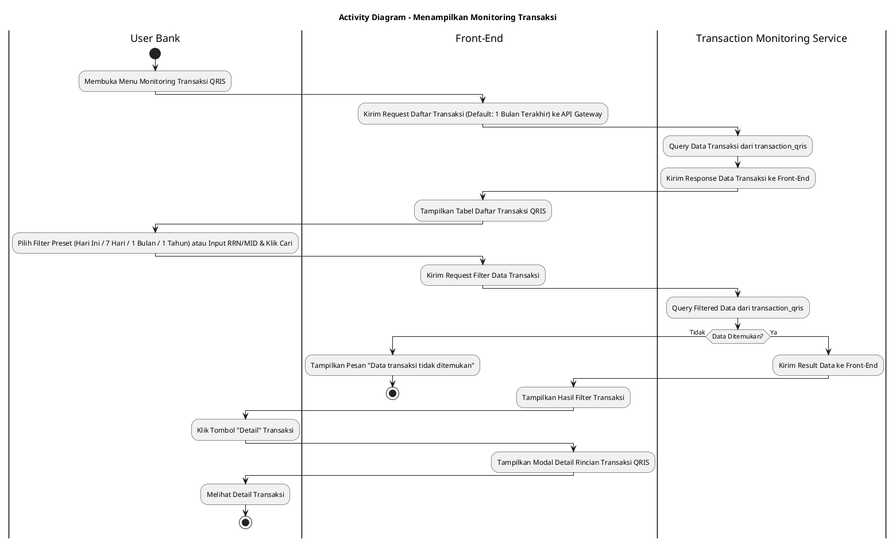
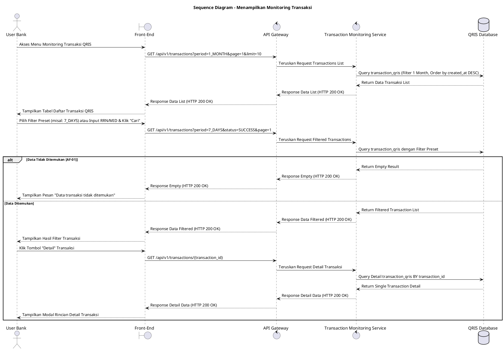

# 1 Deskripsi Use Case

**Tabel 1: Deskripsi Use Case Menampilkan Monitoring Transaksi**

| Elemen Spesifikasi | Deskripsi Detail |
| --- | --- |
| ID Use Case | UC-BOH-017 |
| Nama Use Case | Menampilkan Monitoring Transaksi |
| Penjelasan Singkat | Fitur Web Back Office Hibank yang memungkinkan User Bank memantau, memfilter, dan meninjau daftar serta rincian transaksi QRIS secara real-time dari tabel `transaction_qris` menggunakan Transaction Monitoring Service dengan pilihan filter preset dan pencarian kustom. |
| Aktor Utama | User Bank (Back Office Hibank Staff / Operations / Support) |
| Aktor Pendukung | Transaction Monitoring Service |
| Deskripsi Singkat | User Bank melakukan otentikasi login SSO ke Web Back Office Hibank dan mengakses menu **Monitoring Transaksi**. Front-End mengirimkan request ke API Gateway untuk memuat daftar transaksi QRIS dengan filter default **1 Bulan Terakhir**. Sistem memfasilitasi Pilihan Filter Preset mencakup **Hari Ini**, **7 Hari Terakhir**, **1 Bulan Terakhir** (Periode Default), dan **1 Tahun Terakhir**, serta pencarian kustom berdasarkan RRN/STAN, Merchant ID (MID), dan Status Transaksi (`SUCCESS`, `PENDING`, `FAILED`, `SETTLED`). Transaction Monitoring Service melakukan kueri ke tabel **`transaction_qris`** dan mengembalikan data transaksi mencakup Retrieval Reference Number (RRN), System Trace Audit Number (STAN), Merchant ID (MID), Nama Merchant, Nominal Transaksi, Biaya MDR, Nominal Netto, Status Transaksi, serta Waktu Transaksi. Front-End menampilkan data dalam tabel interaktif beserta tombol **"Detail"** untuk melihat rincian informasi transaksi secara lengkap. |
| Pre-condition | User Bank telah berhasil login SSO ke Web Back Office Hibank dan memiliki kewenangan peran *Transaction Monitoring Staff*. |
| Post-condition | Front-End berhasil menyajikan tabel daftar transaksi QRIS dan informasi rincian detail transaksi sesuai kriteria filter preset yang dipilih. |
| Trigger | User Bank mengakses menu **Monitoring Transaksi** atau memilih opsi filter preset / pencarian kriteria data transaksi pada halaman web. |
| Nama Tabel | transaction_qris |
| Integrasi | 1. **Web Back Office Hibank UI:** Antarmuka tabel monitoring transaksi QRIS beserta komponen filter preset dan pencarian. 2. **Transaction Monitoring Service:** Microservice penyaji data transaksi monitoring dan pelaporan. 3. **QRIS Database:** Penyimpanan data historis dan real-time log transaksi QRIS (`transaction_qris`). |
| Asumsi | 1. Data transaksi pada tabel `transaction_qris` ter-update secara real-time saat transaksi diproses oleh sistem. 2. Halaman monitoring menggunakan metode pembagian halaman (*pagination*) untuk menjaga performa muat data. |
| Keterbatasan | 1. Pemantauan transaksi pada use case ini bersifat read-only (hanya menampilkan data dan tidak memfasilitasi aksi eksekusi refund). 2. Filter preset rentang waktu acuan membatasi kueri maksimum 1 tahun terakhir untuk menjaga performa sistem. |
| Aturan Bisnis/Sistem | 1. **Preset Period Filter Standard:** Sistem WAJIB menyediakan 4 opsi filter preset acuan: &nbsp;&nbsp;- **Hari Ini:** Menampilkan transaksi untuk hari berjalan. &nbsp;&nbsp;- **7 Hari Terakhir:** Menampilkan transaksi 7 hari ke belakang. &nbsp;&nbsp;- **1 Bulan Terakhir:** Menampilkan transaksi 30 hari ke belakang (periode default). &nbsp;&nbsp;- **1 Tahun Terakhir:** Menampilkan transaksi 365 hari ke belakang. 2. **Pagination Standard:** Daftar transaksi wajib ditampilkan dengan pagination (default 10 atau 25 data per halaman). 3. **Real-time Status Display:** Status transaksi yang ditampilkan diselaraskan dengan enum status resmi (`SUCCESS`, `PENDING`, `FAILED`, `EXPIRED`, `SETTLED`, `REFUNDED`). 4. **Security & Data Masking Standard:** Informasi sensitif kartu/sumber dana konsumen wajib disamarkan (*masked*) pada tampilan detail. |
| Session Idle | 15 Menit |

# 2 Main Flow

**Tabel 2: Main Flow Menampilkan Monitoring Transaksi**

| No. | Aktivitas | Deskripsi |
| ---: | --- | --- |
| 1 | Membuka Menu Monitoring Transaksi | User Bank melakukan login SSO dan mengklik menu **Monitoring Transaksi**. |
| 2 | Mengirim Request Daftar Transaksi | Front-End mengirimkan request ke API Gateway untuk mengambil data transaksi QRIS terbaru dengan filter default **1 Bulan Terakhir**. |
| 3 | Query Data Transaksi | Transaction Monitoring Service melakukan kueri ke tabel `transaction_qris` mengambil data RRN, STAN, MID, Nama Merchant, Nominal, Status, dan Timestamp. |
| 4 | Menampilkan Daftar Transaksi QRIS | Front-End menyajikan tabel daftar transaksi QRIS beserta komponen filter preset (**Hari Ini**, **7 Hari Terakhir**, **1 Bulan Terakhir**, **1 Tahun Terakhir**) dan tombol pagination. |
| 5 | Memilih Filter Preset / Parameter Pencarian | User Bank memilih opsi filter preset (misal: **7 Hari Terakhir**) atau memasukkan parameter pencarian RRN/MID/Status dan mengklik tombol **"Cari"**. |
| 6 | Mengirim Request Filter Data | Front-End mengirimkan request pencarian berparameter ke API Gateway. |
| 7 | Query Filtered Transactions | Transaction Monitoring Service menjalankan kueri berfilter pada tabel `transaction_qris` dan mengembalikan data hasil pencarian. |
| 8 | Menampilkan Hasil Filter Transaksi | Front-End memperbarui tabel dengan menyajikan daftar transaksi yang cocok beserta ringkasan total nominal. |
| 9 | Membuka Detail Transaksi | User Bank mengklik tombol **"Detail"** pada salah satu baris data transaksi. |
| 10 | Menampilkan Detail Transaksi | Front-End menampilkan modal/halaman detail yang menyajikan rincian lengkap transaksi QRIS. |
| 11 | Use Case Selesai | Pemantauan data transaksi QRIS selesai dilaksanakan. |

# 3 Alternative Flow

**Tabel 3: Alternative Flow Menampilkan Monitoring Transaksi**

| Kode | Alternative Flow | Deskripsi |
| --- | --- | --- |
| AF-01 | Data Transaksi Tidak Ditemukan | Pada langkah 7, apabila kriteria filter pencarian (RRN/MID/Preset Filter) tidak cocok dengan data pada `transaction_qris`, Sistem mengembalikan data kosong dan Front-End menampilkan `Data transaksi tidak ditemukan`. |
| AF-02 | Gangguan Koneksi Database Server | Pada langkah 3 atau 7, apabila koneksi database terputus, Sistem mengembalikan HTTP status 500 dan Front-End menampilkan `Gagal memuat data monitoring transaksi`. |

# 4 Status Front-End

**Tabel 4: Status Front-End Menampilkan Monitoring Transaksi**

| No. | Nama Status | Deskripsi Tampilan Front-End |
| ---: | --- | --- |
| 1 | LOADING | Indikator muat data (*spinner/skeleton*) ditampilkan pada tabel atau modal detail saat data diproses dari server. |
| 2 | SUCCESS | Tabel daftar monitoring transaksi dan modal rincian detail menyajikan data transaksi QRIS secara valid sesuai filter preset. |
| 3 | EMPTY | Tabel menyajikan tampilan *empty state* saat tidak ada data transaksi yang cocok dengan parameter filter pencarian. |
| 4 | ERROR | Pesan kesalahan disertai tombol **"Retry"** ditampilkan pada UI akibat gangguan server atau validasi filter gagal. |

# 5 Activity Diagram Menampilkan Monitoring Transaksi

# 6 Sequence Diagram Menampilkan Monitoring Transaksi

# 7 Response Code

**Tabel 5: Response Code Menampilkan Monitoring Transaksi**

| No. | HTTP Status | Response Code | Nama Response | Deskripsi | Respons Front-End |
| ---: | ---: | --- | --- | --- | --- |
| 1 | 200 | 200XX00 | SUCCESS_GET_MONITORING_TRANSACTIONS | Data daftar monitoring transaksi QRIS berhasil diambil dari server sesuai filter preset. | Menampilkan tabel daftar transaksi QRIS secara lengkap. |
| 2 | 400 | 400XX00 | INVALID_SEARCH_FILTER | Parameter filter pencarian atau opsi preset filter tidak valid. | Menampilkan pesan kesalahan `Filter pencarian tidak valid`. |
| 3 | 404 | 404XX00 | TRANSACTION_NOT_FOUND | Data transaksi tidak ditemukan berdasarkan kriteria pencarian RRN/MID/Preset yang dipilih. | Menampilkan tabel dalam kondisi *empty state* dengan pesan `Data transaksi tidak ditemukan`. |
| 4 | 500 | 500XX00 | SYSTEM_INTERNAL_ERROR | Terjadi kegagalan internal server saat mengambil data transaksi. | Menampilkan indikator error pada UI dan tombol *retry*. |
| 5 | 504 | 504XX00 | DATABASE_QUERY_TIMEOUT | Kueri ke tabel `transaction_qris` mengalami batas waktu habis (timeout). | Menampilkan pesan kesalahan `Gagal memuat data monitoring transaksi akibat timeout`. |

# 8 Desain Antarmuka

**Tabel 6: Desain Antarmuka Menampilkan Monitoring Transaksi**

| Halaman | Komponen dan State Utama |
| --- | --- |
| Monitoring Transaksi QRIS | 1. **Tombol Filter Preset:** Pilihan Preset (**Hari Ini**, **7 Hari Terakhir**, **1 Bulan Terakhir** *(Default)*, **1 Tahun Terakhir**). 2. **Bilah Pencarian:** Input RRN/STAN, Input MID/Nama Merchant, Dropdown Status (`SUCCESS`, `PENDING`, `FAILED`, `SETTLED`), dan Tombol **"Cari"** / **"Reset"**. 3. **Tabel Transaksi:** Kolom RRN, Tanggal/Waktu, Merchant ID, Nama Merchant, Nominal, MDR, Status, dan Tombol Aksi **"Detail"**. 4. **Pagination Control:** Komponen navigasi halaman (First, Prev, Page Numbers, Next, Last). 5. **State Indicator:** Tampilan LOADING (Spinner), SUCCESS, EMPTY, dan ERROR. |
| Modal Detail Transaksi QRIS | 1. **Header Info:** Transaction ID, RRN, STAN, dan Status Badge. 2. **Rincian Merchant:** MID, MPAN, Nama Merchant, Kategori Usaha (MCC), dan Terminal ID. 3. **Rincian Pembayaran:** Nominal Transaksi, Biaya MDR, Nominal Netto, Tipe QRIS (Static/Dynamic), dan Issuer Bank. 4. **Tombol "Tutup":** Menutup modal rincian transaksi. |
