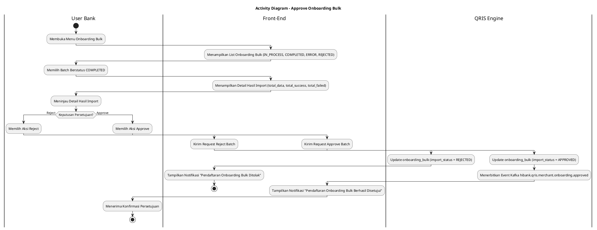
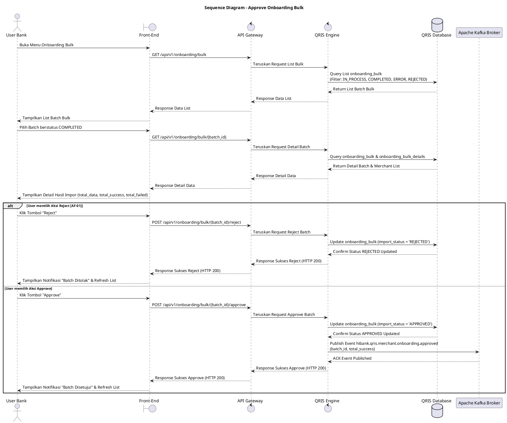

# 1 Deskripsi Use Case

**Tabel 1: Deskripsi Use Case Approve Onboarding Bulk**

| Elemen Spesifikasi | Deskripsi Detail |
| --- | --- |
| ID Use Case | UC-BOH-018 |
| Nama Use Case | Approve Onboarding Bulk |
| Penjelasan Singkat | Fitur Web Back Office Hibank yang memfasilitasi User Bank (Approver) untuk meninjau rincian hasil impor batch onboarding bulk merchant berstatus `COMPLETED`, serta memberikan persetujuan (Approve) atau penolakan (Reject). Persetujuan akan mempublikasikan event `hibank.qris.merchant.onboarding.approved` ke Kafka Broker, sedangkan penolakan akan memperbarui status batch menjadi `REJECTED`. |
| Aktor Utama | User Bank (Back Office Hibank Approver) |
| Aktor Pendukung | QRIS Engine, Apache Kafka Broker |
| Deskripsi Singkat | User Bank melakukan otentikasi login SSO ke Web Back Office Hibank dan mengakses menu **Merchant Onboarding** -> **Onboarding Bulk**. Sistem menampilkan daftar berkas batch onboarding bulk dengan indikator `import_status` memuat status `IN_PROCESS`, `COMPLETED`, `ERROR`, maupun `REJECTED`. User Bank memilih salah satu baris berkas batch yang berstatus `import_status = 'COMPLETED'`. Sistem menampilkan halaman detail hasil impor yang menyajikan rincian header `onboarding_bulk` (`total_data`, `total_success`, `total_failed`) dan tabel rincian merchant per baris dari `onboarding_bulk_details`. User Bank meneliti hasil impor dan memilih aksi persetujuan **"Approve"** atau penolakan **"Reject"**. Apabila memilih **Approve**, sistem memperbarui status batch menjadi `import_status = 'APPROVED'` dan menerbitkan event ke Kafka Topic `hibank.qris.merchant.onboarding.approved`. Apabila memilih **Reject**, sistem memperbarui status batch menjadi `import_status = 'REJECTED'` tanpa mempublikasikan event approval. |
| Pre-condition | 1. User Bank telah berhasil login SSO ke Web Back Office Hibank dan memiliki hak akses otoritas *4-Eyes Approver Onboarding Bulk*. 2. Terdapat record batch pendaftaran bulk pada tabel `onboarding_bulk` yang telah selesai diproses impor dengan status `import_status = 'COMPLETED'`. |
| Post-condition | 1. Jika aksi disetujui (Approve), status batch pada tabel `onboarding_bulk` diperbarui menjadi `import_status = 'APPROVED'` dan event Kafka `hibank.qris.merchant.onboarding.approved` berhasil dipublikasikan. 2. Jika aksi ditolak (Reject), status batch pada tabel `onboarding_bulk` diperbarui menjadi `import_status = 'REJECTED'`. 3. Front-End menampilkan konfirmasi persetujuan/penolakan dan memperbarui daftar batch Onboarding Bulk. |
| Trigger | User Bank memilih batch berstatus `COMPLETED` pada menu Onboarding Bulk dan mengklik tombol **"Approve"** atau **"Reject"**. |
| Nama Tabel | onboarding_bulk, onboarding_bulk_details, request_registrations |
| Integrasi | 1. **Web Back Office Hibank UI:** Antarmuka peninjauan dan eksekusi persetujuan onboarding bulk. 2. **Apache Kafka Message Broker:** Centralized event broker pengemisi event topic `hibank.qris.merchant.onboarding.approved`. |
| Asumsi | 1. Hanya batch dengan status `import_status = 'COMPLETED'` yang dapat dieksekusi aksi persetujuan atau penolakan. 2. Data rincian calon merchant pada `onboarding_bulk_details` telah lengkap beserta `registration_request_id` untuk data yang berhasil diimpor. |
| Keterbatasan | 1. Aksi persetujuan dilakukan pada tingkat batch (`onboarding_bulk`), bukan per individu calon merchant. 2. Batch berstatus `IN_PROCESS`, `ERROR`, `APPROVED`, atau `REJECTED` tidak memunculkan opsi aksi persetujuan ulang. |
| Aturan Bisnis/Sistem | 1. **Batch Eligibility Standard:** Hanya berkas batch dengan `import_status = 'COMPLETED'` yang diizinkan untuk disetujui (Approve) atau ditolak (Reject). 2. **Approval Event Emission Standard:** Jika User Bank mengklik **Approve**, sistem WAJIB memperbarui header `onboarding_bulk` menjadi `import_status = 'APPROVED'` dan mempublikasikan event ke Kafka Topic `hibank.qris.merchant.onboarding.approved` dengan memuat payload `batch_id`, `total_success`, `approved_by`, dan timestamp. 3. **Rejection Handling Standard:** Jika User Bank mengklik **Reject**, sistem WAJIB memperbarui header `onboarding_bulk` menjadi `import_status = 'REJECTED'` dan TIDAK mengemisikan event approval ke Kafka broker. 4. **Audit Trail Standard:** Setiap aksi persetujuan atau penolakan mencatat identitas User Bank (`approved_by` / `rejected_by`) serta timestamp eksekusi pada tabel `onboarding_bulk`. |
| Session Idle | 15 Menit |

# 2 Main Flow

**Tabel 2: Main Flow Approve Onboarding Bulk**

| No. | Aktivitas | Deskripsi |
| ---: | --- | --- |
| 1 | Membuka Menu Onboarding Bulk | User Bank melakukan otentikasi login SSO dan mengklik menu **Merchant Onboarding** -> **Onboarding Bulk**. |
| 2 | Menampilkan List Onboarding Bulk | Sistem menampilkan daftar riwayat batch onboarding bulk dari `onboarding_bulk` dengan filter status `IN_PROCESS`, `COMPLETED`, `ERROR`, dan `REJECTED`. |
| 3 | Memilih Batch Berstatus COMPLETED | User Bank memilih dan mengklik salah satu baris batch yang memiliki `import_status = 'COMPLETED'`. |
| 4 | Menampilkan Detail Hasil Import | Sistem mengambil data dari `onboarding_bulk` dan `onboarding_bulk_details`, lalu menampilkan halaman detail yang menyajikan `total_data`, `total_success`, `total_failed`, serta daftar rincian status per merchant. |
| 5 | Meninjau Hasil Impor Merchant | User Bank meneliti keabsahan ringkasan dan rincian hasil impor data calon merchant. |
| 6 | Memilih Aksi Approved | User Bank mengklik tombol **"Approve"** untuk menyetujui hasil pendaftaran onboarding bulk. |
| 7 | Update Status Batch Approved | Sistem memvalidasi ketersediaan data dan memperbarui status pada tabel `onboarding_bulk` menjadi `import_status = 'APPROVED'`. |
| 8 | Mempublikasikan Event Kafka Approval | Sistem menerbitkan event Kafka ke topic `hibank.qris.merchant.onboarding.approved` dengan payload batch onboarding yang disetujui. |
| 9 | Menampilkan Konfirmasi Approval | Front-End menampilkan notifikasi sukses persetujuan batch dan memperbarui daftar status onboarding bulk. |
| 10 | Use Case Selesai | Proses persetujuan batch onboarding bulk selesai dilaksanakan. |

# 3 Alternative Flow

**Tabel 3: Alternative Flow Approve Onboarding Bulk**

| Kode | Alternative Flow | Deskripsi |
| --- | --- | --- |
| AF-01 | User Memilih Aksi Reject | Pada langkah 6, apabila User Bank mengklik tombol **"Reject"**, Sistem memperbarui `onboarding_bulk` menjadi `import_status = 'REJECTED'` tanpa mempublikasikan event Kafka, dan Front-End menampilkan `Pendaftaran onboarding bulk telah ditolak`. |
| AF-02 | Gagal Mempublikasikan Event ke Kafka Broker | Pada langkah 8, apabila publikasi event `hibank.qris.merchant.onboarding.approved` ke Kafka Broker mengalami timeout/gangguan koneksi, Sistem membatalkan perubahan status approval dan Front-End menampilkan `Gagal mempublikasikan event approval ke Kafka broker`. |
| AF-03 | Status Batch Telah Berubah / Invalid | Pada langkah 3 atau 7, apabila status batch sudah tidak berstatus `COMPLETED` (telah diproses user lain), Sistem membatalkan transaksi dan Front-End menampilkan `Data batch telah diperbarui atau tidak dalam status COMPLETED`. |

# 4 Status Front-End

**Tabel 4: Status Front-End Approve Onboarding Bulk**

| No. | Nama Status | Deskripsi Tampilan Front-End |
| ---: | --- | --- |
| 1 | IDLE | Tampilan halaman daftar batch Onboarding Bulk dan halaman detail hasil impor dalam kondisi siap diproses. |
| 2 | LOADING | Indikator proses (*spinner*) ditampilkan saat memuat rincian hasil impor atau mengirim request persetujuan/penolakan. |
| 3 | SUCCESS | Modal/toast konfirmasi menampilkan pesan persetujuan (`APPROVED`) atau penolakan (`REJECTED`) berhasil disimpan. |
| 4 | ERROR | Pesan peringatan kesalahan ditampilkan pada UI akibat gangguan sistem, status batch tidak valid, atau kegagalan koneksi Kafka. |

# 5 Activity Diagram Approve Onboarding Bulk

# 6 Sequence Diagram Approve Onboarding Bulk

# 7 Response Code

**Tabel 5: Response Code Approve Onboarding Bulk**

| No. | HTTP Status | Response Code | Nama Response | Deskripsi | Respons Front-End |
| ---: | ---: | --- | --- | --- | --- |
| 1 | 200 | 200XX00 | SUCCESS_APPROVE_BULK_ONBOARDING | Persetujuan batch onboarding bulk berhasil diproses dan event terbit. | Menampilkan pesan notifikasi sukses `Batch berhasil disetujui` dan memperbarui daftar. |
| 2 | 200 | 200XX01 | SUCCESS_REJECT_BULK_ONBOARDING | Penolakan batch onboarding bulk berhasil diproses. | Menampilkan pesan notifikasi `Batch berhasil ditolak` dan memperbarui daftar. |
| 3 | 400 | 400XX00 | INVALID_BATCH_STATUS | Batch yang dipilih tidak berstatus `COMPLETED` sehingga tidak dapat diproses. | Menampilkan pesan kesalahan `Hanya batch berstatus COMPLETED yang dapat disetujui atau ditolak`. |
| 4 | 422 | 422XX00 | APPROVAL_VALIDATION_FAILED | Validasi data batch atau kewenangan hak akses approver gagal. | Menampilkan pesan kesalahan `Gagal memvalidasi hak akses persetujuan atau data batch`. |
| 5 | 500 | 500XX00 | SYSTEM_INTERNAL_ERROR | Terjadi kegagalan internal server saat mengeksekusi persetujuan/penolakan. | Menampilkan pesan kesalahan `Terjadi gangguan internal pada server`. |
| 6 | 504 | 504XX00 | KAFKA_EVENT_TIMEOUT | Koneksi publikasi event `hibank.qris.merchant.onboarding.approved` mengalami timeout. | Menampilkan pesan kesalahan `Gagal mempublikasikan event approval ke Kafka broker`. |

# 8 Desain Antarmuka

**Tabel 6: Desain Antarmuka Approve Onboarding Bulk**

| Halaman | Komponen dan State Utama |
| --- | --- |
| Daftar Onboarding Bulk | 1. **Filter Status:** Dropdown filter status (`IN_PROCESS`, `COMPLETED`, `ERROR`, `REJECTED`, `APPROVED`). 2. **Tabel List Batch:** Menampilkan `batch_id`, `file_name`, `total_data`, `import_status`, dan aksi. 3. **Badge Status:** Indikator warna sesuai status batch. |
| Detail & Persetujuan Onboarding Bulk | 1. **Card Header Summary:** Menampilkan `total_data`, `total_success`, `total_failed`, dan `import_status`. 2. **Tabel Detail Merchant:** Menampilkan list `registration_request_id`, profil merchant, dan `import_status` (`SUCCESS`/`FAILED`). 3. **Tombol Aksi:** Tombol **"Approve"** (Warna Hijau) dan tombol **"Reject"** (Warna Merah). |
