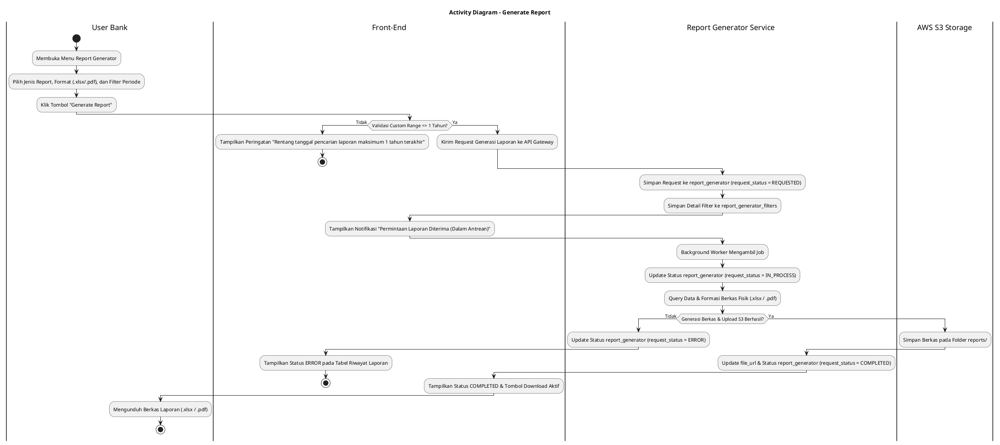
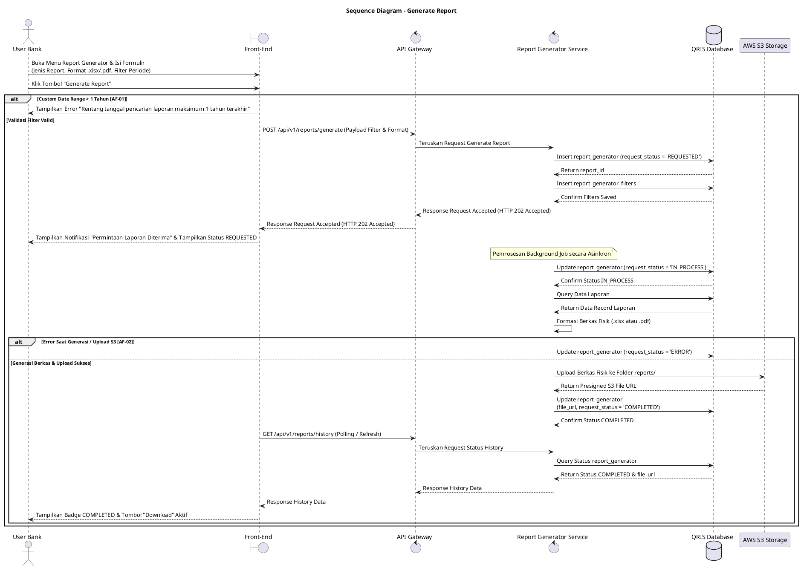

# 1 Deskripsi Use Case

**Tabel 1: Deskripsi Use Case Generate Report**

| Elemen Spesifikasi | Deskripsi Detail |
| --- | --- |
| ID Use Case | UC-BOH-018 |
| Nama Use Case | Generate Report |
| Penjelasan Singkat | Fitur Web Back Office Hibank yang memungkinkan User Bank mengajukan permintaan generasi laporan secara latar belakang (*background process*) dengan pilihan filter preset atau rentang tanggal kustom, menyimpan metadata ke `report_generator` dan `report_generator_filters`, membentuk berkas fisik berformat `.xlsx` atau `.pdf`, serta menyimpannya ke S3 Storage pada direktori `reports/`. |
| Aktor Utama | User Bank (Back Office Hibank Staff / Operations / Management) |
| Aktor Pendukung | Report Generator Service, AWS S3 Storage |
| Deskripsi Singkat | User Bank melakukan otentikasi login SSO ke Web Back Office Hibank dan mengakses menu **Report Generator**. User Bank memilih jenis laporan yang akan ditarik (seperti Laporan Transaksi QRIS, Laporan Merchant, dll.), menentukan format berkas keluaran (`.xlsx` atau `.pdf`), serta menentukan pilihan filter periode. Filter yang didukung meliputi Preset **Hari Ini**, **7 Hari Terakhir**, **1 Bulan Terakhir** (Periode Default), dan **1 Tahun Terakhir**, maupun **Custom Range Date** dengan rentang maksimum 1 tahun (12 bulan) terakhir. Saat User mengklik **"Generate Report"**, Report Generator Service memvalidasi masukan, meng-insert record ke tabel **`report_generator`** dengan status awal `request_status = 'REQUESTED'`, dan menyimpan parameter ke **`report_generator_filters`**. Selanjutnya, background worker pada Report Generator Service mengambil antrean job, mengubah status menjadi `request_status = 'IN_PROCESS'`, mengeksekusi kueri data dari database, serta membentuk berkas fisik laporan (`.xlsx` atau `.pdf`). Berkas laporan diunggah ke AWS S3 Storage pada direktori folder **`reports/`**. Setelah unggah berhasil, Report Generator Service memperbarui `file_url` dan meng-update status menjadi `request_status = 'COMPLETED'`. Apabila terjadi kegagalan atau exception selama pemrosesan, status di-update menjadi `request_status = 'ERROR'`. |
| Pre-condition | 1. User Bank telah berhasil login SSO ke Web Back Office Hibank dan memiliki kewenangan peran *Report Generator Staff*. 2. Layanan AWS S3 Storage dan Report Generator Service background worker beroperasi secara aktif. |
| Post-condition | 1. Metadata permintaan generasi laporan tersimpan pada tabel `report_generator` dan `report_generator_filters`. 2. Berkas fisik laporan berformat `.xlsx` atau `.pdf` berhasil dibentuk dan diunggah ke AWS S3 Storage pada folder `reports/`. 3. Status `request_status` pada tabel `report_generator` diperbarui menjadi `COMPLETED` (atau `ERROR` jika gagal) beserta `file_url` yang siap diunduh oleh User Bank. |
| Trigger | User Bank memilih jenis laporan, menentukan filter periode & format berkas pada menu Report Generator, lalu mengklik tombol **"Generate Report"**. |
| Nama Tabel | report_generator, report_generator_filters |
| Integrasi | 1. **Web Back Office Hibank UI:** Antarmuka formulir pengajuan laporan dan tabel riwayat pemrosesan report. 2. **Report Generator Service:** Microservice backend pengelola antrean request dan eksekutor generasi berkas laporan background. 3. **AWS S3 Storage (Doc Storage):** Media penyimpanan objek berkas fisik hasil generasi laporan (`reports/`). |
| Asumsi | 1. Generasi laporan dilakukan secara asinkron (*background job*) untuk menghindari *request timeout* pada browser User. 2. Berkas laporan yang telah diunggah ke S3 Storage dilengkapi tautan unduh (*presigned URL*) yang aman. |
| Keterbatasan | 1. Rentang tanggal kustom (*Custom Range Date*) dibatasi maksimal 1 tahun (12 bulan atau 365 hari) ke belakang. 2. Format file keluaran yang didukung terbatas pada format spreadsheet `.xlsx` dan dokumen `.pdf`. |
| Aturan Bisnis/Sistem | 1. **Preset Period & Range Filter Standard:** Sistem WAJIB menyediakan 4 opsi filter preset acuan: &nbsp;&nbsp;- **Hari Ini:** Menampilkan transaksi/data untuk hari berjalan. &nbsp;&nbsp;- **7 Hari Terakhir:** Menampilkan data 7 hari ke belakang. &nbsp;&nbsp;- **1 Bulan Terakhir:** Menampilkan data 30 hari ke belakang (periode default). &nbsp;&nbsp;- **1 Tahun Terakhir:** Menampilkan data 365 hari ke belakang. &nbsp;&nbsp;- **Custom Range Date:** Maksimum rentang tanggal mulai hingga tanggal akhir adalah 1 tahun (12 bulan). 2. **Request Lifecycle Status Standard:** Lifecycle status pada tabel `report_generator` dibatasi pada enum resmi: &nbsp;&nbsp;- **`REQUESTED`**: Diset saat request pertama kali dibuat dan tersimpan di database. &nbsp;&nbsp;- **`IN_PROCESS`**: Diset saat background worker mulai mengeksekusi kueri dan membuat berkas. &nbsp;&nbsp;- **`COMPLETED`**: Diset saat berkas `.xlsx`/`.pdf` berhasil diunggah ke S3 Storage. &nbsp;&nbsp;- **`ERROR`**: Diset jika terjadi crash, timeout, atau kegagalan generasi berkas/upload. 3. **S3 Storage Storage Path Standard:** Berkas hasil generasi WAJIB disimpan pada AWS S3 Storage dalam struktur direktori folder `reports/{year}/{month}/{report_id}.{ext}`. 4. **Supported Export Formats:** Sistem memfasilitasi dua pilihan format ekspor resmi yaitu `.xlsx` (Microsoft Excel) dan `.pdf` (Portable Document Format). |
| Session Idle | 15 Menit |

# 2 Main Flow

**Tabel 2: Main Flow Generate Report**

| No. | Aktivitas | Deskripsi |
| ---: | --- | --- |
| 1 | Membuka Menu Report Generator | User Bank melakukan login SSO dan mengklik menu **Report Generator**. |
| 2 | Menampilkan Form Request Laporan | Sistem menampilkan formulir pengajuan laporan beserta tabel riwayat permintaan laporan sebelumnya. |
| 3 | Memilih Jenis Report & Format File | User Bank memilih jenis laporan (misal: Laporan Transaksi QRIS) dan memilih format keluaran berkas (`.xlsx` atau `.pdf`). |
| 4 | Memilih Filter Periode | User Bank memilih preset filter (**Hari Ini**, **7 Hari Terakhir**, **1 Bulan Terakhir**, **1 Tahun Terakhir**) atau mengisi **Custom Range Date** (maksimal 1 tahun). |
| 5 | Mengirim Request Generasi Laporan | User Bank mengklik tombol **"Generate Report"**. |
| 6 | Memvalidasi & Simpan Request | Front-End memvalidasi masukan dan mengirim request ke API Gateway. Report Generator Service meng-insert header ke `report_generator` (`request_status = 'REQUESTED'`) dan detail filter ke `report_generator_filters`. |
| 7 | Menampilkan Konfirmasi Antrean | Front-End menampilkan notifikasi bahwa permintaan laporan telah diterima dan masuk ke dalam antrean *background job*. |
| 8 | Memulai Background Worker | Background Worker pada Report Generator Service mengonsumsi antrean job, lalu meng-update `report_generator` menjadi `request_status = 'IN_PROCESS'`. |
| 9 | Mengolah Data & Membentuk File | Report Generator Service mengeksekusi kueri ke QRIS Database dan membentuk berkas fisik laporan dalam format `.xlsx` atau `.pdf`. |
| 10 | Mengunggah Berkas ke S3 Storage | Report Generator Service mengunggah berkas fisik laporan ke AWS S3 Storage pada direktori folder `reports/` dan memperoleh `file_url`. |
| 11 | Update Status Completed | Report Generator Service memperbarui `file_url` dan meng-update status pada `report_generator` menjadi `request_status = 'COMPLETED'`. |
| 12 | Use Case Selesai | Berkas laporan berhasil digenerate dan siap diunduh oleh User Bank melalui tombol "Download" pada tabel riwayat. |

# 3 Alternative Flow

**Tabel 3: Alternative Flow Generate Report**

| Kode | Alternative Flow | Deskripsi |
| --- | --- | --- |
| AF-01 | Custom Range Date Melebihi 1 Tahun | Pada langkah 4-5, apabila User Bank memilih *Custom Range Date* dengan selisih rentang tanggal melebihi 1 tahun (12 bulan), Sistem menolak request dan Front-End menampilkan `Rentang tanggal pencarian laporan maksimum 1 tahun terakhir`. |
| AF-02 | Kegagalan Pemrosesan Background / Storage Error | Pada langkah 9-10, apabila terjadi exception saat pembuatan berkas atau gagal terhubung ke AWS S3 Storage, Report Generator Service meng-update status pada `report_generator` menjadi `request_status = 'ERROR'` dan mencatat error log. |
| AF-03 | Data Laporan Kosong | Pada langkah 9, apabila kueri data laporan tidak menghasilkan record data, Report Generator Service tetap membentuk berkas template kosong dengan header data, mengunggah ke S3, dan memperbarui `request_status = 'COMPLETED'`. |

# 4 Status Front-End

**Tabel 4: Status Front-End Generate Report**

| No. | Nama Status | Deskripsi Tampilan Front-End |
| ---: | --- | --- |
| 1 | IDLE | Formulir pengajuan report generator siap menerima input jenis laporan, filter periode, dan format berkas. |
| 2 | REQUESTED | Badge status berwarna abu-abu pada tabel riwayat menunjukkan permintaan baru tersimpan dan antre diproses. |
| 3 | IN_PROCESS | Badge status berwarna biru disertai animasi *spinner* pada tabel riwayat menunjukkan berkas sedang digenerate. |
| 4 | COMPLETED | Badge status berwarna hijau pada tabel riwayat beserta tombol **"Download"** aktif untuk mengunduh berkas (.xlsx / .pdf). |
| 5 | ERROR | Badge status berwarna merah pada tabel riwayat menunjukkan pemrosesan generasi laporan mengalami kegagalan. |

# 5 Activity Diagram Generate Report

# 6 Sequence Diagram Generate Report

# 7 Response Code

**Tabel 5: Response Code Generate Report**

| No. | HTTP Status | Response Code | Nama Response | Deskripsi | Respons Front-End |
| ---: | ---: | --- | --- | --- | --- |
| 1 | 200 | 200XX00 | SUCCESS_SUBMIT_REPORT_GENERATOR | Permintaan generasi laporan berhasil diterima dan disimpan dalam antrean. | Menampilkan pesan notifikasi bahwa permintaan laporan dalam proses dan masuk tabel riwayat. |
| 2 | 400 | 400XX00 | INVALID_DATE_RANGE_LIMIT | Rentang tanggal kustom yang dimasukkan melebihi batas 1 tahun (12 bulan). | Menampilkan pesan kesalahan `Rentang tanggal pencarian laporan maksimum 1 tahun terakhir`. |
| 3 | 422 | 422XX00 | UNSUPPORTED_REPORT_TYPE | Jenis laporan atau format file yang dipilih tidak didukung oleh sistem. | Menampilkan pesan kesalahan `Jenis laporan atau format file tidak valid`. |
| 4 | 500 | 500XX00 | SYSTEM_INTERNAL_ERROR | Terjadi gangguan internal server atau background worker saat mengolah laporan. | Menampilkan status `ERROR` pada tabel riwayat laporan. |
| 5 | 502 | 502XX00 | S3_STORAGE_UPLOAD_FAILED | Gagal terhubung atau gagal mengunggah berkas laporan ke AWS S3 Storage. | Menampilkan status `ERROR` pada tabel riwayat laporan akibat kendala storage. |

# 8 Desain Antarmuka

**Tabel 6: Desain Antarmuka Generate Report**

| Halaman | Komponen dan State Utama |
| --- | --- |
| Form & Riwayat Report Generator | 1. **Dropdown Jenis Laporan:** Pilihan jenis laporan (Laporan Transaksi QRIS, Laporan Merchant, dll.). 2. **Pilihan Format File:** Radio button / Dropdown pilihan format (`.xlsx` / `.pdf`). 3. **Tombol Filter Preset:** Pilihan Preset (**Hari Ini**, **7 Hari Terakhir**, **1 Bulan Terakhir** *(Default)*, **1 Tahun Terakhir**). 4. **Picker Custom Date Range:** Rentang tanggal mulai dan tanggal akhir (maks 1 tahun). 5. **Tombol "Generate Report":** Memicu pengiriman permintaan generasi laporan. 6. **Tabel Riwayat Laporan (`report_generator`):** Menampilkan `report_id`, Jenis Report, Format, Waktu Request, `request_status` (`REQUESTED`, `IN_PROCESS`, `COMPLETED`, `ERROR`), dan Tombol **"Download"**. 7. **State Indicator:** Tampilan IDLE, REQUESTED (Abu-abu), IN_PROCESS (Biru + Spinner), COMPLETED (Hijau + Download Button), dan ERROR (Merah). |
