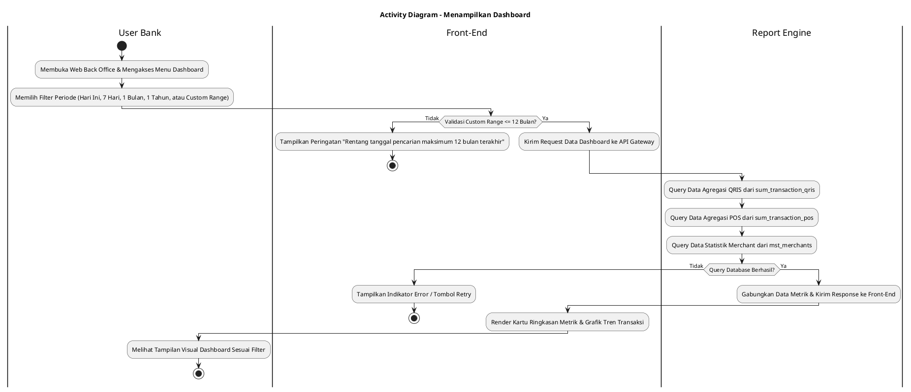
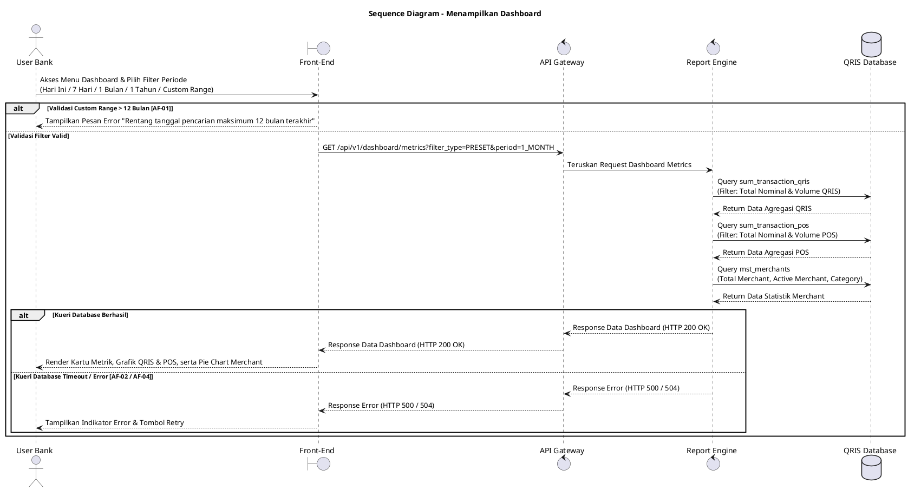

# 1 Deskripsi Use Case

**Tabel 1: Deskripsi Use Case Menampilkan Dashboard**

| Elemen Spesifikasi | Deskripsi Detail |
| --- | --- |
| ID Use Case | UC-BOH-019 |
| Nama Use Case | Menampilkan Dashboard |
| Penjelasan Singkat | Fitur Web Back Office Hibank yang menyajikan statistik kinerja operasional dan metrik bisnis secara visual, memuat akumulasi transaksi QRIS, transaksi POS, serta ringkasan demografi dan status keaktifan merchant melalui Report Engine dengan opsi filter waktu acuan dan kustom. |
| Aktor Utama | User Bank (Back Office Hibank Staff / Approver / Management) |
| Aktor Pendukung | Report Engine |
| Deskripsi Singkat | User Bank melakukan otentikasi login SSO ke Web Back Office Hibank dan mengklik menu **Dashboard** (atau otomatis diarahkan ke halaman utama Dashboard setelah login berhasil). Sistem memfasilitasi pilihan filter periode berupa preset **Hari Ini**, **7 Hari Terakhir**, **1 Bulan Terakhir**, dan **1 Tahun Terakhir**, serta pilihan **Custom Range Date** dengan batasan rentang tanggal maksimum 12 bulan terakhir. Front-End mengirimkan permintaan data metrik dashboard ke Report Engine melalui API Gateway berdasarkan filter periode yang dipilih. Report Engine melakukan kueri agregasi ke tabel **`sum_transaction_qris`** untuk mendapatkan total nominal dan volume transaksi QRIS, ke tabel **`sum_transaction_pos`** untuk mendapatkan total nominal dan volume transaksi POS, serta ke tabel **`mst_merchants`** untuk menghitung statistik total merchant terdaftar, merchant aktif, dan distribusi kategori merchant. Setelah seluruh metrik terhimpun, Report Engine mengembalikan data ke Front-End. Front-End menampilkan dashboard visual yang terdiri dari ringkasan kartu metrik (*summary cards*), grafik tren transaksi harian/bulanan, dan pie chart distribusi merchant. |
| Pre-condition | User Bank telah berhasil melakukan otentikasi login SSO dan memiliki hak akses untuk membuka halaman Dashboard Web Back Office Hibank. |
| Post-condition | Front-End berhasil menyajikan seluruh widget statistik transaksi QRIS, transaksi POS, serta grafik distribusi merchant secara lengkap sesuai filter periode yang dipilih (Hari Ini, 7 Hari Terakhir, 1 Bulan Terakhir, 1 Tahun Terakhir, atau Custom Range maks 12 bulan). |
| Trigger | User Bank berhasil melakukan login SSO, mengklik menu **Dashboard**, atau mengubah pilihan filter periode pada bilah navigasi Dashboard. |
| Nama Tabel | sum_transaction_qris, sum_transaction_pos, mst_merchants |
| Integrasi | 1. **Web Back Office Hibank UI:** Antarmuka visualisasi dashboard yang memuat widget metrik, grafik, dan filter periode. 2. **Report Engine:** Microservice penyaji data pelaporan dan agregasi statistik dashboard. 3. **QRIS Database:** Sumber data agregasi transaksi QRIS, POS, dan data master merchant. |
| Asumsi | 1. Data pada tabel agregasi `sum_transaction_qris` dan `sum_transaction_pos` diperbarui secara berkala (*scheduled batch/real-time sync*). 2. Periode default dashboard yang ditampilkan saat awal muat halaman adalah **1 Bulan Terakhir**. |
| Keterbatasan | 1. Dashboard menampilkan data agregasi ringkasan dan tidak menyajikan detail transaksi individual per rincian log. 2. Pemilihan tanggal pada *Custom Range Date* dibatasi maksimum rentang pencarian 12 bulan (1 tahun) terakhir. |
| Aturan Bisnis/Sistem | 1. **Preset Period Filter Standard:** Sistem WAJIB menyediakan 4 opsi filter preset acuan: &nbsp;&nbsp;- **Hari Ini:** Menampilkan transaksi dan statistik untuk hari berjalan. &nbsp;&nbsp;- **7 Hari Terakhir:** Menampilkan akumulasi 7 hari ke belakang. &nbsp;&nbsp;- **1 Bulan Terakhir:** Menampilkan akumulasi 30 hari ke belakang (periode default). &nbsp;&nbsp;- **1 Tahun Terakhir:** Menampilkan akumulasi 365 hari ke belakang. 2. **Custom Date Range Limit:** Apabila User Bank memilih opsi *Custom Range Date*, selisih rentang tanggal mulai (*start date*) dan tanggal akhir (*end date*) WAJIB MAKSIMUM 12 BULAN (365 HARI) ke belakang dari tanggal hari ini. Sistem akan menolak jika rentang melebihi 12 bulan. 3. **Data Aggregation Standard:** Data metrik transaksi wajib disajikan dari tabel agregasi ringkasan `sum_transaction_qris` dan `sum_transaction_pos` untuk mengoptimalkan kecepatan muat halaman dashboard. 4. **Merchant Statistics Calculation:** Statistik merchant pada widget dihitung dari tabel `mst_merchants` yang dikelompokkan berdasarkan status keaktifan (`status = 'ACTIVE'`) dan tipe merchant. |
| Session Idle | 15 Menit |

# 2 Main Flow

**Tabel 2: Main Flow Menampilkan Dashboard**

| No. | Aktivitas | Deskripsi |
| ---: | --- | --- |
| 1 | Membuka Web Back Office | User Bank melakukan otentikasi login SSO dan mengakses Web Back Office Hibank. |
| 2 | Mengakses Menu Dashboard | User Bank mengklik menu **Dashboard** pada bilah navigasi utama. |
| 3 | Memilih Filter Periode | User Bank memilih salah satu preset filter (**Hari Ini**, **7 Hari Terakhir**, **1 Bulan Terakhir**, **1 Tahun Terakhir**) atau memilih **Custom Range Date** (maksimal rentang 12 bulan). |
| 4 | Mengirim Request Data Dashboard | Front-End memvalidasi rentang tanggal dan mengirimkan request pengambil data metrik dashboard ke API Gateway. |
| 5 | Query Ringkasan Transaksi QRIS | Report Engine melakukan kueri agregasi data total nominal dan volume transaksi QRIS dari tabel `sum_transaction_qris` sesuai periode filter. |
| 6 | Query Ringkasan Transaksi POS | Report Engine melakukan kueri agregasi data total nominal dan volume transaksi POS dari tabel `sum_transaction_pos` sesuai periode filter. |
| 7 | Query Statistik Merchant | Report Engine melakukan kueri total merchant, merchant aktif, dan kategori merchant dari tabel `mst_merchants`. |
| 8 | Mengembalikan Data Metrik | Report Engine menggabungkan seluruh hasil kueri ke dalam objek response data terpadu dan mengembalikannya ke Front-End melalui API Gateway. |
| 9 | Menampilkan Widget Dashboard Visual | Front-End menyajikan data dalam bentuk ringkasan kartu metrik (*summary cards*), grafik tren transaksi QRIS & POS, serta bagan distribusi merchant. |
| 10 | Use Case Selesai | Halaman dashboard berhasil ditampilkan sesuai periode filter terpilih dan siap dipantau oleh User Bank. |

# 3 Alternative Flow

**Tabel 3: Alternative Flow Menampilkan Dashboard**

| Kode | Alternative Flow | Deskripsi |
| --- | --- | --- |
| AF-01 | Custom Date Range Melebihi 12 Bulan | Pada langkah 3-4, apabila User Bank memilih *Custom Range Date* dengan selisih rentang tanggal melebihi 12 bulan terakhir, Sistem menolak request dan Front-End menampilkan pesan `Rentang tanggal pencarian maksimum 12 bulan terakhir`. |
| AF-02 | Gagal Memuat Data Agregasi Transaksi | Pada langkah 5 atau 6, apabila kueri ke `sum_transaction_qris` atau `sum_transaction_pos` mengalami timeout/gangguan, Sistem menyajikan nilai 0 pada widget transaksi yang bersangkutan dan Front-End menampilkan pesan `Gagal memuat ringkasan data transaksi`. |
| AF-03 | Filter Periode Tidak Memiliki Catatan Data | Pada langkah 5-7, apabila periode filter yang dipilih tidak memiliki catatan transaksi, Sistem mengembalikan data bernilai 0 dan Front-End menampilkan tampilan *empty state* pada grafik transaksi. |
| AF-04 | Gangguan Koneksi Database Server | Pada langkah 5-7, apabila koneksi database terputus total, Sistem mengembalikan HTTP status 500 dan Front-End menampilkan pesan `Terjadi gangguan sistem saat memuat dashboard. Silakan coba beberapa saat lagi`. |

# 4 Status Front-End

**Tabel 4: Status Front-End Menampilkan Dashboard**

| No. | Nama Status | Deskripsi Tampilan Front-End |
| ---: | --- | --- |
| 1 | LOADING | Indikator muat data (*skeleton loader*) ditampilkan pada seluruh widget kartu metrik dan area grafik saat filter diubah. |
| 2 | SUCCESS | Seluruh kartu metrik statistik transaksi QRIS, POS, dan grafik distribusi merchant tersaji secara lengkap sesuai filter periode. |
| 3 | EMPTY | Widget grafik menyajikan indikator *no data* untuk rentang periode filter pencarian yang belum memiliki transaksi. |
| 4 | ERROR | Tampilan widget menyajikan indikator kesalahan disertai tombol **"Retry"** akibat gangguan server, database, atau validasi filter gagal. |

# 5 Activity Diagram Menampilkan Dashboard

# 6 Sequence Diagram Menampilkan Dashboard

# 7 Response Code

**Tabel 5: Response Code Menampilkan Dashboard**

| No. | HTTP Status | Response Code | Nama Response | Deskripsi | Respons Front-End |
| ---: | ---: | --- | --- | --- | --- |
| 1 | 200 | 200XX00 | SUCCESS_GET_DASHBOARD_METRICS | Data metrik transaksi QRIS, POS, dan statistik merchant berhasil diambil sesuai filter. | Menampilkan seluruh widget metrik dan grafik dashboard secara visual. |
| 2 | 400 | 400XX00 | INVALID_DATE_RANGE_FILTER | Filter rentang tanggal yang dimasukkan pada Custom Range melebihi batas 12 bulan (1 tahun). | Menampilkan pesan kesalahan `Rentang tanggal pencarian maksimum 12 bulan terakhir`. |
| 3 | 404 | 404XX00 | DASHBOARD_DATA_NOT_FOUND | Tidak ada data agregasi yang ditemukan untuk periode yang dipilih. | Menampilkan widget dalam kondisi *empty state*. |
| 4 | 500 | 500XX00 | SYSTEM_INTERNAL_ERROR | Terjadi kegagalan internal pada server saat mengagregasi data dashboard. | Menampilkan indikator error pada widget dashboard dan tombol *retry*. |
| 5 | 504 | 504XX00 | DATABASE_QUERY_TIMEOUT | Kueri agregasi ke database mengalami batas waktu habis (timeout). | Menampilkan pesan kesalahan `Gagal memuat ringkasan data transaksi akibat timeout`. |

# 8 Desain Antarmuka

**Tabel 6: Desain Antarmuka Menampilkan Dashboard**

| Halaman | Komponen dan State Utama |
| --- | --- |
| Dashboard Utama Back Office | 1. **Filter Periode Preset:** Tombol Pilihan Preset (**Hari Ini**, **7 Hari Terakhir**, **1 Bulan Terakhir**, **1 Tahun Terakhir**). 2. **Filter Custom Range Date:** Picker rentang tanggal mulai dan tanggal akhir (*Custom Date Range*) dengan batasan maksimum 12 bulan terakhir. 3. **Kartu Metrik QRIS (`sum_transaction_qris`):** Menampilkan total nominal transaksi QRIS dan total volume transaksi. 4. **Kartu Metrik POS (`sum_transaction_pos`):** Menampilkan total nominal transaksi POS dan total volume transaksi. 5. **Kartu Metrik Merchant (`mst_merchants`):** Menampilkan total merchant terdaftar dan total merchant aktif. 6. **Grafik Tren Transaksi:** Line chart perbandingan volume & nominal QRIS vs POS. 7. **Pie Chart Merchant:** Grafik perbandingan kategori tipe merchant. 8. **State Indicator:** Mengubah tampilan antara LOADING (Skeleton), SUCCESS, EMPTY, dan ERROR. |
