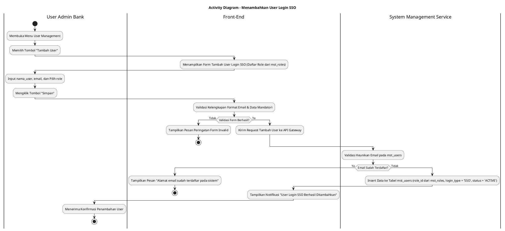
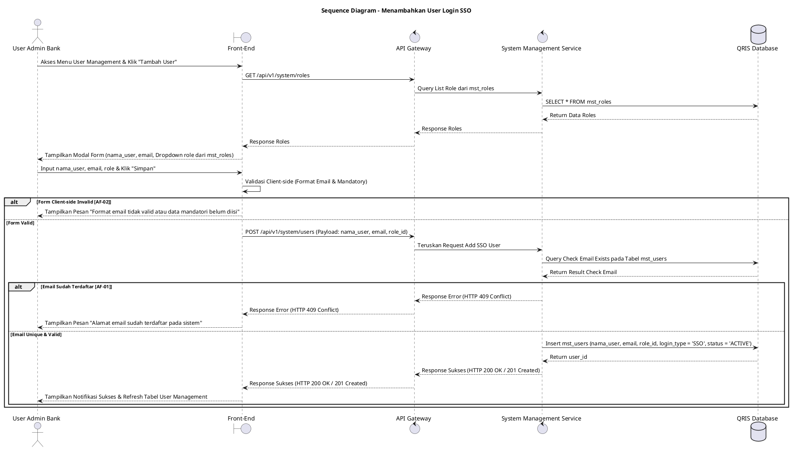

# 1 Deskripsi Use Case

**Tabel 1: Deskripsi Use Case Menambahkan User Login SSO**

| Elemen Spesifikasi | Deskripsi Detail |
| --- | --- |
| ID Use Case | UC-BOH-020 |
| Nama Use Case | Menambahkan User Login SSO |
| Penjelasan Singkat | Fitur Web Back Office Hibank yang memfasilitasi User Admin Bank untuk menambahkan akun pengguna baru berbasis Single Sign-On (SSO) dengan menginput data `nama_user`, `email`, dan `role` melalui System Management Service. Sistem menyimpan akun baru ke tabel `mst_users` dan merelasikan ke `mst_roles` tanpa meminta pengisian password lokal karena tipe autentikasi diatur secara otomatis ke `login_type = 'SSO'`. |
| Aktor Utama | User Admin Bank (Back Office Hibank Superadmin / Admin User Management) |
| Aktor Pendukung | System Management Service |
| Deskripsi Singkat | User Admin Bank melakukan otentikasi login SSO ke Web Back Office Hibank dan mengakses menu **Pengaturan Sistem** -> **User Management**. Sistem menampilkan daftar pengguna yang ada beserta tombol **"Tambah User"**. User Admin Bank mengklik tombol tersebut sehingga sistem menampilkan modal form pendaftaran. User Admin Bank menginput nama pengguna (`nama_user`), alamat email institusi (`email`), dan memilih peran kewenangan (`role` dari tabel `mst_roles`). Pengisian password diabaikan karena autentikasi terintegrasi langsung dengan sistem Single Sign-On (SSO) Bank. User Admin Bank mengklik tombol **"Simpan"**. Sistem memvalidasi format email dan keunikan akun. Setelah validasi sukses, System Management Service menyimpan record pengguna baru ke tabel **`mst_users`** (dengan merelasikan `role_id` dari **`mst_roles`**) dengan secara otomatis menetapkan `login_type = 'SSO'` dan status akun `ACTIVE`. Front-End menyajikan notifikasi konfirmasi bahwa pengguna baru login SSO telah berhasil didaftarkan. |
| Pre-condition | 1. User Admin Bank telah berhasil login SSO ke Web Back Office Hibank dan memiliki kewenangan otoritas *User Administrator*. 2. Alamat email institusi yang akan didaftarkan terdaftar aktif pada server otentikasi SSO Bank. |
| Post-condition | 1. Akun pengguna baru tersimpan pada tabel `mst_users` dengan relasi `role_id` ke `mst_roles`, nilai `login_type = 'SSO'`, dan status `ACTIVE`. 2. Pengguna baru dapat langsung melakukan autentikasi login ke Web Back Office Hibank menggunakan mekanisme SSO tanpa memerlukan kata sandi lokal. 3. Front-End memperbarui daftar akun pengguna pada halaman User Management. |
| Trigger | User Admin Bank mengklik tombol **"Tambah User"** pada halaman User Management, mengisi data `nama_user`, `email`, `role`, lalu mengklik tombol **"Simpan"**. |
| Nama Tabel | mst_users, mst_roles |
| Integrasi | 1. **Web Back Office Hibank UI:** Antarmuka pengelolaan pengguna dan modal pendaftaran akun user baru. 2. **System Management Service:** Microservice backend pengelola pendaftaran, pembaruan, dan otorisasi sistem/pengguna. 3. **Bank SSO Identity Provider (IdP):** Server autentikasi terpusat SSO Bank. |
| Asumsi | 1. Seluruh pengguna internal Bank diotentikasi melalui Single Sign-On (SSO) sehingga kata sandi dikelola terpusat oleh IdP Bank. 2. Hak akses fitur ditentukan sepenuhnya berdasarkan `role` yang terdaftar pada tabel `mst_roles`. |
| Keterbatasan | 1. Pendaftaran user melalui use case ini khusus diperuntukkan bagi metode autentikasi SSO (`login_type = 'SSO'`). 2. Penginputan password lokal ditiadakan dan tidak memfasilitasi pembuatan kata sandi manual. |
| Aturan Bisnis/Sistem | 1. **Default Login Type Standard:** Setiap akun pengguna baru yang ditambahkan melalui pendaftaran ini WAJIB secara otomatis ditetapkan pada tabel `mst_users` memiliki atribut `login_type = 'SSO'`. 2. **No Password Requirement:** Sistem DILARANG meminta, menerima, atau menyimpan kata sandi lokal saat proses pendaftaran pengguna login SSO. 3. **Email Uniqueness & Domain Validation:** Alamat email (`email`) WAJIB unik pada tabel `mst_users` dan mematuhi format domain resmi institusi Bank (contoh: `@hibank.co.id`). 4. **Mandatory Fields:** Kolom `nama_user`, `email`, dan `role` bersifat WAJIB diisi (*mandatory*). 5. **Role Assignment Standard:** Setiap pengguna baru wajib terhubung ke `role_id` yang terdaftar pada tabel `mst_roles`. |
| Session Idle | 15 Menit |

# 2 Main Flow

**Tabel 2: Main Flow Menambahkan User Login SSO**

| No. | Aktivitas | Deskripsi |
| ---: | --- | --- |
| 1 | Membuka Web Back Office | User Admin Bank melakukan otentikasi login SSO dan mengakses dashboard Web Back Office Hibank. |
| 2 | Mengakses Menu User Management | User Admin Bank mengklik menu **Pengaturan Sistem** -> sub-menu **User Management**. |
| 3 | Menampilkan Daftar User Bank | Sistem menampilkan tabel daftar akun pengguna Web Back Office dari `mst_users` beserta tombol **"Tambah User"**. |
| 4 | Memilih Tombol Tambah User | User Admin Bank mengklik tombol **"Tambah User"**. |
| 5 | Menampilkan Form Tambah User | Sistem menampilkan modal form pendaftaran pengguna baru yang memuat input `nama_user`, `email`, dan dropdown `role` (diambil dari `mst_roles`). |
| 6 | Mengisi Data Pengguna Baru | User Admin Bank menginput `nama_user`, `email`, memilih `role`, dan mengklik tombol **"Simpan"**. |
| 7 | Memvalidasi Input Data | Sistem memvalidasi ketersediaan data mandatori, keabsahan format email institusi, serta keunikan email pada database. |
| 8 | Menyimpan Data User Baru | System Management Service menyimpan data ke tabel `mst_users` dengan menyertakan `role_id` dari `mst_roles`, menetapkan `login_type = 'SSO'`, dan `status = 'ACTIVE'`. |
| 9 | Menampilkan Konfirmasi Sukses | Front-End menampilkan pesan notifikasi bahwa akun pengguna login SSO berhasil ditambahkan dan memperbarui tabel daftar user. |
| 10 | Use Case Selesai | Pendaftaran akun pengguna baru berbasis login SSO selesai dilaksanakan. |

# 3 Alternative Flow

**Tabel 3: Alternative Flow Menambahkan User Login SSO**

| Kode | Alternative Flow | Deskripsi |
| --- | --- | --- |
| AF-01 | Alamat Email Sudah Terdaftar | Pada langkah 7, apabila email yang dimasukkan sudah tercatat pada tabel `mst_users`, Sistem menolak pendaftaran dan Front-End menampilkan `Alamat email sudah terdaftar pada sistem`. |
| AF-02 | Format Email Tidak Valid / Kolom Kosong | Pada langkah 7, apabila format email tidak sesuai domain institusi Bank atau terdapat kolom mandatori (`nama_user`/`email`/`role`) yang kosong, Sistem membatalkan simpan dan Front-End menampilkan `Format email tidak valid atau data mandatori belum diisi`. |
| AF-03 | Gagal Terhubung ke Database | Pada langkah 8, apabila terjadi gangguan transaksi pada database server, Sistem mengembalikan HTTP status 500 dan Front-End menampilkan `Gagal menyimpan data pengguna baru`. |

# 4 Status Front-End

**Tabel 4: Status Front-End Menambahkan User Login SSO**

| No. | Nama Status | Deskripsi Tampilan Front-End |
| ---: | --- | --- |
| 1 | IDLE | Modal form pendaftaran dalam kondisi bersih dan siap menerima input `nama_user`, `email`, dan `role`. |
| 2 | LOADING | Indikator proses (*spinner*) ditampilkan pada tombol Simpan saat data sedang divalidasi dan disimpan oleh server. |
| 3 | SUCCESS | Modal/toast konfirmasi menampilkan pesan bahwa akun pengguna login SSO berhasil disimpan. |
| 4 | ERROR | Pesan kesalahan ditampilkan pada modal UI akibat duplikasi email, format email invalid, atau gangguan server. |

# 5 Activity Diagram Menambahkan User Login SSO

# 6 Sequence Diagram Menambahkan User Login SSO

# 7 Response Code

**Tabel 5: Response Code Menambahkan User Login SSO**

| No. | HTTP Status | Response Code | Nama Response | Deskripsi | Respons Front-End |
| ---: | ---: | --- | --- | --- | --- |
| 1 | 200 | 200XX00 | SUCCESS_ADD_SSO_USER | Akun pengguna baru berbasis login SSO berhasil disimpan ke tabel `mst_users`. | Menampilkan pesan notifikasi sukses dan memperbarui tabel daftar user. |
| 2 | 400 | 400XX00 | INVALID_USER_INPUT_DATA | Format data input nama_user, email, atau role tidak valid. | Menampilkan pesan kesalahan `Format email tidak valid atau data mandatori belum diisi`. |
| 3 | 409 | 409XX00 | EMAIL_ALREADY_EXISTS | Alamat email yang diinput sudah terdaftar pada akun pengguna lain. | Menampilkan pesan kesalahan `Alamat email sudah terdaftar pada sistem`. |
| 4 | 422 | 422XX00 | INVALID_EMAIL_DOMAIN_FORMAT | Alamat email tidak menggunakan domain resmi institusi Bank. | Menampilkan pesan kesalahan `Alamat email wajib menggunakan domain institusi resmi Bank`. |
| 5 | 500 | 500XX00 | SYSTEM_INTERNAL_ERROR | Terjadi kegagalan internal server saat menyimpan data pengguna baru. | Menampilkan pesan kesalahan `Terjadi kendala internal pada server`. |

# 8 Desain Antarmuka

**Tabel 6: Desain Antarmuka Menambahkan User Login SSO**

| Halaman | Komponen dan State Utama |
| --- | --- |
| User Management Back Office | 1. **Bilah Pencarian & Filter:** Field pencarian nama/email dan dropdown filter role. 2. **Tombol "Tambah User":** Tombol pemicu pembukaan modal form pendaftaran user baru. 3. **Tabel User (`mst_users`):** Kolom Nama User, Email, Role (`mst_roles`), Login Type (`SSO`), Status (`ACTIVE`), dan Aksi. |
| Modal Form Tambah User SSO | 1. **Input Nama User (`nama_user`):** Field teks nama lengkap pengguna. 2. **Input Email (`email`):** Field teks email institusi resmi Bank. 3. **Dropdown Role (`role`):** Dropdown pilihan peran kewenangan (diambil dari tabel `mst_roles`). 4. **Indikator Login Type:** Label tertera `Login Type: SSO (Default)` tanpa field password. 5. **Tombol Aksi:** Tombol **"Simpan"** (Primary) dan **"Batal"** (Secondary). |
