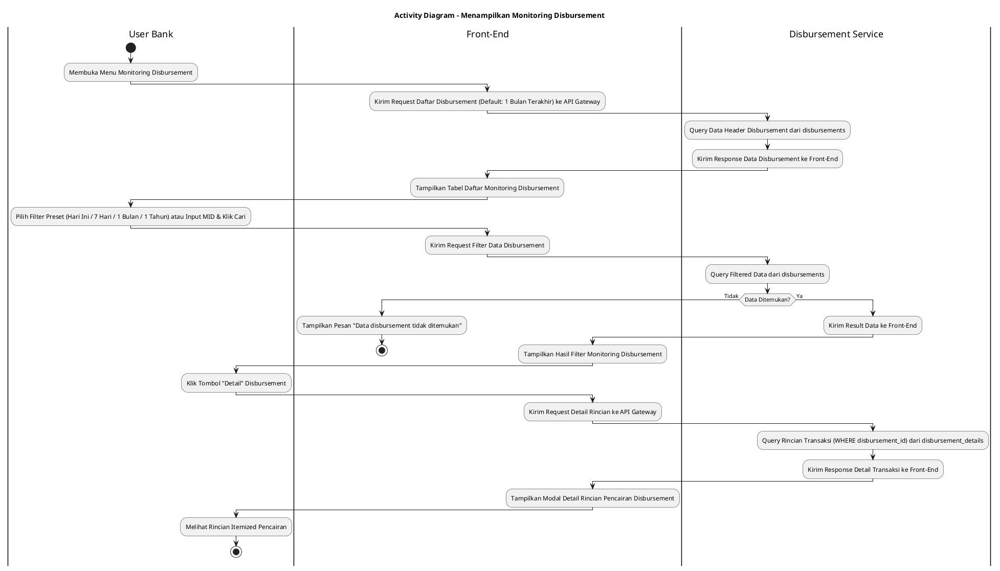
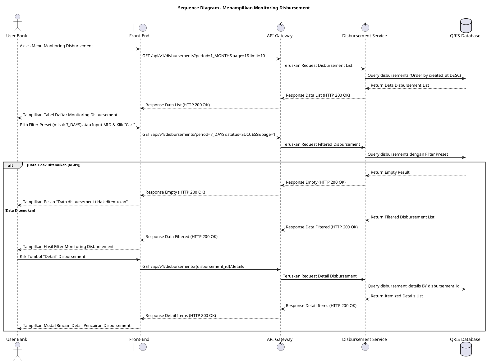

# 1 Deskripsi Use Case

**Tabel 1: Deskripsi Use Case Menampilkan Monitoring Disbursement**

| Elemen Spesifikasi | Deskripsi Detail |
| --- | --- |
| ID Use Case | UC-BOH-022 |
| Nama Use Case | Menampilkan Monitoring Disbursement |
| Penjelasan Singkat | Fitur Web Back Office Hibank yang memungkinkan User Bank memantau status eksekusi pencairan dana (*disbursement*) ke rekening merchant secara real-time dari tabel `disbursements` dan `disbursement_details` menggunakan Disbursement Service. |
| Aktor Utama | User Bank (Back Office Hibank Finance / Operations Staff) |
| Aktor Pendukung | Disbursement Service |
| Deskripsi Singkat | User Bank melakukan otentikasi login SSO ke Web Back Office Hibank dan mengakses menu **Disbursement & Pencairan** -> **Monitoring Disbursement**. Front-End mengirimkan request ke API Gateway untuk memuat daftar pencairan dana merchant dengan filter default **1 Bulan Terakhir**. Sistem memfasilitasi Pilihan Filter Preset mencakup **Hari Ini**, **7 Hari Terakhir**, **1 Bulan Terakhir** (Periode Default), dan **1 Tahun Terakhir**, serta pencarian kustom berdasarkan Merchant ID (MID), Nama Merchant, Nomor Referensi, dan Status Disbursement (`SUCCESS`, `PENDING`, `PROCESSING`, `FAILED`). Disbursement Service melakukan kueri ke tabel **`disbursements`** untuk mengambil data Batch ID, MID, Nama Merchant, Rekening Tujuan, Total Nominal Disbursement, Biaya Transfer, Status Pencairan, dan Timestamp Transfer Core Banking. Front-End menampilkan data dalam tabel interaktif beserta tombol **"Detail"**. Saat User Bank mengklik **"Detail"**, Disbursement Service melakukan kueri rincian item ke tabel **`disbursement_details`** dan Front-End menyajikan modal rincian transaksi per item secara lengkap. |
| Pre-condition | User Bank telah berhasil login SSO ke Web Back Office Hibank dan memiliki kewenangan peran *Disbursement Monitoring Staff*. |
| Post-condition | Front-End berhasil menyajikan tabel daftar transaksi pencairan dana merchant dan rincian itemized dari `disbursement_details` secara lengkap. |
| Trigger | User Bank mengakses menu Monitoring Disbursement atau memasukkan kriteria filter preset / pencarian data pencairan dana pada Web Back Office. |
| Nama Tabel | disbursements, disbursement_details |
| Integrasi | 1. **Web Back Office Hibank UI:** Antarmuka tabel monitoring pencairan dana merchant beserta komponen filter preset dan modal detail. 2. **Disbursement Service:** Microservice backend pengelola transaksi pencairan dana ke rekening merchant. 3. **QRIS Database:** Penyimpanan data header pencairan (`disbursements`) dan rincian itemized pencairan (`disbursement_details`). |
| Asumsi | 1. Data eksekusi pencairan dana pada tabel `disbursements` dan `disbursement_details` diperbarui secara real-time oleh Disbursement Service setelah instruksi transfer diselesaikan oleh Core Banking. 2. Halaman monitoring menggunakan metode pembagian halaman (*pagination*) untuk menjaga performa muat data. |
| Keterbatasan | 1. Pemantauan disbursement pada use case ini bersifat read-only (hanya memantau status pencairan yang dieksekusi). 2. Filter preset rentang waktu acuan membatasi kueri maksimum 1 tahun terakhir untuk menjaga performa sistem. |
| Aturan Bisnis/Sistem | 1. **Preset Period Filter Standard:** Sistem WAJIB menyediakan 4 opsi filter preset acuan: &nbsp;&nbsp;- **Hari Ini:** Menampilkan data pencairan untuk hari berjalan. &nbsp;&nbsp;- **7 Hari Terakhir:** Menampilkan data pencairan 7 hari ke belakang. &nbsp;&nbsp;- **1 Bulan Terakhir:** Menampilkan data pencairan 30 hari ke belakang (periode default). &nbsp;&nbsp;- **1 Tahun Terakhir:** Menampilkan data pencairan 365 hari ke belakang. 2. **Disbursement Itemized Details Association:** Setiap baris rincian pada modal detail WAJIB mengambil data dari `disbursement_details` yang terhubung via `disbursement_id`. 3. **Real-time Status Display:** Status pencairan diselaraskan dengan enum resmi (`SUCCESS`, `PENDING`, `PROCESSING`, `FAILED`). 4. **Pagination Standard:** Daftar pencairan dana wajib ditampilkan dengan pagination (default 10 atau 25 data per halaman). |
| Session Idle | 15 Menit |

# 2 Main Flow

**Tabel 2: Main Flow Menampilkan Monitoring Disbursement**

| No. | Aktivitas | Deskripsi |
| ---: | --- | --- |
| 1 | Membuka Menu Monitoring Disbursement | User Bank melakukan login SSO dan mengklik menu **Disbursement & Pencairan** -> **Monitoring Disbursement**. |
| 2 | Mengirim Request Daftar Disbursement | Front-End mengirimkan request ke API Gateway untuk mengambil data pencairan dana merchant terbaru dengan filter default **1 Bulan Terakhir**. |
| 3 | Query Data Header Disbursement | Disbursement Service melakukan kueri ke tabel `disbursements` mengambil Batch ID, MID, Nama Merchant, Rekening Tujuan, Total Nominal, Status, dan Timestamp. |
| 4 | Menampilkan Daftar Disbursement | Front-End menyajikan tabel daftar pencairan disbursement merchant beserta komponen filter preset (**Hari Ini**, **7 Hari Terakhir**, **1 Bulan Terakhir**, **1 Tahun Terakhir**) dan tombol pagination. |
| 5 | Memilih Filter Preset / Parameter Pencarian | User Bank memilih opsi filter preset (misal: **7 Hari Terakhir**) atau memasukkan parameter pencarian MID/Status dan mengklik tombol **"Cari"**. |
| 6 | Mengirim Request Filter Data | Front-End mengirimkan request pencarian berparameter ke API Gateway. |
| 7 | Query Filtered Disbursement Data | Disbursement Service menjalankan kueri berfilter pada tabel `disbursements` dan mengembalikan data hasil pencarian. |
| 8 | Menampilkan Hasil Filter Disbursement | Front-End memperbarui tabel dengan menyajikan daftar pencairan disbursement yang cocok beserta ringkasan total nominal transfer. |
| 9 | Membuka Detail Disbursement | User Bank mengklik tombol **"Detail"** pada salah satu baris data pencairan. |
| 10 | Query Detail Transaksi Disbursement | Disbursement Service melakukan kueri rincian itemized ke tabel `disbursement_details` berdasarkan `disbursement_id`. |
| 11 | Menampilkan Detail Transaksi Disbursement | Front-End menampilkan modal/halaman detail yang menyajikan rincian per transaksi yang masuk dalam paket pencairan dana tersebut. |
| 12 | Use Case Selesai | Pemantauan data disbursement merchant selesai dilaksanakan. |

# 3 Alternative Flow

**Tabel 3: Alternative Flow Menampilkan Monitoring Disbursement**

| Kode | Alternative Flow | Deskripsi |
| --- | --- | --- |
| AF-01 | Data Disbursement Tidak Ditemukan | Pada langkah 7 atau 10, apabila kriteria filter pencarian atau rincian detail tidak cocok dengan data pada `disbursements`, Sistem mengembalikan data kosong dan Front-End menampilkan `Data disbursement tidak ditemukan`. |
| AF-02 | Gangguan Koneksi Database Server | Pada langkah 3, 7, atau 10, apabila koneksi database terputus, Sistem mengembalikan HTTP status 500 dan Front-End menampilkan `Gagal memuat data monitoring disbursement`. |

# 4 Status Front-End

**Tabel 4: Status Front-End Menampilkan Monitoring Disbursement**

| No. | Nama Status | Deskripsi Tampilan Front-End |
| ---: | --- | --- |
| 1 | LOADING | Indikator muat data (*spinner/skeleton*) ditampilkan pada tabel atau modal detail saat data diproses dari server. |
| 2 | SUCCESS | Tabel daftar monitoring disbursement dan modal rincian detail menyajikan data pencairan dana merchant secara valid sesuai filter preset. |
| 3 | EMPTY | Tabel menyajikan tampilan *empty state* saat tidak ada data pencairan yang cocok dengan parameter filter pencarian. |
| 4 | ERROR | Pesan kesalahan disertai tombol **"Retry"** ditampilkan pada UI akibat gangguan server atau validasi filter gagal. |

# 5 Activity Diagram Menampilkan Monitoring Disbursement

# 6 Sequence Diagram Menampilkan Monitoring Disbursement

# 7 Response Code

**Tabel 5: Response Code Menampilkan Monitoring Disbursement**

| No. | HTTP Status | Response Code | Nama Response | Deskripsi | Respons Front-End |
| ---: | ---: | --- | --- | --- | --- |
| 1 | 200 | 200XX00 | SUCCESS_GET_MONITORING_DISBURSEMENT | Data daftar pencairan disbursement merchant berhasil diambil dari server sesuai filter preset. | Menampilkan tabel daftar pencairan disbursement secara lengkap. |
| 2 | 400 | 400XX00 | INVALID_SEARCH_FILTER | Parameter filter pencarian atau opsi preset filter tidak valid. | Menampilkan pesan kesalahan `Filter pencarian tidak valid`. |
| 3 | 404 | 404XX00 | DISBURSEMENT_NOT_FOUND | Data pencairan disbursement atau rincian detail tidak ditemukan berdasarkan kriteria pencarian yang dimasukkan. | Menampilkan tabel dalam kondisi *empty state* dengan pesan `Data disbursement tidak ditemukan`. |
| 4 | 500 | 500XX00 | SYSTEM_INTERNAL_ERROR | Terjadi kegagalan internal server saat mengambil data disbursement merchant. | Menampilkan indikator error pada UI dan tombol *retry*. |
| 5 | 504 | 504XX00 | DATABASE_QUERY_TIMEOUT | Kueri ke tabel `disbursements` / `disbursement_details` mengalami batas waktu habis (timeout). | Menampilkan pesan kesalahan `Gagal memuat data monitoring disbursement akibat timeout`. |

# 8 Desain Antarmuka

**Tabel 6: Desain Antarmuka Menampilkan Monitoring Disbursement**

| Halaman | Komponen dan State Utama |
| --- | --- |
| Monitoring Disbursement | 1. **Tombol Filter Preset:** Pilihan Preset (**Hari Ini**, **7 Hari Terakhir**, **1 Bulan Terakhir** *(Default)*, **1 Tahun Terakhir**). 2. **Bilah Pencarian:** Input Merchant ID / Nama Merchant, Dropdown Status (`SUCCESS`, `PENDING`, `PROCESSING`, `FAILED`), dan Tombol **"Cari"** / **"Reset"**. 3. **Tabel Disbursement:** Kolom Batch ID, Tanggal Transfer, Merchant ID, Nama Merchant, Rekening Tujuan, Total Nominal Transfer, Status, dan Tombol Aksi **"Detail"**. 4. **Pagination Control:** Komponen navigasi halaman (First, Prev, Page Numbers, Next, Last). 5. **State Indicator:** Tampilan LOADING (Spinner), SUCCESS, EMPTY, dan ERROR. |
| Modal Detail Disbursement | 1. **Header Ringkasan:** Batch ID, Tanggal Transfer, MID, Total Nominal Transfer, dan Status Badge. 2. **Tabel Rincian Item (`disbursement_details`):** Kolom RRN, Tanggal Transaksi, Nominal Transaksi, Biaya MDR, Nominal Netto Disetorkan, dan Status Item. 3. **Tombol "Tutup":** Menutup modal rincian detail pencairan. |
