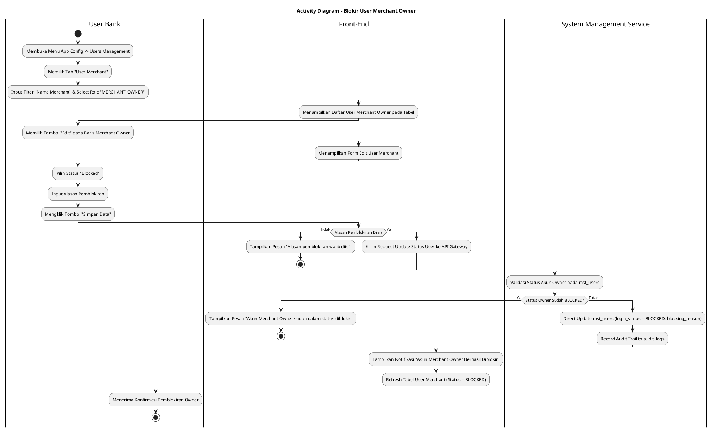
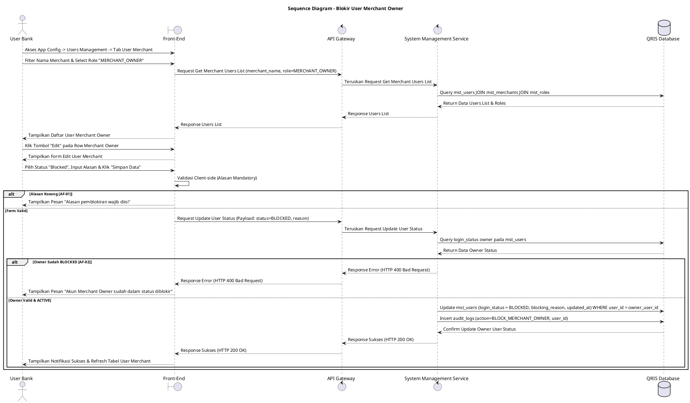

# 1 Deskripsi Use Case

**Tabel 1: Deskripsi Use Case Blokir User Merchant Owner**

| Elemen Spesifikasi | Deskripsi Detail |
| --- | --- |
| ID Use Case | UC-BOH-023 |
| Nama Use Case | Blokir User Merchant Owner |
| Penjelasan Singkat | Fitur Web Back Office Hibank pada menu App Config -> Users Management (Tab User Merchant) yang memfasilitasi User Bank untuk memfilter akun pengguna berdasarkan Nama Merchant dan Role `MERCHANT_OWNER`, serta mengubah status akun Merchant Owner menjadi `Blocked` pada tabel `mst_users` (`login_status = BLOCKED`), sehingga Merchant Owner tersebut tidak dapat melakukan login ke Portal Back Office Merchant. |
| Aktor Utama | User Bank (Back Office Hibank Compliance / Risk / Operations Staff) |
| Aktor Pendukung | System Management Service (`system_management_service`) |
| Deskripsi Singkat | User Bank melakukan otentikasi login SSO ke Web Back Office Hibank dan mengakses menu **App Config** -> **Users Management**. Sistem menampilkan halaman pengelolaan pengguna dengan beberapa tab. User Bank memilih tab **User Merchant**. Sistem menyajikan toolbar pencarian dan filter data. User Bank memasukkan/memilih kriteria filter berdasarkan **Nama Merchant** (pada kolom pencarian/select merchant) dan memilih opsi filter Role **`MERCHANT_OWNER`** (pada dropdown filter role). Sistem menampilkan daftar akun pengguna merchant yang memenuhi kriteria filter dari tabel `mst_users`, `mst_merchants`, dan `mst_roles`. User Bank memilih baris akun Merchant Owner yang akan diblokir, lalu mengklik tombol aksi **"Edit"**. Sistem menampilkan modal/halaman formulir pengeditan data pengguna merchant. User Bank mengubah pilihan kolom Status Pengguna dari `Active` menjadi **`Blocked`** dan menginputkan Alasan Pemblokiran (*blocking reason*). User Bank mengklik tombol **"Simpan Data"**. Front-End memvalidasi kelengkapan data dan mengirimkan request pemblokiran ke API Gateway. Service backend memvalidasi keberadaan `user_id`. Setelah validasi sukses, service secara langsung memperbarui status akun Merchant Owner pada tabel **`mst_users`** menjadi **`login_status = BLOCKED`** dan mencatat jejak pemblokiran ke tabel **`audit_logs`**, sehingga akun Merchant Owner ditolak saat mencoba autentikasi login ke Portal Back Office Merchant. Front-End memperbarui tabel daftar user merchant dan menampilkan notifikasi konfirmasi bahwa akun Merchant Owner berhasil diblokir. |
| Pre-condition | 1. User Bank telah berhasil login SSO ke Web Back Office Hibank dan memiliki hak akses menu *App Config - Users Management*. 2. Akun Merchant Owner yang akan diblokir terdaftar aktif pada tabel `mst_users` (`login_status = ACTIVE`). |
| Post-condition | 1. Kolom `login_status` akun Merchant Owner pada tabel `mst_users` diperbarui secara langsung menjadi `BLOCKED`. 2. Merchant Owner yang diblokir ditolak akses autentikasinya dan tidak dapat melakukan login ke Portal Back Office Merchant. 3. Front-End memperbarui tampilan tabel daftar user merchant pada tab User Merchant menu App Config. |
| Trigger | User Bank mengakses menu **App Config** -> **Users Management**, memilih tab **User Merchant**, memfilter **Nama Merchant** dan Role **`MERCHANT_OWNER`**, mengklik tombol **"Edit"**, mengubah status menjadi **`Blocked`**, mengisi alasan pemblokiran, dan mengklik **"Simpan Data"**. |
| Nama Tabel | mst_users, mst_roles, mst_merchants, audit_logs |
| Integrasi | 1. **Web Back Office Hibank UI:** Antarmuka menu App Config - Users Management (Tab User Merchant), filter toolbar, dan form edit user merchant. 2. **System Management Service:** Microservice backend pengelola pembaruan status keaktifan dan otorisasi pengguna merchant di database. |
| Asumsi | 1. Pemblokiran akun Merchant Owner berfokus khusus pada penangguhan hak akses login pengguna ke Portal Back Office Merchant. 2. Alasan pemblokiran dicatat secara eksplisit pada log perubahan untuk kebutuhan *audit trail*. |
| Keterbatasan | 1. Akun Merchant Owner berstatus `BLOCKED` tidak dapat dipulihkan kecuali dilakukan aksi *Unblock* dari menu App Config. 2. Pemblokiran user owner tidak secara otomatis menangguhkan transaksi QRIS toko jika user kasir masih berstatus aktif. |
| Aturan Bisnis/Sistem | 1. **Navigation & Scoping:** Fitur pemblokiran user merchant owner dikelola terpusat pada menu **App Config** -> sub-menu **Users Management** -> tab **User Merchant**. 2. **Filter & Search Criteria:** Toolbar filter mendukung pencarian spesifik berbasis **Nama Merchant** (`merchant_name`) dan pemfilteran peran **`MERCHANT_OWNER`** (`role_code = MERCHANT_OWNER`). 3. **Edit Form Status Modification:** Perubahan status dilakukan melalui form Edit User Merchant dengan mengubah field Status dari `Active` menjadi `Blocked` serta mengisi field wajib `Blocking Reason`. 4. **Direct Database Update (`mst_users`):** Sistem memperbarui kolom `login_status = BLOCKED`, `updated_at`, dan `updated_by` pada tabel `mst_users`. 5. **Authentication Lockout:** Sistem autentikasi Back Office Merchant secara otomatis menolak permintaan login dari akun yang memiliki `login_status = BLOCKED`. 6. **Audit Trail Logging:** Setiap tindakan pemblokiran wajib mencatat ID pelaksana, timestamp, ID merchant, dan alasan pemblokiran ke tabel `audit_logs`. |
| Session Idle | 15 Menit |

# 2 Main Flow

**Tabel 2: Main Flow Blokir User Merchant Owner**

| No. | Aktivitas | Deskripsi |
| ---: | --- | --- |
| 1 | Akses Menu Users Management | User Bank mengklik menu **App Config** -> sub-menu **Users Management** pada bilah navigasi utama. |
| 2 | Memilih Tab User Merchant | User Bank memilih tab **User Merchant** pada halaman Users Management. |
| 3 | Memfilter Nama Merchant & Role Owner | User Bank memasukkan **Nama Merchant** pada field pencarian merchant dan memilih filter Role **`MERCHANT_OWNER`** pada toolbar. |
| 4 | Menampilkan Daftar User Merchant Owner | Sistem menampilkan daftar akun pengguna merchant yang ber-role Merchant Owner sesuai filter nama merchant dari `mst_users` dan `mst_merchants`. |
| 5 | Memilih Tombol Edit | User Bank mengklik tombol aksi **"Edit"** pada baris akun Merchant Owner yang ingin diblokir. |
| 6 | Menampilkan Form Edit User Merchant | Sistem menampilkan modal/halaman formulir pengeditan data pengguna merchant. |
| 7 | Mengubah Status Menjadi Blocked & Fill Reason | User Bank mengubah pilihan dropdown Status menjadi **`Blocked`** dan mengisi alasan pemblokiran pada field `Alasan Pemblokiran`. |
| 8 | Mengklik Tombol Simpan Data | User Bank mengklik tombol **"Simpan Data"** untuk mengonfirmasi perubahan status pemblokiran. |
| 9 | Memvalidasi Client & Kirim Request | Front-End memvalidasi kelengkapan alasan pemblokiran dan mengirim request API pemblokiran ke API Gateway. |
| 10 | Update Database `mst_users` | Microservice backend memperbarui status akun Merchant Owner pada `mst_users` (`login_status = BLOCKED`) dan mencatat `audit_logs`. |
| 11 | Menampilkan Konfirmasi Berhasil | Front-End memperbarui tabel daftar user merchant dan menampilkan toast notifikasi bahwa akun Merchant Owner telah berhasil diblokir. |
| 12 | Use Case Selesai | Proses pemblokiran akun Merchant Owner dari menu App Config selesai dilaksanakan. |

# 3 Alternative Flow

**Tabel 3: Alternative Flow Blokir User Merchant Owner**

| Kode | Alternative Flow | Deskripsi |
| --- | --- | --- |
| AF-01 | Alasan Pemblokiran Kosong | Pada langkah 8-9, apabila User Bank mengosongkan kolom alasan pemblokiran saat memilih status `Blocked`, Sistem menolak request dan Front-End menampilkan pesan `Alasan pemblokiran wajib diisi`. |
| AF-02 | Merchant Owner Sudah Berstatus Blocked | Pada langkah 10, apabila akun Merchant Owner pada database sudah berstatus `login_status = BLOCKED`, Sistem membatalkan transaksi dan Front-End menampilkan `Akun Merchant Owner sudah dalam status diblokir`. |
| AF-03 | Gagal Terhubung ke Database Server | Pada langkah 10, apabila koneksi database terputus total, Sistem mengembalikan HTTP status 500 dan Front-End menampilkan `Gagal memperbarui status pemblokiran ke database`. |

# 4 Status Front-End

**Tabel 4: Status Front-End Blokir User Merchant Owner**

| No. | Nama Status | Deskripsi Tampilan Front-End |
| ---: | --- | --- |
| 1 | IDLE | Tab User Merchant menyajikan toolbar filter (Nama Merchant & Role) dan tabel daftar pengguna merchant. |
| 2 | LOADING | Indikator proses (*spinner*) ditampilkan pada tombol Simpan Data saat request pemblokiran sedang diproses server. |
| 3 | SUCCESS | Toast konfirmasi menampilkan pesan bahwa akun Merchant Owner telah berhasil diblokir dan status pada tabel berubah menjadi `BLOCKED`. |
| 4 | ERROR | Pesan kesalahan ditampilkan pada UI akibat alasan kosong, status owner tidak valid, atau gangguan server. |

# 5 Activity Diagram Blokir User Merchant Owner

# 6 Sequence Diagram Blokir User Merchant Owner

# 7 Response Code

**Tabel 5: Response Code Blokir User Merchant Owner**

| No. | HTTP Status | Response Code | Nama Response | Deskripsi | Respons Front-End |
| ---: | ---: | --- | --- | --- | --- |
| 1 | 200 | 200XX00 | SUCCESS_BLOCK_MERCHANT_OWNER | Status akun Merchant Owner berhasil diubah menjadi `BLOCKED` sehingga tidak dapat login ke Portal Back Office Merchant. | Menampilkan pesan notifikasi sukses dan memperbarui tabel daftar user merchant. |
| 2 | 400 | 400XX00 | INVALID_BLOCKING_REASON | Alasan pemblokiran yang dimasukkan tidak valid atau kosong. | Menampilkan pesan kesalahan `Alasan pemblokiran wajib diisi`. |
| 3 | 400 | 400XX01 | OWNER_ALREADY_BLOCKED | Akun Merchant Owner yang dipilih sudah dalam kondisi status diblokir. | Menampilkan pesan kesalahan `Akun Merchant Owner sudah dalam status diblokir`. |
| 4 | 404 | 404XX00 | USER_NOT_FOUND | Data akun Merchant Owner tidak ditemukan pada database. | Menampilkan pesan kesalahan `Data akun pengguna tidak ditemukan`. |
| 5 | 500 | 500XX00 | SYSTEM_INTERNAL_ERROR | Terjadi kegagalan internal server saat mengeksekusi pemblokiran akun Merchant Owner. | Menampilkan pesan kesalahan `Terjadi kendala internal pada server`. |

# 8 Desain Antarmuka

**Tabel 6: Desain Antarmuka Blokir User Merchant Owner**

| Halaman | Komponen dan State Utama |
| --- | --- |
| Halaman App Config - Users Management (Tab User Merchant) | 1. **Navigation Header:** `App Config` -> `Users Management`. 2. **Tab Navigation:** Tab `User Merchant` (Active), Tab `User Internal`. 3. **Toolbar Filter:** &nbsp;&nbsp;* Field Search Nama Merchant: Input pencarian nama merchant (`merchant_name`). &nbsp;&nbsp;* Dropdown Filter Role: Pilihan role (`MERCHANT_OWNER`, `KASIR`, dll.). 4. **Tabel User Merchant (`mst_users` & `mst_merchants`):** &nbsp;&nbsp;* Kolom: Nama User, Nama Merchant, Email, Role (`MERCHANT_OWNER`), Status (`login_status`), Aksi. &nbsp;&nbsp;* Tombol Aksi: Tombol **"Edit"** (Icon Pensil / Button). |
| Modal / Form Edit User Merchant | 1. **Header Modal:** `Edit User Merchant`. 2. **Info User (Read-Only):** Nama User, Email, Nama Merchant, Role (`MERCHANT_OWNER`). 3. **Dropdown Status:** Pilihan `Active` dan **`Blocked`**. 4. **Textarea Alasan Pemblokiran:** Mandatory input saat status di-set `Blocked`. 5. **Tombol Aksi:** Tombol **"Simpan Data"** (Primary Red/Blue) dan **"Batal"** (Secondary). |
