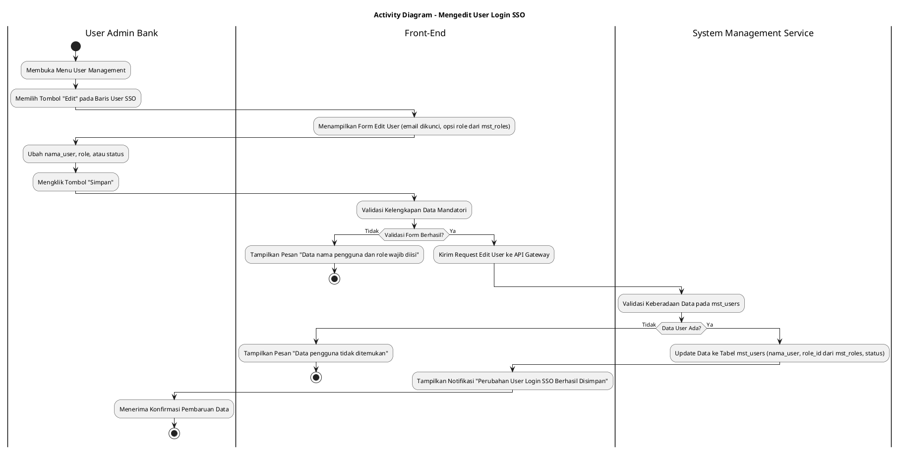
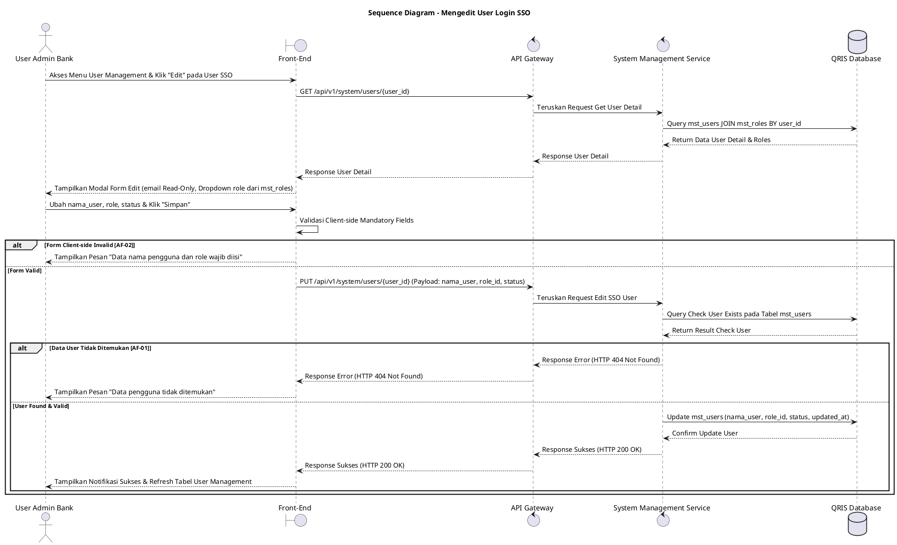

# 1 Deskripsi Use Case

**Tabel 1: Deskripsi Use Case Mengedit User Login SSO**

| Elemen Spesifikasi | Deskripsi Detail |
| --- | --- |
| ID Use Case | UC-BOH-024 |
| Nama Use Case | Mengedit User Login SSO |
| Penjelasan Singkat | Fitur Web Back Office Hibank yang memfasilitasi User Admin Bank untuk memperbarui informasi data profil pengguna login SSO (`nama_user`, `role` dari `mst_roles`, dan `status`) pada tabel `mst_users` melalui System Management Service tanpa memfasilitasi pengubahan password lokal. |
| Aktor Utama | User Admin Bank (Back Office Hibank Superadmin / Admin User Management) |
| Aktor Pendukung | System Management Service |
| Deskripsi Singkat | User Admin Bank melakukan otentikasi login SSO ke Web Back Office Hibank dan mengakses menu **Pengaturan Sistem** -> **User Management**. Sistem menampilkan daftar akun pengguna pada tabel `mst_users`. User Admin Bank memilih salah satu baris akun pengguna berbasis SSO (`login_type = 'SSO'`) dan mengklik tombol **"Edit"**. Sistem menampilkan modal form pengubahan data yang telah terisi dengan data eksisting (`nama_user`, `email`, `role`, `status`). Kolom `email` dan `login_type` bersifat dikunci (*read-only*). User Admin Bank melakukan pengubahan nama pengguna (`nama_user`), peran kewenangan (`role` dari tabel `mst_roles`), atau status keaktifan akun (`ACTIVE`/`INACTIVE`), lalu mengklik tombol **"Simpan"**. Sistem memvalidasi masukan. Setelah validasi berhasil, System Management Service memperbarui rekord data pengguna pada tabel **`mst_users`** (termasuk penyesuaian `role_id` dari **`mst_roles`**). Front-End menyajikan notifikasi sukses bahwa pengubahan data pengguna login SSO telah berhasil disimpan. |
| Pre-condition | 1. User Admin Bank telah berhasil login SSO ke Web Back Office Hibank dan memiliki kewenangan otoritas *User Administrator*. 2. Akun pengguna berbasis SSO yang akan diubah terdaftar valid pada tabel `mst_users`. |
| Post-condition | 1. Perubahan data `nama_user`, `role_id` (ke `mst_roles`), atau `status` pengguna berhasil diperbarui pada tabel `mst_users`. 2. Alamat email dan tipe autentikasi `login_type = 'SSO'` tetap dipertahankan tanpa perubahan. 3. Front-End memperbarui data terbaru pada tabel User Management. |
| Trigger | User Admin Bank mengklik tombol **"Edit"** pada salah satu baris akun pengguna di halaman User Management, mengedit data `nama_user`, `role`, atau `status`, lalu mengklik tombol **"Simpan"**. |
| Nama Tabel | mst_users, mst_roles |
| Integrasi | 1. **Web Back Office Hibank UI:** Antarmuka pengelolaan pengguna dan modal pengubahan akun user. 2. **System Management Service:** Microservice backend pengelola pembaruan profil dan otorisasi peran pengguna. 3. **Bank SSO Identity Provider (IdP):** Server autentikasi terpusat SSO Bank. |
| Asumsi | 1. Pengubahan identitas email atau kata sandi dilakukan secara mandiri oleh pengguna melalui IdP Bank dan tidak diakomodasi pada form ini. 2. Pengubahan `role` pengguna akan langsung memberlakukan hak akses baru saat sesi berikutnya. |
| Keterbatasan | 1. Kolom `email` dan `login_type` bersifat *read-only* untuk menjaga integritas pemetaan akun SSO. 2. Form edit tidak menyediakan pengisian atau pengubahan kata sandi (*no password field*). |
| Aturan Bisnis/Sistem | 1. **Read-Only Identifier Protection:** Alamat email (`email`) dan jenis login (`login_type = 'SSO'`) DILARANG diubah saat proses pengeditan pengguna SSO. 2. **No Password Update:** Sistem DILARANG menyediakan input atau memproses pengubahan kata sandi untuk akun berkategori login SSO. 3. **Mandatory Edit Fields Validation:** Kolom `nama_user`, `role`, dan `status` bersifat WAJIB diisi (*mandatory*). 4. **Role Update Synchronization:** Pembaruan `role_id` pada `mst_users` merujuk langsung ke tabel `mst_roles`. |
| Session Idle | 15 Menit |

# 2 Main Flow

**Tabel 2: Main Flow Mengedit User Login SSO**

| No. | Aktivitas | Deskripsi |
| ---: | --- | --- |
| 1 | Membuka Web Back Office | User Admin Bank melakukan otentikasi login SSO dan mengakses dashboard Web Back Office Hibank. |
| 2 | Mengakses Menu User Management | User Admin Bank mengklik menu **Pengaturan Sistem** -> sub-menu **User Management**. |
| 3 | Menampilkan Daftar User Bank | Sistem menampilkan tabel daftar akun pengguna Web Back Office dari `mst_users` beserta tombol **"Edit"** per baris. |
| 4 | Memilih Tombol Edit | User Admin Bank mengklik tombol **"Edit"** pada baris pengguna berbasis SSO (`login_type = 'SSO'`) yang ingin diubah. |
| 5 | Menampilkan Form Edit User | Sistem menampilkan modal form pengubahan data yang telah terisi data eksisting (`nama_user`, `email` [read-only], `role` dari `mst_roles`, `status`). |
| 6 | Mengubah Data Pengguna | User Admin Bank mengedit `nama_user`, memilih `role` baru, atau mengubah `status` (`ACTIVE`/`INACTIVE`), lalu mengklik tombol **"Simpan"**. |
| 7 | Memvalidasi Input Pengubahan | Sistem memvalidasi ketersediaan data mandatori dan format masukan. |
| 8 | Menyimpan Perubahan Data | System Management Service memperbarui data pengguna pada tabel `mst_users` (termasuk pembaruan `role_id` dari `mst_roles`). |
| 9 | Menampilkan Konfirmasi Sukses | Front-End menampilkan pesan notifikasi bahwa perubahan data pengguna berhasil disimpan dan memperbarui tabel daftar user. |
| 10 | Use Case Selesai | Pengubahan data pengguna login SSO selesai dilaksanakan. |

# 3 Alternative Flow

**Tabel 3: Alternative Flow Mengedit User Login SSO**

| Kode | Alternative Flow | Deskripsi |
| --- | --- | --- |
| AF-01 | User ID Tidak Ditemukan / Invalid | Pada langkah 4 atau 7, apabila akun pengguna yang akan diubah tidak ditemukan pada `mst_users`, Sistem membatalkan transaksi dan Front-End menampilkan `Data pengguna tidak ditemukan`. |
| AF-02 | Kolom Mandatori Kosong | Pada langkah 7, apabila kolom `nama_user` dikosongkan atau `role` tidak dipilih, Sistem menolak pengubahan dan Front-End menampilkan `Data nama pengguna dan role wajib diisi`. |
| AF-03 | Gagal Terhubung ke Database | Pada langkah 8, apabila terjadi gangguan transaksi pada database server, Sistem mengembalikan HTTP status 500 dan Front-End menampilkan `Gagal memperbarui data pengguna`. |

# 4 Status Front-End

**Tabel 4: Status Front-End Mengedit User Login SSO**

| No. | Nama Status | Deskripsi Tampilan Front-End |
| ---: | --- | --- |
| 1 | IDLE | Modal form edit pengguna menyajikan data awal eksisting dengan kolom `email` terkunci (*read-only*). |
| 2 | LOADING | Indikator proses (*spinner*) ditampilkan pada tombol Simpan saat perubahan data sedang divalidasi dan disimpan oleh server. |
| 3 | SUCCESS | Modal/toast konfirmasi menampilkan pesan bahwa pengubahan data pengguna login SSO berhasil disimpan. |
| 4 | ERROR | Pesan kesalahan ditampilkan pada modal UI akibat validasi form gagal atau gangguan server. |

# 5 Activity Diagram Mengedit User Login SSO

# 6 Sequence Diagram Mengedit User Login SSO

# 7 Response Code

**Tabel 5: Response Code Mengedit User Login SSO**

| No. | HTTP Status | Response Code | Nama Response | Deskripsi | Respons Front-End |
| ---: | ---: | --- | --- | --- | --- |
| 1 | 200 | 200XX00 | SUCCESS_EDIT_SSO_USER | Data pengguna berbasis login SSO berhasil diperbarui pada tabel `mst_users`. | Menampilkan pesan notifikasi sukses dan memperbarui tabel daftar user. |
| 2 | 400 | 400XX00 | INVALID_USER_INPUT_DATA | Format data input nama_user, role, atau status tidak valid / kosong. | Menampilkan pesan kesalahan `Data nama pengguna dan role wajib diisi`. |
| 3 | 404 | 404XX00 | USER_NOT_FOUND | Data pengguna yang akan diubah tidak ditemukan pada tabel `mst_users`. | Menampilkan pesan kesalahan `Data pengguna tidak ditemukan`. |
| 4 | 422 | 422XX00 | IMMUTABLE_FIELD_UPDATE_REJECTED | Terdapat upaya mengubah kolom terproteksi seperti `email` atau `login_type`. | Menampilkan pesan kesalahan `Alamat email dan jenis login SSO tidak dapat diubah`. |
| 5 | 500 | 500XX00 | SYSTEM_INTERNAL_ERROR | Terjadi kegagalan internal server saat memperbarui data pengguna. | Menampilkan pesan kesalahan `Terjadi kendala internal pada server`. |

# 8 Desain Antarmuka

**Tabel 6: Desain Antarmuka Mengedit User Login SSO**

| Halaman | Komponen dan State Utama |
| --- | --- |
| User Management Back Office | 1. **Bilah Pencarian & Filter:** Field pencarian nama/email dan dropdown filter role. 2. **Tabel User (`mst_users`):** Kolom Nama User, Email, Role (`mst_roles`), Login Type (`SSO`), Status (`ACTIVE`/`INACTIVE`), dan Tombol Aksi **"Edit"**. |
| Modal Form Edit User SSO | 1. **Input Nama User (`nama_user`):** Field teks pengubahan nama lengkap pengguna. 2. **Input Email (`email`):** Field teks email institusi (Disabled / Read-Only). 3. **Dropdown Role (`role`):** Dropdown pilihan pengubahan peran kewenangan (diambil dari `mst_roles`). 4. **Dropdown Status (`status`):** Dropdown pilihan status keaktifan (`ACTIVE` / `INACTIVE`). 5. **Indikator Login Type:** Label tertera `Login Type: SSO (Read-Only)` tanpa field password. 6. **Tombol Aksi:** Tombol **"Simpan"** (Primary) dan **"Batal"** (Secondary). |
