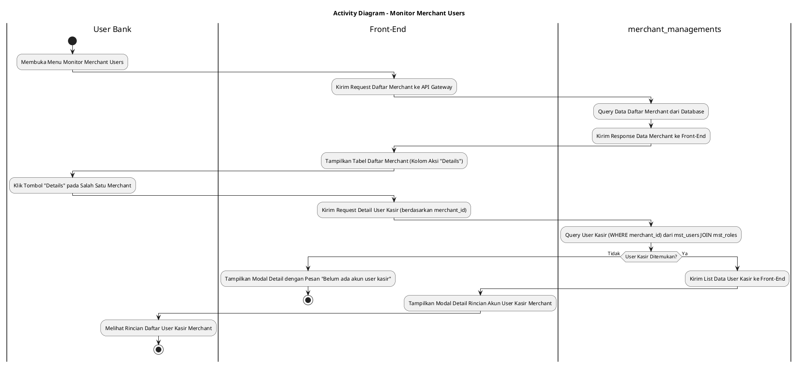
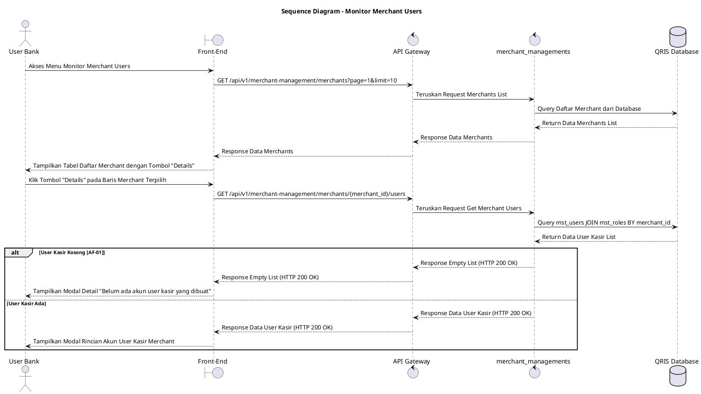

# 1 Deskripsi Use Case

**Tabel 1: Deskripsi Use Case Monitor Merchant Users**

| Elemen Spesifikasi | Deskripsi Detail |
| --- | --- |
| ID Use Case | UC-BOH-025 |
| Nama Use Case | Monitor Merchant Users |
| Penjelasan Singkat | Fitur Web Back Office Hibank yang memfasilitasi User Bank untuk memantau daftar merchant terdaftar beserta rincian daftar akun pengguna kasir dan staff merchant yang dibuat oleh merchant terpilih dari tabel `mst_users` dan `mst_roles` menggunakan service `merchant_managements`. |
| Aktor Utama | User Bank (Back Office Hibank Staff / Operations / Support) |
| Aktor Pendukung | merchant_managements (Merchant Management Service) |
| Deskripsi Singkat | User Bank melakukan otentikasi login SSO ke Web Back Office Hibank dan mengakses menu **Merchant Management** -> **Monitor Merchant Users**. Front-End mengirimkan request ke API Gateway untuk memuat daftar merchant. Service `merchant_managements` melakukan kueri ke database dan mengembalikan daftar merchant terdaftar. Front-End menyajikan tabel daftar merchant yang memuat Merchant ID (MID), Nama Merchant, Kategori Usaha, dan tombol aksi **"Details"**. User Bank memilih dan mengklik tombol **"Details"** pada salah satu baris merchant. Front-End mengirimkan request pengambil rincian user kasir untuk merchant terpilih. Service `merchant_managements` mengeksekusi kueri ke tabel **`mst_users`** dengan memfilter `merchant_id` terpilih serta menghubungkan relasi ke **`mst_roles`** untuk mengambil akun berkategori kasir/staff merchant. Front-End menyajikan modal/halaman rincian yang menampilkan daftar akun user kasir mencakup Nama Kasir, Email/Username, Role (`mst_roles`), Status Keaktifan (`ACTIVE`/`INACTIVE`), dan Tanggal Pendaftaran. |
| Pre-condition | User Bank telah berhasil login SSO ke Web Back Office Hibank dan memiliki kewenangan peran *Merchant Monitoring Staff*. |
| Post-condition | Front-End berhasil menyajikan tabel daftar merchant dan modal rincian detail akun user kasir yang dibuat oleh merchant terpilih. |
| Trigger | User Bank mengklik menu Monitor Merchant Users atau mengklik tombol **"Details"** pada salah satu baris merchant di tabel monitoring. |
| Nama Tabel | mst_merchants, mst_users, mst_roles |
| Integrasi | 1. **Web Back Office Hibank UI:** Antarmuka daftar monitoring merchant dan modal rincian detail akun user kasir. 2. **merchant_managements:** Microservice backend pengelola data master merchant, toko, dan akun pengguna merchant. 3. **QRIS Database:** Penyimpanan data master merchant (`mst_merchants`), akun pengguna (`mst_users`), dan peran kewenangan (`mst_roles`). |
| Asumsi | 1. Setiap akun kasir/staff merchant terhubung secara eksplisit ke `merchant_id` induknya pada tabel `mst_users`. 2. Halaman monitoring menggunakan metode pembagian halaman (*pagination*) untuk memuat data merchant secara responsif. |
| Keterbatasan | 1. Pemantauan pengguna merchant pada use case ini bersifat read-only (hanya memantau dan tidak memfasilitasi reset password kasir dari sisi Bank). 2. Data user yang ditampilkan hanya terbatas pada akun kasir dan staff yang dibuat oleh merchant terpilih. |
| Aturan Bisnis/Sistem | 1. **Merchant User Filtering Standard:** Kueri rincian user kasir WAJIB memfilter tabel `mst_users` berdasarkan `merchant_id` merchant terpilih dan menyertakan deskripsi peran dari `mst_roles`. 2. **Data Isolation Security:** User Bank hanya dapat melihat akun kasir yang secara sah terdaftar di bawah `merchant_id` terpilih. 3. **Pagination Standard:** Daftar merchant dan daftar user kasir wajib ditampilkan dengan fasilitas pagination (default 10 atau 25 baris data per halaman). 4. **Real-time Status Display:** Status keaktifan akun kasir ditampilkan sesuai enum resmi (`ACTIVE`, `INACTIVE`, `SUSPENDED`). |
| Session Idle | 15 Menit |

# 2 Main Flow

**Tabel 2: Main Flow Monitor Merchant Users**

| No. | Aktivitas | Deskripsi |
| ---: | --- | --- |
| 1 | Membuka Menu Monitor Merchant Users | User Bank melakukan login SSO dan mengklik menu **Merchant Management** -> **Monitor Merchant Users**. |
| 2 | Mengirim Request Daftar Merchant | Front-End mengirimkan request ke API Gateway untuk mengambil data daftar merchant terdaftar dengan parameter pagination default. |
| 3 | Query Data Merchant | Service `merchant_managements` melakukan kueri data merchant dari tabel `mst_merchants` / `mst_users` dan mengembalikannya ke Front-End. |
| 4 | Menampilkan Tabel Daftar Merchant | Front-End menyajikan tabel daftar merchant yang memuat MID, Nama Merchant, Status, dan tombol aksi **"Details"**. |
| 5 | Memilih Aksi Details Merchant | User Bank mengklik tombol **"Details"** pada salah satu baris merchant yang ingin ditinjau daftar kasirnya. |
| 6 | Mengirim Request Detail User Kasir | Front-End mengirimkan request pengambil rincian akun kasir untuk `merchant_id` terpilih ke API Gateway. |
| 7 | Query User Kasir Merchant | Service `merchant_managements` melakukan kueri ke tabel `mst_users` berdasarkan `merchant_id` dan mengambil nama peran dari `mst_roles`. |
| 8 | Mengembalikan Data User Kasir | Service `merchant_managements` menyusun daftar akun kasir merchant dan mengembalikannya ke Front-End melalui API Gateway. |
| 9 | Menampilkan Modal Rincian User Kasir | Front-End menampilkan modal/halaman detail yang menyajikan daftar akun user kasir (Nama, Email/Username, Role, Status, Tanggal Dibuat). |
| 10 | Use Case Selesai | Pemantauan akun pengguna merchant selesai dilaksanakan. |

# 3 Alternative Flow

**Tabel 3: Alternative Flow Monitor Merchant Users**

| Kode | Alternative Flow | Deskripsi |
| --- | --- | --- |
| AF-01 | Merchant Tidak Memiliki User Kasir | Pada langkah 7-9, apabila merchant terpilih belum pernah membuat akun kasir/staff pada `mst_users`, Sistem mengembalikan data kosong dan Front-End menampilkan `Belum ada akun user kasir yang dibuat oleh merchant ini`. |
| AF-02 | Merchant ID Tidak Ditemukan | Pada langkah 6-7, apabila `merchant_id` yang dipilih tidak valid atau telah dihapus, Sistem mengembalikan HTTP 404 dan Front-End menampilkan `Data merchant tidak ditemukan`. |
| AF-03 | Gangguan Koneksi Database Server | Pada langkah 3 atau 7, apabila terjadi gangguan transaksi pada database server, Sistem mengembalikan HTTP status 500 dan Front-End menampilkan `Gagal memuat data pengguna merchant`. |

# 4 Status Front-End

**Tabel 4: Status Front-End Monitor Merchant Users**

| No. | Nama Status | Deskripsi Tampilan Front-End |
| ---: | --- | --- |
| 1 | LOADING | Indikator muat data (*spinner/skeleton*) ditampilkan pada tabel merchant atau modal detail saat data diproses dari server. |
| 2 | SUCCESS | Tabel daftar merchant dan modal rincian akun user kasir tersaji secara valid dan lengkap. |
| 3 | EMPTY | Modal detail menyajikan tampilan *empty state* saat merchant terpilih belum memiliki akun user kasir. |
| 4 | ERROR | Pesan kesalahan disertai tombol **"Retry"** ditampilkan pada UI akibat gangguan server atau ID merchant invalid. |

# 5 Activity Diagram Monitor Merchant Users

# 6 Sequence Diagram Monitor Merchant Users

# 7 Response Code

**Tabel 5: Response Code Monitor Merchant Users**

| No. | HTTP Status | Response Code | Nama Response | Deskripsi | Respons Front-End |
| ---: | ---: | --- | --- | --- | --- |
| 1 | 200 | 200XX00 | SUCCESS_GET_MERCHANT_USERS | Data daftar akun user kasir yang dibuat oleh merchant berhasil diambil. | Menampilkan modal rincian daftar akun user kasir merchant secara lengkap. |
| 2 | 400 | 400XX00 | INVALID_MERCHANT_ID | Format `merchant_id` yang dikirimkan tidak valid. | Menampilkan pesan kesalahan `ID Merchant tidak valid`. |
| 3 | 404 | 404XX00 | MERCHANT_NOT_FOUND | Data merchant yang dipilih tidak ditemukan pada database. | Menampilkan pesan kesalahan `Data merchant tidak ditemukan`. |
| 4 | 500 | 500XX00 | SYSTEM_INTERNAL_ERROR | Terjadi kegagalan internal server saat mengambil data pengguna merchant. | Menampilkan indikator error pada UI dan tombol *retry*. |
| 5 | 504 | 504XX00 | DATABASE_QUERY_TIMEOUT | Kueri ke tabel `mst_users` / `mst_roles` mengalami batas waktu habis (timeout). | Menampilkan pesan kesalahan `Gagal memuat data pengguna merchant akibat timeout`. |

# 8 Desain Antarmuka

**Tabel 6: Desain Antarmuka Monitor Merchant Users**

| Halaman | Komponen dan State Utama |
| --- | --- |
| Monitoring Merchant Users | 1. **Bilah Pencarian Merchant:** Input nama merchant / Merchant ID (MID) dan Tombol **"Cari"**. 2. **Tabel Daftar Merchant:** Kolom Merchant ID (MID), Nama Merchant, Pemilik Merchant, Status, dan Tombol Aksi **"Details"**. 3. **Pagination Control:** Komponen navigasi halaman merchant. 4. **State Indicator:** Tampilan LOADING (Spinner), SUCCESS, EMPTY, dan ERROR. |
| Modal Detail User Kasir Merchant | 1. **Header Info Merchant:** MID, Nama Merchant, dan Total Akun Kasir Terdaftar. 2. **Tabel User Kasir (`mst_users` & `mst_roles`):** Kolom Nama Kasir (`nama_user`), Email/Username, Role (`mst_roles`), Status (`ACTIVE`/`INACTIVE`), dan Tanggal Dibuat. 3. **Tombol "Tutup":** Menutup modal rincian akun kasir. |
