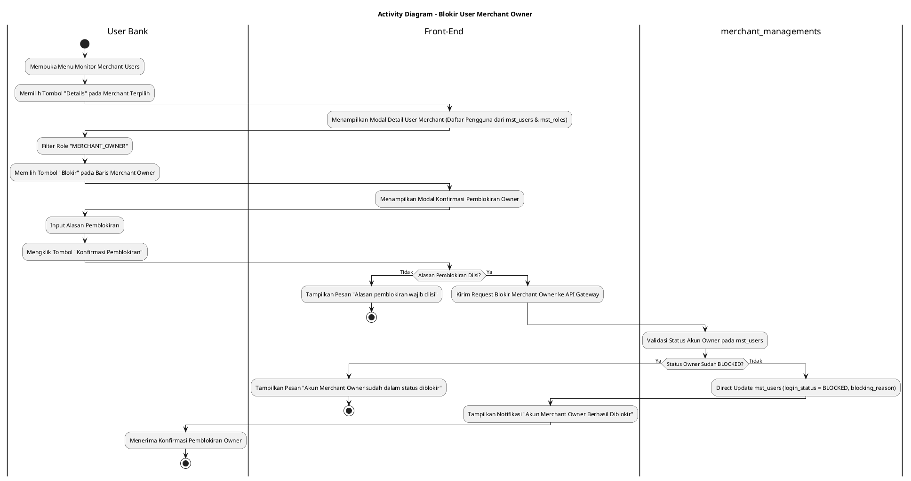
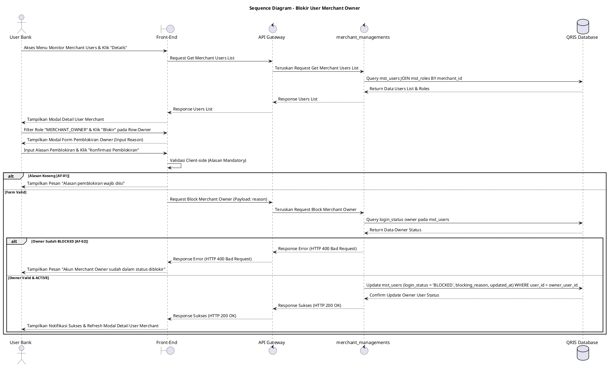

# 1 Deskripsi Use Case

**Tabel 1: Deskripsi Use Case Blokir User Merchant Owner**

| Elemen Spesifikasi | Deskripsi Detail |
| --- | --- |
| ID Use Case | UC-BOH-026 |
| Nama Use Case | Blokir User Merchant Owner |
| Penjelasan Singkat | Fitur Web Back Office Hibank yang memfasilitasi User Bank untuk meninjau rincian pengguna merchant, memfilter akun ber-role `MERCHANT_OWNER`, dan memblokir secara langsung akun Merchant Owner pada tabel `mst_users` (`login_status = 'BLOCKED'`) melalui service `merchant_managements`, sehingga Merchant Owner tersebut tidak dapat melakukan login ke Portal Back Office Merchant. |
| Aktor Utama | User Bank (Back Office Hibank Compliance / Risk / Operations Approver) |
| Aktor Pendukung | merchant_managements (Merchant Management Service) |
| Deskripsi Singkat | User Bank melakukan otentikasi login SSO ke Web Back Office Hibank dan mengakses menu **Merchant Management** -> **Monitor Merchant Users**. Sistem menampilkan daftar merchant terdaftar. User Bank memilih salah satu merchant, lalu mengklik tombol **"Details"**. Sistem menampilkan modal/halaman rincian daftar pengguna yang terdaftar pada merchant tersebut dari tabel `mst_users` dan `mst_roles`. User Bank memfilter atau memilih akun pengguna yang memiliki peran **`MERCHANT_OWNER`** (dari `mst_roles`), lalu mengklik tombol aksi **"Blokir"**. Sistem menampilkan modal konfirmasi pemblokiran yang meminta pengisian alasan pemblokiran (*blocking reason*). User Bank memasukkan alasan pemblokiran dan mengklik tombol **"Konfirmasi Pemblokiran"**. Front-End mengirim request ke API Gateway. Service `merchant_managements` memvalidasi status akun. Setelah validasi sukses, service secara langsung memperbarui status akun Merchant Owner pada tabel **`mst_users`** menjadi **`login_status = 'BLOCKED'`** dan mencatat alasan pemblokiran, sehingga Merchant Owner ditolak saat mencoba login ke Portal Back Office Merchant. Front-End memperbarui status pada modal rincian user dan menampilkan konfirmasi bahwa akun Merchant Owner berhasil diblokir. |
| Pre-condition | 1. User Bank telah berhasil login SSO ke Web Back Office Hibank dan memiliki otoritas kewenangan *Merchant Compliance/Risk Officer*. 2. Akun Merchant Owner yang akan diblokir terdaftar aktif pada tabel `mst_users` (`login_status = 'ACTIVE'`). |
| Post-condition | 1. Kolom `login_status` akun Merchant Owner pada tabel `mst_users` diperbarui secara langsung menjadi `BLOCKED`. 2. Merchant Owner yang diblokir ditolak akses autentikasinya dan tidak dapat melakukan login ke Portal Back Office Merchant. 3. Front-End memperbarui status tampilan akun Merchant Owner pada modal rincian pengguna merchant. |
| Trigger | User Bank mengklik tombol **"Details"** pada merchant terpilih, memfilter role `MERCHANT_OWNER`, mengklik tombol **"Blokir"**, mengisi alasan pemblokiran, dan mengklik **"Konfirmasi Pemblokiran"**. |
| Nama Tabel | mst_users, mst_roles |
| Integrasi | 1. **Web Back Office Hibank UI:** Antarmuka daftar merchant, modal rincian pengguna merchant, dan dialog pemblokiran akun Merchant Owner. 2. **merchant_managements:** Microservice backend pengelola pembaruan status keaktifan akun merchant secara langsung di database. |
| Asumsi | 1. Pemblokiran akun Merchant Owner berfokus khusus pada penangguhan hak akses login pengguna ke Portal Back Office Merchant. 2. Alasan pemblokiran dicatat secara eksplisit untuk kebutuhan *audit trail*. |
| Keterbatasan | 1. Akun Merchant Owner yang sudah berstatus `login_status = 'BLOCKED'` tidak dapat diblokir ulang. 2. Pengisian alasan pemblokiran bersifat mandatori dan tidak boleh dikosongkan. |
| Aturan Bisnis/Sistem | 1. **Role Filtering Standard:** User Bank dapat melihat dan memilih spesifik akun ber-role `MERCHANT_OWNER` dari relasi tabel `mst_roles`. 2. **Direct User Status Update Standard:** Service `merchant_managements` WAJIB meng-update kolom `login_status = 'BLOCKED'` pada `mst_users` khusus untuk `user_id` Merchant Owner terpilih. 3. **Authentication Access Denial:** Akun Merchant Owner dengan `login_status = 'BLOCKED'` WAJIB ditolak oleh sistem otentikasi saat mencoba melakukan login ke Portal Back Office Merchant. 4. **Mandatory Blocking Reason:** Pengisian kolom alasan pemblokiran (*blocking_reason*) bersifat WAJIB sebelum eksekusi pemblokiran diproses. 5. **Audit Trail Standard:** Setiap tindakan pemblokiran mencatat `owner_user_id`, `blocked_by` (ID User Bank), alasan pemblokiran, dan timestamp pada `mst_users`. |
| Session Idle | 15 Menit |

# 2 Main Flow

**Tabel 2: Main Flow Blokir User Merchant Owner**

| No. | Aktivitas | Deskripsi |
| ---: | --- | --- |
| 1 | Membuka Menu Monitor Merchant Users | User Bank melakukan login SSO dan mengklik menu **Merchant Management** -> **Monitor Merchant Users**. |
| 2 | Menampilkan Daftar Merchant | Sistem menampilkan tabel daftar merchant dari database beserta tombol aksi **"Details"** per baris merchant. |
| 3 | Memilih Tombol Details | User Bank mengklik tombol **"Details"** pada salah satu baris merchant terpilih. |
| 4 | Menampilkan Detail User Merchant | Sistem menampilkan modal rincian daftar pengguna yang terdaftar di bawah merchant tersebut dari `mst_users` dan `mst_roles`. |
| 5 | Memfilter Role Merchant Owner | User Bank memfilter atau memilih akun pengguna ber-role **`MERCHANT_OWNER`**. |
| 6 | Memilih Tombol Blokir Owner | User Bank mengklik tombol aksi **"Blokir"** pada baris akun Merchant Owner terpilih. |
| 7 | Menampilkan Modal Pemblokiran | Sistem menampilkan modal konfirmasi pemblokiran yang memuat rincian nama owner, email owner, dan textarea alasan pemblokiran. |
| 8 | Mengisi Alasan & Konfirmasi | User Bank menginput alasan pemblokiran pada kolom textarea dan mengklik tombol **"Konfirmasi Pemblokiran"**. |
| 9 | Memvalidasi Request Pemblokiran | Front-End memvalidasi ketersediaan alasan dan mengirim request pemblokiran ke API Gateway. |
| 10 | Direct Update Status Owner | Service `merchant_managements` langsung memperbarui akun Merchant Owner pada `mst_users` (`login_status = 'BLOCKED'`, `blocking_reason`). |
| 11 | Menampilkan Konfirmasi Berhasil | Front-End memperbarui modal rincian user dan menampilkan notifikasi bahwa akun Merchant Owner telah berhasil diblokir. |
| 12 | Use Case Selesai | Proses pemblokiran akun Merchant Owner selesai dilaksanakan. |

# 3 Alternative Flow

**Tabel 3: Alternative Flow Blokir User Merchant Owner**

| Kode | Alternative Flow | Deskripsi |
| --- | --- | --- |
| AF-01 | Alasan Pemblokiran Kosong | Pada langkah 8-9, apabila User Bank mengosongkan kolom alasan pemblokiran, Sistem menolak request dan Front-End menampilkan `Alasan pemblokiran wajib diisi`. |
| AF-02 | Merchant Owner Sudah Berstatus Blocked | Pada langkah 10, apabila akun Merchant Owner pada database sudah berstatus `login_status = 'BLOCKED'`, Sistem membatalkan transaksi dan Front-End menampilkan `Akun Merchant Owner sudah dalam status diblokir`. |
| AF-03 | Gagal Terhubung ke Database Server | Pada langkah 10, apabila koneksi database terputus total, Sistem mengembalikan HTTP status 500 dan Front-End menampilkan `Gagal memperbarui status pemblokiran ke database`. |

# 4 Status Front-End

**Tabel 4: Status Front-End Blokir User Merchant Owner**

| No. | Nama Status | Deskripsi Tampilan Front-End |
| ---: | --- | --- |
| 1 | IDLE | Modal rincian user merchant menyajikan daftar akun dan modal pemblokiran siap menerima masukan alasan. |
| 2 | LOADING | Indikator proses (*spinner*) ditampilkan pada tombol konfirmasi saat request pemblokiran sedang diproses server. |
| 3 | SUCCESS | Modal/toast konfirmasi menampilkan pesan bahwa akun Merchant Owner telah berhasil diblokir. |
| 4 | ERROR | Pesan kesalahan ditampilkan pada UI akibat alasan kosong, status owner tidak valid, atau gangguan server. |

# 5 Activity Diagram Blokir User Merchant Owner

# 6 Sequence Diagram Blokir User Merchant Owner

# 7 Response Code

**Tabel 5: Response Code Blokir User Merchant Owner**

| No. | HTTP Status | Response Code | Nama Response | Deskripsi | Respons Front-End |
| ---: | ---: | --- | --- | --- | --- |
| 1 | 200 | 200XX00 | SUCCESS_BLOCK_MERCHANT_OWNER | Status akun Merchant Owner berhasil diblokir sehingga tidak dapat login ke Portal Back Office Merchant. | Menampilkan pesan notifikasi sukses dan memperbarui modal rincian user merchant. |
| 2 | 400 | 400XX00 | INVALID_BLOCKING_REASON | Alasan pemblokiran yang dimasukkan tidak valid atau kosong. | Menampilkan pesan kesalahan `Alasan pemblokiran wajib diisi`. |
| 3 | 400 | 400XX01 | OWNER_ALREADY_BLOCKED | Akun Merchant Owner yang dipilih sudah dalam kondisi status diblokir. | Menampilkan pesan kesalahan `Akun Merchant Owner sudah dalam status diblokir`. |
| 4 | 404 | 404XX00 | USER_NOT_FOUND | Data akun Merchant Owner tidak ditemukan pada database. | Menampilkan pesan kesalahan `Data akun pengguna tidak ditemukan`. |
| 5 | 500 | 500XX00 | SYSTEM_INTERNAL_ERROR | Terjadi kegagalan internal server saat mengeksekusi pemblokiran akun Merchant Owner. | Menampilkan pesan kesalahan `Terjadi kendala internal pada server`. |

# 8 Desain Antarmuka

**Tabel 6: Desain Antarmuka Blokir User Merchant Owner**

| Halaman | Komponen dan State Utama |
| --- | --- |
| Modal Details User Merchant | 1. **Dropdown Filter Role:** Filter pilihan role (`MERCHANT_OWNER`, `KASIR`, dll.). 2. **Tabel Users (`mst_users` & `mst_roles`):** Kolom Nama User, Email, Role (`MERCHANT_OWNER`), Status (`login_status`), dan Aksi. 3. **Tombol "Blokir":** Tombol pemicu pemblokiran pada baris akun Merchant Owner aktif (Warna Merah). |
| Modal Konfirmasi Pemblokiran Owner | 1. **Header Peringatan:** Judul konfirmasi pemblokiran akun Merchant Owner. 2. **Info User:** Menampilkan Nama Owner, Email, dan Role (`MERCHANT_OWNER`). 3. **Textarea Alasan Pemblokiran:** Input wajib alasan pemblokiran. 4. **Tombol Aksi:** Tombol **"Konfirmasi Pemblokiran"** (Primary Red) dan **"Batal"** (Secondary). |
