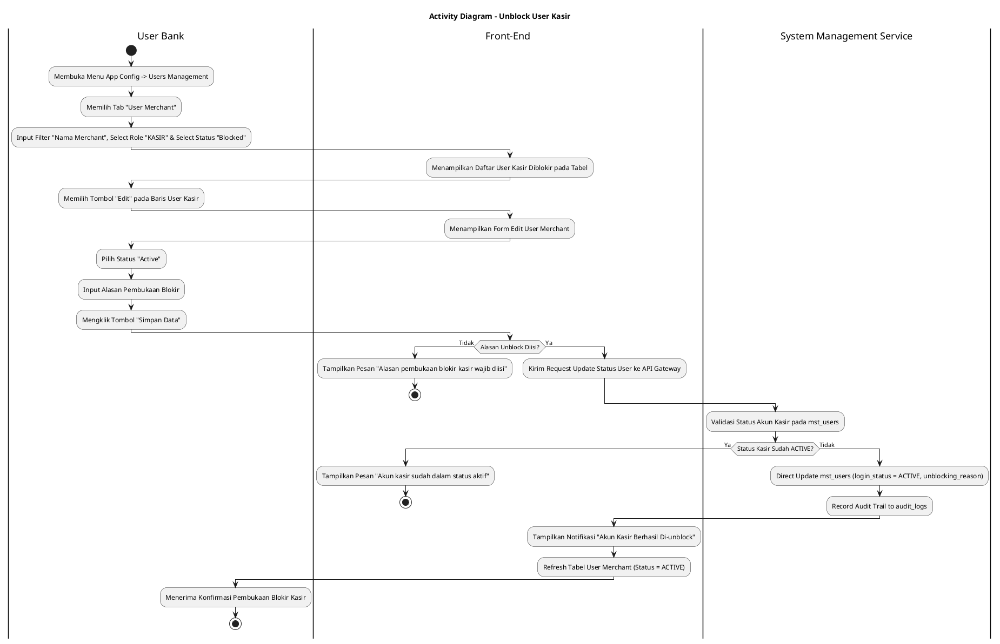
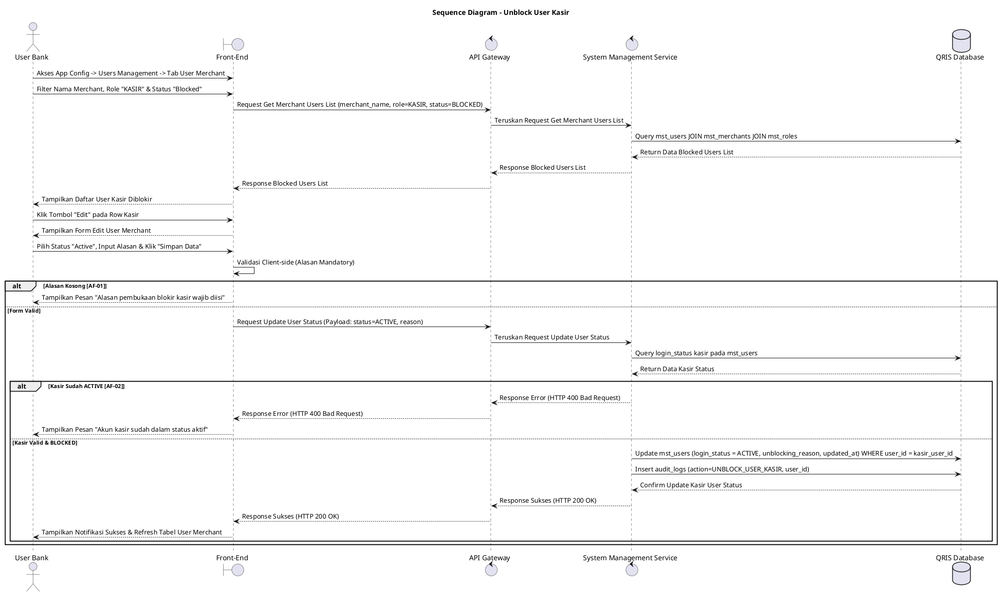

# 1 Deskripsi Use Case

**Tabel 1: Deskripsi Use Case Unblock User Kasir**

| Elemen Spesifikasi | Deskripsi Detail |
| --- | --- |
| ID Use Case | UC-BOH-026 |
| Nama Use Case | Unblock User Kasir |
| Penjelasan Singkat | Fitur Web Back Office Hibank pada menu App Config -> Users Management (Tab User Merchant) yang memfasilitasi User Bank untuk memfilter akun ber-role `KASIR` berstatus `Blocked` dan membuka kembali blokir (*unblock*) akun user kasir pada tabel `mst_users` melalui System Management Service (`system_management_service`), sehingga kasir tersebut dapat melakukan login kembali ke Web POS / Mobile App POS. |
| Aktor Utama | User Bank (Back Office Hibank Compliance / Risk / Operations Staff) |
| Aktor Pendukung | System Management Service (`system_management_service`) |
| Deskripsi Singkat | User Bank melakukan otentikasi login SSO ke Web Back Office Hibank dan mengakses menu **App Config** -> **Users Management**. Sistem menampilkan halaman pengelolaan pengguna dengan beberapa tab. User Bank memilih tab **User Merchant**. Sistem menyajikan toolbar pencarian dan filter data. User Bank memasukkan/memilih kriteria filter berdasarkan **Nama Merchant**, memilih filter Role **`KASIR`**, dan memfilter Status **`Blocked`**. Sistem menampilkan daftar akun pengguna kasir berstatus diblokir dari tabel `mst_users`, `mst_merchants`, dan `mst_roles`. User Bank memilih baris akun user kasir yang akan dibuka blokirnya, lalu mengklik tombol aksi **"Edit"**. Sistem menampilkan modal/halaman formulir pengeditan data pengguna merchant. User Bank mengubah pilihan kolom Status Pengguna dari `Blocked` menjadi **`Active`** dan menginputkan Alasan Pembukaan Blokir (*unblocking reason*). User Bank mengklik tombol **"Simpan Data"**. Front-End memvalidasi kelengkapan data dan mengirimkan request pembukaan blokir ke API Gateway. Service `system_management_service` memvalidasi status akun. Setelah validasi sukses, service memperbarui status akun user kasir pada tabel **`mst_users`** menjadi **`login_status = ACTIVE`** dan mencatat jejak pembukaan blokir ke tabel **`audit_logs`**, sehingga user kasir kembali dapat melakukan otentikasi login ke Web POS / Mobile App POS. Front-End memperbarui tabel daftar user merchant dan menampilkan notifikasi konfirmasi bahwa akun user kasir telah berhasil di-unblock. |
| Pre-condition | 1. User Bank telah berhasil login SSO ke Web Back Office Hibank dan memiliki hak akses menu *App Config - Users Management*. 2. Akun user kasir yang akan dibuka blokirnya terdaftar pada tabel `mst_users` dengan status diblokir (`login_status = BLOCKED`). |
| Post-condition | 1. Kolom `login_status` akun user kasir pada `mst_users` diperbarui secara langsung menjadi `ACTIVE`. 2. User kasir kembali dapat melakukan otentikasi login dan mengakses Web POS / Mobile App POS. 3. Front-End memperbarui tampilan tabel daftar user merchant pada tab User Merchant menu App Config. |
| Trigger | User Bank mengakses menu **App Config** -> **Users Management**, memilih tab **User Merchant**, memfilter **Nama Merchant**, Role **`KASIR`**, dan Status **`Blocked`**, mengklik tombol **"Edit"**, mengubah status menjadi **`Active`**, mengisi alasan unblock, dan mengklik **"Simpan Data"**. |
| Nama Tabel | mst_users, mst_roles, mst_merchants, audit_logs |
| Integrasi | 1. **Web Back Office Hibank UI:** Antarmuka menu App Config - Users Management (Tab User Merchant), filter toolbar, dan form edit user merchant. 2. **System Management Service:** Microservice backend pengelola pembaruan status keaktifan akun merchant di database. |
| Asumsi | 1. Pembukaan blokir akun user kasir mengembalikan akses login kasir ke aplikasi kasir (Web POS / Mobile App POS). 2. Alasan pembukaan blokir dicatat secara eksplisit pada log perubahan untuk kebutuhan *audit trail*. |
| Keterbatasan | 1. Akun user kasir yang sudah berstatus aktif (`login_status = ACTIVE`) tidak dapat di-unblock ulang. 2. Pengisian alasan pembukaan blokir bersifat mandatori dan tidak boleh dikosongkan. |
| Aturan Bisnis/Sistem | 1. **Navigation & Scoping:** Fitur unblock user kasir dikelola terpusat pada menu **App Config** -> sub-menu **Users Management** -> tab **User Merchant**. 2. **Filter & Search Criteria:** Toolbar filter mendukung pencarian berbasis **Nama Merchant** (`merchant_name`), peran **`KASIR`**, dan status **`Blocked`** (`login_status = BLOCKED`). 3. **Edit Form Status Modification:** Pembukaan blokir dilakukan via form Edit User Merchant dengan mengubah field Status dari `Blocked` menjadi `Active` serta menginput field wajib `Unblocking Reason`. 4. **Direct Database Update (`mst_users`):** Sistem memperbarui kolom `login_status = ACTIVE`, `updated_at`, dan `updated_by` pada tabel `mst_users`. 5. **Audit Trail Logging:** Setiap tindakan pembukaan blokir wajib mencatat ID pelaksana, timestamp, ID merchant, dan alasan pembukaan blokir ke tabel `audit_logs`. |
| Session Idle | 15 Menit |

# 2 Main Flow

**Tabel 2: Main Flow Unblock User Kasir**

| No. | Aktivitas | Deskripsi |
| ---: | --- | --- |
| 1 | Akses Menu Users Management | User Bank mengklik menu **App Config** -> sub-menu **Users Management** pada bilah navigasi utama. |
| 2 | Memilih Tab User Merchant | User Bank memilih tab **User Merchant** pada halaman Users Management. |
| 3 | Memfilter Nama Merchant, Role Kasir & Status Blocked | User Bank memasukkan **Nama Merchant**, memilih filter Role **`KASIR`**, dan memilih filter Status **`Blocked`** pada toolbar. |
| 4 | Menampilkan Daftar Kasir Diblokir | Sistem menampilkan daftar akun user kasir berstatus `BLOCKED` yang memenuhi kriteria filter dari `mst_users` dan `mst_merchants`. |
| 5 | Memilih Tombol Edit | User Bank mengklik tombol aksi **"Edit"** pada baris akun user kasir yang ingin dibuka blokirnya. |
| 6 | Menampilkan Form Edit User Merchant | Sistem menampilkan modal/halaman formulir pengeditan data pengguna merchant. |
| 7 | Mengubah Status Menjadi Active & Fill Reason | User Bank mengubah pilihan dropdown Status dari `Blocked` menjadi **`Active`** dan mengisi alasan pembukaan blokir pada field `Alasan Unblock`. |
| 8 | Mengklik Tombol Simpan Data | User Bank mengklik tombol **"Simpan Data"** untuk mengonfirmasi pembukaan blokir. |
| 9 | Memvalidasi Client & Kirim Request | Front-End memvalidasi kelengkapan alasan unblock dan mengirim request API ke API Gateway. |
| 10 | Update Database `mst_users` | Service `system_management_service` memperbarui status pada `mst_users` (`login_status = ACTIVE`) dan mencatat `audit_logs`. |
| 11 | Menampilkan Konfirmasi Berhasil | Front-End memperbarui tabel daftar user merchant dan menampilkan toast notifikasi bahwa akun user kasir telah berhasil di-unblock. |
| 12 | Use Case Selesai | Proses pembukaan blokir akun user kasir dari menu App Config selesai dilaksanakan. |

# 3 Alternative Flow

**Tabel 3: Alternative Flow Unblock User Kasir**

| Kode | Alternative Flow | Deskripsi |
| --- | --- | --- |
| AF-01 | Alasan Pembukaan Blokir Kosong | Pada langkah 8-9, apabila User Bank mengosongkan kolom alasan unblock saat memilih status `Active`, Sistem menolak request dan Front-End menampilkan pesan `Alasan pembukaan blokir kasir wajib diisi`. |
| AF-02 | Akun Kasir Sudah Berstatus Active | Pada langkah 10, apabila akun kasir pada database sudah berstatus `login_status = ACTIVE`, Sistem membatalkan transaksi dan Front-End menampilkan `Akun kasir sudah dalam status aktif`. |
| AF-03 | Gagal Terhubung ke Database Server | Pada langkah 10, apabila koneksi database terputus total, Sistem mengembalikan HTTP status 500 dan Front-End menampilkan `Gagal memperbarui status pembukaan blokir kasir ke database`. |

# 4 Status Front-End

**Tabel 4: Status Front-End Unblock User Kasir**

| No. | Nama Status | Deskripsi Tampilan Front-End |
| ---: | --- | --- |
| 1 | IDLE | Tab User Merchant menyajikan toolbar filter (Nama Merchant, Role, Status) dan tabel daftar pengguna merchant diblokir. |
| 2 | LOADING | Indikator proses (*spinner*) ditampilkan pada tombol Simpan Data saat request pembukaan blokir kasir sedang diproses server. |
| 3 | SUCCESS | Toast konfirmasi menampilkan pesan bahwa akun user kasir telah berhasil di-unblock dan status pada tabel berubah menjadi `ACTIVE`. |
| 4 | ERROR | Pesan kesalahan ditampilkan pada UI akibat alasan kosong, status kasir tidak valid, atau gangguan server. |

# 5 Activity Diagram Unblock User Kasir

# 6 Sequence Diagram Unblock User Kasir

# 7 Response Code

**Tabel 5: Response Code Unblock User Kasir**

| No. | HTTP Status | Response Code | Nama Response | Deskripsi | Respons Front-End |
| ---: | ---: | --- | --- | --- | --- |
| 1 | 200 | 200XX00 | SUCCESS_UNBLOCK_MERCHANT_USER | Status akun user kasir berhasil diubah menjadi `ACTIVE` sehingga dapat login kembali ke Web POS / Mobile App POS. | Menampilkan pesan notifikasi sukses dan memperbarui tabel daftar user merchant. |
| 2 | 400 | 400XX00 | INVALID_UNBLOCK_REASON | Alasan pembukaan blokir kasir yang dimasukkan tidak valid atau kosong. | Menampilkan pesan kesalahan `Alasan pembukaan blokir kasir wajib diisi`. |
| 3 | 400 | 400XX01 | USER_ALREADY_ACTIVE | Akun user kasir yang dipilih sudah dalam kondisi status aktif. | Menampilkan pesan kesalahan `Akun kasir sudah dalam status aktif`. |
| 4 | 404 | 404XX00 | USER_NOT_FOUND | Data akun user kasir tidak ditemukan pada database. | Menampilkan pesan kesalahan `Data akun kasir tidak ditemukan`. |
| 5 | 500 | 500XX00 | SYSTEM_INTERNAL_ERROR | Terjadi kegagalan internal server saat mengeksekusi pembukaan blokir akun kasir. | Menampilkan pesan kesalahan `Terjadi kendala internal pada server`. |

# 8 Desain Antarmuka

**Tabel 6: Desain Antarmuka Unblock User Kasir**

| Halaman | Komponen dan State Utama |
| --- | --- |
| Halaman App Config - Users Management (Tab User Merchant) | 1. **Navigation Header:** `App Config` -> `Users Management`. 2. **Tab Navigation:** Tab `User Merchant` (Active), Tab `User Internal`. 3. **Toolbar Filter:** &nbsp;&nbsp;* Field Search Nama Merchant: Input pencarian nama merchant (`merchant_name`). &nbsp;&nbsp;* Dropdown Filter Role: Pilihan role (`KASIR`, `MERCHANT_OWNER`, dll.). &nbsp;&nbsp;* Dropdown Filter Status: Pilihan status (`Blocked`, `Active`, `All`). 4. **Tabel User Merchant (`mst_users` & `mst_merchants`):** &nbsp;&nbsp;* Kolom: Nama User, Nama Merchant, Email, Role (`KASIR`), Status (`login_status = BLOCKED`), Aksi. &nbsp;&nbsp;* Tombol Aksi: Tombol **"Edit"** (Icon Pensil / Button). |
| Modal / Form Edit User Merchant | 1. **Header Modal:** `Edit User Merchant`. 2. **Info User (Read-Only):** Nama User, Email, Nama Merchant, Role (`KASIR`). 3. **Dropdown Status:** Pilihan `Blocked` dan **`Active`**. 4. **Textarea Alasan Pembukaan Blokir:** Mandatory input saat status di-set `Active`. 5. **Tombol Aksi:** Tombol **"Simpan Data"** (Primary Green/Blue) dan **"Batal"** (Secondary). |
