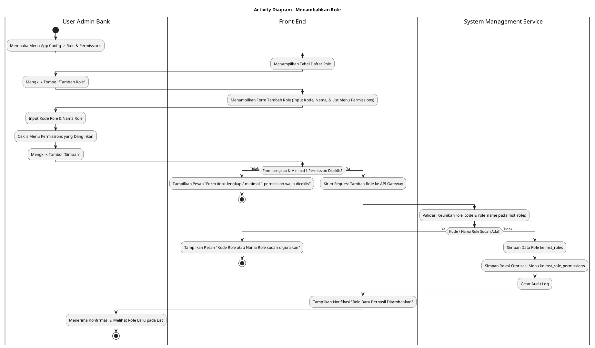
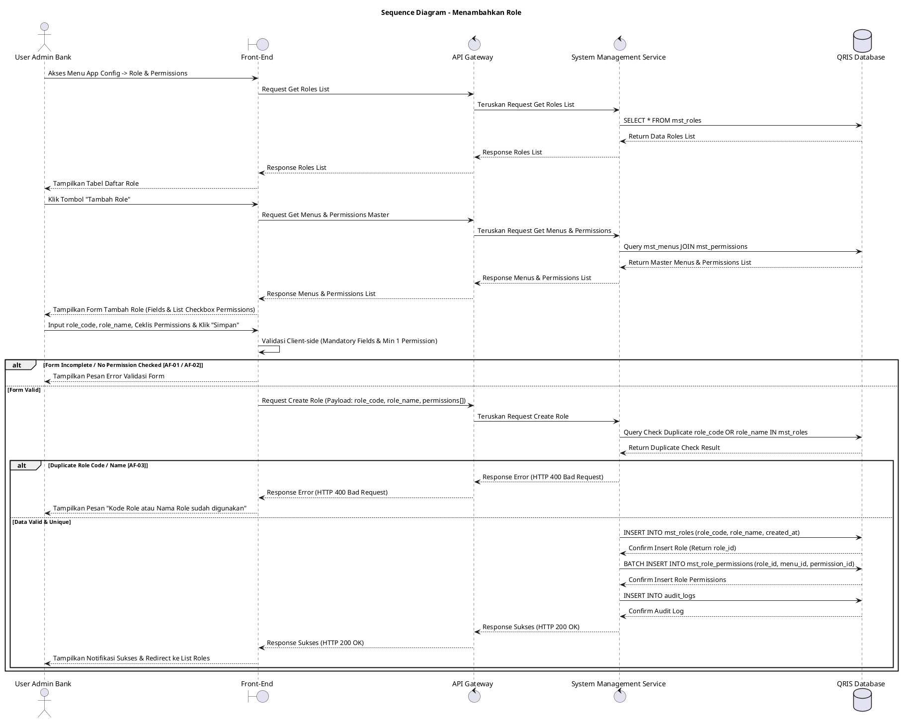

# 1 Deskripsi Use Case

**Tabel 1: Deskripsi Use Case Menambahkan Role**

| Elemen Spesifikasi | Deskripsi Detail |
| --- | --- |
| ID Use Case | UC-BOH-027 |
| Nama Use Case | Menambahkan Role |
| Penjelasan Singkat | Fitur Web Back Office Hibank pada menu App Config -> Role & Permissions yang memfasilitasi User Admin Bank untuk membuat dan mendaftarkan peran baru (*role*) ke dalam tabel `mst_roles`, serta mengonfigurasi hak akses otorisasi izin menu (*menu permissions*) pada tabel `mst_role_permissions` melalui System Management Service (`system_management_service`). |
| Aktor Utama | User Admin Bank (System Administrator / Security Administrator) |
| Aktor Pendukung | System Management Service (`system_management_service`) |
| Deskripsi Singkat | User Admin Bank melakukan otentikasi login SSO ke Web Back Office Hibank dan mengakses menu **App Config** -> **Role & Permissions**. Sistem menampilkan halaman pengelolaan role beserta tabel daftar role terdaftar dari `mst_roles`. User Admin Bank mengklik tombol **"Tambah Role"**. Sistem menampilkan modal/halaman formulir penambahan role baru yang memuat field input Kode Role, Nama Role, dan daftar otorisasi izin menu (*menu permissions*) berbasis *checkbox*. User Admin Bank menginputkan Kode Role (*role_code*) dan Nama Role (*role_name*), lalu memilih dan menceklis *checkbox menu permissions* yang ingin diberikan pada role tersebut. User Admin Bank mengklik tombol **"Simpan"**. Front-End memvalidasi kelengkapan inputan dan memastikan minimal satu *permission* telah diceklis, lalu mengirimkan request pembuatan role ke API Gateway. System Management Service memvalidasi keunikan `role_code` dan `role_name`. Setelah validasi sukses, service menyimpan record role baru ke tabel **`mst_roles`**, menyisipkan daftar pemetaan izin ke tabel **`mst_role_permissions`**, dan mencatat jejak aktivitas ke tabel **`audit_logs`**. Front-End memperbarui tabel daftar role dan menyajikan notifikasi konfirmasi bahwa role baru telah berhasil ditambahkan. |
| Pre-condition | 1. User Admin Bank telah berhasil login SSO ke Web Back Office Hibank dan memiliki kewenangan *Role Management*. 2. Data master menu dan master permissions terdaftar lengkap di database. |
| Post-condition | 1. Record role baru tersimpan aktif pada tabel `mst_roles`. 2. Pemetaan otorisasi izin menu untuk role baru tersimpan lengkap pada tabel `mst_role_permissions`. 3. Role baru yang ditambahkan siap ditetapkan (*assign*) ke pengguna internal bank. 4. Front-End memperbarui tampilan tabel daftar role pada menu App Config -> Role & Permissions. |
| Trigger | User Admin Bank mengakses menu **App Config** -> **Role & Permissions**, mengklik tombol **"Tambah Role"**, mengisi Kode & Nama Role, menceklis *permissions*, dan mengklik **"Simpan"**. |
| Nama Tabel | mst_roles, mst_permissions, mst_menus, mst_role_permissions, audit_logs |
| Integrasi | 1. **Web Back Office Hibank UI:** Antarmuka menu App Config -> Role & Permissions dan form penambahan role baru. 2. **System Management Service:** Microservice backend pengelola pendaftaran role dan manajemen otorisasi otentikasi pengguna. |
| Asumsi | 1. Kode Role (`role_code`) bersifat unik, menggunakan format huruf kapital dan garis bawah (*UPPERCASE_SNAKE_CASE*). 2. Setiap pembuatan role baru wajib memiliki minimal satu *menu permission* yang diberikan. |
| Keterbatasan | 1. Kode Role yang telah disimpan tidak dapat diubah kembali (*read-only* saat pengeditan). 2. Pengisian Kode Role dan Nama Role bersifat mandatori. |
| Aturan Bisnis/Sistem | 1. **Navigation & Scoping:** Fitur pengelolaan role dikelola terpusat pada menu **App Config** -> sub-menu **Role & Permissions**. 2. **Uniqueness Validation:** System Management Service WAJIB memvalidasi bahwa `role_code` dan `role_name` belum pernah terdaftar sebelumnya pada `mst_roles`. 3. **Mandatory Permission Selection:** Pendaftaran role baru mewajibkan penentuan minimal satu pasang `menu_id` dan `permission_id`. 4. **Atomic Transaction Insert:** Penyimpanan ke `mst_roles` dan `mst_role_permissions` dilakukan secara *database transaction* terisolasi. 5. **Audit Trail Logging:** Setiap tindakan penambahan role wajib mencatat `user_id` pembuat, timestamp, dan payload role ke tabel `audit_logs`. |
| Session Idle | 15 Menit |

# 2 Main Flow

**Tabel 2: Main Flow Menambahkan Role**

| No. | Aktivitas | Deskripsi |
| ---: | --- | --- |
| 1 | Akses Menu Role & Permissions | User Admin Bank mengklik menu **App Config** -> sub-menu **Role & Permissions** pada bilah navigasi utama. |
| 2 | Menampilkan Daftar Role | Sistem menampilkan tabel daftar role terdaftar dari tabel `mst_roles` beserta tombol aksi **"Tambah Role"**. |
| 3 | Memilih Tombol Tambah Role | User Admin Bank mengklik tombol **"Tambah Role"** pada halaman utama Role & Permissions. |
| 4 | Menampilkan Form Tambah Role | Sistem menampilkan modal/halaman formulir penambahan role baru yang memuat field input dan daftar *checkbox menu permissions*. |
| 5 | Mengisi Kode & Nama Role | User Admin Bank menginputkan Kode Role (`role_code`) dan Nama Role (`role_name`). |
| 6 | Menceklis Menu Permissions | User Admin Bank memilih dan menceklis *checkbox* otorisasi izin menu (*menu permissions*) yang diinginkan. |
| 7 | Mengklik Tombol Simpan | User Admin Bank mengklik tombol **"Simpan"** untuk memproses pembuatan role baru. |
| 8 | Memvalidasi Form Client-side | Front-End memvalidasi kelengkapan inputan dan ketersediaan minimal satu *permission* yang diceklis, lalu mengirim request ke API Gateway. |
| 9 | Memvalidasi Keunikan & Menyimpan Data | System Management Service memvalidasi keunikan `role_code` dan `role_name`, menyimpan record baru ke `mst_roles`, serta menyisipkan relasi ke `mst_role_permissions`. |
| 10 | Menampilkan Konfirmasi Berhasil | Front-End memperbarui tabel daftar role dan menampilkan notifikasi bahwa role baru telah berhasil ditambahkan. |
| 11 | Use Case Selesai | Proses penambahan role baru dari menu App Config selesai dilaksanakan. |

# 3 Alternative Flow

**Tabel 3: Alternative Flow Menambahkan Role**

| Kode | Alternative Flow | Deskripsi |
| --- | --- | --- |
| AF-01 | Kode atau Nama Role Kosong / Tidak Valid | Pada langkah 7-8, apabila Kode Role atau Nama Role dikosongkan, Sistem menolak request dan Front-End menampilkan `Kode Role dan Nama Role wajib diisi`. |
| AF-02 | Menu Permission Belum Diceklis | Pada langkah 7-8, apabila User Admin Bank belum menceklis satu pun *menu permission*, Sistem menolak request dan Front-End menampilkan `Pilih minimal satu menu permission untuk role baru`. |
| AF-03 | Kode atau Nama Role Sudah Terdaftar | Pada langkah 9, apabila `role_code` atau `role_name` sudah ada pada `mst_roles`, Sistem membatalkan transaksi dan Front-End menampilkan `Kode Role atau Nama Role sudah digunakan`. |
| AF-04 | Gagal Terhubung ke Database Server | Pada langkah 9, apabila koneksi database terputus total, Sistem mengembalikan HTTP status 500 dan Front-End menampilkan `Terjadi kendala internal pada server`. |

# 4 Status Front-End

**Tabel 4: Status Front-End Menambahkan Role**

| No. | Nama Status | Deskripsi Tampilan Front-End |
| ---: | --- | --- |
| 1 | IDLE | Formulir penambahan role siap menerima masukan Kode Role, Nama Role, dan pilihan *checkbox menu permissions*. |
| 2 | LOADING | Indikator proses (*spinner*) ditampilkan pada tombol Simpan saat request pembuatan role sedang diproses server. |
| 3 | SUCCESS | Toast/banner konfirmasi menampilkan pesan bahwa role baru berhasil disimpan dan formulir dialihkan kembali ke daftar role. |
| 4 | ERROR | Pesan kesalahan ditampilkan pada UI akibat kolom mandatory kosong, duplikasi role, atau *permission* belum dipilih. |

# 5 Activity Diagram Menambahkan Role

# 6 Sequence Diagram Menambahkan Role

# 7 Response Code

**Tabel 5: Response Code Menambahkan Role**

| No. | HTTP Status | Response Code | Nama Response | Deskripsi | Respons Front-End |
| ---: | ---: | --- | --- | --- | --- |
| 1 | 200 | 200XX00 | SUCCESS_CREATE_ROLE | Data role baru dan pemetaan *menu permissions* berhasil disimpan. | Menampilkan pesan notifikasi sukses dan mengarahkan ke halaman daftar role. |
| 2 | 400 | 400XX00 | INVALID_ROLE_INPUT | Kode Role, Nama Role kosong, atau tidak ada *permission* yang diceklis. | Menampilkan pesan kesalahan validasi input. |
| 3 | 400 | 400XX01 | DUPLICATE_ROLE_CODE_OR_NAME | Kode Role atau Nama Role yang diinput sudah digunakan pada sistem. | Menampilkan pesan kesalahan `Kode Role atau Nama Role sudah digunakan`. |
| 4 | 404 | 404XX00 | MENU_PERMISSION_NOT_FOUND | Salah satu ID menu atau permission yang dipilih tidak ditemukan di database. | Menampilkan pesan kesalahan `Master data menu/permission tidak valid`. |
| 5 | 500 | 500XX00 | SYSTEM_INTERNAL_ERROR | Terjadi kegagalan internal server saat mengeksekusi penambahan role. | Menampilkan pesan kesalahan `Terjadi kendala internal pada server`. |

# 8 Desain Antarmuka

**Tabel 6: Desain Antarmuka Menambahkan Role**

| Halaman | Komponen dan State Utama |
| --- | --- |
| Halaman App Config - Role & Permissions | 1. **Navigation Header:** `App Config` -> `Role & Permissions`. 2. **Tabel Daftar Role (`mst_roles`):** Kolom Kode Role, Nama Role, Jumlah Permission, dan Aksi. 3. **Tombol "Tambah Role":** Tombol pemicu pembukaan form penambahan role baru (Primary Button). |
| Form Tambah Role | 1. **Field Kode Role (`role_code`):** Text Input (Mandatory). 2. **Field Nama Role (`role_name`):** Text Input (Mandatory). 3. **Daftar Menu Permissions:** List hirarki menu dilengkapi *checkbox* otorisasi (`View`, `Create`, `Edit`, `Delete`, `Approve`). 4. **Tombol Aksi:** Tombol **"Simpan"** (Primary) dan **"Batal"** (Secondary). |
