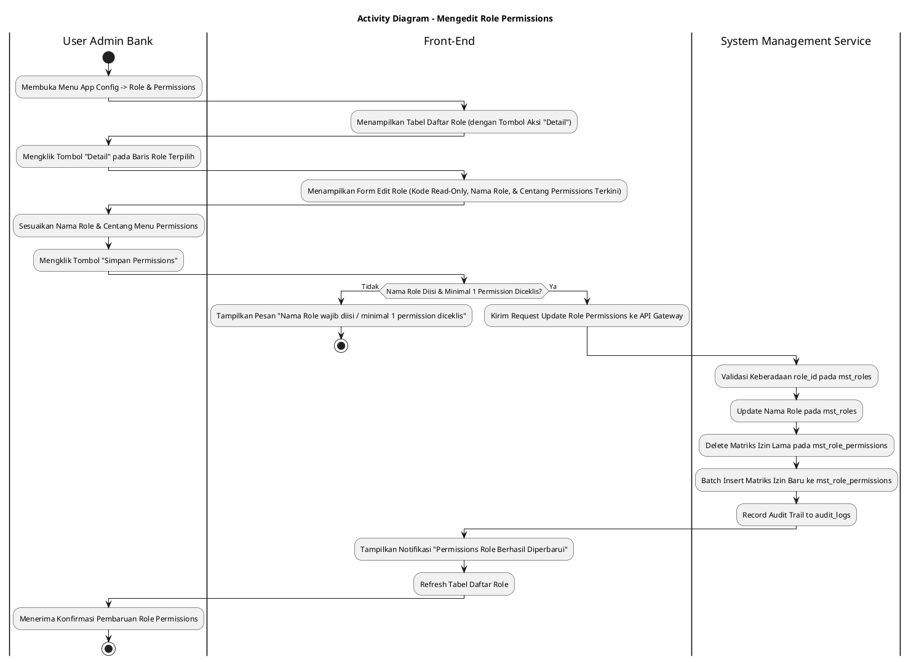
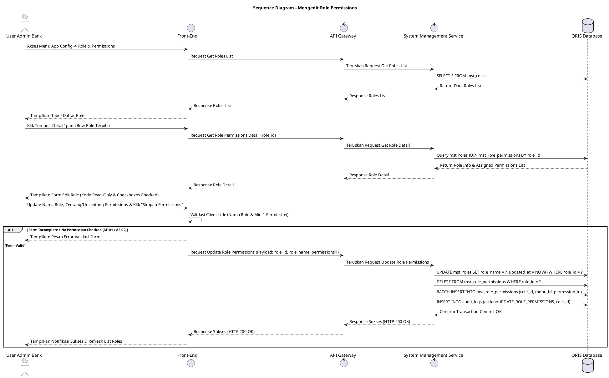

# 1 Deskripsi Use Case

**Tabel 1: Deskripsi Use Case Mengedit Role Permissions**

| Elemen Spesifikasi | Deskripsi Detail |
| --- | --- |
| ID Use Case | UC-BOH-028 |
| Nama Use Case | Mengedit Role Permissions |
| Penjelasan Singkat | Fitur Web Back Office Hibank pada menu App Config -> Role & Permissions yang memfasilitasi User Admin Bank untuk meninjau detail role melalui tombol **"Detail"**, mengubah Nama Role dan pemetaan otorisasi izin menu (*menu permissions*), serta menyimpan pembaruan hak akses melalui tombol **"Simpan Permissions"** pada tabel `mst_roles` dan `mst_role_permissions` via System Management Service (`system_management_service`). |
| Aktor Utama | User Admin Bank (System Administrator / Security Administrator) |
| Aktor Pendukung | System Management Service (`system_management_service`) |
| Deskripsi Singkat | User Admin Bank melakukan otentikasi login SSO ke Web Back Office Hibank dan mengakses menu **App Config** -> **Role & Permissions**. Sistem menampilkan halaman pengelolaan role beserta tabel daftar role terdaftar dari `mst_roles`. User Admin Bank memilih salah satu baris role yang ingin dikonfigurasi, lalu mengklik tombol aksi **"Detail"**. Sistem menampilkan halaman/modal rincian pengeditan role yang memuat Kode Role (*read-only*), Nama Role (*editable*), dan daftar otorisasi izin menu (*menu permissions*) berbasis *checkbox* yang sudah tercekiklis sesuai hak akses saat ini. User Admin Bank memperbarui Nama Role (jika diperlukan), menambah atau mengosongkan centang *checkbox menu permissions*, lalu mengklik tombol **"Simpan Permissions"**. Front-End memvalidasi kelengkapan data dan memastikan minimal satu *permission* tetap diceklis, lalu mengirimkan request pembaruan izin ke API Gateway. System Management Service memvalidasi keaslian `role_id`. Setelah validasi sukses, service memperbarui Nama Role pada tabel **`mst_roles`**, me-replace matriks izin lama dengan matriks izin baru pada tabel **`mst_role_permissions`**, dan mencatat jejak perubahan ke tabel **`audit_logs`**. Front-End memperbarui tampilan tabel daftar role dan menyajikan notifikasi konfirmasi bahwa hak akses role berhasil diperbarui. |
| Pre-condition | 1. User Admin Bank telah berhasil login SSO ke Web Back Office Hibank dan memiliki kewenangan *Role Management*. 2. Data role yang akan dikonfigurasi terdaftar aktif pada tabel `mst_roles`. |
| Post-condition | 1. Perubahan Nama Role dan matriks pemetaan izin menu terbaru berhasil disimpan pada `mst_roles` dan `mst_role_permissions`. 2. Seluruh pengguna internal bank yang memegang role tersebut secara *real-time* memperoleh pembaruan otorisasi hak akses menu. 3. Jejak aktivitas pembaruan izin tercatat pada `audit_logs`. 4. Front-End memperbarui tampilan tabel daftar role pada menu App Config -> Role & Permissions. |
| Trigger | User Admin Bank mengakses menu **App Config** -> **Role & Permissions**, mengklik tombol **"Detail"** pada baris role terpilih, menyesuaikan centang *permissions*, dan mengklik **"Simpan Permissions"**. |
| Nama Tabel | mst_roles, mst_permissions, mst_menus, mst_role_permissions, audit_logs |
| Integrasi | 1. **Web Back Office Hibank UI:** Antarmuka menu App Config -> Role & Permissions, tombol "Detail", dan form konfigurasi "Simpan Permissions". 2. **System Management Service:** Microservice backend pengelola otorisasi dan pembaruan hak akses peran pengguna. |
| Asumsi | 1. Kode Role (`role_code`) bersifat terkunci (*read-only*) dan tidak dapat diubah setelah role dibuat. 2. Perubahan *permissions* berdampak langsung (*real-time*) terhadap hak akses seluruh pengguna ber-role tersebut. |
| Keterbatasan | 1. Pengurangan *permission* menu utama akan secara otomatis mencabut akses sub-menu di bawahnya. 2. Pengeditan role mewajibkan minimal satu *permission* tetap berada dalam kondisi diceklis. |
| Aturan Bisnis/Sistem | 1. **Navigation & Scoping:** Fitur pengeditan role permissions dikelola terpusat pada menu **App Config** -> sub-menu **Role & Permissions**. 2. **Detail Action Trigger:** Pengeditan diawali dengan mengklik tombol aksi **"Detail"** pada baris role target. 3. **Locked Role Code:** Field `role_code` disajikan berstatus terkunci (*read-only/disabled*) untuk menjaga integritas acuan otorisasi sistem. 4. **Save Permissions Action:** Pemrosesan simpan executed saat tombol **"Simpan Permissions"** diklik. 5. **Transactional Permission Replacement:** Service `system_management_service` menghapus matriks izin lama pada `mst_role_permissions` untuk `role_id` terpilih, lalu meng-insert batch matriks izin baru secara atomic. 6. **Audit Trail Logging:** Setiap pembaruan izin wajib mencatat `role_id`, `updated_by`, timestamp, dan daftar `permission_id` baru ke tabel `audit_logs`. |
| Session Idle | 15 Menit |

# 2 Main Flow

**Tabel 2: Main Flow Mengedit Role Permissions**

| No. | Aktivitas | Deskripsi |
| ---: | --- | --- |
| 1 | Akses Menu Role & Permissions | User Admin Bank mengklik menu **App Config** -> sub-menu **Role & Permissions** pada bilah navigasi utama. |
| 2 | Menampilkan Daftar Role | Sistem menampilkan tabel daftar role terdaftar dari tabel `mst_roles` beserta tombol aksi **"Detail"** per baris role. |
| 3 | Memilih Tombol Detail | User Admin Bank mengklik tombol **"Detail"** pada baris role yang ingin dikonfigurasi hak aksesnya. |
| 4 | Menampilkan Form Edit Role Permissions | Sistem menampilkan halaman/modal rincian role yang memuat Kode Role (*read-only*), Nama Role, dan daftar *checkbox menu permissions* terpilih. |
| 5 | Menyesuaikan Nama & Checkbox Permissions | User Admin Bank memperbarui Nama Role (jika perlu) dan menyesuaikan centang *checkbox menu permissions*. |
| 6 | Mengklik Tombol Simpan Permissions | User Admin Bank mengklik tombol **"Simpan Permissions"** untuk memproses pembaruan hak akses. |
| 7 | Memvalidasi Form Client-side | Front-End memvalidasi kelengkapan data dan ketersediaan minimal satu *permission* yang diceklis, lalu mengirim request ke API Gateway. |
| 8 | Updating Database `mst_roles` & `mst_role_permissions` | System Management Service memperbarui Nama Role di `mst_roles`, mereplace matriks izin pada `mst_role_permissions`, dan mencatat `audit_logs`. |
| 9 | Menampilkan Konfirmasi Berhasil | Front-End memperbarui tabel daftar role dan menyajikan notifikasi bahwa permissions role telah berhasil diperbarui. |
| 10 | Use Case Selesai | Proses pengeditan role permissions dari menu App Config selesai dilaksanakan. |

# 3 Alternative Flow

**Tabel 3: Alternative Flow Mengedit Role Permissions**

| Kode | Alternative Flow | Deskripsi |
| --- | --- | --- |
| AF-01 | Nama Role Kosong / Invalid | Pada langkah 6-7, apabila Nama Role dikosongkan, Sistem menolak request dan Front-End menampilkan `Nama Role wajib diisi`. |
| AF-02 | Seluruh Menu Permission Dikosongkan | Pada langkah 6-7, apabila User Admin Bank mengosongkan seluruh centang *permission*, Sistem menolak request dan Front-End menampilkan `Minimal satu menu permission wajib diceklis`. |
| AF-03 | Gagal Terhubung ke Database Server | Pada langkah 8, apabila koneksi database terputus total, Sistem mengembalikan HTTP status 500 dan Front-End menampilkan `Terjadi kendala internal pada server`. |

# 4 Status Front-End

**Tabel 4: Status Front-End Mengedit Role Permissions**

| No. | Nama Status | Deskripsi Tampilan Front-End |
| ---: | --- | --- |
| 1 | IDLE | Formulir edit role permissions menampilkan Kode Role (disabled), Nama Role, dan *checkbox permissions* terisi sesuai state saat ini. |
| 2 | LOADING | Indikator proses (*spinner*) ditampilkan pada tombol Simpan Permissions saat request pembaruan sedang diproses server. |
| 3 | SUCCESS | Toast konfirmasi menampilkan pesan bahwa permissions role berhasil diperbarui dan daftar role ter-refresh. |
| 4 | ERROR | Pesan kesalahan ditampilkan pada UI akibat nama role kosong, seluruh permission dicabut, atau gangguan server. |

# 5 Activity Diagram Mengedit Role Permissions

# 6 Sequence Diagram Mengedit Role Permissions

# 7 Response Code

**Tabel 5: Response Code Mengedit Role Permissions**

| No. | HTTP Status | Response Code | Nama Response | Deskripsi | Respons Front-End |
| ---: | ---: | --- | --- | --- | --- |
| 1 | 200 | 200XX00 | SUCCESS_UPDATE_ROLE_PERMISSIONS | Hak akses *menu permissions* role berhasil diperbarui. | Menampilkan pesan notifikasi sukses dan memperbarui tabel daftar role. |
| 2 | 400 | 400XX00 | INVALID_ROLE_INPUT | Nama Role kosong atau tidak ada *permission* yang diceklis. | Menampilkan pesan kesalahan validasi input. |
| 3 | 404 | 404XX00 | ROLE_NOT_FOUND | Data `role_id` yang akan diedit tidak ditemukan di database. | Menampilkan pesan kesalahan `Data role tidak ditemukan`. |
| 4 | 500 | 500XX00 | SYSTEM_INTERNAL_ERROR | Terjadi kegagalan internal server saat mengeksekusi pengeditan role. | Menampilkan pesan kesalahan `Terjadi kendala internal pada server`. |

# 8 Desain Antarmuka

**Tabel 6: Desain Antarmuka Mengedit Role Permissions**

| Halaman | Komponen dan State Utama |
| --- | --- |
| Halaman App Config - Role & Permissions | 1. **Navigation Header:** `App Config` -> `Role & Permissions`. 2. **Tabel Daftar Role (`mst_roles`):** Kolom Kode Role, Nama Role, Jumlah Permission, dan Aksi. 3. **Tombol Aksi "Detail":** Tombol pemicu pengeditan pada baris role target (Button / Icon). |
| Form Edit Role Permissions | 1. **Field Kode Role (`role_code`):** Text Input (Disabled / Read-Only). 2. **Field Nama Role (`role_name`):** Text Input (Editable). 3. **Daftar Menu Permissions:** List hirarki menu dengan *checkbox permissions* tercentang sesuai state saat ini. 4. **Tombol Aksi:** Tombol **"Simpan Permissions"** (Primary) dan **"Batal"** (Secondary). |
