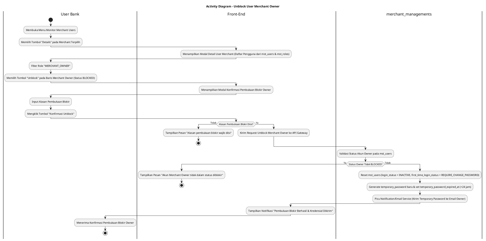
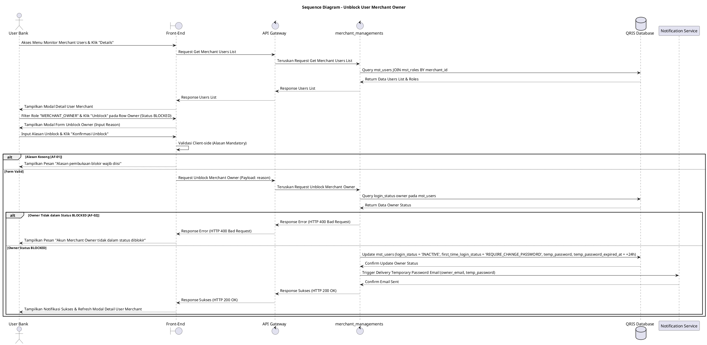

# 1 Deskripsi Use Case

**Tabel 1: Deskripsi Use Case Unblock User Merchant Owner**

| Elemen Spesifikasi | Deskripsi Detail |
| --- | --- |
| ID Use Case | UC-BOH-028 |
| Nama Use Case | Unblock User Merchant Owner |
| Penjelasan Singkat | Fitur Web Back Office Hibank yang memfasilitasi User Bank untuk membuka blokir (*unblock*) akun Merchant Owner pada tabel `mst_users`. Pembukaan blokir ini secara otomatis mengembalikan mekanisme First Time Login (`login_status = 'INACTIVE'`, `first_time_login_status = 'REQUIRE_CHANGE_PASSWORD'`, dan generasi `temporary_password` baru) sehingga Merchant Owner wajib melakukan aktivasi akun ulang. |
| Aktor Utama | User Bank (Back Office Hibank Compliance / Risk / Operations Approver) |
| Aktor Pendukung | merchant_managements (Merchant Management Service), Notification/Email Service |
| Deskripsi Singkat | User Bank melakukan otentikasi login SSO ke Web Back Office Hibank dan mengakses menu **Merchant Management** -> **Monitor Merchant Users**. Sistem menampilkan daftar merchant terdaftar. User Bank memilih salah satu merchant dan mengklik tombol **"Details"**. Sistem menampilkan modal rincian daftar pengguna merchant dari tabel `mst_users` dan `mst_roles`. User Bank memfilter role **`MERCHANT_OWNER`** dan memilih akun yang berstatus diblokir (`login_status = 'BLOCKED'`), lalu mengklik tombol aksi **"Unblock"**. Sistem menampilkan modal konfirmasi unblock yang meminta pengisian alasan pembukaan blokir (*unblocking reason*). User Bank menginput alasan dan mengklik tombol **"Konfirmasi Unblock"**. Service `merchant_managements` memvalidasi status akun, me-reset status keaktifan di `mst_users` menjadi `login_status = 'INACTIVE'`, me-reset `first_time_login_status = 'REQUIRE_CHANGE_PASSWORD'`, membuang password lama, men-generate password sementara (*temporary password*) baru beserta `temporary_password_expired_at`, serta memicu Notification/Email Service untuk mengirimkan kredensial sementara ke email Merchant Owner. Front-End memperbarui modal rincian user dan menampilkan notifikasi bahwa akun Merchant Owner telah berhasil di-unblock. |
| Pre-condition | 1. User Bank telah berhasil login SSO ke Web Back Office Hibank dan memiliki otoritas kewenangan *Merchant Compliance/Risk Officer*. 2. Akun Merchant Owner yang akan dibuka blokirnya terdaftar pada tabel `mst_users` dengan status diblokir (`login_status = 'BLOCKED'`). |
| Post-condition | 1. Kolom `login_status` akun Merchant Owner pada `mst_users` diperbarui menjadi `INACTIVE`. 2. Kolom `first_time_login_status` diperbarui menjadi `REQUIRE_CHANGE_PASSWORD`. 3. Kredensial password sementara baru di-generate, disimpan ke `mst_users` (`temporary_password_expired_at` diisi 24 jam), dan dikirimkan ke email Merchant Owner. 4. Merchant Owner wajib melalui mekanisme *First Time Login* untuk membuat password baru dan mengaktifkan akunnya kembali. |
| Trigger | User Bank mengklik tombol **"Details"** pada merchant terpilih, memfilter role `MERCHANT_OWNER`, mengklik tombol **"Unblock"**, mengisi alasan pembukaan blokir, dan mengklik **"Konfirmasi Unblock"**. |
| Nama Tabel | mst_users, mst_roles, audit_logs |
| Integrasi | 1. **Web Back Office Hibank UI:** Antarmuka daftar merchant, modal rincian pengguna merchant, dan dialog pembukaan blokir akun Merchant Owner. 2. **merchant_managements:** Microservice backend pengelola pembaruan status akun merchant. 3. **Notification/Email Service:** Layanan pengiriman email kredensial password sementara ke email Merchant Owner. |
| Asumsi | 1. Pembukaan blokir akun Merchant Owner mewajibkan perulangan alur First Time Login demi keamanan akun. 2. Alasan pembukaan blokir dicatat secara eksplisit untuk kebutuhan jejak audit (*audit trail*). |
| Keterbatasan | 1. Akun Merchant Owner yang berstatus aktif (`login_status = 'ACTIVE'`) atau belum diblokir tidak dapat di-unblock. 2. Pengisian alasan pembukaan blokir bersifat mandatori dan tidak boleh dikosongkan. |
| Aturan Bisnis/Sistem | 1. **Role Filtering Standard:** User Bank dapat melihat dan memilih akun ber-role `MERCHANT_OWNER` dari relasi tabel `mst_roles`. 2. **Unblock & First Time Login Re-trigger Standard:** Saat tindakan unblock diproses, service `merchant_managements` WAJIB me-reset `login_status = 'INACTIVE'`, me-reset `first_time_login_status = 'REQUIRE_CHANGE_PASSWORD'`, mengosongkan `password_hash` lama, men-generate password sementara baru (`temporary_password_expired_at = CURRENT_TIMESTAMP + 24 jam`), dan mengosongkan `password_expired_at`. 3. **Temporary Credential Notification:** Password sementara baru WAJIB dikirimkan ke email terdaftar Merchant Owner via Notification/Email Service. 4. **Mandatory Unblocking Reason:** Pengisian kolom alasan pembukaan blokir (*unblocking_reason*) bersifat WAJIB sebelum eksekusi diproses. 5. **Audit Trail Standard:** Setiap tindakan pembukaan blokir mencatat `owner_user_id`, `unblocked_by` (ID User Bank), alasan pembukaan blokir, dan timestamp pada `audit_logs` / `mst_users`. |
| Session Idle | 15 Menit |

# 2 Main Flow

**Tabel 2: Main Flow Unblock User Merchant Owner**

| No. | Aktivitas | Deskripsi |
| ---: | --- | --- |
| 1 | Membuka Menu Monitor Merchant Users | User Bank melakukan login SSO dan mengklik menu **Merchant Management** -> **Monitor Merchant Users**. |
| 2 | Menampilkan Daftar Merchant | Sistem menampilkan tabel daftar merchant dari database beserta tombol aksi **"Details"** per baris merchant. |
| 3 | Memilih Tombol Details | User Bank mengklik tombol **"Details"** pada salah satu baris merchant terpilih. |
| 4 | Menampilkan Detail User Merchant | Sistem menampilkan modal rincian daftar pengguna yang terdaftar di bawah merchant tersebut dari `mst_users` dan `mst_roles`. |
| 5 | Memfilter Role Merchant Owner | User Bank memfilter atau memilih akun pengguna ber-role **`MERCHANT_OWNER`**. |
| 6 | Memilih Tombol Unblock Owner | User Bank mengklik tombol aksi **"Unblock"** pada baris akun Merchant Owner yang berstatus `BLOCKED`. |
| 7 | Menampilkan Modal Unblock | Sistem menampilkan modal konfirmasi pembukaan blokir yang memuat rincian nama owner, email owner, dan textarea alasan pembukaan blokir. |
| 8 | Mengisi Alasan & Konfirmasi | User Bank menginput alasan pembukaan blokir pada kolom textarea dan mengklik tombol **"Konfirmasi Unblock"**. |
| 9 | Memvalidasi Request Unblock | Front-End memvalidasi ketersediaan alasan dan mengirim request unblock ke API Gateway. |
| 10 | Reset Status & Re-trigger First Time Login | Service `merchant_managements` memperbarui `mst_users` (`login_status = 'INACTIVE'`, `first_time_login_status = 'REQUIRE_CHANGE_PASSWORD'`, generate `temporary_password` baru, set `temporary_password_expired_at = +24 jam`, dan hapus `password_hash` lama). |
| 11 | Pengiriman Temporary Credential | Service `merchant_managements` memicu Notification/Email Service untuk mengirimkan password sementara baru ke email Merchant Owner. |
| 12 | Menampilkan Konfirmasi Berhasil | Front-End memperbarui modal rincian user dan menampilkan notifikasi bahwa akun Merchant Owner telah berhasil di-unblock dan kredensial sementara baru telah dikirimkan. |
| 13 | Use Case Selesai | Proses pembukaan blokir akun Merchant Owner selesai dilaksanakan. |

# 3 Alternative Flow

**Tabel 3: Alternative Flow Unblock User Merchant Owner**

| Kode | Alternative Flow | Deskripsi |
| --- | --- | --- |
| AF-01 | Alasan Pembukaan Blokir Kosong | Pada langkah 8-9, apabila User Bank mengosongkan kolom alasan pembukaan blokir, Sistem menolak request dan Front-End menampilkan `Alasan pembukaan blokir wajib diisi`. |
| AF-02 | Merchant Owner Tidak dalam Status Blocked | Pada langkah 10, apabila akun Merchant Owner pada database tidak berstatus `login_status = 'BLOCKED'`, Sistem membatalkan transaksi dan Front-End menampilkan `Akun Merchant Owner tidak dalam status diblokir`. |
| AF-03 | Gagal Mengirim Email Kredensial | Pada langkah 11, apabila Notification/Email Service mengalami kendala pengiriman, Sistem membatalkan/rollback transaksi dan Front-End menampilkan `Gagal mengirimkan kredensial sementara ke email Merchant Owner`. |
| AF-04 | Gagal Terhubung ke Database Server | Pada langkah 10, apabila koneksi database terputus total, Sistem mengembalikan HTTP status 500 dan Front-End menampilkan `Terjadi kendala internal pada server`. |

# 4 Status Front-End

**Tabel 4: Status Front-End Unblock User Merchant Owner**

| No. | Nama Status | Deskripsi Tampilan Front-End |
| ---: | --- | --- |
| 1 | IDLE | Modal rincian user merchant menyajikan daftar akun dan modal unblock siap menerima masukan alasan. |
| 2 | LOADING | Indikator proses (*spinner*) ditampilkan pada tombol konfirmasi saat request pembukaan blokir sedang diproses server. |
| 3 | SUCCESS | Modal/toast konfirmasi menampilkan pesan bahwa pembukaan blokir sukses dan kredensial sementara telah dikirim ke email owner. |
| 4 | ERROR | Pesan kesalahan ditampilkan pada UI akibat alasan kosong, status akun tidak valid, atau gangguan pengiriman email/server. |

# 5 Activity Diagram Unblock User Merchant Owner

# 6 Sequence Diagram Unblock User Merchant Owner

# 7 Response Code

**Tabel 5: Response Code Unblock User Merchant Owner**

| No. | HTTP Status | Response Code | Nama Response | Deskripsi | Respons Front-End |
| ---: | ---: | --- | --- | --- | --- |
| 1 | 200 | 200XX00 | SUCCESS_UNBLOCK_MERCHANT_OWNER | Pembukaan blokir akun Merchant Owner berhasil dan mekanisme First Time Login diaktifkan kembali. | Menampilkan pesan notifikasi sukses dan memperbarui status akun pada modal. |
| 2 | 400 | 400XX00 | INVALID_UNBLOCKING_REASON | Alasan pembukaan blokir yang dimasukkan tidak valid atau kosong. | Menampilkan pesan kesalahan `Alasan pembukaan blokir wajib diisi`. |
| 3 | 400 | 400XX01 | OWNER_NOT_BLOCKED | Akun Merchant Owner yang dipilih tidak dalam kondisi status diblokir. | Menampilkan pesan kesalahan `Akun Merchant Owner tidak dalam status diblokir`. |
| 4 | 404 | 404XX00 | USER_NOT_FOUND | Data akun Merchant Owner tidak ditemukan pada database. | Menampilkan pesan kesalahan `Data akun pengguna tidak ditemukan`. |
| 5 | 500 | 500XX00 | SYSTEM_INTERNAL_ERROR | Terjadi kegagalan internal server saat mengeksekusi pembukaan blokir akun Merchant Owner. | Menampilkan pesan kesalahan `Terjadi kendala internal pada server`. |

# 8 Desain Antarmuka

**Tabel 6: Desain Antarmuka Unblock User Merchant Owner**

| Halaman | Komponen dan State Utama |
| --- | --- |
| Modal Details User Merchant | 1. **Dropdown Filter Role:** Filter pilihan role (`MERCHANT_OWNER`, `KASIR`, dll.). 2. **Tabel Users (`mst_users` & `mst_roles`):** Kolom Nama User, Email, Role (`MERCHANT_OWNER`), Status (`login_status = 'BLOCKED'`), dan Aksi. 3. **Tombol "Unblock":** Tombol pemicu pembukaan blokir pada baris akun Merchant Owner yang diblokir (Warna Hijau/Biru). |
| Modal Konfirmasi Unblock Owner | 1. **Header Informasi:** Judul konfirmasi pembukaan blokir akun Merchant Owner. 2. **Info User:** Menampilkan Nama Owner, Email, dan Role (`MERCHANT_OWNER`). 3. **Textarea Alasan Pembukaan Blokir:** Input wajib alasan pembukaan blokir. 4. **Tombol Aksi:** Tombol **"Konfirmasi Unblock"** (Primary) dan **"Batal"** (Secondary). |
