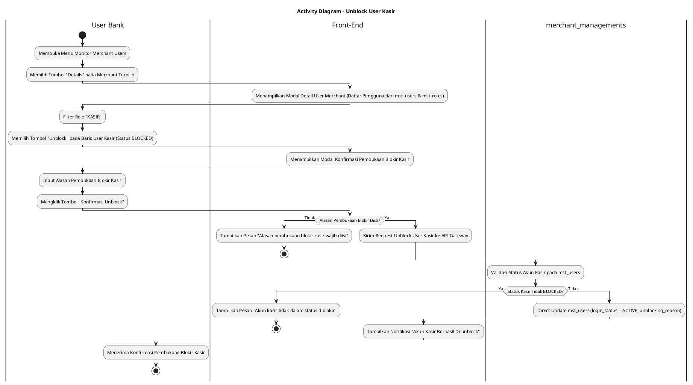
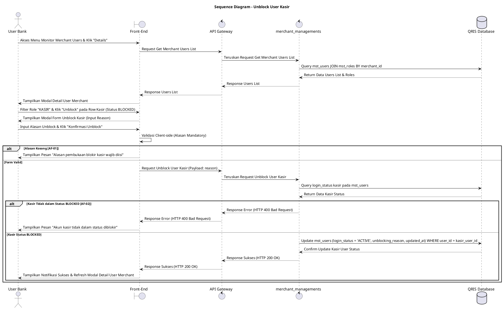

# 1 Deskripsi Use Case

**Tabel 1: Deskripsi Use Case Unblock User Kasir**

| Elemen Spesifikasi | Deskripsi Detail |
| --- | --- |
| ID Use Case | UC-BOH-029 |
| Nama Use Case | Unblock User Kasir |
| Penjelasan Singkat | Fitur Web Back Office Hibank yang memfasilitasi User Bank untuk membuka blokir (*unblock*) akun user kasir merchant pada tabel `mst_users`, memulihkan status keaktifan akun (`login_status = 'ACTIVE'`), dan menghapus catatan alasan pemblokiran sehingga Kasir dapat kembali melakukan login ke Aplikasi POS / Mobile POS. |
| Aktor Utama | User Bank (Back Office Hibank Staff / Operations / Support) |
| Aktor Pendukung | merchant_managements (Merchant Management Service) |
| Deskripsi Singkat | User Bank melakukan otentikasi login SSO ke Web Back Office Hibank dan mengakses menu **Merchant Management** -> **Monitor Merchant Users**. Sistem menampilkan daftar merchant terdaftar. User Bank memilih salah satu merchant dan mengklik tombol **"Details"**. Sistem menampilkan modal rincian daftar pengguna merchant dari tabel `mst_users` dan `mst_roles`. User Bank memfilter role **`KASIR`** dan memilih akun kasir yang berstatus diblokir (`login_status = 'BLOCKED'`), lalu mengklik tombol aksi **"Unblock"**. Sistem menampilkan modal konfirmasi unblock yang meminta pengisian alasan pembukaan blokir (*unblocking reason*). User Bank menginput alasan dan mengklik tombol **"Konfirmasi Unblock"**. Service `merchant_managements` memvalidasi status akun, secara langsung memperbarui status akun kasir pada tabel **`mst_users`** menjadi `login_status = 'ACTIVE'`, mengosongkan `blocking_reason`, dan mencatat riwayat pembukaan blokir. Front-End memperbarui modal rincian user dan menampilkan notifikasi bahwa akun user kasir telah berhasil di-unblock. |
| Pre-condition | 1. User Bank telah berhasil login SSO ke Web Back Office Hibank dan memiliki otoritas kewenangan *Merchant User Administrator*. 2. Akun user kasir yang akan dibuka blokirnya terdaftar pada tabel `mst_users` dengan status diblokir (`login_status = 'BLOCKED'`). |
| Post-condition | 1. Kolom `login_status` akun user kasir pada tabel `mst_users` diperbarui secara langsung menjadi `ACTIVE`. 2. Kasir yang di-unblock dapat kembali melakukan login dan transaksi pada Aplikasi Web POS / Mobile POS. 3. Front-End memperbarui status tampilan akun kasir pada modal rincian pengguna merchant. |
| Trigger | User Bank mengklik tombol **"Details"** pada merchant terpilih, memfilter role `KASIR`, mengklik tombol **"Unblock"**, mengisi alasan pembukaan blokir, dan mengklik **"Konfirmasi Unblock"**. |
| Nama Tabel | mst_users, mst_roles, audit_logs |
| Integrasi | 1. **Web Back Office Hibank UI:** Antarmuka daftar merchant, modal rincian pengguna merchant, dan dialog pembukaan blokir akun Kasir. 2. **merchant_managements:** Microservice backend pengelola pembaruan status keaktifan akun pengguna merchant secara langsung di database. |
| Asumsi | 1. Pembukaan blokir akun kasir langsung memulihkan status `ACTIVE` tanpa memerlukan perulangan First Time Login. 2. Alasan pembukaan blokir dicatat secara eksplisit untuk kebutuhan jejak audit (*audit trail*). |
| Keterbatasan | 1. Akun user kasir yang berstatus aktif (`login_status = 'ACTIVE'`) atau belum diblokir tidak dapat di-unblock. 2. Pengisian alasan pembukaan blokir bersifat mandatori dan tidak boleh dikosongkan. |
| Aturan Bisnis/Sistem | 1. **Role Filtering Standard:** User Bank dapat melihat dan memilih akun ber-role `KASIR` dari relasi tabel `mst_roles`. 2. **Direct Status Restoration Standard:** Service `merchant_managements` WAJIB meng-update kolom `login_status = 'ACTIVE'` pada `mst_users` khusus untuk `user_id` kasir terpilih. 3. **Authentication Access Restoration:** Kasir dengan `login_status = 'ACTIVE'` secara otomatis dipulihkan hak akses autentikasinya oleh Web POS / Mobile POS Service. 4. **Mandatory Unblocking Reason:** Pengisian kolom alasan pembukaan blokir (*unblocking_reason*) bersifat WAJIB sebelum eksekusi pembukaan blokir diproses. 5. **Audit Trail Standard:** Setiap tindakan pembukaan blokir kasir mencatat `user_id` kasir, `unblocked_by` (ID User Bank), alasan pembukaan blokir, dan timestamp pada `audit_logs` / `mst_users`. |
| Session Idle | 15 Menit |

# 2 Main Flow

**Tabel 2: Main Flow Unblock User Kasir**

| No. | Aktivitas | Deskripsi |
| ---: | --- | --- |
| 1 | Membuka Menu Monitor Merchant Users | User Bank melakukan login SSO dan mengklik menu **Merchant Management** -> **Monitor Merchant Users**. |
| 2 | Menampilkan Daftar Merchant | Sistem menampilkan tabel daftar merchant dari database beserta tombol aksi **"Details"** per baris merchant. |
| 3 | Memilih Tombol Details | User Bank mengklik tombol **"Details"** pada salah satu baris merchant terpilih. |
| 4 | Menampilkan Detail User Merchant | Sistem menampilkan modal rincian daftar pengguna yang terdaftar di bawah merchant tersebut dari `mst_users` dan `mst_roles`. |
| 5 | Memfilter Role Kasir | User Bank memfilter atau memilih akun pengguna ber-role **`KASIR`**. |
| 6 | Memilih Tombol Unblock Kasir | User Bank mengklik tombol aksi **"Unblock"** pada baris akun user kasir yang berstatus `BLOCKED`. |
| 7 | Menampilkan Modal Unblock | Sistem menampilkan modal konfirmasi pembukaan blokir yang memuat rincian nama kasir, email/username kasir, dan textarea alasan pembukaan blokir. |
| 8 | Mengisi Alasan & Konfirmasi | User Bank menginput alasan pembukaan blokir pada kolom textarea dan mengklik tombol **"Konfirmasi Unblock"**. |
| 9 | Memvalidasi Request Unblock | Front-End memvalidasi ketersediaan alasan dan mengirim request unblock kasir ke API Gateway. |
| 10 | Direct Update Status Kasir | Service `merchant_managements` langsung memperbarui akun kasir pada `mst_users` (`login_status = 'ACTIVE'`, `unblocking_reason`). |
| 11 | Menampilkan Konfirmasi Berhasil | Front-End memperbarui modal rincian user dan menampilkan notifikasi bahwa akun user kasir telah berhasil di-unblock. |
| 12 | Use Case Selesai | Proses pembukaan blokir akun user kasir selesai dilaksanakan. |

# 3 Alternative Flow

**Tabel 3: Alternative Flow Unblock User Kasir**

| Kode | Alternative Flow | Deskripsi |
| --- | --- | --- |
| AF-01 | Alasan Pembukaan Blokir Kosong | Pada langkah 8-9, apabila User Bank mengosongkan kolom alasan pembukaan blokir, Sistem menolak request dan Front-End menampilkan `Alasan pembukaan blokir kasir wajib diisi`. |
| AF-02 | Akun Kasir Tidak dalam Status Blocked | Pada langkah 10, apabila akun kasir pada database tidak berstatus `login_status = 'BLOCKED'`, Sistem membatalkan transaksi dan Front-End menampilkan `Akun kasir tidak dalam status diblokir`. |
| AF-03 | Gagal Terhubung ke Database Server | Pada langkah 10, apabila koneksi database terputus total, Sistem mengembalikan HTTP status 500 dan Front-End menampilkan `Gagal memperbarui status pembukaan blokir kasir ke database`. |

# 4 Status Front-End

**Tabel 4: Status Front-End Unblock User Kasir**

| No. | Nama Status | Deskripsi Tampilan Front-End |
| ---: | --- | --- |
| 1 | IDLE | Modal rincian user merchant menyajikan daftar akun dan modal unblock siap menerima masukan alasan. |
| 2 | LOADING | Indikator proses (*spinner*) ditampilkan pada tombol konfirmasi saat request pembukaan blokir kasir sedang diproses server. |
| 3 | SUCCESS | Modal/toast konfirmasi menampilkan pesan bahwa akun user kasir telah berhasil di-unblock. |
| 4 | ERROR | Pesan kesalahan ditampilkan pada UI akibat alasan kosong, status kasir tidak valid, atau gangguan server. |

# 5 Activity Diagram Unblock User Kasir

# 6 Sequence Diagram Unblock User Kasir

# 7 Response Code

**Tabel 5: Response Code Unblock User Kasir**

| No. | HTTP Status | Response Code | Nama Response | Deskripsi | Respons Front-End |
| ---: | ---: | --- | --- | --- | --- |
| 1 | 200 | 200XX00 | SUCCESS_UNBLOCK_MERCHANT_USER | Status akun user kasir merchant berhasil dipulihkan menjadi aktif (`ACTIVE`). | Menampilkan pesan notifikasi sukses dan memperbarui modal rincian user merchant. |
| 2 | 400 | 400XX00 | INVALID_UNBLOCKING_REASON | Alasan pembukaan blokir kasir yang dimasukkan tidak valid atau kosong. | Menampilkan pesan kesalahan `Alasan pembukaan blokir kasir wajib diisi`. |
| 3 | 400 | 400XX01 | USER_NOT_BLOCKED | Akun user kasir yang dipilih tidak dalam kondisi status diblokir. | Menampilkan pesan kesalahan `Akun kasir tidak dalam status diblokir`. |
| 4 | 404 | 404XX00 | USER_NOT_FOUND | Data akun user kasir tidak ditemukan pada database. | Menampilkan pesan kesalahan `Data akun kasir tidak ditemukan`. |
| 5 | 500 | 500XX00 | SYSTEM_INTERNAL_ERROR | Terjadi kegagalan internal server saat mengeksekusi pembukaan blokir akun kasir. | Menampilkan pesan kesalahan `Terjadi kendala internal pada server`. |

# 8 Desain Antarmuka

**Tabel 6: Desain Antarmuka Unblock User Kasir**

| Halaman | Komponen dan State Utama |
| --- | --- |
| Modal Details User Merchant | 1. **Dropdown Filter Role:** Filter pilihan role (`KASIR`, `MERCHANT_OWNER`, dll.). 2. **Tabel Users (`mst_users` & `mst_roles`):** Kolom Nama User, Email, Role (`KASIR`), Status (`login_status = 'BLOCKED'`), dan Aksi. 3. **Tombol "Unblock":** Tombol pemicu pembukaan blokir pada baris akun kasir yang diblokir (Warna Hijau/Biru). |
| Modal Konfirmasi Unblock Kasir | 1. **Header Informasi:** Judul konfirmasi pembukaan blokir akun kasir. 2. **Info Kasir:** Menampilkan Nama Kasir, Email/Username, dan Role (`KASIR`). 3. **Textarea Alasan Pembukaan Blokir:** Input wajib alasan pembukaan blokir kasir. 4. **Tombol Aksi:** Tombol **"Konfirmasi Unblock"** (Primary) dan **"Batal"** (Secondary). |
