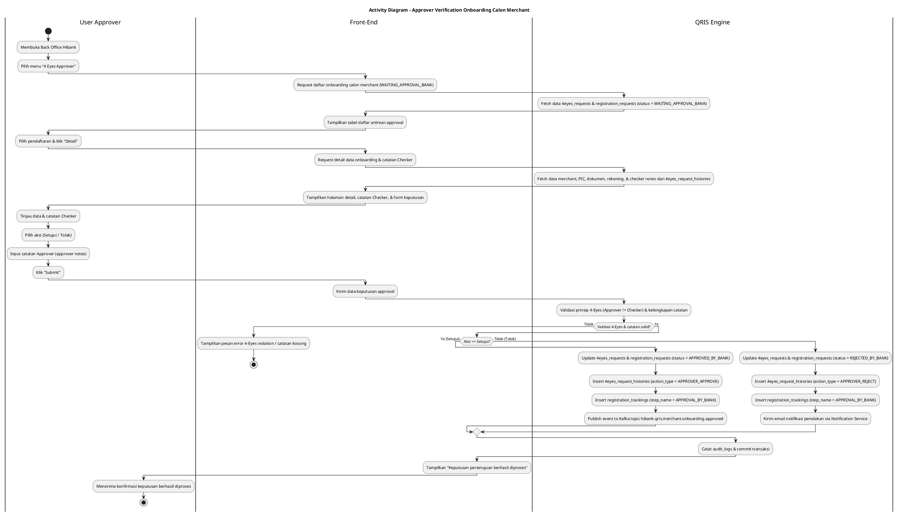
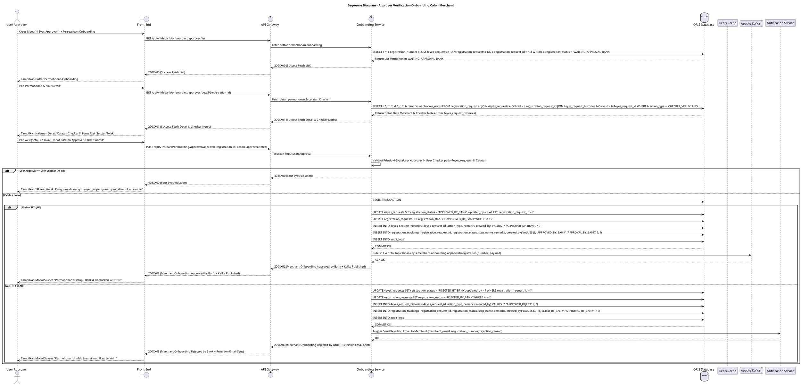

# 1 Deskripsi Use Case

**Tabel 1: Deskripsi Use Case Approver Verification Onboarding Calon Merchant**

| Elemen Spesifikasi | Deskripsi Detail |
| --- | --- |
| ID Use Case | UC-BOH-003 |
| Nama Use Case | Approver Verification Onboarding Calon Merchant |
| Penjelasan Singkat | Proses evaluasi dan penetapan keputusan persetujuan/penolakan permohonan registrasi calon merchant oleh User Approver melalui menu 4 Eyes Approver pada Back Office Hibank, mencakup peninjauan catatan Checker dari `4eyes_request_histories`, eksekusi keputusan pada `4eyes_requests`, publikasi event Kafka, dan pengiriman notifikasi email penolakan. |
| Aktor Utama | User Approver |
| Aktor Pendukung | Notification Service, Apache Kafka |
| Deskripsi Singkat | User Approver mengakses Back Office Hibank dan membuka menu "4 Eyes Approver". Sistem menampilkan daftar permohonan onboarding calon merchant dari tabel `4eyes_requests` berstatus `WAITING_APPROVAL_BANK`. User Approver memilih permohonan dan menekan tombol "Detail" untuk meninjau seluruh data merchant, dokumen, serta catatan verifikasi dari User Checker (*checker notes*) yang ditarik dari `4eyes_request_histories`. User Approver menentukan keputusan: **Setujui** (`APPROVED_BY_BANK`) atau **Tolak** (`REJECTED_BY_BANK`), menginput catatan persetujuan/penolakan (*approver notes*), dan menekan tombol "Submit". Apabila **Disetujui**, sistem memperbarui status `4eyes_requests` & `registration_requests` menjadi `APPROVED_BY_BANK`, menambahkan riwayat ke `4eyes_request_histories` dan `registration_trackings`, serta memublikasikan event ke Kafka Topic `hibank.qris.merchant.onboarding.approved`. Apabila **Ditolak**, sistem memperbarui status `REJECTED_BY_BANK`, mencatat riwayat penolakan, dan memicu Notification Service untuk mengirimi calon merchant email notifikasi penolakan resmi beserta alasan penolakan. |
| Pre-condition | 1. User Approver telah berhasil login ke Back Office Hibank menggunakan akun SSO dengan `role_id` Approver yang sah. 2. Terdapat permohonan registrasi calon merchant pada `4eyes_requests` dan `registration_requests` dengan status `registration_status = 'WAITING_APPROVAL_BANK'` yang telah lolos verifikasi User Checker. |
| Post-condition | 1. Keputusan persetujuan atau penolakan beserta catatan User Approver tersimpan secara permanen pada `4eyes_requests` dan `4eyes_request_histories`. 2. Rekam jejak audit ditambahkan pada tabel `registration_trackings` (`step_name = 'APPROVAL_BY_BANK'`). 3. Jika **Disetujui**: Event dipublikasikan ke Kafka Topic `hibank.qris.merchant.onboarding.approved`. 4. Jika **Ditolak**: Email notifikasi penolakan terkirim ke alamat email calon merchant via Notification Service. |
| Trigger | User Approver memilih detail permohonan pada menu 4 Eyes Approver, memilih keputusan (Setujui/Tolak), dan menekan tombol "Submit". |
| Nama Tabel | 4eyes_requests, 4eyes_request_histories, registration_requests, registration_request_merchant_details, registration_trackings, audit_logs |
| Integrasi | 1. **Apache Kafka Message Broker:** Publishes event persetujuan pada topic `hibank.qris.merchant.onboarding.approved` pasca sukses approval Bank. 2. **Notification Service:** Layanan pengiriman email notifikasi penolakan ke calon merchant (apabila ditolak). 3. **Redis Cache:** Manajemen sesi login User Approver dan concurrency lock antrean approval. |
| Asumsi | 1. User Approver bertindak independen sesuai prinsip *4-Eyes Principle* dan memiliki wewenang struktural untuk menetapkan keputusan pendaftaran Bank. 2. Koneksi ke Kafka Cluster dan Notification Service beroperasi dengan stabil. |
| Keterbatasan | 1. User Approver tidak dapat menyetujui permohonan yang diinisiasi atau diverifikasi oleh dirinya sendiri pada `4eyes_requests` (*4-Eyes Principle Enforcement*). 2. Keputusan penolakan bersifat final (`REJECTED_BY_BANK`), tidak ada mekanisme revisi data, dan calon merchant harus melakukan registrasi ulang. |
| Aturan Bisnis/Sistem | 1. **4-Eyes Principle Enforcement:** User Approver WAJIB berbeda dengan User Checker yang menangani permohonan yang sama pada `4eyes_requests`. Sistem akan menolak transaksi jika `created_by` / `checker_by` sama dengan `approver_by`. 2. **Approval Action & Kafka Publication:** Apabila User Approver memilih aksi **Setujui**, sistem mengubah status pada `4eyes_requests` & `registration_requests` menjadi `APPROVED_BY_BANK`, menambahkan riwayat persetujuan ke `4eyes_request_histories`, mencatat `registration_trackings` (`step_name = 'APPROVAL_BY_BANK'`), dan memublikasikan event payload ke Kafka Topic `hibank.qris.merchant.onboarding.approved` untuk diproses ke tahap pendaftaran PTEN (`SEND_TO_PTEN`). 3. **Rejection Action & Email Notification:** Apabila User Approver memilih aksi **Tolak**, sistem mengubah status pada `4eyes_requests` & `registration_requests` menjadi `REJECTED_BY_BANK`, menambahkan riwayat penolakan ke `4eyes_request_histories`, mencatat `registration_trackings` (`step_name = 'APPROVAL_BY_BANK'`), dan memicu **Notification Service** untuk mengirimi calon merchant email notifikasi penolakan berisi alasan resmi penolakan. 4. **Mandatory Approver Notes:** User Approver WAJIB menginput kolom catatan persetujuan/penolakan (*approver notes*) sebelum dapat menekan tombol submit. 5. **Audit Logging:** Setiap keputusan persetujuan atau penolakan dicatat secara terperinci pada tabel `audit_logs` memuat timestamp, User ID Approver, IP address, dan rincian keputusan. |
| Session Idle | 15 Menit |

# 2 Main Flow

**Tabel 2: Main Flow Approver Verification Onboarding Calon Merchant**

| No. | Aktivitas | Deskripsi |
| ---: | --- | --- |
| 1 | Membuka Menu 4 Eyes Approver | User Approver membuka Back Office Hibank dan memilih menu "4 Eyes Approver" -> sub-menu "Persetujuan Onboarding Merchant". |
| 2 | Menampilkan Daftar Request Onboarding | Sistem menampilkan daftar permohonan registrasi calon merchant dari `4eyes_requests` berstatus `registration_status = 'WAITING_APPROVAL_BANK'`. |
| 3 | Memilih Detail Pendaftaran | User Approver memilih salah satu permohonan dari daftar dan menekan tombol "Detail". |
| 4 | Menampilkan Detail Data & Catatan Checker | Sistem menampilkan detail lengkap data merchant, PIC, dokumen, rekening settlement, serta kolom khusus **Catatan Verifikasi User Checker** (*checker notes*) yang diambil dari `4eyes_request_histories`. |
| 5 | Menentukan Keputusan Approval | User Approver meninjau data dan catatan Checker, lalu memilih aksi **Setujui** (`APPROVED_BY_BANK`) atau **Tolak** (`REJECTED_BY_BANK`). |
| 6 | Menginput Catatan Approver | User Approver menginput catatan persetujuan/penolakan (*approver notes*) pada kolom yang disediakan. |
| 7 | Mengirim Hasil Keputusan | User Approver menekan tombol "Submit", Front-End mengirim request keputusan approval ke Onboarding Service via API Gateway. |
| 8 | Memvalidasi 4-Eyes & Kelengkapan | Onboarding Service memverifikasi prinsip 4-Eyes (User Approver != User Checker) pada `4eyes_requests` dan memvalidasi kelengkapan keputusan serta catatan Approver. |
| 9 | Memproses Keputusan Approval | **Jika Setujui:** Onboarding Service memperbarui status `4eyes_requests` & `registration_requests` menjadi `APPROVED_BY_BANK`, mencatat riwayat pada `4eyes_request_histories` & `registration_trackings`, dan memublikasikan event ke Kafka Topic `hibank.qris.merchant.onboarding.approved`. **Jika Tolak:** Onboarding Service memperbarui status menjadi `REJECTED_BY_BANK`, mencatat riwayat pada `4eyes_request_histories` & `registration_trackings`, dan memicu Notification Service untuk mengirimi calon merchant email notifikasi penolakan. |
| 10 | Use Case Selesai | Sistem menampilkan notifikasi sukses "Keputusan persetujuan berhasil diproses" dan mengarahkan User Approver kembali ke daftar antrean. |

# 3 Alternative Flow

**Tabel 3: Alternative Flow Approver Verification Onboarding Calon Merchant**

| Kode | Alternative Flow | Deskripsi |
| --- | --- | --- |
| AF-01 | Catatan Approver Kosong | Pada langkah 7, apabila User Approver tidak menginput catatan persetujuan/penolakan, Sistem menolak submit dan Front-End menampilkan `Catatan persetujuan/penolakan wajib diisi.`. |
| AF-02 | Pelanggaran Prinsip 4-Eyes (User Approver Sama dengan User Checker) | Pada langkah 8, apabila User Approver mencoba menyetujui/menolak permohonan yang diverifikasi oleh dirinya sendiri pada tahap Checker, Sistem menolak dan Front-End menampilkan `Akses ditolak. Pengguna dilarang menyetujui pengajuan yang diverifikasi sendiri (4-Eyes Violation).`. |
| AF-03 | Permohonan Sedang Ditangani Approver Lain (Lock Conflict) | Pada langkah 3, apabila permohonan pada `4eyes_requests` sedang dibuka oleh User Approver lain, Sistem menolak akses detail dan Front-End menampilkan `Permohonan ini sedang ditangani oleh Approver lain.`. |
| AF-04 | Kegagalan Publikasi Event Kafka / Notification Service | Pada langkah 9, apabila publikasi Kafka event atau pengiriman email mengalami timeout/gagal, Sistem melakukan pembatalan transaksi (*rollback*) dan Front-End menampilkan `Gagal memproses keputusan. Silakan coba beberapa saat lagi.`. |

# 4 Status Front-End

**Tabel 4: Status Front-End Approver Verification Onboarding Calon Merchant**

| No. | Nama Status | Deskripsi Tampilan Front-End |
| ---: | --- | --- |
| 1 | LIST_VIEW | Tampilan tabel daftar permohonan onboarding calon merchant (`WAITING_APPROVAL_BANK`) dari `4eyes_requests` dilengkapi filter dan tombol "Detail". |
| 2 | DETAIL_VIEW | Tampilan detail data pendaftaran merchant, PIC, dokumen, rekening settlement, dan Box Catatan Checker dari `4eyes_request_histories` dengan tombol radio aksi ("Setujui" / "Tolak"). |
| 3 | LOADING | Indikator memuat (spinner) saat memproses keputusan approval, publish Kafka, atau pengiriman email notifikasi. |
| 4 | SUCCESS | Tampilan modal/toast notifikasi sukses memberitahukan bahwa keputusan approval berhasil diproses. |
| 5 | ERROR | Tampilan pesan kesalahan (alert banner/toast) saat terjadi 4-eyes violation, catatan kosong, lock conflict, atau gangguan Kafka/Notification Service. |

# 5 Activity Diagram Approver Verification Onboarding Calon Merchant

# 6 Sequence Diagram Approver Verification Onboarding Calon Merchant

# 7 Response Code

**Tabel 5: Response Code Approver Verification Onboarding Calon Merchant**

| No. | HTTP Status | Response Code | Nama Response | Deskripsi | Respons Front-End |
| ---: | ---: | --- | --- | --- | --- |
| 1 | 200 | 200XX00 | BOH_APPROVER_LIST_FETCHED | Daftar permohonan onboarding calon merchant (`WAITING_APPROVAL_BANK`) dari `4eyes_requests` berhasil diambil dari database. | Menampilkan tabel daftar antrean persetujuan Approver. |
| 2 | 200 | 200XX01 | BOH_APPROVER_DETAIL_FETCHED | Detail data merchant, PIC, dokumen, rekening, dan catatan Checker dari `4eyes_request_histories` berhasil diambil dari database. | Menampilkan form detail, catatan Checker, dan opsi persetujuan. |
| 3 | 200 | 200XX02 | BOH_ONBOARDING_APPROVED_SUCCESS | Permohonan disetujui Bank (`APPROVED_BY_BANK`), data diperbarui pada `4eyes_requests` & `4eyes_request_histories`, rekam jejak tersimpan, dan event dipublikasikan ke Kafka Topic `hibank.qris.merchant.onboarding.approved`. | Menampilkan pesan sukses persetujuan Bank dan mengarahkan kembali ke daftar antrean. |
| 4 | 200 | 200XX03 | BOH_ONBOARDING_REJECTED_SUCCESS | Permohonan ditolak Bank (`REJECTED_BY_BANK`), data diperbarui pada `4eyes_requests` & `4eyes_request_histories`, rekam jejak tersimpan, dan email notifikasi penolakan terkirim via Notification Service. | Menampilkan pesan sukses penolakan Bank dan mengarahkan kembali ke daftar antrean. |
| 5 | 400 | 400XX00 | APPROVER_NOTES_EMPTY | Catatan persetujuan/penolakan dari User Approver kosong. | Menampilkan pesan error wajib menginput catatan Approver. |
| 6 | 403 | 403XX00 | FOUR_EYES_VIOLATION | User Approver mencoba menyetujui/menolak permohonan yang diverifikasi oleh dirinya sendiri pada tahap Checker pada `4eyes_requests`. | Menampilkan pesan error pelanggaran 4-eyes principle. |
| 7 | 409 | 409XX00 | RECORD_LOCKED_BY_OTHER_APPROVER | Permohonan registrasi sedang dibuka/ditangani oleh User Approver lain pada `4eyes_requests`. | Menampilkan pesan peringatan lock conflict. |
| 8 | 500 | 500XX00 | INTERNAL_BACKOFFICE_ERROR | Gangguan internal pada layanan Back Office Hibank / Onboarding Service / Kafka / Notification Service. | Menampilkan pesan kesalahan sistem internal. |

# 8 Desain Antarmuka

**Tabel 6: Desain Antarmuka Approver Verification Onboarding Calon Merchant**

| Halaman | Komponen dan State Utama |
| --- | --- |
| Halaman 4 Eyes Approver (Daftar Antrean) | - Tabel Daftar Permohonan Onboarding (`WAITING_APPROVAL_BANK`) dari `4eyes_requests`. - Kolom: Nomor Registrasi, Nama Merchant, Nama PIC, Tanggal Pengajuan, Tanggal Verifikasi Checker, Status. - Tombol Aksi **"Detail"** (`LIST_VIEW`). |
| Halaman Detail & Form Approval User Approver | - Tab Navigasi Data: **Data Merchant**, **Data PIC**, **Dokumen Pendukung**, **Rekening Settlement**. - Box Card Informasi: **Catatan Verifikasi User Checker (Checker Notes)** (ditarik dari `4eyes_request_histories`). - Section Radio Button Keputusan Approval: &nbsp;&nbsp;* Radio Button Opsi: **[ ] Setujui (APPROVED_BY_BANK)** & **[ ] Tolak (REJECTED_BY_BANK)**. - Form Input **Catatan Persetujuan / Penolakan (Approver Notes)**. - Tombol Utama **"Submit"** (`IDLE` / `LOADING`). |
| Modal Konfirmasi Sukses Persetujuan | - Banner Success Green dengan Icon Checklist. - Pesan Info: **"Permohonan disetujui Bank (`APPROVED_BY_BANK`). Event berhasil dipublikasikan ke Kafka Topic hibank.qris.merchant.onboarding.approved."**. - Tombol **"Kembali ke Daftar Antrean"**. |
| Modal Konfirmasi Sukses Penolakan | - Banner Notification Red dengan Icon Alert. - Pesan Info: **"Permohonan ditolak Bank (`REJECTED_BY_BANK`). Email notifikasi penolakan berhasil dikirimkan ke calon merchant via Notification Service."**. - Tombol **"Kembali ke Daftar Antrean"**. |
