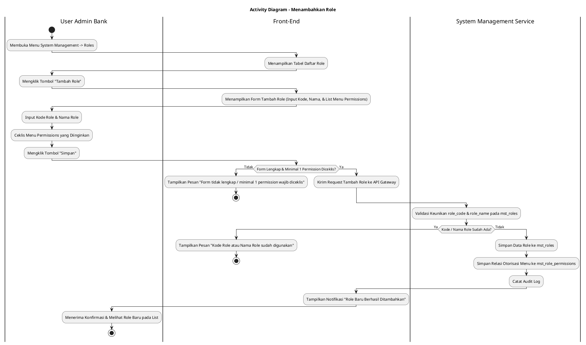
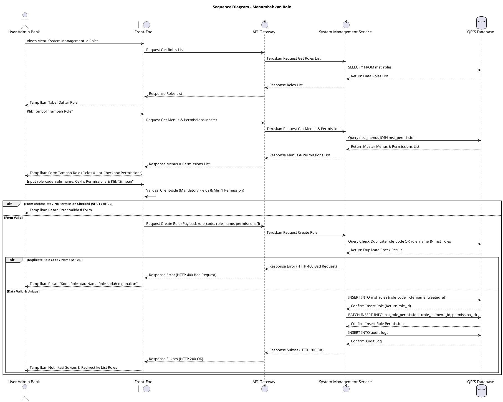

# 1 Deskripsi Use Case

**Tabel 1: Deskripsi Use Case Menambahkan Role**

| Elemen Spesifikasi | Deskripsi Detail |
| --- | --- |
| ID Use Case | UC-BOH-031 |
| Nama Use Case | Menambahkan Role |
| Penjelasan Singkat | Fitur Web Back Office Hibank pada menu System Management yang memfasilitasi User Admin Bank untuk mendaftarkan peranan (*role*) baru dengan menginput Kode Role (`role_code`), Nama Role (`role_name`), serta memilih daftar otorisasi izin menu (*menu permissions*) pada tabel `mst_roles`, `mst_menus`, `mst_permissions`, dan `mst_role_permissions`. |
| Aktor Utama | User Admin Bank (Back Office Hibank Superadmin / System Administrator) |
| Aktor Pendukung | System Management Service |
| Deskripsi Singkat | User Admin Bank melakukan otentikasi login SSO ke Web Back Office Hibank dan mengakses menu **System Management** -> **Roles**. Sistem menampilkan halaman daftar peranan (*role list*) yang ada beserta tombol aksi **"Tambah Role"**. User Admin Bank mengklik tombol tersebut sehingga sistem menampilkan formulir penambahan role baru. User Admin Bank mengisi Kode Role (`role_code`), Nama Role (`role_name`), dan meninjau daftar hierarki menu beserta hak izinnya (*menu permissions*). User Admin Bank menceklis opsi *permissions* (seperti *View*, *Create*, *Edit*, *Delete*, *Approve*) pada daftar menu yang ingin diberikan pada role tersebut, lalu mengklik tombol **"Simpan"**. Front-End memvalidasi kelengkapan form dan mengirimkan request ke API Gateway. System Management Service memvalidasi keunikan `role_code` dan `role_name` pada tabel `mst_roles`. Setelah validasi sukses, service menyimpan data role baru ke tabel **`mst_roles`** dan me-rekam pemetaan relasi otorisasi menu ke tabel **`mst_role_permissions`**. Front-End memperbarui tabel daftar role dan menyajikan notifikasi konfirmasi bahwa role baru berhasil ditambahkan. |
| Pre-condition | 1. User Admin Bank telah berhasil login SSO ke Web Back Office Hibank dan memiliki otoritas kewenangan *System Administrator*. 2. Data master menu dan hak izin (*permissions*) telah terdaftar pada tabel `mst_menus` dan `mst_permissions`. |
| Post-condition | 1. Record role baru berhasil disimpan pada tabel `mst_roles`. 2. Relasi hak izin otorisasi menu untuk role tersebut tersimpan pada tabel `mst_role_permissions`. 3. Role baru yang telah dibuat siap untuk ditautkan (*assigned*) ke pengguna pada fitur User Management. 4. Front-End menampilkan role baru pada daftar halaman Roles. |
| Trigger | User Admin Bank mengklik menu **System Management** -> **Roles**, mengklik tombol **"Tambah Role"**, mengisi Kode Role, Nama Role, menceklis daftar *menu permissions*, lalu mengklik **"Simpan"**. |
| Nama Tabel | mst_roles, mst_menus, mst_permissions, mst_role_permissions, audit_logs |
| Integrasi | 1. **Web Back Office Hibank UI:** Antarmuka daftar role, form penambahan role baru, dan komponen *checkbox list menu permissions*. 2. **System Management Service:** Microservice backend pengelola pendaftaran role, otorisasi menu, dan kontrol hak akses pengguna. |
| Asumsi | 1. Penambahan role baru berlaku secara langsung bagi pengguna yang nantinya ditautkan dengan `role_id` tersebut. 2. Struktur hak akses dikelola berbasis granularity per menu dan tipe izin (*View/Read*, *Create*, *Edit*, *Delete*, *Approve*). |
| Keterbatasan | 1. Kode Role (`role_code`) dan Nama Role (`role_name`) bersifat unik dan tidak boleh sama dengan role yang sudah terdaftar. 2. Penambahan role wajib menyertakan minimal 1 (satu) otorisasi *menu permission* yang diceklis. |
| Aturan Bisnis/Sistem | 1. **Role Identification Uniqueness:** Kode Role (`role_code`) dan Nama Role (`role_name`) WAJIB unik dan tidak case-sensitive pada tabel `mst_roles`. 2. **Mandatory Input Fields:** Kolom Kode Role (`role_code`) dan Nama Role (`role_name`) bersifat WAJIB diisi (*mandatory*). 3. **Permission Assignment Standard:** Setiap role baru WAJIB memiliki setidaknya 1 (satu) otorisasi *menu permission* yang diceklis dari daftar `mst_menus` & `mst_permissions`. 4. **Permission Mapping Relational Integrity:** Pilihan *menu permissions* yang diceklis WAJIB disimpan ke dalam tabel relasi `mst_role_permissions` yang menghubungkan `role_id`, `menu_id`, dan `permission_id`. 5. **Audit Trail Standard:** Setiap tindakan penambahan role baru mencatat `role_id`, `created_by` (ID User Admin), detail permissions yang diceklis, dan timestamp pada `audit_logs`. |
| Session Idle | 15 Menit |

# 2 Main Flow

**Tabel 2: Main Flow Menambahkan Role**

| No. | Aktivitas | Deskripsi |
| ---: | --- | --- |
| 1 | Membuka Menu System Management | User Admin Bank melakukan login SSO dan mengklik menu **System Management**. |
| 2 | Memilih Sub-menu Roles | User Admin Bank memilih sub-menu **Roles** pada navigasi System Management. |
| 3 | Menampilkan Daftar Role | Sistem menampilkan halaman tabel daftar role yang terdaftar dari `mst_roles` beserta tombol aksi **"Tambah Role"**. |
| 4 | Memilih Tombol Tambah Role | User Admin Bank mengklik tombol **"Tambah Role"**. |
| 5 | Menampilkan Form Tambah Role | Sistem menampilkan formulir penambahan role yang berisi inputan Kode Role, Nama Role, dan daftar hirarki *menu permissions* dilengkapi *checkbox*. |
| 6 | Mengisi Kode & Nama Role | User Admin Bank menginput Kode Role (`role_code`) dan Nama Role (`role_name`). |
| 7 | Menceklis Menu Permissions | User Admin Bank memilih dan menceklis *checkbox* otorisasi izin menu (*menu permissions*) yang diinginkan dari daftar menu. |
| 8 | Mengklik Tombol Simpan | User Admin Bank mengklik tombol **"Simpan"** untuk memproses pembuatan role baru. |
| 9 | Memvalidasi Form Client-side | Front-End memvalidasi kelengkapan inputan dan ketersediaan minimal satu *permission* yang diceklis, lalu mengirim request ke API Gateway. |
| 10 | Memvalidasi Keunikan & Menyimpan Data | System Management Service memvalidasi keunikan `role_code` dan `role_name`, menyimpan record baru ke `mst_roles`, serta menyisipkan relasi ke `mst_role_permissions`. |
| 11 | Menampilkan Konfirmasi Berhasil | Front-End memperbarui tabel daftar role dan menampilkan notifikasi bahwa role baru telah berhasil ditambahkan. |
| 12 | Use Case Selesai | Proses penambahan role baru selesai dilaksanakan. |

# 3 Alternative Flow

**Tabel 3: Alternative Flow Menambahkan Role**

| Kode | Alternative Flow | Deskripsi |
| --- | --- | --- |
| AF-01 | Kode atau Nama Role Kosong / Tidak Valid | Pada langkah 8-9, apabila Kode Role atau Nama Role dikosongkan, Sistem menolak request dan Front-End menampilkan `Kode Role dan Nama Role wajib diisi`. |
| AF-02 | Menu Permission Belum Diceklis | Pada langkah 8-9, apabila User Admin Bank belum menceklis satu pun *menu permission*, Sistem menolak request dan Front-End menampilkan `Pilih minimal satu menu permission untuk role baru`. |
| AF-03 | Kode atau Nama Role Sudah Terdaftar | Pada langkah 10, apabila `role_code` atau `role_name` sudah ada pada `mst_roles`, Sistem membatalkan transaksi dan Front-End menampilkan `Kode Role atau Nama Role sudah digunakan`. |
| AF-04 | Gagal Terhubung ke Database Server | Pada langkah 10, apabila koneksi database terputus total, Sistem mengembalikan HTTP status 500 dan Front-End menampilkan `Terjadi kendala internal pada server`. |

# 4 Status Front-End

**Tabel 4: Status Front-End Menambahkan Role**

| No. | Nama Status | Deskripsi Tampilan Front-End |
| ---: | --- | --- |
| 1 | IDLE | Formulir penambahan role siap menerima masukan Kode Role, Nama Role, dan pilihan *checkbox menu permissions*. |
| 2 | LOADING | Indikator proses (*spinner*) ditampilkan pada tombol Simpan saat request pembuatan role sedang diproses server. |
| 3 | SUCCESS | Toast/banner konfirmasi menampilkan pesan bahwa role baru berhasil disimpan dan formulir dialihkan kembali ke daftar role. |
| 4 | ERROR | Pesan kesalahan ditampilkan pada UI akibat kolom mandatory kosong, duplikasi role, atau *permission* belum dipilih. |

# 5 Activity Diagram Menambahkan Role

# 6 Sequence Diagram Menambahkan Role

# 7 Response Code

**Tabel 5: Response Code Menambahkan Role**

| No. | HTTP Status | Response Code | Nama Response | Deskripsi | Respons Front-End |
| ---: | ---: | --- | --- | --- | --- |
| 1 | 200 | 200XX00 | SUCCESS_CREATE_ROLE | Data role baru dan pemetaan *menu permissions* berhasil disimpan. | Menampilkan pesan notifikasi sukses dan mengarahkan ke halaman daftar role. |
| 2 | 400 | 400XX00 | INVALID_ROLE_INPUT | Kode Role, Nama Role kosong, atau tidak ada *permission* yang diceklis. | Menampilkan pesan kesalahan validasi input. |
| 3 | 400 | 400XX01 | DUPLICATE_ROLE_CODE_OR_NAME | Kode Role atau Nama Role yang diinput sudah digunakan pada sistem. | Menampilkan pesan kesalahan `Kode Role atau Nama Role sudah digunakan`. |
| 4 | 404 | 404XX00 | MENU_PERMISSION_NOT_FOUND | Salah satu ID menu atau permission yang dipilih tidak ditemukan di database. | Menampilkan pesan kesalahan `Master data menu/permission tidak valid`. |
| 5 | 500 | 500XX00 | SYSTEM_INTERNAL_ERROR | Terjadi kegagalan internal server saat mengeksekusi penambahan role. | Menampilkan pesan kesalahan `Terjadi kendala internal pada server`. |

# 8 Desain Antarmuka

**Tabel 6: Desain Antarmuka Menambahkan Role**

| Halaman | Komponen dan State Utama |
| --- | --- |
| Halaman List Roles | 1. **Tabel Daftar Role (`mst_roles`):** Kolom Kode Role, Nama Role, Jumlah Permission, dan Aksi. 2. **Tombol "Tambah Role":** Tombol pemicu pembukaan form penambahan role baru (Primary Button). |
| Form Tambah Role | 1. **Field Kode Role (`role_code`):** Text Input (Mandatory). 2. **Field Nama Role (`role_name`):** Text Input (Mandatory). 3. **Daftar Menu Permissions:** Treeview/List hirarki menu dilengkapi *checkbox* otorisasi (`View`, `Create`, `Edit`, `Delete`, `Approve`). 4. **Tombol Aksi:** Tombol **"Simpan"** (Primary) dan **"Batal"** (Secondary). |
