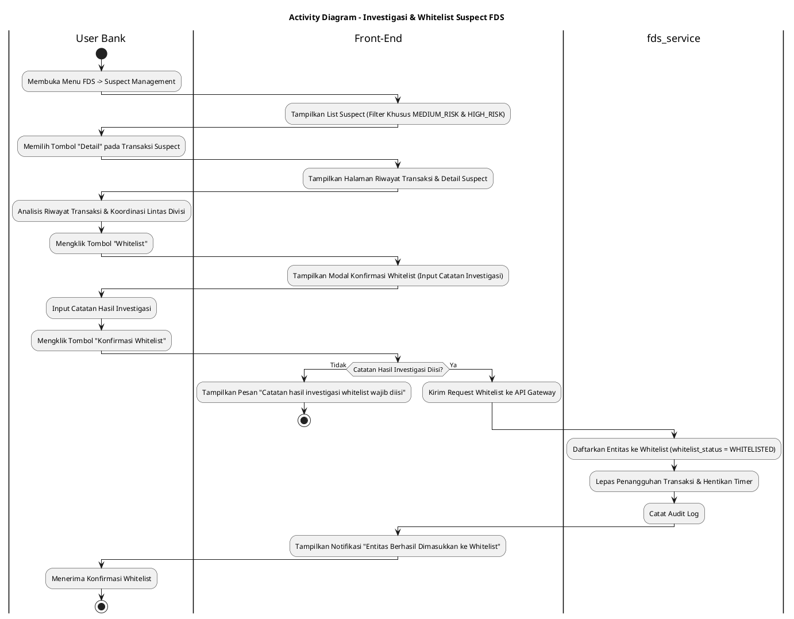
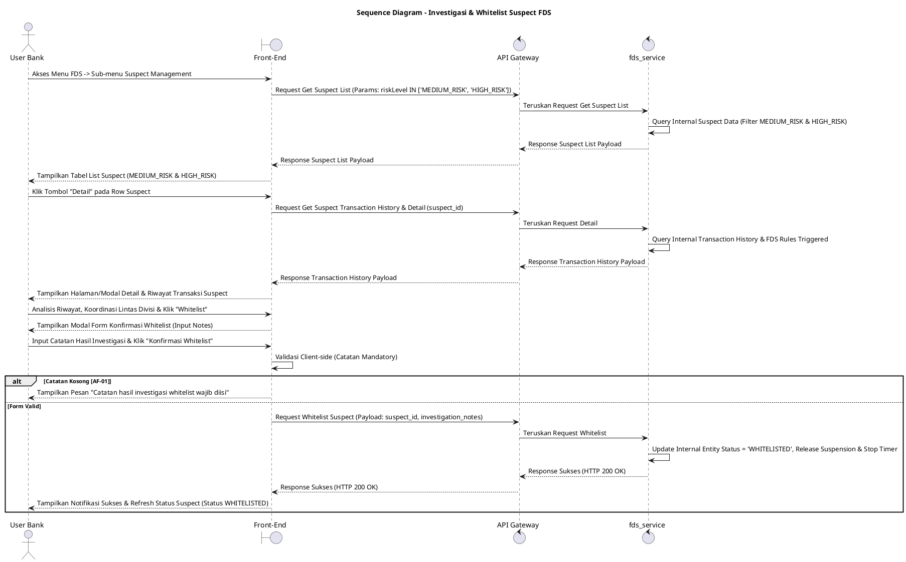

# 1 Deskripsi Use Case

**Tabel 1: Deskripsi Use Case Investigasi & Whitelist Suspect FDS**

| Elemen Spesifikasi | Deskripsi Detail |
| --- | --- |
| ID Use Case | UC-BOH-032 |
| Nama Use Case | Investigasi & Whitelist Suspect FDS |
| Penjelasan Singkat | Fitur Web Back Office Hibank yang memfasilitasi User Bank (Fraud Risk Officer) untuk meninjau transaksi mencurigakan ber-risk level `MEDIUM_RISK` dan `HIGH_RISK` pada menu Suspect Management, menganalisis riwayat transaksi, melakukan koordinasi investigasi lintas divisi, serta mengeksekusi pelepasan dan pendaftaran ke daftar putih (*Whitelist*) pada `fds_service` agar transaksi/entitas tersebut diizinkan bertransaksi tanpa halangan FDS di masa depan. |
| Aktor Utama | User Bank (Fraud Risk / Anti-Money Laundering Investigator) |
| Aktor Pendukung | fds_service (Fraud Detection System Service) |
| Deskripsi Singkat | User Bank melakukan otentikasi login SSO ke Web Back Office Hibank dan mengakses menu **FDS** -> **Suspect Management**. Sistem menampilkan daftar transaksi terindikasi fraud khusus untuk klasifikasi tingkat risiko **`MEDIUM_RISK`** dan **`HIGH_RISK`**. User Bank memilih salah satu baris transaksi dan mengklik tombol aksi **"Detail"**. Sistem menampilkan halaman/modal rincian suspect yang berisi riwayat transaksi komprehensif, profil entitas (merchant/user), serta indikator aturan fraud yang ter-trigger. User Bank melakukan proses investigasi mendalam dan koordinasi lintas divisi (misalnya dengan divisi Compliance, Operations, atau Legal). Apabila hasil investigasi membuktikan bahwa entitas/transaksi tersebut sah (*legitimate*) dan bebas dari kecurangan, User Bank mengklik tombol **"Whitelist"**, menginput catatan hasil investigasi (*whitelist reason*), dan mengonfirmasi. Front-End mengirim request ke API Gateway. Service `fds_service` memproses pendaftaran entitas ke dalam daftar *Whitelist* (`whitelist_status = 'WHITELISTED'`), melepaskan penangguhan transaksi secara langsung, dan menghentikan timer penangguhan. Front-End memperbarui tampilan rincian suspect dan menampilkan notifikasi konfirmasi bahwa entitas telah berhasil di-whitelist. |
| Pre-condition | 1. User Bank telah berhasil login SSO ke Web Back Office Hibank dan memiliki kewenangan otoritas *Fraud Risk Investigator*. 2. Terdapat transaksi/entitas suspect terdaftar pada `fds_service` dengan tingkat risiko `MEDIUM_RISK` atau `HIGH_RISK`. |
| Post-condition | 1. Entitas/transaksi terpilih didaftarkan ke dalam daftar putih (*Whitelist*) pada `fds_service` (`whitelist_status = 'WHITELISTED'`) dan dibebaskan dari pembatasan FDS selanjutnya. 2. Penangguhan transaksi langsung dilepaskan (*released*) dan timer penangguhan dihentikan. 3. Hasil keputusan dan catatan investigasi whitelist terdokumentasi pada jejak audit FDS. 4. Front-End memperbarui tampilan status entitas menjadi `WHITELISTED`. |
| Trigger | User Bank mengklik menu **FDS** -> **Suspect Management**, mengklik tombol **"Detail"** pada transaksi `MEDIUM_RISK` / `HIGH_RISK`, meninjau riwayat transaksi, dan mengklik **"Whitelist"** serta mengonfirmasi catatan investigasi. |
| Nama Tabel | Tidak dapat diekspose (Dikelola secara internal di dalam `fds_service`) |
| Integrasi | 1. **Web Back Office Hibank UI:** Antarmuka daftar Suspect Management, halaman riwayat rincian transaksi suspect, dan dialog konfirmasi whitelist. 2. **fds_service:** Microservice terisolasi pengelola evaluasi suspect, eksekusi pendaftaran whitelist, pembebasan penangguhan transaksi, dan perekaman jejak audit FDS. |
| Asumsi | 1. Tindakan whitelist digunakan untuk entitas yang terbukti aman setelah melalui prosedur verifikasi dan koordinasi internal. 2. Seluruh nama tabel database dan repositori FDS terisolasi secara internal di dalam `fds_service` demi keamanan arsitektur. |
| Keterbatasan | 1. Menu Suspect Management secara khusus hanya menampilkan entitas/transaksi ber-risk level `MEDIUM_RISK` dan `HIGH_RISK`. 2. Eksekusi whitelist manual wajib disertai pengisian catatan alasan hasil koordinasi investigasi. |
| Aturan Bisnis/Sistem | 1. **Risk Level Filtering Constraint:** Menu Suspect Management HANYA menampilkan data transaksi/entitas yang memiliki tingkat risiko **`MEDIUM_RISK`** dan **`HIGH_RISK`**. 2. **Internal Encapsulation Standard:** Data tabel internal `fds_service` DILARANG diekspose secara langsung ke Front-End; komunikasi wajib melalui API terisolasi. 3. **Manual Whitelist Decision Standard:** Saat User Bank mengonfirmasi tindakan **"Whitelist"**, `fds_service` WAJIB mendaftarkan entitas/pengguna tersebut ke daftar *Whitelist* (`whitelist_status = 'WHITELISTED'`), melepaskan penangguhan transaksi secara langsung, dan mencatat `whitelisted_by` serta catatan alasan investigasi. 4. **Mandatory Investigation Reason:** Pengisian catatan hasil investigasi dan koordinasi lintas divisi bersifat WAJIB sebelum eksekusi whitelist diproses. 5. **Audit Trail Standard:** Setiap tindakan whitelist mencatat `suspect_id`, `whitelisted_by` (ID User Bank), catatan investigasi, dan timestamp pada jejak audit internal `fds_service`. |
| Session Idle | 15 Menit |

# 2 Main Flow

**Tabel 2: Main Flow Investigasi & Whitelist Suspect FDS**

| No. | Aktivitas | Deskripsi |
| ---: | --- | --- |
| 1 | Membuka Menu FDS | User Bank melakukan login SSO dan mengklik menu utama **FDS**. |
| 2 | Memilih Suspect Management | User Bank memilih sub-menu **Suspect Management**. |
| 3 | Menampilkan List Suspect | Sistem menampilkan daftar transaksi suspect yang disaring khusus untuk *risk level* **`MEDIUM_RISK`** dan **`HIGH_RISK`**. |
| 4 | Memilih Tombol Detail | User Bank mengklik tombol **"Detail"** pada salah satu baris transaksi suspect terpilih. |
| 5 | Menampilkan Riwayat & Detail Suspect | Sistem menampilkan halaman/modal rincian suspect yang memuat riwayat transaksi, profil entitas, dan parameter aturan fraud ter-trigger. |
| 6 | Investigasi & Koordinasi Lintas Divisi | User Bank melakukan analisis riwayat transaksi dan berkoordinasi dengan divisi terkait (Compliance/Operations/Legal). |
| 7 | Memilih Aksisi Whitelist | Setelah hasil koordinasi menyatakan aman, User Bank mengklik tombol **"Whitelist"** pada halaman rincian suspect. |
| 8 | Menampilkan Modal Konfirmasi | Sistem menampilkan modal konfirmasi whitelist yang meminta pengisian catatan hasil investigasi (*whitelist reason*). |
| 9 | Mengisi Catatan & Konfirmasi | User Bank memasukkan catatan hasil investigasi dan mengklik tombol **"Konfirmasi Whitelist"**. |
| 10 | Eksekusi Whitelist di Service FDS | Front-End memvalidasi ketersediaan catatan dan mengirim request whitelist ke API Gateway. Service `fds_service` mendaftarkan entitas ke daftar Whitelist permanen (`whitelist_status = 'WHITELISTED'`), melepaskan penangguhan transaksi, dan menghentikan timer. |
| 11 | Menampilkan Konfirmasi Berhasil | Front-End memperbarui tampilan status suspect dan menyajikan notifikasi bahwa entitas telah berhasil didaftarkan ke daftar Whitelist. |
| 12 | Use Case Selesai | Proses investigasi dan tindakan whitelist suspect FDS selesai dilaksanakan. |

# 3 Alternative Flow

**Tabel 3: Alternative Flow Investigasi & Whitelist Suspect FDS**

| Kode | Alternative Flow | Deskripsi |
| --- | --- | --- |
| AF-01 | Catatan Hasil Investigasi Whitelist Kosong | Pada langkah 9-10, apabila User Bank mengosongkan textarea catatan hasil investigasi, Sistem menolak request dan Front-End menampilkan `Catatan hasil investigasi whitelist wajib diisi`. |
| AF-02 | Service FDS Tidak Merespon / Timeout | Pada langkah 10, apabila `fds_service` mengalami kendala koneksi atau timeout, API Gateway mengembalikan HTTP 500/504 dan Front-End menampilkan `Gagal memproses eksekusi whitelist pada fds_service`. |

# 4 Status Front-End

**Tabel 4: Status Front-End Investigasi & Whitelist Suspect FDS**

| No. | Nama Status | Deskripsi Tampilan Front-End |
| ---: | --- | --- |
| 1 | IDLE | Halaman Suspect Management menyajikan daftar transaksi `MEDIUM_RISK` dan `HIGH_RISK` serta modal rincian siap ditinjau. |
| 2 | LOADING | Indikator memuat (*spinner*) ditampilkan saat mengunduh riwayat rincian transaksi atau memproses konfirmasi whitelist. |
| 3 | SUCCESS | Modal/toast konfirmasi menampilkan pesan sukses entitas berhasil dimasukkan ke daftar Whitelist. |
| 4 | ERROR | Pesan kesalahan ditampilkan pada UI akibat catatan kosong atau gangguan server. |

# 5 Activity Diagram Investigasi & Whitelist Suspect FDS

# 6 Sequence Diagram Investigasi & Whitelist Suspect FDS

# 7 Response Code

**Tabel 5: Response Code Investigasi & Whitelist Suspect FDS**

| No. | HTTP Status | Response Code | Nama Response | Deskripsi | Respons Front-End |
| ---: | ---: | --- | --- | --- | --- |
| 1 | 200 | 200XX00 | SUCCESS_WHITELIST_SUSPECT | Entitas/transaksi suspect berhasil didaftarkan ke daftar *Whitelist* pada `fds_service` dan penangguhan dilepaskan. | Menampilkan pesan notifikasi sukses dan memperbarui status pada UI. |
| 2 | 400 | 400XX00 | INVALID_INVESTIGATION_NOTES | Catatan hasil investigasi whitelist yang dimasukkan tidak valid atau kosong. | Menampilkan pesan kesalahan `Catatan hasil investigasi whitelist wajib diisi`. |
| 3 | 404 | 404XX00 | SUSPECT_NOT_FOUND | Data suspect yang akan ditindaklanjuti tidak ditemukan pada `fds_service`. | Menampilkan pesan kesalahan `Data suspect tidak ditemukan`. |
| 4 | 500 | 500XX00 | FDS_SERVICE_ERROR | Terjadi kegagalan internal pada `fds_service` saat mengeksekusi pendaftaran whitelist. | Menampilkan pesan kesalahan `Gagal memproses eksekusi whitelist pada fds_service`. |

# 8 Desain Antarmuka

**Tabel 6: Desain Antarmuka Investigasi & Whitelist Suspect FDS**

| Halaman | Komponen dan State Utama |
| --- | --- |
| Halaman Suspect Management | 1. **Filter Risk Level:** Filter terkunci/terpilih khusus `MEDIUM_RISK` dan `HIGH_RISK`. 2. **Tabel Suspect List:** Kolom ID Suspect, Tanggal/Waktu, Entity Name/MID, Skor Risk, **Risk Level** (`MEDIUM_RISK` / `HIGH_RISK`), Timer Penangguhan, dan Tombol Aksi **"Detail"**. |
| Halaman Detail & Riwayat Transaksi Suspect | 1. **Info Profil & Risk Badge:** Rincian entitas beserta status *risk level*. 2. **Aturan FDS Ter-trigger:** List kriteria/rule fraud yang dilanggar. 3. **Tabel Riwayat Transaksi:** Riwayat transaksi historis entitas untuk bahan investigasi. 4. **Indikator Timer Penangguhan:** Countdown durasi *auto-release* `fds_service`. 5. **Tombol Aksi:** Tombol **"Whitelist"** (Primary Green/Blue), **"Blacklist"** (Secondary Red), dan **"Kembali"** (Secondary). |
| Modal Konfirmasi Whitelist | 1. **Header Informasi:** Judul konfirmasi pendaftaran whitelist entitas. 2. **Info Suspect:** Menampilkan ID Suspect dan Nama Entitas. 3. **Textarea Catatan Investigasi:** Input wajib rincian hasil investigasi & koordinasi lintas divisi. 4. **Tombol Aksi:** Tombol **"Konfirmasi Whitelist"** (Primary Green/Blue) dan **"Batal"** (Secondary). |
