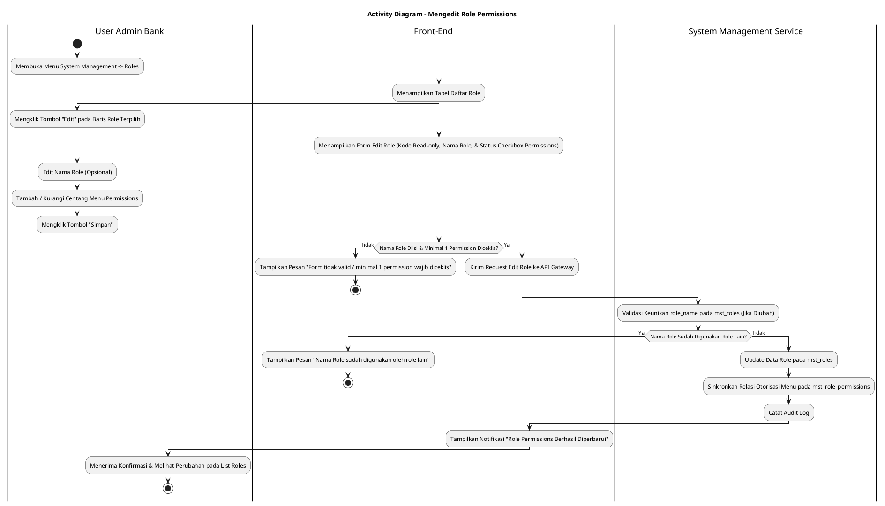
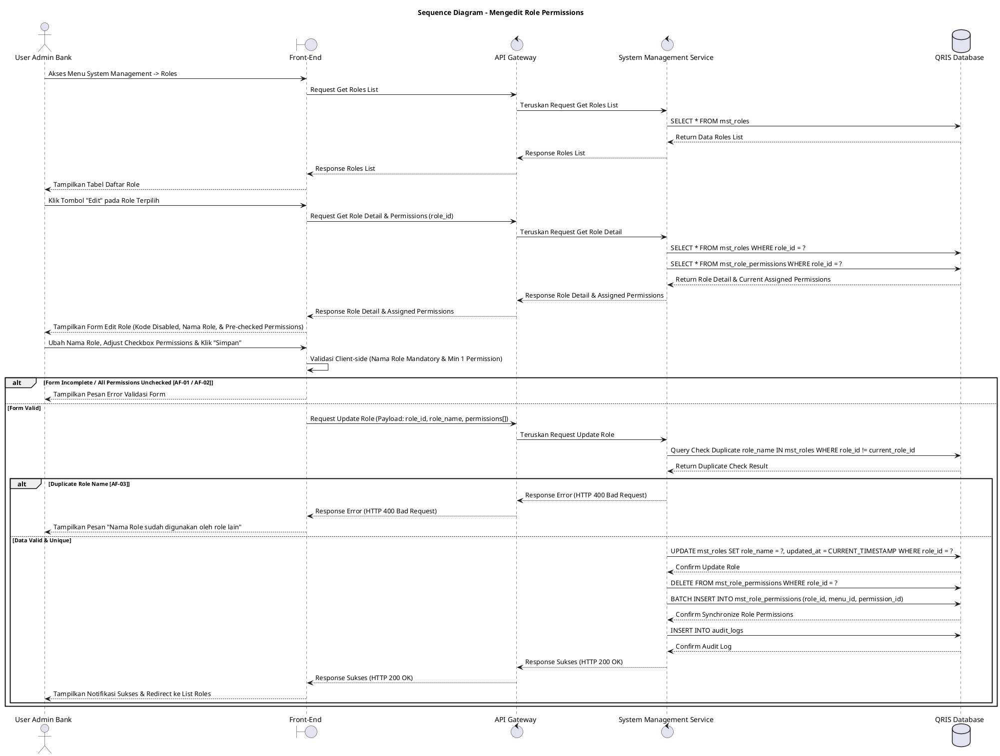

# 1 Deskripsi Use Case

**Tabel 1: Deskripsi Use Case Mengedit Role Permissions**

| Elemen Spesifikasi | Deskripsi Detail |
| --- | --- |
| ID Use Case | UC-BOH-032 |
| Nama Use Case | Mengedit Role Permissions |
| Penjelasan Singkat | Fitur Web Back Office Hibank pada menu System Management yang memfasilitasi User Admin Bank untuk memperbarui Nama Role (`role_name`) dan penyesuaian hak akses izin menu (*menu permissions*) pada tabel `mst_roles` dan `mst_role_permissions`. |
| Aktor Utama | User Admin Bank (Back Office Hibank Superadmin / System Administrator) |
| Aktor Pendukung | System Management Service |
| Deskripsi Singkat | User Admin Bank melakukan otentikasi login SSO ke Web Back Office Hibank dan mengakses menu **System Management** -> **Roles**. Sistem menampilkan halaman tabel daftar peranan (*role list*). User Admin Bank memilih salah satu role yang ingin diubah dan mengklik tombol aksi **"Edit"**. Sistem menampilkan formulir pengeditan role yang memuat Kode Role (`role_code` bersifat *read-only*), Nama Role (`role_name`), serta daftar hirarki *menu permissions* beserta *checkbox* status centang saat ini dari `mst_role_permissions`. User Admin Bank melakukan penyesuaian pada Nama Role dan/atau menambah/menghapus centang *checkbox* otorisasi izin menu yang diinginkan, lalu mengklik tombol **"Simpan"**. Front-End memvalidasi kelengkapan form dan mengirimkan request ke API Gateway. System Management Service memvalidasi keunikan `role_name` jika diubah. Setelah validasi sukses, service memperbarui `role_name` pada tabel **`mst_roles`**, me-refresh relasi pemetaan otorisasi menu pada tabel **`mst_role_permissions`**, serta memperbarui sesi pengguna yang sedang aktif menggunakan role tersebut. Front-End memperbarui tabel daftar role dan menyajikan notifikasi konfirmasi bahwa perbahan role permissions berhasil disimpan. |
| Pre-condition | 1. User Admin Bank telah berhasil login SSO ke Web Back Office Hibank dan memiliki otoritas kewenangan *System Administrator*. 2. Role yang akan diubah terdaftar pada tabel `mst_roles`. |
| Post-condition | 1. Nama Role (`role_name`) diperbarui pada tabel `mst_roles`. 2. Relasi hak izin otorisasi menu untuk role tersebut pada tabel `mst_role_permissions` diperbarui secara tersinkronisasi. 3. Pengguna yang memiliki role tersebut secara otomatis mendapatkan pembaruan hak akses menu pada sesi login berikutnya. 4. Front-End menampilkan data role terbaru pada daftar halaman Roles. |
| Trigger | User Admin Bank mengklik menu **System Management** -> **Roles**, mengklik tombol **"Edit"** pada role terpilih, menyesuaikan Nama Role dan/atau centang *checkbox menu permissions*, lalu mengklik **"Simpan"**. |
| Nama Tabel | mst_roles, mst_menus, mst_permissions, mst_role_permissions, audit_logs |
| Integrasi | 1. **Web Back Office Hibank UI:** Antarmuka daftar role, form pengeditan role permissions, dan komponen *checkbox list menu permissions*. 2. **System Management Service:** Microservice backend pengelola pembaruan role, otorisasi menu, dan kontrol hak akses pengguna. |
| Asumsi | 1. Kode Role (`role_code`) merupakan identitas unik yang bersifat permanen (*read-only*) dan tidak dapat diubah setelah dibuat. 2. Pembaruan role permissions berdampak langsung pada seluruh pengguna yang terkait dengan `role_id` tersebut. |
| Keterbatasan | 1. Kode Role (`role_code`) dilarang diubah (*read-only*). 2. Role sistem bawaan (*system default roles* seperti Superadmin) tidak dapat dihapus atau dikurangi *core permissions*-nya. 3. Pengeditan role wajib menyertakan minimal 1 (satu) otorisasi *menu permission* yang diceklis. |
| Aturan Bisnis/Sistem | 1. **Role Code Immutability Standard:** Kode Role (`role_code`) bersifat *READ-ONLY* pada form edit dan tidak boleh diizinkan untuk diubah. 2. **Role Name Uniqueness Validation:** Apabila Nama Role (`role_name`) diubah, nama baru WAJIB unik dan tidak boleh menyamai `role_name` lain pada tabel `mst_roles`. 3. **Mandatory Permission Constraint:** Setiap role WAJIB memiliki setidaknya 1 (satu) otorisasi *menu permission* yang diceklis. 4. **Permission Synchronization Standard:** Perubahan centang *checkbox permissions* WAJIB memperbarui record pada `mst_role_permissions` (menghapus relasi lama yang di-uncheck dan menyisipkan relasi baru yang diceklis). 5. **Audit Trail Standard:** Setiap tindakan pengeditan role permissions mencatat `role_id`, `updated_by` (ID User Admin), rincian perubahan permissions, dan timestamp pada `audit_logs`. |
| Session Idle | 15 Menit |

# 2 Main Flow

**Tabel 2: Main Flow Mengedit Role Permissions**

| No. | Aktivitas | Deskripsi |
| ---: | --- | --- |
| 1 | Membuka Menu System Management | User Admin Bank melakukan login SSO dan mengklik menu **System Management**. |
| 2 | Memilih Sub-menu Roles | User Admin Bank memilih sub-menu **Roles** pada navigasi System Management. |
| 3 | Menampilkan Daftar Role | Sistem menampilkan halaman tabel daftar role yang terdaftar dari `mst_roles` beserta tombol aksi **"Edit"** per baris role. |
| 4 | Memilih Tombol Edit Role | User Admin Bank mengklik tombol **"Edit"** pada salah satu baris role terpilih. |
| 5 | Menampilkan Form Edit Role | Sistem menampilkan formulir pengeditan role yang memuat Kode Role (*read-only*), Nama Role, dan daftar hirarki *menu permissions* beserta status *checkbox* yang tercentang dari `mst_role_permissions`. |
| 6 | Mengedit Nama Role & Permissions | User Admin Bank mengubah Nama Role (jika diperlukan) dan menambah atau mengurangi centang *checkbox* otorisasi izin menu yang diinginkan. |
| 7 | Mengklik Tombol Simpan | User Admin Bank mengklik tombol **"Simpan"** untuk memproses pembaruan role permissions. |
| 8 | Memvalidasi Form Client-side | Front-End memvalidasi kelengkapan inputan dan ketersediaan minimal satu *permission* yang diceklis, lalu mengirim request ke API Gateway. |
| 9 | Memvalidasi Keunikan & Update Data | System Management Service memvalidasi keunikan `role_name` (jika diubah), memperbarui `mst_roles`, dan menyinkronkan pemetaan relasi pada `mst_role_permissions`. |
| 10 | Menampilkan Konfirmasi Berhasil | Front-End memperbarui tabel daftar role dan menampilkan notifikasi bahwa perubahan role permissions telah berhasil disimpan. |
| 11 | Use Case Selesai | Proses pengeditan role permissions selesai dilaksanakan. |

# 3 Alternative Flow

**Tabel 3: Alternative Flow Mengedit Role Permissions**

| Kode | Alternative Flow | Deskripsi |
| --- | --- | --- |
| AF-01 | Nama Role Kosong / Tidak Valid | Pada langkah 7-8, apabila Nama Role dikosongkan, Sistem menolak request dan Front-End menampilkan `Nama Role wajib diisi`. |
| AF-02 | Seluruh Menu Permission Di-uncheck | Pada langkah 7-8, apabila User Admin Bank meng-uncheck seluruh *menu permission*, Sistem menolak request dan Front-End menampilkan `Pilih minimal satu menu permission untuk role ini`. |
| AF-03 | Nama Role Sudah Digunakan Role Lain | Pada langkah 9, apabila `role_name` baru yang diinput sudah digunakan oleh role lain pada `mst_roles`, Sistem membatalkan transaksi dan Front-End menampilkan `Nama Role sudah digunakan oleh role lain`. |
| AF-04 | Gagal Terhubung ke Database Server | Pada langkah 9, apabila koneksi database terputus total, Sistem mengembalikan HTTP status 500 dan Front-End menampilkan `Terjadi kendala internal pada server`. |

# 4 Status Front-End

**Tabel 4: Status Front-End Mengedit Role Permissions**

| No. | Nama Status | Deskripsi Tampilan Front-End |
| ---: | --- | --- |
| 1 | IDLE | Formulir pengeditan role menyajikan data terisi dan *checkbox menu permissions* siap diubah. |
| 2 | LOADING | Indikator proses (*spinner*) ditampilkan pada tombol Simpan saat request pembaruan role sedang diproses server. |
| 3 | SUCCESS | Toast/banner konfirmasi menampilkan pesan bahwa perubahan role permissions berhasil disimpan dan formulir dialihkan kembali ke daftar role. |
| 4 | ERROR | Pesan kesalahan ditampilkan pada UI akibat Nama Role kosong, duplikasi nama role, atau seluruh *permission* di-uncheck. |

# 5 Activity Diagram Mengedit Role Permissions

# 6 Sequence Diagram Mengedit Role Permissions

# 7 Response Code

**Tabel 5: Response Code Mengedit Role Permissions**

| No. | HTTP Status | Response Code | Nama Response | Deskripsi | Respons Front-End |
| ---: | ---: | --- | --- | --- | --- |
| 1 | 200 | 200XX00 | SUCCESS_UPDATE_ROLE | Pembaruan data role dan relasi *menu permissions* berhasil disimpan. | Menampilkan pesan notifikasi sukses dan mengarahkan ke halaman daftar role. |
| 2 | 400 | 400XX00 | INVALID_ROLE_UPDATE_INPUT | Nama Role kosong atau seluruh *permission* di-uncheck. | Menampilkan pesan kesalahan validasi input. |
| 3 | 400 | 400XX01 | DUPLICATE_ROLE_NAME | Nama Role yang baru dimasukkan sudah digunakan oleh role lain. | Menampilkan pesan kesalahan `Nama Role sudah digunakan oleh role lain`. |
| 4 | 404 | 404XX00 | ROLE_NOT_FOUND | Role yang akan diubah tidak ditemukan pada database. | Menampilkan pesan kesalahan `Data role tidak ditemukan`. |
| 5 | 500 | 500XX00 | SYSTEM_INTERNAL_ERROR | Terjadi kegagalan internal server saat mengeksekusi pengeditan role. | Menampilkan pesan kesalahan `Terjadi kendala internal pada server`. |

# 8 Desain Antarmuka

**Tabel 6: Desain Antarmuka Mengedit Role Permissions**

| Halaman | Komponen dan State Utama |
| --- | --- |
| Halaman List Roles | 1. **Tabel Daftar Role (`mst_roles`):** Kolom Kode Role, Nama Role, Jumlah Permission, dan Aksi. 2. **Tombol "Edit":** Tombol pemicu pengeditan role pada baris role terpilih (Secondary Button). |
| Form Edit Role | 1. **Field Kode Role (`role_code`):** Text Input (*Disabled / Read-only*). 2. **Field Nama Role (`role_name`):** Text Input (Editable, Mandatory). 3. **Daftar Menu Permissions:** Treeview/List hirarki menu dilengkapi *checkbox* otorisasi (`View`, `Create`, `Edit`, `Delete`, `Approve`) yang menampilkan status tercentang dari `mst_role_permissions`. 4. **Tombol Aksi:** Tombol **"Simpan"** (Primary) dan **"Batal"** (Secondary). |
