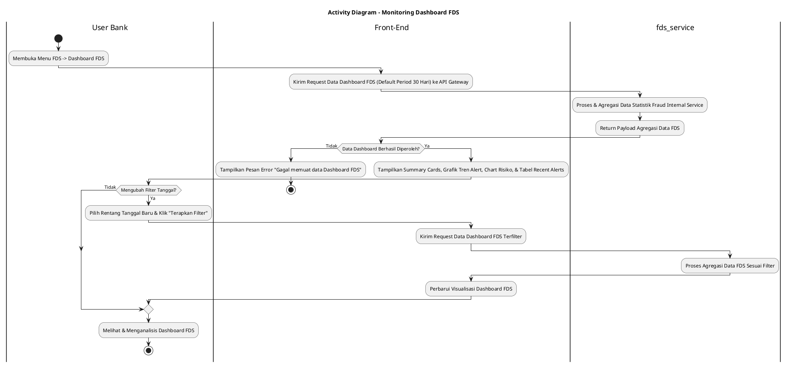
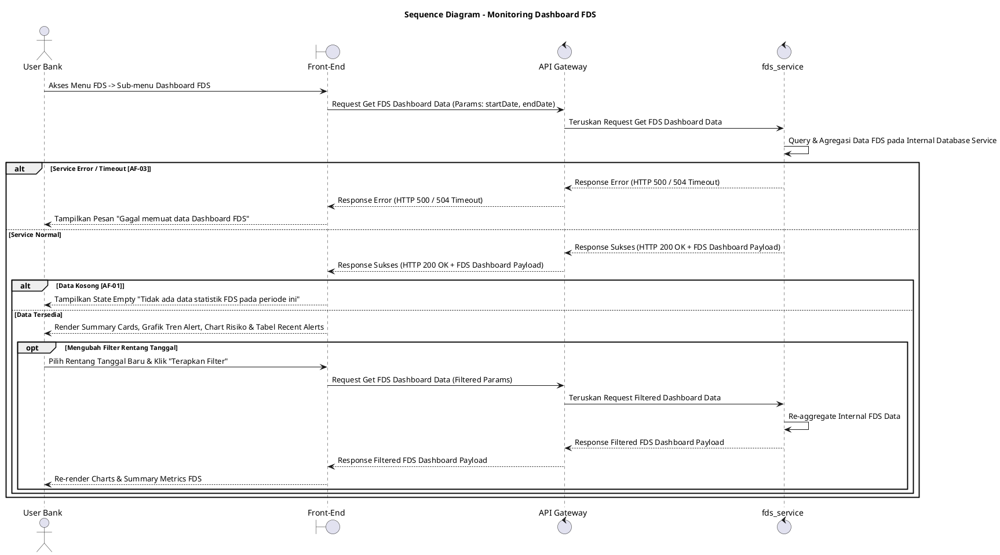

# 1 Deskripsi Use Case

**Tabel 1: Deskripsi Use Case Monitoring Dashboard FDS**

| Elemen Spesifikasi | Deskripsi Detail |
| --- | --- |
| ID Use Case | UC-BOH-033 |
| Nama Use Case | Monitoring Dashboard FDS |
| Penjelasan Singkat | Fitur Web Back Office Hibank yang memfasilitasi User Bank (Fraud Risk Officer) untuk mengawasi dan menganalisis indikator indikasi kecurangan (*Fraud Detection System*) melalui tampilan ringkasan metrik, grafik tren alert, distribusi tingkat risiko, serta daftar deteksi transaksi mencurigakan terkini yang disajikan oleh `fds_service`. |
| Aktor Utama | User Bank (Fraud Risk / Anti-Money Laundering Officer) |
| Aktor Pendukung | fds_service (Fraud Detection System Service) |
| Deskripsi Singkat | User Bank melakukan otentikasi login SSO ke Web Back Office Hibank dan mengakses menu **FDS** -> **Dashboard FDS**. Front-End mengirim request ke API Gateway. `fds_service` memproses serta mengagregasikan metrik pemantauan FDS internal service (seperti total alert, alert berdasarkan tingkat risiko *High/Medium/Low*, jumlah transaksi terblokir otomatis, dan daftar deteksi transaksi mencurigakan terbaru). Sistem menampilkan halaman Dashboard FDS yang memuat *summary cards*, grafik tren alert harian/mingguan, diagram distribusi tingkat risiko fraud, serta tabel monitoring *recent fraud alerts*. User Bank dapat menyesuaikan filter rentang tanggal (*date range filter*) atau opsi kategori alert untuk memperbarui data dashboard. |
| Pre-condition | 1. User Bank telah berhasil login SSO ke Web Back Office Hibank dan memiliki hak akses otorisasi untuk memantau menu FDS. 2. Service `fds_service` beroperasi dan terhubung dengan API Gateway. |
| Post-condition | 1. Front-End menyajikan data agregasi metrik, grafik statistik tren fraud, dan daftar alert FDS terbaru. 2. User Bank memperoleh gambaran analisis indikasi kecurangan transaksi secara *real-time*. |
| Trigger | User Bank mengklik menu **FDS** -> sub-menu **Dashboard FDS**. |
| Nama Tabel | Tidak dapat diekspose (Dikelola secara internal di dalam `fds_service`) |
| Integrasi | 1. **Web Back Office Hibank UI:** Antarmuka visualisasi dashboard monitoring FDS (*charts, summary cards, alert tables*). 2. **fds_service:** Microservice terisolasi pengelola aturan *fraud detection*, komputasi agregasi statistik, serta penyedia API data dashboard FDS. |
| Asumsi | 1. Data mentah transaksi dan aturan deteksi fraud diproses serta disimpan secara internal pada repositori terisolasi di dalam `fds_service`. 2. Akses antarmuka bersifat *read-only* untuk memantau indikator dan statistik kecurangan. |
| Keterbatasan | 1. Skema dan nama tabel database tidak diekspose ke publik/layer integrasi luar demi keamanan dan privasi arsitektur internal `fds_service`. 2. Pembaruan data grafik dan statistik bergantung pada ketersediaan data agregasi dari `fds_service`. |
| Aturan Bisnis/Sistem | 1. **Internal Encapsulation Standard:** Data tabel internal `fds_service` DILARANG diekspose secara langsung ke Front-End; komunikasi wajib melalui API agregasi tertutup. 2. **Default Filter Standard:** Tampilan awal dashboard menyajikan agregasi data FDS untuk periode 30 hari terakhir (*default date range*). 3. **Real-time Aggregation Standard:** `fds_service` menyajikan data statistik terbaru yang dihitung dari mesin aturan deteksi fraud. 4. **Role-based Access Control:** Hanya User Bank ber-role Fraud / Risk Officer yang memiliki otorisasi mengakses menu **FDS** -> **Dashboard FDS**. |
| Session Idle | 15 Menit |

# 2 Main Flow

**Tabel 2: Main Flow Monitoring Dashboard FDS**

| No. | Aktivitas | Deskripsi |
| ---: | --- | --- |
| 1 | Membuka Menu FDS | User Bank melakukan login SSO dan mengklik menu utama **FDS**. |
| 2 | Memilih Dashboard FDS | User Bank memilih sub-menu **Dashboard FDS**. |
| 3 | Mengirim Request Data Dashboard | Front-End mengirim request data agregasi dashboard FDS ke API Gateway. |
| 4 | Memproses Agregasi Data FDS | Service `fds_service` menerima request, mengolah komputasi agregasi statistik fraud (total alert, rasio risiko, tren waktu), dan menyusun payload data dashboard. |
| 5 | Mengembalikan Payload Dashboard | Service `fds_service` mengembalikan respons data agregasi dashboard FDS ke Front-End melalui API Gateway. |
| 6 | Menampilkan Dashboard FDS | Front-End menampilkan halaman Dashboard FDS yang berisi *summary cards*, grafik statistik tren alert, chart distribusi tingkat risiko (*High/Medium/Low*), dan tabel *recent alerts*. |
| 7 | Mengubah Filter Rentang Tanggal | (Opsional) User Bank memilih rentang tanggal baru pada filter antarmuka dan mengklik **"Terapkan Filter"**. |
| 8 | Memperbarui Visualisasi Dashboard | Front-End mengambil data agregasi terfilter dari `fds_service` dan memperbarui tampilan grafik serta metrik pada dashboard. |
| 9 | Use Case Selesai | Proses pemantauan Dashboard FDS selesai dilakukan. |

# 3 Alternative Flow

**Tabel 3: Alternative Flow Monitoring Dashboard FDS**

| Kode | Alternative Flow | Deskripsi |
| --- | --- | --- |
| AF-01 | Data FDS Kosong | Pada langkah 5-6, apabila belum ada data alert atau transaksi terdeteksi pada periode terpilih, `fds_service` mengembalikan respons kosong dan Front-End menampilkan `Tidak ada data statistik FDS pada periode ini` beserta metrik 0. |
| AF-02 | Filter Tanggal Tidak Valid | Pada langkah 7, apabila tanggal akhir lebih kecil dari tanggal awal, Front-End menolak request dan menampilkan `Rentang tanggal tidak valid`. |
| AF-03 | Service FDS Tidak Merespon / Timeout | Pada langkah 4, apabila `fds_service` mengalami kendala atau waktu tunggu habis (timeout), API Gateway mengembalikan HTTP status 504/500 dan Front-End menampilkan `Gagal memuat data Dashboard FDS`. |

# 4 Status Front-End

**Tabel 4: Status Front-End Monitoring Dashboard FDS**

| No. | Nama Status | Deskripsi Tampilan Front-End |
| ---: | --- | --- |
| 1 | IDLE | Tampilan default Dashboard FDS menyajikan grafik statistik dan metrik agregasi FDS. |
| 2 | LOADING | Indikator memuat (*skeleton loader* / *spinner*) ditampilkan pada komponen *chart* dan *cards* saat data FDS sedang diunduh dari server. |
| 3 | SUCCESS | Seluruh komponen *summary cards*, grafik tren alert, dan tabel *recent alerts* berhasil dirender. |
| 4 | ERROR | Banner/toast pesan kesalahan ditampilkan pada UI akibat kendala jaringan, timeout service, atau filter tanggal invalid. |

# 5 Activity Diagram Monitoring Dashboard FDS

# 6 Sequence Diagram Monitoring Dashboard FDS

# 7 Response Code

**Tabel 5: Response Code Monitoring Dashboard FDS**

| No. | HTTP Status | Response Code | Nama Response | Deskripsi | Respons Front-End |
| ---: | ---: | --- | --- | --- | --- |
| 1 | 200 | 200XX00 | SUCCESS_GET_FDS_DASHBOARD | Data agregasi metrik, grafik statistik, dan alert FDS berhasil diperoleh dari `fds_service`. | Menampilkan *summary cards*, grafik tren, dan tabel alert pada dashboard. |
| 2 | 400 | 400XX00 | INVALID_DATE_RANGE | Parameter rentang tanggal yang dikirim tidak valid (misal: tanggal akhir lebih kecil dari tanggal awal). | Menampilkan pesan kesalahan `Rentang tanggal tidak valid`. |
| 3 | 403 | 403XX00 | FDS_ACCESS_DENIED | User Bank tidak memiliki kewenangan otorisasi untuk mengakses fitur monitoring FDS. | Menampilkan pesan kesalahan `Akses ditolak. Anda tidak memiliki izin melihat menu FDS`. |
| 4 | 500 | 500XX00 | FDS_SERVICE_ERROR | Terjadi gangguan internal pada `fds_service` saat memproses komputasi data. | Menampilkan pesan kesalahan `Gagal memuat data Dashboard FDS`. |

# 8 Desain Antarmuka

**Tabel 6: Desain Antarmuka Monitoring Dashboard FDS**

| Halaman | Komponen dan State Utama |
| --- | --- |
| Halaman Dashboard FDS | 1. **Filter Header:** Input Rentang Tanggal (*Datepicker*) & Tombol **"Terapkan Filter"**. 2. **Summary Cards:** Card Total Alerts, High Risk Alerts, Transaksi Terblokir Otomatis, dan Alert Dalam Peninjauan. 3. **Grafik Tren Alert:** Line/Bar chart statistik tren deteksi fraud harian/mingguan. 4. **Chart Distribusi Risiko:** Donut/Pie chart persentase tingkatan risiko (*High*, *Medium*, *Low*). 5. **Tabel Recent FDS Alerts:** Tabel 5 alert fraud terbaru memuat ID Alert, Timestamp, Tipe Merchant/User, Tingkat Risiko, dan Status Penanganan. |
