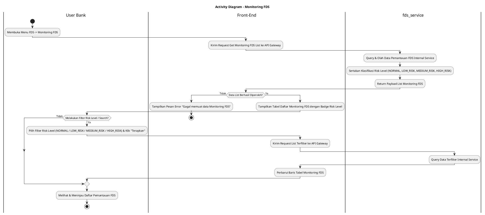
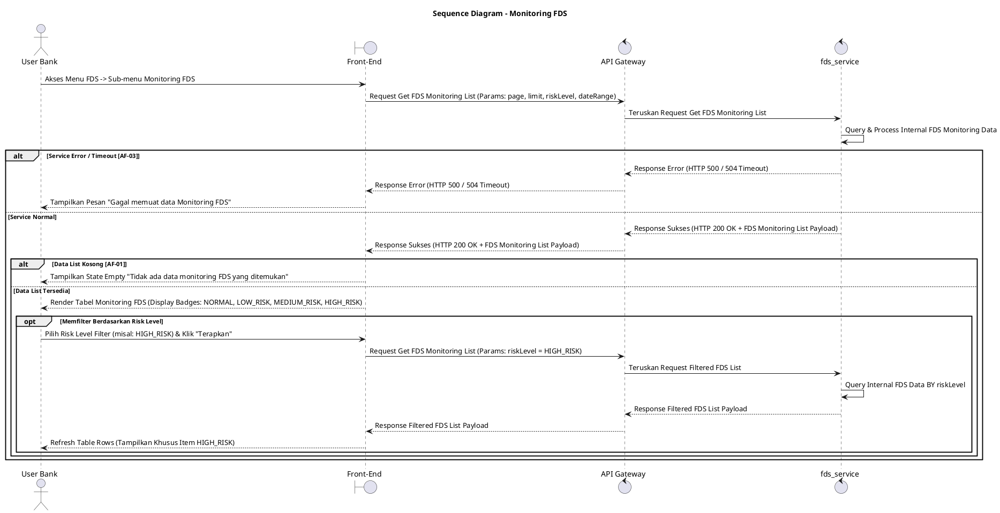

# 1 Deskripsi Use Case

**Tabel 1: Deskripsi Use Case Monitoring FDS**

| Elemen Spesifikasi | Deskripsi Detail |
| --- | --- |
| ID Use Case | UC-BOH-034 |
| Nama Use Case | Monitoring FDS |
| Penjelasan Singkat | Fitur Web Back Office Hibank yang memfasilitasi User Bank (Fraud Risk Officer) untuk memantau daftar transaksi atau entitas mencurigakan yang terdeteksi oleh sistem FDS beserta klasifikasi tingkat risikonya (`NORMAL`, `LOW_RISK`, `MEDIUM_RISK`, `HIGH_RISK`) melalui `fds_service`. |
| Aktor Utama | User Bank (Fraud Risk / Anti-Money Laundering Officer) |
| Aktor Pendukung | fds_service (Fraud Detection System Service) |
| Deskripsi Singkat | User Bank melakukan otentikasi login SSO ke Web Back Office Hibank dan mengakses menu **FDS** -> **Monitoring FDS**. Front-End mengirim request ke API Gateway. Service `fds_service` memproses query pencarian dan mengembalikan daftar entitas/transaksi terdeteksi yang sedang dipantau FDS beserta informasi atribut penanda kecurangan dan klasifikasi *risk level*. Sistem menampilkan halaman Monitoring FDS yang berisi tabel daftar pemantauan FDS dengan kolom indikator tingkat risiko berlabel **`NORMAL`**, **`LOW_RISK`**, **`MEDIUM_RISK`**, dan **`HIGH_RISK`**. User Bank dapat melakukan pencarian, penyaringan (*filter*) berdasarkan tingkat risiko atau rentang tanggal, serta melihat rincian alert yang sedang diawasi. |
| Pre-condition | 1. User Bank telah berhasil login SSO ke Web Back Office Hibank dan memiliki kewenangan otorisasi *Fraud Risk Officer*. 2. Service `fds_service` beroperasi dan terhubung dengan API Gateway. |
| Post-condition | 1. Front-End menyajikan tabel daftar pemantauan FDS yang berisi entitas/transaksi terdeteksi beserta badge status *risk level* (`NORMAL`, `LOW_RISK`, `MEDIUM_RISK`, `HIGH_RISK`). 2. User Bank dapat memfilter dan mengevaluasi entitas yang memerlukan tindakan penanganan indikasi fraud. |
| Trigger | User Bank mengklik menu **FDS** -> sub-menu **Monitoring FDS**. |
| Nama Tabel | Tidak dapat diekspose (Dikelola secara internal di dalam `fds_service`) |
| Integrasi | 1. **Web Back Office Hibank UI:** Antarmuka tabel daftar monitoring FDS, filter risk level, dan pencarian transaksi terindikasi. 2. **fds_service:** Microservice terisolasi pengelola aturan *fraud detection*, penilaian skor risiko, serta penyedia API data pemantauan FDS. |
| Asumsi | 1. Aturan klasifikasi *risk level* dihitung secara otomatis oleh mesin aturan internal `fds_service`. 2. Seluruh nama tabel database dan repositori FDS terisolasi secara internal di dalam `fds_service` demi keamanan dan privasi arsitektur. |
| Keterbatasan | 1. Skema dan nama tabel database tidak diekspose ke luar layer integrasi `fds_service`. 2. Klasifikasi nilai *risk level* yang valid dibatasi pada 4 status baku: `NORMAL`, `LOW_RISK`, `MEDIUM_RISK`, dan `HIGH_RISK`. |
| Aturan Bisnis/Sistem | 1. **Risk Level Standard Classification:** Setiap item yang muncul pada tabel Monitoring FDS WAJIB memiliki status *risk level* yang diklasifikasikan ke dalam salah satu dari empat nilai baku: **`NORMAL`**, **`LOW_RISK`**, **`MEDIUM_RISK`**, atau **`HIGH_RISK`**. 2. **Internal Encapsulation Standard:** Data tabel internal `fds_service` DILARANG diekspose secara langsung ke Front-End; komunikasi wajib melalui API agregasi/list tertutup. 3. **Filtering & Searching Standard:** Antarmuka Monitoring FDS WAJIB menyediakan filter berdasarkan *Risk Level* (`NORMAL`, `LOW_RISK`, `MEDIUM_RISK`, `HIGH_RISK`), rentang tanggal, dan kolom pencarian (*search bar*). 4. **Role-based Access Control:** Hanya User Bank ber-role Fraud / Risk Officer yang memiliki otoritas mengakses menu **FDS** -> **Monitoring FDS**. |
| Session Idle | 15 Menit |

# 2 Main Flow

**Tabel 2: Main Flow Monitoring FDS**

| No. | Aktivitas | Deskripsi |
| ---: | --- | --- |
| 1 | Membuka Menu FDS | User Bank melakukan login SSO dan mengklik menu utama **FDS**. |
| 2 | Memilih Sub-menu Monitoring FDS | User Bank memilih sub-menu **Monitoring FDS**. |
| 3 | Mengirim Request List Monitoring | Front-End mengirim request pengambilan daftar monitoring FDS ke API Gateway. |
| 4 | Memproses List Pemantauan FDS | Service `fds_service` mengolah pencarian data pemantauan FDS internal service beserta atribut klasifikasi *risk level* (`NORMAL`, `LOW_RISK`, `MEDIUM_RISK`, `HIGH_RISK`). |
| 5 | Mengembalikan Response List | Service `fds_service` mengembalikan data list pemantauan FDS ke Front-End melalui API Gateway. |
| 6 | Menampilkan Tabel Monitoring FDS | Front-End menampilkan tabel daftar monitoring FDS yang menyajikan kolom ID Alert/Transaksi, Merchant/User, Timestamp, Skor Fraud, dan Badge *Risk Level* (`NORMAL`, `LOW_RISK`, `MEDIUM_RISK`, `HIGH_RISK`). |
| 7 | Memfilter Berdasarkan Risk Level | (Opsional) User Bank memilih salah satu status pada dropdown filter Risk Level (misal: `HIGH_RISK`) dan mengklik **"Terapkan Filter"**. |
| 8 | Memperbarui Tampilan List | Front-End mengambil data terfilter dari `fds_service` dan memperbarui baris tabel monitoring FDS sesuai kriteria. |
| 9 | Use Case Selesai | Proses pemantauan FDS selesai dilaksanakan. |

# 3 Alternative Flow

**Tabel 3: Alternative Flow Monitoring FDS**

| Kode | Alternative Flow | Deskripsi |
| --- | --- | --- |
| AF-01 | Data Pemantauan FDS Kosong | Pada langkah 5-6, apabila tidak ada item transaksi/entitas yang sesuai dengan kriteria filter, `fds_service` mengembalikan list kosong dan Front-End menampilkan `Tidak ada data monitoring FDS yang ditemukan`. |
| AF-02 | Filter Tanggal / Risk Level Tidak Valid | Pada langkah 7, apabila kriteria filter tidak valid, Front-End menolak request dan menampilkan `Kriteria filter yang dimasukkan tidak valid`. |
| AF-03 | Service FDS Tidak Merespon / Timeout | Pada langkah 4, apabila `fds_service` mengalami kendala atau waktu tunggu habis (timeout), API Gateway mengembalikan HTTP status 504/500 dan Front-End menampilkan `Gagal memuat data Monitoring FDS`. |

# 4 Status Front-End

**Tabel 4: Status Front-End Monitoring FDS**

| No. | Nama Status | Deskripsi Tampilan Front-End |
| ---: | --- | --- |
| 1 | IDLE | Tampilan default halaman Monitoring FDS menyajikan tabel daftar pemantauan beserta filter pencarian. |
| 2 | LOADING | Indikator memuat (*skeleton table* / *spinner*) ditampilkan saat data list FDS sedang diunduh dari server. |
| 3 | SUCCESS | Tabel daftar pemantauan FDS berhasil dirender dengan indikator badge *risk level* yang jelas. |
| 4 | ERROR | Pesan kesalahan ditampilkan pada UI akibat gangguan server, timeout `fds_service`, atau filter tidak valid. |

# 5 Activity Diagram Monitoring FDS

# 6 Sequence Diagram Monitoring FDS

# 7 Response Code

**Tabel 5: Response Code Monitoring FDS**

| No. | HTTP Status | Response Code | Nama Response | Deskripsi | Respons Front-End |
| ---: | ---: | --- | --- | --- | --- |
| 1 | 200 | 200XX00 | SUCCESS_GET_FDS_MONITORING_LIST | Daftar item pemantauan FDS dan indikator *risk level* berhasil diperoleh dari `fds_service`. | Menampilkan tabel daftar monitoring FDS pada UI. |
| 2 | 400 | 400XX00 | INVALID_FILTER_PARAMETERS | Parameter filter (seperti *risk level* atau rentang tanggal) tidak valid. | Menampilkan pesan kesalahan `Kriteria filter yang dimasukkan tidak valid`. |
| 3 | 403 | 403XX00 | FDS_ACCESS_DENIED | User Bank tidak memiliki kewenangan otorisasi untuk mengakses fitur monitoring FDS. | Menampilkan pesan kesalahan `Akses ditolak. Anda tidak memiliki izin melihat menu FDS`. |
| 4 | 500 | 500XX00 | FDS_SERVICE_ERROR | Terjadi gangguan internal pada `fds_service` saat memproses pencarian data pemantauan. | Menampilkan pesan kesalahan `Gagal memuat data Monitoring FDS`. |

# 8 Desain Antarmuka

**Tabel 6: Desain Antarmuka Monitoring FDS**

| Halaman | Komponen dan State Utama |
| --- | --- |
| Halaman Monitoring FDS | 1. **Filter Bar:** Dropdown Filter **Risk Level** (`Semua`, `NORMAL`, `LOW_RISK`, `MEDIUM_RISK`, `HIGH_RISK`), Datepicker Filter, dan Input Search Bar. 2. **Tabel Monitoring FDS:** Kolom No, ID Alert/Transaksi, Tanggal/Waktu, Nama Merchant/User, Skor Fraud, **Risk Level** (Badge Warna: `NORMAL` - Hijau, `LOW_RISK` - Biru, `MEDIUM_RISK` - Kuning/Oranye, `HIGH_RISK` - Merah), dan Action (**Detail**). 3. **Pagination Component:** Kontrol navigasi halaman data list. |
