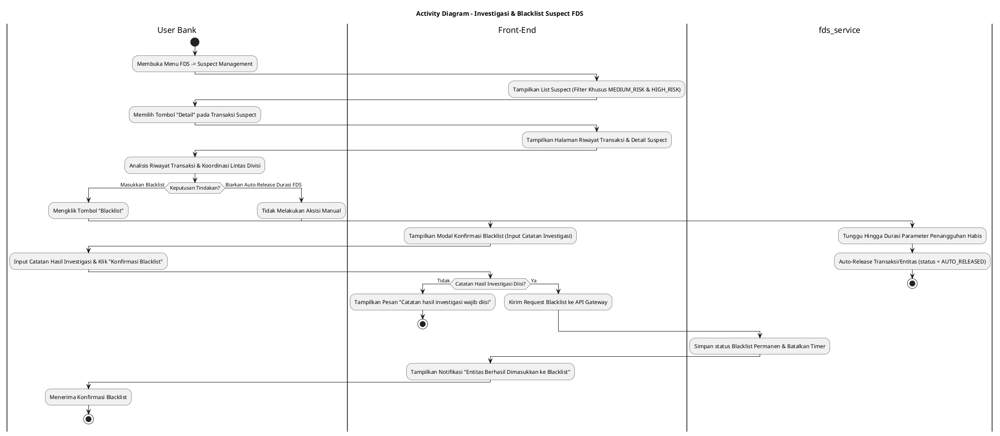
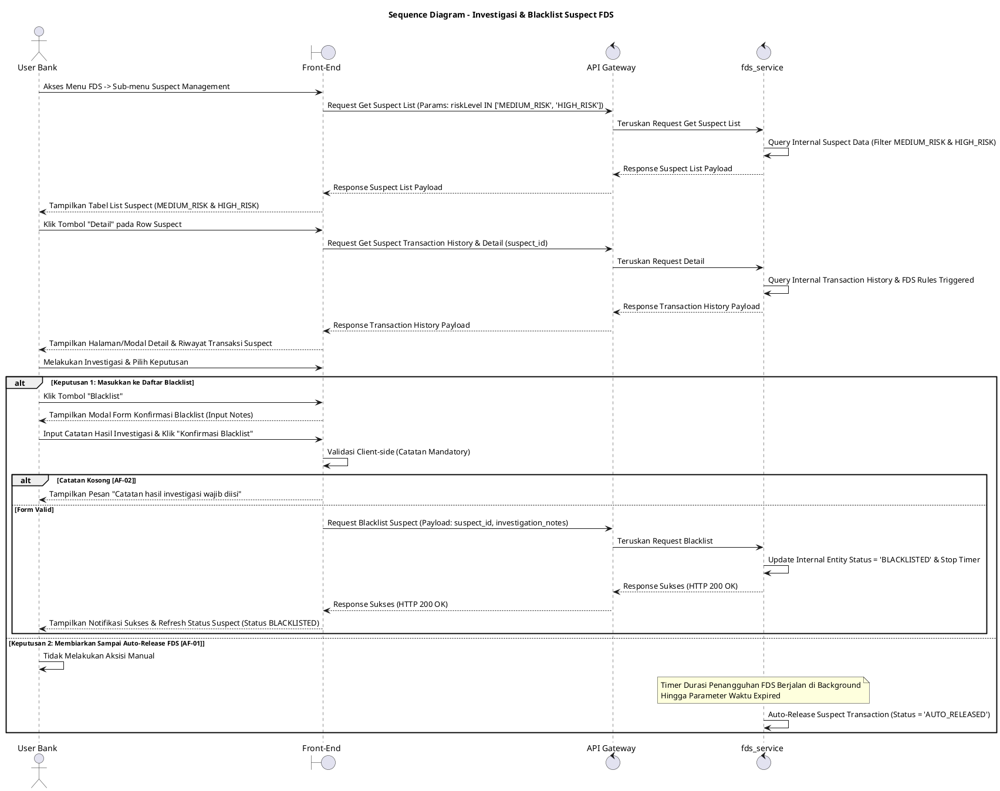

# 1 Deskripsi Use Case

**Tabel 1: Deskripsi Use Case Investigasi & Blacklist Suspect FDS**

| Elemen Spesifikasi | Deskripsi Detail |
| --- | --- |
| ID Use Case | UC-BOH-035 |
| Nama Use Case | Investigasi & Blacklist Suspect FDS |
| Penjelasan Singkat | Fitur Web Back Office Hibank yang memfasilitasi User Bank (Fraud Risk Officer) untuk meninjau transaksi mencurigakan ber-risk level `MEDIUM_RISK` dan `HIGH_RISK` pada menu Suspect Management, menganalisis riwayat transaksi, melakukan koordinasi investigasi lintas divisi, serta menentukan keputusan akhir apakah memasukkan entitas ke daftar *Blacklist* atau membiarkannya terlepas secara otomatis sesuai parameter durasi penangguhan `fds_service`. |
| Aktor Utama | User Bank (Fraud Risk / Anti-Money Laundering Investigator) |
| Aktor Pendukung | fds_service (Fraud Detection System Service) |
| Deskripsi Singkat | User Bank melakukan otentikasi login SSO ke Web Back Office Hibank dan mengakses menu **FDS** -> **Suspect Management**. Sistem menampilkan daftar transaksi terindikasi fraud khusus untuk klasifikasi tingkat risiko **`MEDIUM_RISK`** dan **`HIGH_RISK`**. User Bank memilih salah satu baris transaksi dan mengklik tombol aksi **"Detail"**. Sistem menampilkan halaman/modal rincian suspect yang berisi riwayat transaksi komprehensif, profil entitas (merchant/user), serta indikator aturan fraud yang ter-trigger. User Bank melakukan proses investigasi mendalam dan koordinasi lintas divisi (misalnya dengan divisi Compliance, Operations, atau Legal). Berdasarkan hasil investigasi, User Bank mengambil salah satu keputusan: **(1) Memasukkan ke Daftar Blacklist**: User Bank mengklik tombol **"Blacklist"**, mengisi alasan keputusan investigasi, dan mengonfirmasi sehingga `fds_service` secara permanen mem-blacklist entitas terpilih; atau **(2) Membiarkan Auto-Release Durasi FDS**: User Bank tidak mengeksekusi blacklist, sehingga transaksi/entitas akan secara otomatis dirilis (*auto-released*) oleh `fds_service` setelah melewati batas parameter durasi *hold/suspension* yang ditetapkan sistem. |
| Pre-condition | 1. User Bank telah berhasil login SSO ke Web Back Office Hibank dan memiliki kewenangan otoritas *Fraud Risk Investigator*. 2. Terdapat transaksi/entitas suspect terdaftar pada `fds_service` dengan tingkat risiko `MEDIUM_RISK` atau `HIGH_RISK`. |
| Post-condition | 1. **Keputusan Blacklist:** Entitas/transaksi terpilih dimasukkan ke dalam daftar *Blacklist* pada `fds_service` (`blacklist_status = 'BLACKLISTED'`) dan diblokir permanen. 2. **Keputusan Auto-Release:** Entitas/transaksi dibiarkan tanpa tindakan manual hingga parameter durasi penangguhan `fds_service` habis dan status transaksi secara otomatis dirilis (`auto_released`). 3. Hasil keputusan dan catatan investigasi terdokumentasi pada jejak audit FDS. |
| Trigger | User Bank mengklik menu **FDS** -> **Suspect Management**, mengklik tombol **"Detail"** pada transaksi `MEDIUM_RISK` / `HIGH_RISK`, meninjau riwayat transaksi, dan memutuskan tindakan blacklist atau auto-release. |
| Nama Tabel | Tidak dapat diekspose (Dikelola secara internal di dalam `fds_service`) |
| Integrasi | 1. **Web Back Office Hibank UI:** Antarmuka daftar Suspect Management, halaman riwayat rincian transaksi suspect, dan dialog konfirmasi blacklist. 2. **fds_service:** Microservice terisolasi pengelola evaluasi suspect, eksekusi pemblokiran blacklist, timer durasi penangguhan (*hold duration parameter*), dan pelepasan otomatis (*auto-release engine*). |
| Asumsi | 1. `fds_service` memiliki parameter durasi waktu penangguhan transaksi (*suspension hold timer*) yang secara otomatis melepas (*release*) transaksi jika tidak ditindaklanjuti hingga waktu habis. 2. Seluruh nama tabel database dan repositori FDS terisolasi secara internal di dalam `fds_service` demi keamanan arsitektur. |
| Keterbatasan | 1. Menu Suspect Management secara khusus hanya menampilkan entitas/transaksi ber-risk level `MEDIUM_RISK` dan `HIGH_RISK`. 2. Tindakan blacklist manual wajib disertai pengisian catatan alasan hasil koordinasi investigasi. |
| Aturan Bisnis/Sistem | 1. **Risk Level Filtering Constraint:** Menu Suspect Management HANYA menampilkan data transaksi/entitas yang memiliki tingkat risiko **`MEDIUM_RISK`** dan **`HIGH_RISK`**. 2. **Internal Encapsulation Standard:** Data tabel internal `fds_service` DILARANG diekspose secara langsung ke Front-End; komunikasi wajib melalui API terisolasi. 3. **Manual Blacklist Decision Standard:** Apabila User Bank mengeksekusi tombol **"Blacklist"**, `fds_service` WAJIB mendaftarkan entitas/pengguna tersebut ke daftar *Blacklist* permanen dan mencatat `blacklisted_by` serta catatan alasan investigasi. 4. **Auto-Release Timer Mechanism Standard:** Apabila transaksi tidak dimasukkan ke daftar blacklist oleh User Bank hingga durasi parameter penangguhan (*hold duration parameter*) pada `fds_service` kedaluwarsa, maka `fds_service` WAJIB melepaskan (*release*) transaksi tersebut secara otomatis (`status = 'AUTO_RELEASED'`). 5. **Mandatory Investigation Reason:** Pengisian catatan hasil investigasi dan koordinasi lintas divisi bersifat WAJIB saat mengonfirmasi tindakan blacklist. |
| Session Idle | 15 Menit |

# 2 Main Flow

**Tabel 2: Main Flow Investigasi & Blacklist Suspect FDS**

| No. | Aktivitas | Deskripsi |
| ---: | --- | --- |
| 1 | Membuka Menu FDS | User Bank melakukan login SSO dan mengklik menu utama **FDS**. |
| 2 | Memilih Suspect Management | User Bank memilih sub-menu **Suspect Management**. |
| 3 | Menampilkan List Suspect | Sistem menampilkan daftar transaksi suspect yang disaring khusus untuk *risk level* **`MEDIUM_RISK`** dan **`HIGH_RISK`**. |
| 4 | Memilih Tombol Detail | User Bank mengklik tombol **"Detail"** pada salah satu baris transaksi suspect terpilih. |
| 5 | Menampilkan Riwayat & Detail Suspect | Sistem menampilkan halaman/modal rincian suspect yang memuat riwayat transaksi, parameter aturan fraud ter-trigger, dan timer durasi penangguhan `fds_service`. |
| 6 | Investigasi & Koordinasi Lintas Divisi | User Bank melakukan analisis riwayat transaksi dan berkoordinasi dengan divisi terkait (Compliance/Operations/Legal). |
| 7 | Menentukan Keputusan Penanganan | User Bank menentukan keputusan: mengeksekusi pemblokiran *Blacklist* atau membiarkan transaksi hingga *auto-release*. |
| 8 | Memilih Aksisi Blacklist | User Bank mengklik tombol **"Blacklist"** pada form rincian suspect. |
| 9 | Mengisi Catatan & Konfirmasi | Sistem menampilkan modal konfirmasi blacklist; User Bank memasukkan catatan hasil investigasi dan mengklik **"Konfirmasi Blacklist"**. |
| 10 | Eksekusi Blacklist di Service FDS | Front-End mengirim request blacklist ke API Gateway. Service `fds_service` memperbarui status entitas menjadi *Blacklist* permanen dan membatalkan timer penangguhan. |
| 11 | Menampilkan Konfirmasi Berhasil | Front-End memperbarui tampilan status suspect dan menyajikan notifikasi bahwa entitas telah berhasil dimasukkan ke daftar Blacklist. |
| 12 | Use Case Selesai | Proses investigasi dan tindakan blacklist suspect FDS selesai dilaksanakan. |

# 3 Alternative Flow

**Tabel 3: Alternative Flow Investigasi & Blacklist Suspect FDS**

| Kode | Alternative Flow | Deskripsi |
| --- | --- | --- |
| AF-01 | Keputusan Membiarkan Sampai Auto-Release FDS | Pada langkah 7, apabila berdasarkan investigasi transaksi dinilai aman/tidak terbukti fraud, User Bank membiarkan transaksi tanpa mengeksekusi blacklist. Setelah parameter durasi penangguhan pada `fds_service` habis, `fds_service` secara otomatis melepas (*release*) transaksi tersebut (`status = 'AUTO_RELEASED'`). |
| AF-02 | Catatan Hasil Investigasi Blacklist Kosong | Pada langkah 9, apabila User Bank mengosongkan textarea catatan hasil investigasi, Sistem menolak request dan Front-End menampilkan `Catatan hasil investigasi wajib diisi`. |
| AF-03 | Service FDS Tidak Merespon / Timeout | Pada langkah 10, apabila `fds_service` mengalami kendala koneksi atau timeout, API Gateway mengembalikan HTTP 500/504 dan Front-End menampilkan `Gagal memproses eksekusi blacklist pada fds_service`. |

# 4 Status Front-End

**Tabel 4: Status Front-End Investigasi & Blacklist Suspect FDS**

| No. | Nama Status | Deskripsi Tampilan Front-End |
| ---: | --- | --- |
| 1 | IDLE | Halaman Suspect Management menyajikan daftar transaksi `MEDIUM_RISK` dan `HIGH_RISK` serta modal rincian siap ditinjau. |
| 2 | LOADING | Indikator memuat (*spinner*) ditampilkan saat mengunduh riwayat rincian transaksi atau memproses konfirmasi blacklist. |
| 3 | SUCCESS | Modal/toast konfirmasi menampilkan pesan sukses entitas berhasil dimasukkan ke daftar Blacklist. |
| 4 | ERROR | Pesan kesalahan ditampilkan pada UI akibat catatan kosong atau gangguan server. |

# 5 Activity Diagram Investigasi & Blacklist Suspect FDS

# 6 Sequence Diagram Investigasi & Blacklist Suspect FDS

# 7 Response Code

**Tabel 5: Response Code Investigasi & Blacklist Suspect FDS**

| No. | HTTP Status | Response Code | Nama Response | Deskripsi | Respons Front-End |
| ---: | ---: | --- | --- | --- | --- |
| 1 | 200 | 200XX00 | SUCCESS_BLACKLIST_SUSPECT | Entitas/transaksi suspect berhasil dimasukkan ke daftar *Blacklist* permanen pada `fds_service`. | Menampilkan pesan notifikasi sukses dan memperbarui status pada UI. |
| 2 | 400 | 400XX00 | INVALID_INVESTIGATION_NOTES | Catatan hasil investigasi yang dimasukkan tidak valid atau kosong. | Menampilkan pesan kesalahan `Catatan hasil investigasi wajib diisi`. |
| 3 | 404 | 404XX00 | SUSPECT_NOT_FOUND | Data suspect yang akan ditindaklanjuti tidak ditemukan pada `fds_service`. | Menampilkan pesan kesalahan `Data suspect tidak ditemukan`. |
| 4 | 500 | 500XX00 | FDS_SERVICE_ERROR | Terjadi kegagalan internal pada `fds_service` saat mengeksekusi pemblokiran blacklist. | Menampilkan pesan kesalahan `Gagal memproses eksekusi blacklist pada fds_service`. |

# 8 Desain Antarmuka

**Tabel 6: Desain Antarmuka Investigasi & Blacklist Suspect FDS**

| Halaman | Komponen dan State Utama |
| --- | --- |
| Halaman Suspect Management | 1. **Filter Risk Level:** Filter terkunci/terpilih khusus `MEDIUM_RISK` dan `HIGH_RISK`. 2. **Tabel Suspect List:** Kolom ID Suspect, Tanggal/Waktu, Entity Name/MID, Skor Risk, **Risk Level** (`MEDIUM_RISK` / `HIGH_RISK`), Timer Penangguhan, dan Tombol Aksi **"Detail"**. |
| Halaman Detail & Riwayat Transaksi Suspect | 1. **Info Profil & Risk Badge:** Rincian entitas beserta status *risk level*. 2. **Aturan FDS Ter-trigger:** List kriteria/rule fraud yang dilanggar. 3. **Tabel Riwayat Transaksi:** Riwayat transaksi historis entitas untuk bahan investigasi. 4. **Indikator Timer Penangguhan:** Countdown durasi *auto-release* `fds_service`. 5. **Tombol Aksi:** Tombol **"Blacklist"** (Primary Red) dan **"Kembali"** (Secondary). |
| Modal Konfirmasi Blacklist | 1. **Header Peringatan:** Judul konfirmasi pemblokiran blacklist entitas. 2. **Info Suspect:** Menampilkan ID Suspect dan Nama Entitas. 3. **Textarea Catatan Investigasi:** Input wajib rincian hasil investigasi & koordinasi lintas divisi. 4. **Tombol Aksi:** Tombol **"Konfirmasi Blacklist"** (Primary Red) dan **"Batal"** (Secondary). |

