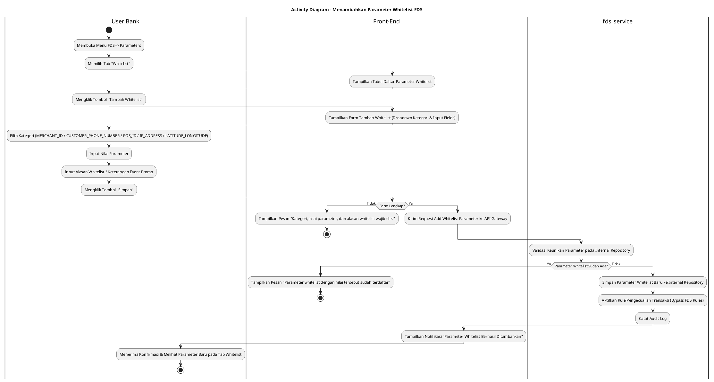
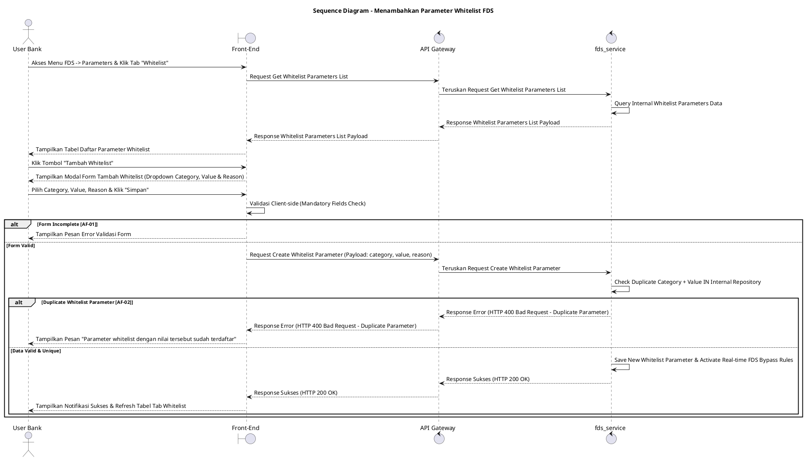

# 1 Deskripsi Use Case

**Tabel 1: Deskripsi Use Case Menambahkan Parameter Whitelist FDS**

| Elemen Spesifikasi | Deskripsi Detail |
| --- | --- |
| ID Use Case | UC-BOH-035 |
| Nama Use Case | Menambahkan Parameter Whitelist FDS |
| Penjelasan Singkat | Fitur Web Back Office Hibank pada menu FDS yang memfasilitasi User Bank (Fraud Risk Officer) untuk mendaftarkan entitas/parameter ke dalam daftar *Whitelist* (`fds_service`) sesuai SOP kebijakan Hibank (misalnya untuk mengakomodasi merchant peserta event promo atau lonjakan transaksi khusus) agar transaksi tidak terdeteksi atau terblokir palsu (*false positive*) oleh mesin aturan FDS. |
| Aktor Utama | User Bank (Fraud Risk / Anti-Money Laundering Administrator) |
| Aktor Pendukung | fds_service (Fraud Detection System Service) |
| Deskripsi Singkat | User Bank melakukan otentikasi login SSO ke Web Back Office Hibank dan mengakses menu **FDS** -> **Parameters**. Sistem menampilkan halaman pengelolaan parameter dengan beberapa tab. User Bank memilih tab **Whitelist**. Sistem menampilkan daftar parameter whitelist terdaftar beserta nilai (*value*), kategori, dan alasannya dari `fds_service`. User Bank mengklik tombol **"Tambah Whitelist"**. Sistem menampilkan modal/formulir penambahan parameter whitelist. User Bank memilih **Kategori Whitelist** (`MERCHANT_ID`, `CUSTOMER_PHONE_NUMBER`, `POS_ID`, `IP_ADDRESS`, `LATITUDE_LONGITUDE`), memasukkan **Nilai Parameter** (*parameter value*), serta menginput **Alasan Whitelist / Keterangan Event Promo** sesuai SOP kebijakan Hibank. User Bank mengklik tombol **"Simpan"**. Front-End memvalidasi kelengkapan form dan mengirim request ke API Gateway. Service `fds_service` memvalidasi keunikan parameter pada repositori internal FDS. Setelah validasi sukses, `fds_service` menyimpan parameter whitelist tersebut ke dalam repositori internal FDS sehingga transaksi yang mencocoki parameter ini akan diizinkan (*bypassed*) dari aturan pemicu FDS secara *real-time*. Front-End memperbarui tabel tab Whitelist dan menyajikan notifikasi konfirmasi sukses. |
| Pre-condition | 1. User Bank telah berhasil login SSO ke Web Back Office Hibank dan memiliki kewenangan otoritas *Fraud Risk Administrator*. 2. Adanya instruksi/pengajuan resmi sesuai SOP kebijakan Hibank (misal: pendaftaran promo merchant atau pengecualian transaksi khusus). 3. Service `fds_service` beroperasi dan terhubung dengan API Gateway. |
| Post-condition | 1. Parameter whitelist baru berhasil tersimpan pada repositori internal `fds_service`. 2. Transaksi yang mencocoki parameter whitelist tersebut diizinkan bertransaksi tanpa terkena pemicu *alert* atau pemblokiran palsu FDS secara *real-time*. 3. Front-End menyajikan data parameter whitelist baru pada tab Whitelist halaman Parameters FDS. |
| Trigger | User Bank mengklik menu **FDS** -> **Parameters**, memilih tab **Whitelist**, mengklik tombol **"Tambah Whitelist"**, menginput data kategori, nilai, dan alasan SOP/promo, lalu mengklik **"Simpan"**. |
| Nama Tabel | Tidak dapat diekspose (Dikelola secara internal di dalam `fds_service`) |
| Integrasi | 1. **Web Back Office Hibank UI:** Antarmuka tab Whitelist pada halaman Parameters FDS, formulir penambahan whitelist, dan validasi input. 2. **fds_service:** Microservice terisolasi pengelola daftar pengecualian aturan (*whitelist rules*) dan pengabaian pemicu alert FDS. |
| Asumsi | 1. Whitelist digunakan untuk mengakomodasi merchant peserta event promo atau kebutuhan khusus guna mencegah transaksi sah terblokir sebagai kecurangan (*false positive*). 2. Pengelolaan penghapusan dari whitelist dapat dilakukan sewaktu-waktu sesuai SOP kebijakan Hibank. |
| Keterbatasan | 1. Kategori whitelist terbatas pada 5 tipe entitas baku: `MERCHANT_ID`, `CUSTOMER_PHONE_NUMBER`, `POS_ID`, `IP_ADDRESS`, dan `LATITUDE_LONGITUDE`. 2. Pendaftaran whitelist wajib melampirkan alasan/referensi SOP kebijakan Hibank atau nama event promo yang disetujui. |
| Aturan Bisnis/Sistem | 1. **Category Selection Standard:** Penambahan parameter whitelist WAJIB memilih salah satu kategori baku dari pilihan: **`MERCHANT_ID`**, **`CUSTOMER_PHONE_NUMBER`**, **`POS_ID`**, **`IP_ADDRESS`**, atau **`LATITUDE_LONGITUDE`**. 2. **False Positive Prevention Standard:** Mesin aturan FDS WAJIB mengecualikan (*bypass*) pemicu alert dan pemblokiran transaksi otomatis secara *real-time* untuk entitas yang berada dalam daftar whitelist aktif. 3. **Internal Encapsulation Standard:** Data tabel internal `fds_service` DILARANG diekspose secara langsung ke Front-End; komunikasi wajib melalui API terisolasi. 4. **Mandatory SOP & Event Reason:** Pengisian Alasan Whitelist (misal: nama event promo merchant atau referensi dokumen SOP Hibank) bersifat WAJIB sebelum eksekusi diproses. 5. **Audit Trail Standard:** Setiap tindakan penambahan parameter whitelist mencatat `created_by` (ID User Bank), kategori, nilai, alasan SOP, dan timestamp pada jejak audit FDS. |
| Session Idle | 15 Menit |

# 2 Main Flow

**Tabel 2: Main Flow Menambahkan Parameter Whitelist FDS**

| No. | Aktivitas | Deskripsi |
| ---: | --- | --- |
| 1 | Membuka Menu FDS | User Bank melakukan login SSO dan mengklik menu utama **FDS**. |
| 2 | Memilih Menu Parameters | User Bank memilih sub-menu **Parameters**. |
| 3 | Memilih Tab Whitelist | User Bank mengklik tab **Whitelist** pada halaman Parameters FDS. |
| 4 | Menampilkan List Parameter Whitelist | Sistem menampilkan tabel daftar parameter whitelist dari `fds_service` beserta kategori, nilai parameter, dan alasannya. |
| 5 | Memilih Tombol Tambah Whitelist | User Bank mengklik tombol **"Tambah Whitelist"**. |
| 6 | Menampilkan Form Tambah Whitelist | Sistem menampilkan modal/form penambahan parameter whitelist yang memuat dropdown Kategori, input Nilai Parameter, dan textarea Alasan Whitelist. |
| 7 | Mengisi Form Parameter & Alasan Promo | User Bank memilih Kategori Whitelist, menginput Nilai Parameter, dan memasukkan Alasan Whitelist / Keterangan Event Promo. |
| 8 | Mengklik Tombol Simpan | User Bank mengklik tombol **"Simpan"**. |
| 9 | Memvalidasi Request Whitelist | Front-End memvalidasi kelengkapan form, lalu mengirim request pembuatan parameter whitelist ke API Gateway. |
| 10 | Menyimpan Parameter Whitelist Baru | Service `fds_service` memvalidasi keunikan data, menyimpan entitas ke repositori whitelist internal, serta mengaktifkan aturan pengecualian FDS *real-time*. |
| 11 | Menampilkan Konfirmasi Berhasil | Front-End memperbarui tabel tab Whitelist dan menampilkan notifikasi bahwa parameter whitelist berhasil ditambahkan. |
| 12 | Use Case Selesai | Proses penambahan parameter whitelist FDS selesai dilaksanakan. |

# 3 Alternative Flow

**Tabel 3: Alternative Flow Menambahkan Parameter Whitelist FDS**

| Kode | Alternative Flow | Deskripsi |
| --- | --- | --- |
| AF-01 | Kategori, Nilai, atau Alasan Kosong | Pada langkah 8-9, apabila Kategori tidak dipilih atau Nilai/Alasan dikosongkan, Sistem menolak request dan Front-End menampilkan `Kategori, nilai parameter, dan alasan whitelist wajib diisi`. |
| AF-02 | Parameter Whitelist Sudah Terdaftar | Pada langkah 10, apabila pasangan Kategori dan Nilai Parameter sudah ada pada repositori `fds_service`, Sistem membatalkan transaksi dan Front-End menampilkan `Parameter whitelist dengan nilai tersebut sudah terdaftar`. |
| AF-03 | Service FDS Tidak Merespon / Timeout | Pada langkah 10, apabila `fds_service` mengalami kendala koneksi atau timeout, API Gateway mengembalikan HTTP 500/504 dan Front-End menampilkan `Gagal memproses penambahan parameter whitelist pada fds_service`. |

# 4 Status Front-End

**Tabel 4: Status Front-End Menambahkan Parameter Whitelist FDS**

| No. | Nama Status | Deskripsi Tampilan Front-End |
| ---: | --- | --- |
| 1 | IDLE | Tab Whitelist menyajikan tabel daftar parameter dan modal tambah siap menerima masukan entitas. |
| 2 | LOADING | Indikator memuat (*spinner*) ditampilkan pada tombol Simpan saat request pembuatan parameter whitelist sedang diproses server. |
| 3 | SUCCESS | Modal/toast konfirmasi menampilkan pesan sukses parameter whitelist berhasil disimpan dan data tabel diperbarui. |
| 4 | ERROR | Pesan kesalahan ditampilkan pada UI akibat input kosong, duplikasi parameter, atau gangguan server. |

# 5 Activity Diagram Menambahkan Parameter Whitelist FDS

# 6 Sequence Diagram Menambahkan Parameter Whitelist FDS

# 7 Response Code

**Tabel 5: Response Code Menambahkan Parameter Whitelist FDS**

| No. | HTTP Status | Response Code | Nama Response | Deskripsi | Respons Front-End |
| ---: | ---: | --- | --- | --- | --- |
| 1 | 200 | 200XX00 | SUCCESS_CREATE_WHITELIST_PARAMETER | Parameter whitelist baru berhasil disimpan dan aturan pengecualian FDS diaktifkan. | Menampilkan pesan notifikasi sukses dan memperbarui tabel tab Whitelist. |
| 2 | 400 | 400XX00 | INVALID_WHITELIST_INPUT | Kategori, nilai parameter, atau alasan whitelist kosong. | Menampilkan pesan kesalahan validasi input. |
| 3 | 400 | 400XX01 | DUPLICATE_WHITELIST_PARAMETER | Pasangan kategori dan nilai parameter yang diinput sudah terdaftar di repositori whitelist. | Menampilkan pesan kesalahan `Parameter whitelist dengan nilai tersebut sudah terdaftar`. |
| 4 | 500 | 500XX00 | FDS_SERVICE_ERROR | Terjadi kegagalan internal pada `fds_service` saat mengeksekusi penambahan parameter whitelist. | Menampilkan pesan kesalahan `Gagal memproses penambahan parameter whitelist pada fds_service`. |

# 8 Desain Antarmuka

**Tabel 6: Desain Antarmuka Menambahkan Parameter Whitelist FDS**

| Halaman | Komponen dan State Utama |
| --- | --- |
| Halaman Parameters FDS (Tab Whitelist) | 1. **Navigasi Tab:** Tab **Blacklist**, Tab **Whitelist** (Active), Tab **Rule Thresholds**. 2. **Tabel Parameter Whitelist:** Kolom No, Kategori (`MERCHANT_ID`, `CUSTOMER_PHONE_NUMBER`, `POS_ID`, `IP_ADDRESS`, `LATITUDE_LONGITUDE`), Nilai Parameter, Alasan / Keterangan Event Promo, Tanggal Dibuat, Dibuat Oleh, dan Aksi. 3. **Tombol "Tambah Whitelist":** Tombol pemicu modal penambahan parameter (Primary Button). |
| Modal Form Tambah Whitelist | 1. **Dropdown Kategori:** Pilihan kategori (`MERCHANT_ID`, `CUSTOMER_PHONE_NUMBER`, `POS_ID`, `IP_ADDRESS`, `LATITUDE_LONGITUDE`). 2. **Field Nilai Parameter:** Input text/number sesuai format kategori. 3. **Textarea Alasan Whitelist:** Input wajib alasan / nama event promo merchant / referensi SOP. 4. **Tombol Aksi:** Tombol **"Simpan"** (Primary) dan **"Batal"** (Secondary). |
