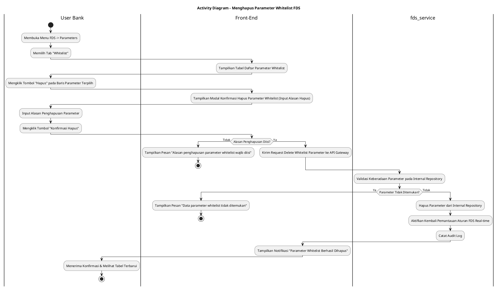
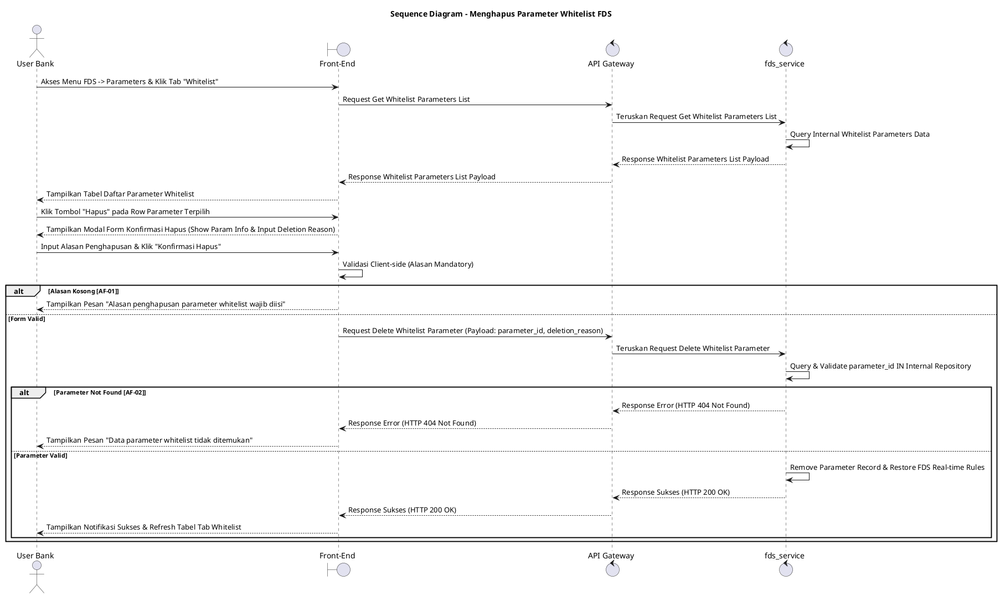

# 1 Deskripsi Use Case

**Tabel 1: Deskripsi Use Case Menghapus Parameter Whitelist FDS**

| Elemen Spesifikasi | Deskripsi Detail |
| --- | --- |
| ID Use Case | UC-BOH-036 |
| Nama Use Case | Menghapus Parameter Whitelist FDS |
| Penjelasan Singkat | Fitur Web Back Office Hibank pada menu FDS yang memfasilitasi User Bank (Fraud Risk Officer) untuk menghapus entitas/parameter dari daftar *Whitelist* (`fds_service`) sehingga pengecualian pemicu FDS terhadap nilai parameter tersebut dicabut dan kembali dipantau/dievaluasi secara *real-time*. |
| Aktor Utama | User Bank (Fraud Risk / Anti-Money Laundering Administrator) |
| Aktor Pendukung | fds_service (Fraud Detection System Service) |
| Deskripsi Singkat | User Bank melakukan otentikasi login SSO ke Web Back Office Hibank dan mengakses menu **FDS** -> **Parameters**. Sistem menampilkan halaman pengelolaan parameter dengan beberapa tab. User Bank memilih tab **Whitelist**. Sistem menampilkan daftar parameter whitelist terdaftar beserta nilai (*value*), kategori, dan alasannya dari `fds_service`. User Bank memilih salah satu entitas parameter whitelist yang ingin dihapus (misalnya event promo telah selesai atau adanya evaluasi ulang SOP), lalu mengklik tombol aksi **"Hapus"** (ikon tempat sampah). Sistem menampilkan modal konfirmasi penghapusan parameter whitelist yang meminta masukan **Alasan Penghapusan** (*deletion reason*). User Bank menginput alasan penghapusan dan mengklik tombol **"Konfirmasi Hapus"**. Front-End memvalidasi ketersediaan alasan dan mengirim request penghapusan ke API Gateway. Service `fds_service` memvalidasi keberadaan parameter pada repositori internal FDS. Setelah validasi sukses, `fds_service` menghapus (*soft delete* / merilis) record parameter whitelist tersebut dari repositori internal FDS serta mengaktifkan kembali mesin pemantauan aturan FDS secara *real-time* untuk nilai parameter tersebut. Front-End memperbarui tabel daftar parameter whitelist dan menyajikan notifikasi konfirmasi sukses. |
| Pre-condition | 1. User Bank telah berhasil login SSO ke Web Back Office Hibank dan memiliki kewenangan otoritas *Fraud Risk Administrator*. 2. Parameter whitelist yang akan dihapus terdaftar aktif pada repositori internal `fds_service`. |
| Post-condition | 1. Parameter whitelist terpilih berhasil dihapus/dirilis dari repositori internal `fds_service`. 2. Pengecualian pemicu FDS untuk nilai parameter tersebut dicabut sehingga transaksi mendatang kembali dievaluasi secara *real-time* oleh aturan FDS. 3. Alasan penghapusan dan ID penghapus tercatat pada jejak audit FDS. 4. Front-End memperbarui tampilan tabel tab Whitelist dengan menghapus baris parameter tersebut. |
| Trigger | User Bank mengklik menu **FDS** -> **Parameters**, memilih tab **Whitelist**, mengklik tombol aksi **"Hapus"** pada salah satu baris parameter, menginput alasan penghapusan, dan mengklik **"Konfirmasi Hapus"**. |
| Nama Tabel | Tidak dapat diekspose (Dikelola secara internal di dalam `fds_service`) |
| Integrasi | 1. **Web Back Office Hibank UI:** Antarmuka tab Whitelist pada halaman Parameters FDS, tombol aksi hapus, dan dialog konfirmasi penghapusan. 2. **fds_service:** Microservice terisolasi pengelola repositori whitelist, pemulihan aturan pemantauan transaksi otomatis FDS, serta penyedia API manajemen parameter. |
| Asumsi | 1. Penghapusan parameter whitelist dilakukan apabila event promo merchant telah berakhir atau adanya instruksi penyesuaian dari tim Fraud/Risk sesuai SOP Hibank. 2. Seluruh nama tabel database dan repositori FDS terisolasi secara internal di dalam `fds_service` demi alasan keamanan arsitektur. |
| Keterbatasan | 1. Parameter whitelist yang sudah dihapus tidak dapat dihapus ulang. 2. Pengisian alasan penghapusan parameter bersifat mandatori untuk kebutuhan jejak audit (*audit trail*). |
| Aturan Bisnis/Sistem | 1. **Mandatory Deletion Reason:** Pengisian alasan penghapusan parameter whitelist (*deletion_reason*) bersifat WAJIB sebelum eksekusi penghapusan diproses. 2. **Internal Encapsulation Standard:** Data tabel internal `fds_service` DILARANG diekspose secara langsung ke Front-End; komunikasi wajib melalui API terisolasi. 3. **Immediate Rule Re-activation Standard:** Setelah parameter berhasil dihapus dari `fds_service`, mesin aturan FDS WAJIB secara *real-time* mengaktifkan kembali pemantauan dan evaluasi transaksi otomatis terhadap nilai tersebut. 4. **Audit Trail Standard:** Setiap tindakan penghapusan parameter whitelist mencatat `deleted_by` (ID User Bank), `parameter_id`, `category`, `value`, alasan penghapusan, dan timestamp pada jejak audit FDS. |
| Session Idle | 15 Menit |

# 2 Main Flow

**Tabel 2: Main Flow Menghapus Parameter Whitelist FDS**

| No. | Aktivitas | Deskripsi |
| ---: | --- | --- |
| 1 | Membuka Menu FDS | User Bank melakukan login SSO dan mengklik menu utama **FDS**. |
| 2 | Memilih Menu Parameters | User Bank memilih sub-menu **Parameters**. |
| 3 | Memilih Tab Whitelist | User Bank mengklik tab **Whitelist** pada halaman Parameters FDS. |
| 4 | Menampilkan List Parameter Whitelist | Sistem menampilkan tabel daftar parameter whitelist dari `fds_service` beserta tombol aksi **"Hapus"** per baris parameter. |
| 5 | Memilih Tombol Hapus | User Bank mengklik tombol aksi **"Hapus"** pada salah satu baris parameter whitelist terpilih. |
| 6 | Menampilkan Modal Konfirmasi | Sistem menampilkan modal konfirmasi penghapusan yang memuat rincian kategori, nilai parameter, dan textarea Alasan Penghapusan. |
| 7 | Mengisi Alasan & Konfirmasi | User Bank menginput alasan penghapusan pada kolom textarea dan mengklik tombol **"Konfirmasi Hapus"**. |
| 8 | Memvalidasi Request Penghapusan | Front-End memvalidasi ketersediaan alasan dan mengirim request penghapusan parameter ke API Gateway. |
| 9 | Direct Remove & Restore FDS Rules | Service `fds_service` menghapus parameter dari repositori internal FDS, mengaktifkan kembali pemantauan aturan FDS secara *real-time*, dan mencatat audit log. |
| 10 | Menampilkan Konfirmasi Berhasil | Front-End memperbarui tabel daftar parameter whitelist dan menampilkan notifikasi bahwa parameter whitelist telah berhasil dihapus. |
| 11 | Use Case Selesai | Proses penghapusan parameter whitelist FDS selesai dilaksanakan. |

# 3 Alternative Flow

**Tabel 3: Alternative Flow Menghapus Parameter Whitelist FDS**

| Kode | Alternative Flow | Deskripsi |
| --- | --- | --- |
| AF-01 | Alasan Penghapusan Kosong | Pada langkah 7-8, apabila User Bank mengosongkan textarea alasan penghapusan, Sistem menolak request dan Front-End menampilkan `Alasan penghapusan parameter whitelist wajib diisi`. |
| AF-02 | Parameter Sudah Tidak Ditemukan | Pada langkah 9, apabila parameter whitelist yang akan dihapus sudah tidak ada pada repositori `fds_service`, Sistem membatalkan transaksi dan Front-End menampilkan `Data parameter whitelist tidak ditemukan`. |
| AF-03 | Service FDS Tidak Merespon / Timeout | Pada langkah 9, apabila `fds_service` mengalami kendala koneksi atau timeout, API Gateway mengembalikan HTTP 500/504 dan Front-End menampilkan `Gagal memproses penghapusan parameter whitelist pada fds_service`. |

# 4 Status Front-End

**Tabel 4: Status Front-End Menghapus Parameter Whitelist FDS**

| No. | Nama Status | Deskripsi Tampilan Front-End |
| ---: | --- | --- |
| 1 | IDLE | Tab Whitelist menyajikan tabel daftar parameter dan modal konfirmasi hapus siap menerima masukan alasan. |
| 2 | LOADING | Indikator memuat (*spinner*) ditampilkan pada tombol Konfirmasi Hapus saat request penghapusan sedang diproses server. |
| 3 | SUCCESS | Modal/toast konfirmasi menampilkan pesan sukses parameter whitelist berhasil dihapus dan baris tabel diperbarui. |
| 4 | ERROR | Pesan kesalahan ditampilkan pada UI akibat alasan kosong, data tidak ditemukan, atau gangguan server. |

# 5 Activity Diagram Menghapus Parameter Whitelist FDS

# 6 Sequence Diagram Menghapus Parameter Whitelist FDS

# 7 Response Code

**Tabel 5: Response Code Menghapus Parameter Whitelist FDS**

| No. | HTTP Status | Response Code | Nama Response | Deskripsi | Respons Front-End |
| ---: | ---: | --- | --- | --- | --- |
| 1 | 200 | 200XX00 | SUCCESS_DELETE_WHITELIST_PARAMETER | Parameter whitelist berhasil dihapus dari `fds_service` dan pemantauan FDS dipulihkan. | Menampilkan pesan notifikasi sukses dan memperbarui tabel tab Whitelist. |
| 2 | 400 | 400XX00 | INVALID_DELETION_REASON | Alasan penghapusan parameter whitelist yang dimasukkan tidak valid atau kosong. | Menampilkan pesan kesalahan `Alasan penghapusan parameter whitelist wajib diisi`. |
| 3 | 404 | 404XX00 | PARAMETER_NOT_FOUND | Parameter whitelist yang akan dihapus tidak ditemukan pada repositori `fds_service`. | Menampilkan pesan kesalahan `Data parameter whitelist tidak ditemukan`. |
| 4 | 500 | 500XX00 | FDS_SERVICE_ERROR | Terjadi kegagalan internal pada `fds_service` saat mengeksekusi penghapusan parameter whitelist. | Menampilkan pesan kesalahan `Gagal memproses penghapusan parameter whitelist pada fds_service`. |

# 8 Desain Antarmuka

**Tabel 6: Desain Antarmuka Menghapus Parameter Whitelist FDS**

| Halaman | Komponen dan State Utama |
| --- | --- |
| Halaman Parameters FDS (Tab Whitelist) | 1. **Navigasi Tab:** Tab **Blacklist**, Tab **Whitelist** (Active), Tab **Rule Thresholds**. 2. **Tabel Parameter Whitelist:** Kolom Kategori, Nilai Parameter, Alasan, Tanggal Dibuat, dan Aksi. 3. **Tombol "Hapus":** Tombol aksi pemicu modal penghapusan pada tiap baris parameter (Ikon Trash / Warna Merah). |
| Modal Konfirmasi Hapus Whitelist | 1. **Header Peringatan:** Judul konfirmasi penghapusan parameter whitelist. 2. **Info Parameter:** Menampilkan Kategori dan Nilai Parameter yang akan dihapus. 3. **Textarea Alasan Penghapusan:** Input wajib alasan penghapusan parameter. 4. **Tombol Aksi:** Tombol **"Konfirmasi Hapus"** (Primary Red) dan **"Batal"** (Secondary). |
