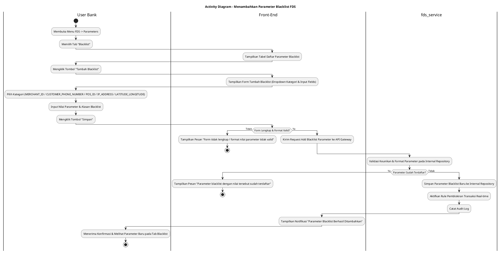
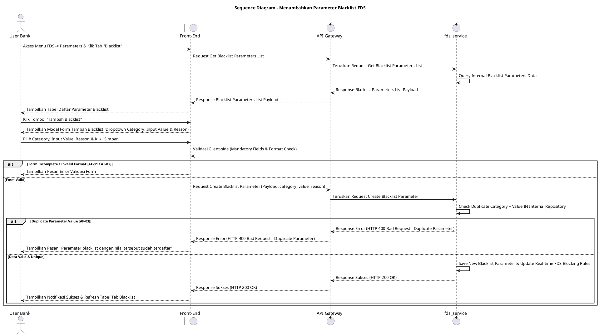

# 1 Deskripsi Use Case

**Tabel 1: Deskripsi Use Case Menambahkan Parameter Blacklist FDS**

| Elemen Spesifikasi | Deskripsi Detail |
| --- | --- |
| ID Use Case | UC-BOH-037 |
| Nama Use Case | Menambahkan Parameter Blacklist FDS |
| Penjelasan Singkat | Fitur Web Back Office Hibank pada menu FDS yang memfasilitasi User Bank (Fraud Risk Officer) untuk mengelola dan mendaftarkan entitas/parameter baru ke dalam daftar *Blacklist* berdasarkan kategori spesifik (`MERCHANT_ID`, `CUSTOMER_PHONE_NUMBER`, `POS_ID`, `IP_ADDRESS`, atau `LATITUDE_LONGITUDE`) melalui `fds_service`, termasuk untuk menindaklanjuti daftar daftar hitam (*blacklist*) yang diterbitkan oleh regulator resmi (seperti Bank Indonesia, OJK, atau PPATK). |
| Aktor Utama | User Bank (Fraud Risk / Anti-Money Laundering Administrator) |
| Aktor Pendukung | fds_service (Fraud Detection System Service) |
| Deskripsi Singkat | User Bank melakukan otentikasi login SSO ke Web Back Office Hibank dan mengakses menu **FDS** -> **Parameters**. Sistem menampilkan halaman pengelolaan parameter dengan beberapa tab. User Bank memilih tab **Blacklist**. Sistem menampilkan daftar parameter blacklist terdaftar beserta nilai (*value*), kategori, dan keterangan dari `fds_service`. User Bank mengklik tombol **"Tambah Blacklist"**. Sistem menampilkan modal/formulir penambahan parameter blacklist. User Bank memilih **Kategori Blacklist** yang akan diblokir dari pilihan dropdown (`MERCHANT_ID`, `CUSTOMER_PHONE_NUMBER`, `POS_ID`, `IP_ADDRESS`, `LATITUDE_LONGITUDE`), memasukkan **Nilai Parameter** (*parameter value*) yang terindikasi kecurangan internal atau berasal dari instruksi/daftar regulator, serta memberikan **Alasan Blacklist** (*reason*). User Bank mengklik tombol **"Simpan"**. Front-End memvalidasi kelengkapan inputan dan mengirim request ke API Gateway. Service `fds_service` memvalidasi format nilai serta keunikan parameter pada repositori internal FDS. Setelah validasi sukses, `fds_service` menyimpan entitas baru tersebut ke dalam repositori blacklist internal dan memperbarui aturan pemblokiran transaksi otomatis secara *real-time*. Front-End memperbarui tabel daftar parameter blacklist dan menampilkan notifikasi konfirmasi sukses. |
| Pre-condition | 1. User Bank telah berhasil login SSO ke Web Back Office Hibank dan memiliki kewenangan otoritas *Fraud Risk Administrator*. 2. Service `fds_service` beroperasi dan terhubung dengan API Gateway. |
| Post-condition | 1. Parameter blacklist baru berhasil tersimpan pada repositori internal `fds_service`. 2. Transaksi mendatang yang mencocoki nilai parameter blacklist tersebut (`MERCHANT_ID`, `CUSTOMER_PHONE_NUMBER`, `POS_ID`, `IP_ADDRESS`, atau `LATITUDE_LONGITUDE`) secara otomatis ditolak/diblokir oleh `fds_service`. 3. Front-End menyajikan data parameter blacklist baru pada tab Blacklist halaman Parameters FDS. |
| Trigger | User Bank mengklik menu **FDS** -> **Parameters**, memilih tab **Blacklist**, mengklik tombol **"Tambah Blacklist"**, memilih kategori, mengisi nilai & alasan, lalu mengklik **"Simpan"**. |
| Nama Tabel | Tidak dapat diekspose (Dikelola secara internal di dalam `fds_service`) |
| Integrasi | 1. **Web Back Office Hibank UI:** Antarmuka tab Blacklist pada halaman Parameters FDS, formulir penambahan parameter, dan validasi input. 2. **fds_service:** Microservice terisolasi pengelola daftar aturan blacklist, validasi kriteria kualifikasi fraud, dan eksekusi penolakan transaksi otomatis. |
| Asumsi | 1. Fitur ini dapat dimanfaatkan untuk memasukkan daftar *blacklist* internal maupun daftar parameter hitam yang secara resmi diinstruksikan oleh regulator (seperti Bank Indonesia, OJK, atau PPATK). 2. Seluruh entitas yang terdaftar pada parameter blacklist akan langsung digunakan oleh mesin aturan FDS untuk memblokir transaksi yang cocok. 3. Nama tabel repositori database FDS terisolasi secara internal di dalam `fds_service` demi alasan keamanan arsitektur. |
| Keterbatasan | 1. Kategori blacklist terbatas pada 5 tipe entitas baku: `MERCHANT_ID`, `CUSTOMER_PHONE_NUMBER`, `POS_ID`, `IP_ADDRESS`, dan `LATITUDE_LONGITUDE`. 2. Pasangan Kategori dan Nilai Parameter (`category` + `value`) yang diinput tidak boleh duplikat dengan data blacklist yang sudah ada. |
| Aturan Bisnis/Sistem | 1. **Category Selection Standard:** Penambahan parameter blacklist WAJIB memilih salah satu kategori baku dari pilihan: **`MERCHANT_ID`**, **`CUSTOMER_PHONE_NUMBER`**, **`POS_ID`**, **`IP_ADDRESS`**, atau **`LATITUDE_LONGITUDE`**. 2. **Regulatory & Internal Blacklist Input Standard:** Fitur ini mendukung pencatatan parameter blacklist yang bersumber dari hasil analisis internal maupun daftar instruksi kepatuhan regulator resmi (Bank Indonesia, OJK, PPATK). 3. **Internal Encapsulation Standard:** Data tabel internal `fds_service` DILARANG diekspose secara langsung ke Front-End; komunikasi wajib melalui API terisolasi. 4. **Value Uniqueness & Format Validation Standard:** Combination `category` dan `parameter_value` WAJIB unik. Format `IP_ADDRESS` (IPv4/IPv6) dan `LATITUDE_LONGITUDE` (koordinat desimal) WAJIB tervalidasi sesuai standar format masing-masing. 5. **Immediate Rule Enforcement:** Setelah parameter disimpan di `fds_service`, mesin aturan FDS WAJIB secara otomatis memblokir transaksi baru yang memuat kriteria nilai tersebut secara *real-time*. 6. **Mandatory Reason & Audit Trail:** Pengisian Alasan Blacklist bersifat WAJIB, dan setiap tindakan penambahan mencatat `created_by` (ID User Bank), kategori, nilai, alasan (termasuk referensi surat/instruksi regulator jika ada), serta timestamp pada jejak audit FDS. |
| Session Idle | 15 Menit |

# 2 Main Flow

**Tabel 2: Main Flow Menambahkan Parameter Blacklist FDS**

| No. | Aktivitas | Deskripsi |
| ---: | --- | --- |
| 1 | Membuka Menu FDS | User Bank melakukan login SSO dan mengklik menu utama **FDS**. |
| 2 | Memilih Menu Parameters | User Bank memilih sub-menu **Parameters**. |
| 3 | Memilih Tab Blacklist | User Bank mengklik tab **Blacklist** pada halaman Parameters FDS. |
| 4 | Menampilkan List Parameter Blacklist | Sistem menampilkan tabel daftar parameter blacklist dari `fds_service` beserta kategori, nilai parameter, dan alasannya. |
| 5 | Memilih Tombol Tambah Blacklist | User Bank mengklik tombol **"Tambah Blacklist"**. |
| 6 | Menampilkan Form Tambah Blacklist | Sistem menampilkan modal/form penambahan parameter blacklist yang memuat dropdown Kategori, input Nilai Parameter, dan textarea Alasan Blacklist. |
| 7 | Mengisi Form Parameter | User Bank memilih Kategori Blacklist (`MERCHANT_ID` / `CUSTOMER_PHONE_NUMBER` / `POS_ID` / `IP_ADDRESS` / `LATITUDE_LONGITUDE`), menginput Nilai Parameter, dan memasukkan Alasan Blacklist. |
| 8 | Mengklik Tombol Simpan | User Bank mengklik tombol **"Simpan"**. |
| 9 | Memvalidasi Request Parameter | Front-End memvalidasi kelengkapan form & format nilai, lalu mengirim request pembuatan parameter ke API Gateway. |
| 10 | Menyimpan Parameter Blacklist Baru | Service `fds_service` memvalidasi keunikan data dan format nilai, menyimpan entitas ke repositori blacklist internal, serta mengaktifkan aturan pemblokiran transaksi *real-time*. |
| 11 | Menampilkan Konfirmasi Berhasil | Front-End memperbarui tabel daftar parameter blacklist dan menampilkan notifikasi bahwa parameter blacklist berhasil ditambahkan. |
| 12 | Use Case Selesai | Proses penambahan parameter blacklist FDS selesai dilaksanakan. |

# 3 Alternative Flow

**Tabel 3: Alternative Flow Menambahkan Parameter Blacklist FDS**

| Kode | Alternative Flow | Deskripsi |
| --- | --- | --- |
| AF-01 | Kategori, Nilai, atau Alasan Kosong | Pada langkah 8-9, apabila Kategori tidak dipilih atau Nilai/Alasan dikosongkan, Sistem menolak request dan Front-End menampilkan `Kategori, nilai parameter, dan alasan blacklist wajib diisi`. |
| AF-02 | Format Nilai Parameter Tidak Valid | Pada langkah 8-10, apabila format `IP_ADDRESS` atau `LATITUDE_LONGITUDE` yang dimasukkan tidak sesuai format standar, Sistem menolak request dan Front-End menampilkan `Format nilai parameter tidak valid`. |
| AF-03 | Parameter Blacklist Sudah Terdaftar | Pada langkah 10, apabila pasangan Kategori dan Nilai Parameter sudah ada pada repositori `fds_service`, Sistem membatalkan transaksi dan Front-End menampilkan `Parameter blacklist dengan nilai tersebut sudah terdaftar`. |
| AF-04 | Service FDS Tidak Merespon / Timeout | Pada langkah 10, apabila `fds_service` mengalami kendala koneksi atau timeout, API Gateway mengembalikan HTTP 500/504 dan Front-End menampilkan `Gagal memproses penambahan parameter blacklist pada fds_service`. |

# 4 Status Front-End

**Tabel 4: Status Front-End Menambahkan Parameter Blacklist FDS**

| No. | Nama Status | Deskripsi Tampilan Front-End |
| ---: | --- | --- |
| 1 | IDLE | Tab Blacklist halaman Parameters menyajikan tabel daftar parameter dan modal tambah siap menerima masukan. |
| 2 | LOADING | Indikator memuat (*spinner*) ditampilkan pada tombol Simpan saat request pembuatan parameter blacklist sedang diproses server. |
| 3 | SUCCESS | Modal/toast konfirmasi menampilkan pesan sukses parameter blacklist berhasil disimpan dan data tabel diperbarui. |
| 4 | ERROR | Pesan kesalahan ditampilkan pada UI akibat input kosong, format nilai invalid, duplikasi parameter, atau gangguan server. |

# 5 Activity Diagram Menambahkan Parameter Blacklist FDS

# 6 Sequence Diagram Menambahkan Parameter Blacklist FDS

# 7 Response Code

**Tabel 5: Response Code Menambahkan Parameter Blacklist FDS**

| No. | HTTP Status | Response Code | Nama Response | Deskripsi | Respons Front-End |
| ---: | ---: | --- | --- | --- | --- |
| 1 | 200 | 200XX00 | SUCCESS_CREATE_BLACKLIST_PARAMETER | Parameter blacklist baru berhasil disimpan dan aturan pemblokiran transaksi diaktifkan. | Menampilkan pesan notifikasi sukses dan memperbarui tabel tab Blacklist. |
| 2 | 400 | 400XX00 | INVALID_PARAMETER_INPUT | Kategori, nilai parameter, atau alasan blacklist kosong / tidak memenuhi format baku. | Menampilkan pesan kesalahan validasi input. |
| 3 | 400 | 400XX01 | DUPLICATE_BLACKLIST_PARAMETER | Pasangan kategori dan nilai parameter yang dimasukkan sudah terdaftar di repositori blacklist. | Menampilkan pesan kesalahan `Parameter blacklist dengan nilai tersebut sudah terdaftar`. |
| 4 | 500 | 500XX00 | FDS_SERVICE_ERROR | Terjadi kegagalan internal pada `fds_service` saat mengeksekusi penambahan parameter blacklist. | Menampilkan pesan kesalahan `Gagal memproses penambahan parameter blacklist pada fds_service`. |

# 8 Desain Antarmuka

**Tabel 6: Desain Antarmuka Menambahkan Parameter Blacklist FDS**

| Halaman | Komponen dan State Utama |
| --- | --- |
| Halaman Parameters FDS (Tab Blacklist) | 1. **Navigasi Tab:** Tab **Blacklist** (Active), Tab **Whitelist**, Tab **Rule Thresholds**. 2. **Tabel Parameter Blacklist:** Kolom No, Kategori (`MERCHANT_ID`, `CUSTOMER_PHONE_NUMBER`, `POS_ID`, `IP_ADDRESS`, `LATITUDE_LONGITUDE`), Nilai Parameter, Alasan, Tanggal Dibuat, Dibuat Oleh, dan Aksi. 3. **Tombol "Tambah Blacklist":** Tombol pemicu modal penambahan parameter (Primary Button). |
| Modal Form Tambah Blacklist | 1. **Dropdown Kategori:** Pilihan kategori (`MERCHANT_ID`, `CUSTOMER_PHONE_NUMBER`, `POS_ID`, `IP_ADDRESS`, `LATITUDE_LONGITUDE`). 2. **Field Nilai Parameter:** Input text/number sesuai format kategori. 3. **Textarea Alasan Blacklist:** Input wajib alasan penambahan parameter ke blacklist. 4. **Tombol Aksi:** Tombol **"Simpan"** (Primary) dan **"Batal"** (Secondary). |
