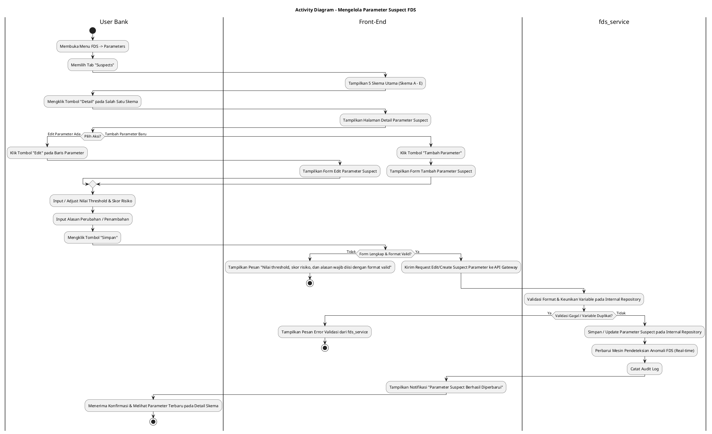
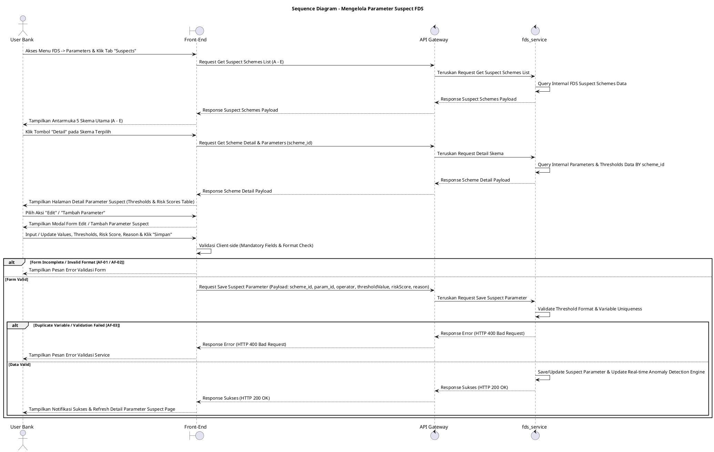

# 1 Deskripsi Use Case

**Tabel 1: Deskripsi Use Case Mengelola Parameter Suspect FDS**

| Elemen Spesifikasi | Deskripsi Detail |
| --- | --- |
| ID Use Case | UC-BOH-037 |
| Nama Use Case | Mengelola Parameter Suspect FDS |
| Penjelasan Singkat | Fitur Web Back Office Hibank pada menu FDS yang memfasilitasi Tim Fraud Analyst untuk meninjau, menambah, dan mengedit nilai ambang batas (*thresholds*) serta parameter logika pendeteksian anomali FDS berbasis 5 (lima) skema utama (A-Nominal Transaksi, B-Waktu Transaksi, C-Frekuensi & Pola Transaksi, D-Perangkat & Akses, E-QRIS & Channel) melalui `fds_service`. |
| Aktor Utama | User Bank (Fraud Risk / Anti-Money Laundering Analyst) |
| Aktor Pendukung | fds_service (Fraud Detection System Service) |
| Deskripsi Singkat | User Bank melakukan otentikasi login SSO ke Web Back Office Hibank dan mengakses menu **FDS** -> **Parameters**. Sistem menampilkan halaman pengelolaan parameter FDS. User Bank memilih tab **Suspects** (atau Suspect Parameter). Sistem menampilkan daftar 5 (lima) skema utama pendeteksian anomali FDS: **Skema A (Nominal Transaksi)**, **Skema B (Waktu Transaksi)**, **Skema C (Frekuensi & Pola Transaksi)**, **Skema D (Perangkat & Akses)**, dan **Skema E (QRIS & Channel)**. User Bank memilih salah satu skema dan mengklik tombol aksi **"Detail"**. Sistem menampilkan halaman/modal rincian parameter suspect yang berisi daftar variabel ambang batas (*thresholds*), skor bobot risiko (*risk score weight*), dan aturan logika pendeteksian. Dari halaman detail ini, User Bank dapat melakukan dua aksi utama: **(1) Mengedit Parameter:** User Bank mengklik **"Edit Parameter"**, mengubah nilai threshold atau bobot skor, memasukkan alasan perubahan, dan mengklik **"Simpan"**; atau **(2) Menambah Parameter Baru:** User Bank mengklik **"Tambah Parameter"**, memilih nama variabel aturan, mengkonfigurasi kondisi operator & nilai threshold, memasukkan bobot skor risiko, mengisi alasan penambahan, dan mengklik **"Simpan"**. Front-End memvalidasi kelengkapan form dan mengirim request ke API Gateway. Service `fds_service` memvalidasi keunikan serta kelayakan ambang batas pada repositori internal FDS. Setelah validasi sukses, `fds_service` memperbarui/menyimpan konfigurasi parameter suspect dan memperbarui mesin pendeteksian anomali secara *real-time*. Front-End memperbarui tampilan rincian parameter suspect dan menyajikan notifikasi konfirmasi sukses. |
| Pre-condition | 1. User Bank telah berhasil login SSO ke Web Back Office Hibank dan memiliki kewenangan otoritas *Fraud Analyst*. 2. Service `fds_service` beroperasi dan terhubung dengan API Gateway. |
| Post-condition | 1. Nilai ambang batas (*thresholds*), bobot skor risiko, atau parameter logika anomali FDS berhasil diperbarui/disimpan pada `fds_service`. 2. Mesin deteksi kecurangan FDS secara *real-time* menerapkan konfigurasi parameter suspect terbaru untuk mengevaluasi transaksi yang berjalan. 3. Alasan perubahan/penambahan dan ID pengubah tercatat pada jejak audit FDS. 4. Front-End menampilkan rincian parameter suspect terbaru pada tab Suspects halaman Parameters FDS. |
| Trigger | User Bank mengklik menu **FDS** -> **Parameters**, memilih tab **Suspects**, mengklik tombol **"Detail"** pada salah satu skema utama (A-E), lalu memilih aksi **"Edit Parameter"** atau **"Tambah Parameter"** dan mengklik **"Simpan"**. |
| Nama Tabel | Tidak dapat diekspose (Dikelola secara internal di dalam `fds_service`) |
| Integrasi | 1. **Web Back Office Hibank UI:** Antarmuka tab Suspects pada halaman Parameters FDS, kartu 5 skema utama, formulir rincian parameter, serta modal tambah/edit threshold. 2. **fds_service:** Microservice terisolasi pengelola repositori parameter FDS, kalkulasi bobot skor risiko, dan mesin pendeteksian anomali transaksi *real-time*. |
| Asumsi | 1. Skema pendeteksian dikelompokkan ke dalam 5 kategori baku (Nominal, Waktu, Frekuensi & Pola, Perangkat & Akses, QRIS & Channel) untuk mempermudah manajemen rule FDS. 2. Perubahan nilai threshold langsung mempengaruhi kriteria transaksi yang dikualifikasikan sebagai `MEDIUM_RISK` atau `HIGH_RISK`. 3. Seluruh repositori database FDS terisolasi secara internal di dalam `fds_service` demi keamanan arsitektur. |
| Keterbatasan | 1. Pengisian alasan perubahan atau penambahan parameter bersifat mandatori untuk kebutuhan jejak audit (*audit trail*). 2. Nilai threshold dan bobot skor risiko wajib bernilai positif dan sesuai dengan standar tipe data parameter. |
| Aturan Bisnis/Sistem | 1. **Five Core Schemes Classification Standard:** Pengelolaan parameter suspect WAJIB terklasifikasi ke dalam 5 (lima) skema baku: **Skema A (Nominal Transaksi)**, **Skema B (Waktu Transaksi)**, **Skema C (Frekuensi & Pola Transaksi)**, **Skema D (Perangkat & Akses)**, dan **Skema E (QRIS & Channel)**. 2. **Internal Encapsulation Standard:** Data tabel internal `fds_service` DILARANG diekspose secara langsung ke Front-End; komunikasi wajib melalui API terisolasi. 3. **Immediate Rule Engine Update Standard:** Perubahan atau penambahan nilai ambang batas (*threshold*) pada `fds_service` WAJIB secara *real-time* diterapkan oleh mesin deteksi anomali FDS terhadap seluruh transaksi yang masuk. 4. **Mandatory Change Reason & Audit Trail:** Pengisian alasan pengeditan/penambahan parameter suspect bersifat WAJIB, dan setiap tindakan mencatat `updated_by` / `created_by` (ID User Bank), kode skema, nama parameter, nilai lama, nilai baru, serta timestamp pada jejak audit FDS. |
| Session Idle | 15 Menit |

# 2 Main Flow

**Tabel 2: Main Flow Mengelola Parameter Suspect FDS**

| No. | Aktivitas | Deskripsi |
| ---: | --- | --- |
| 1 | Membuka Menu FDS | User Bank melakukan login SSO dan mengklik menu utama **FDS**. |
| 2 | Memilih Menu Parameters | User Bank memilih sub-menu **Parameters**. |
| 3 | Memilih Tab Suspects | User Bank mengklik tab **Suspects** (Suspect Parameter) pada halaman Parameters FDS. |
| 4 | Menampilkan 5 Skema Utama | Sistem menampilkan antarmuka 5 (lima) skema utama: Skema A (Nominal Transaksi), Skema B (Waktu Transaksi), Skema C (Frekuensi & Pola Transaksi), Skema D (Perangkat & Akses), dan Skema E (QRIS & Channel) dari `fds_service`. |
| 5 | Memilih Tombol Detail Skema | User Bank mengklik tombol aksi **"Detail"** pada salah satu kartu skema (misalnya Skema C-Frekuensi & Pola Transaksi). |
| 6 | Menampilkan Detail Parameter Suspect | Sistem menampilkan halaman/modal detail parameter suspect yang berisi tabel daftar variabel ambang batas (*thresholds*), skor bobot risiko, dan deskripsi aturan logika skema tersebut. |
| 7 | Memilih Aksi Edit atau Tambah | User Bank memilih aksi **"Edit"** pada salah satu baris parameter yang sudah ada atau mengklik tombol **"Tambah Parameter"** untuk menambahkan variabel baru. |
| 8 | Menampilkan Form Edit / Tambah | Sistem menampilkan form edit atau form tambah parameter suspect yang memuat field Nama Parameter, Operator Logic, Nilai Threshold, Skor Risiko, dan Textarea Alasan Perubahan. |
| 9 | Mengisi Form Parameter | User Bank menyesuaikan/menginput nilai threshold, operator logika, skor risiko, serta menginput Alasan Perubahan / Penambahan Parameter. |
| 10 | Mengklik Tombol Simpan | User Bank mengklik tombol **"Simpan"**. |
| 11 | Memvalidasi Request Parameter | Front-End memvalidasi kelengkapan form & kelayakan format angka, lalu mengirim request update/create parameter ke API Gateway. |
| 12 | Menyimpan & Update Engine FDS | Service `fds_service` memvalidasi keunikan serta batasan threshold, menyimpan konfigurasi baru ke repositori internal FDS, dan memperbarui mesin pendeteksian anomali secara *real-time*. |
| 13 | Menampilkan Konfirmasi Berhasil | Front-End memperbarui halaman detail parameter suspect dan menampilkan notifikasi konfirmasi bahwa konfigurasi parameter suspect berhasil diperbarui/ditambahkan. |
| 14 | Use Case Selesai | Proses pengelolaan parameter suspect FDS selesai dilaksanakan. |

# 3 Alternative Flow

**Tabel 3: Alternative Flow Mengelola Parameter Suspect FDS**

| Kode | Alternative Flow | Deskripsi |
| --- | --- | --- |
| AF-01 | Nilai Threshold / Alasan Kosong | Pada langkah 9-11, apabila nilai threshold, skor risiko, atau alasan perubahan dikosongkan, Sistem menolak request dan Front-End menampilkan `Nilai threshold, skor risiko, dan alasan perubahan wajib diisi`. |
| AF-02 | Format Nilai Threshold Tidak Valid | Pada langkah 9-11, apabila nilai threshold yang dimasukkan tidak sesuai tipe data (misal: memasukkan teks pada parameter angka), Sistem menolak request dan Front-End menampilkan `Format nilai threshold tidak valid`. |
| AF-03 | Parameter Baru Sudah Terdaftar pada Skema | Pada langkah 12, apabila menambahkan parameter baru yang nama/kode variabelnya sudah ada pada skema tersebut, `fds_service` membatalkan transaksi dan Front-End menampilkan `Parameter variabel tersebut sudah terdaftar pada skema ini`. |
| AF-04 | Service FDS Tidak Merespon / Timeout | Pada langkah 12, apabila `fds_service` mengalami kendala koneksi atau timeout, API Gateway mengembalikan HTTP 500/504 dan Front-End menampilkan `Gagal memproses pembaruan parameter suspect pada fds_service`. |

# 4 Status Front-End

**Tabel 4: Status Front-End Mengelola Parameter Suspect FDS**

| No. | Nama Status | Deskripsi Tampilan Front-End |
| ---: | --- | --- |
| 1 | IDLE | Tab Suspects menyajikan visualisasi 5 skema utama dan halaman detail siap menampilkan daftar threshold. |
| 2 | LOADING | Indikator memuat (*spinner*) ditampilkan saat mengunduh detail skema atau saat request pembaruan parameter sedang diproses server. |
| 3 | SUCCESS | Toast/modal konfirmasi menampilkan pesan sukses konfigurasi parameter suspect berhasil diperbarui dan tampilan detail direfresh. |
| 4 | ERROR | Pesan kesalahan ditampilkan pada UI akibat input kosong, format threshold invalid, duplikasi variabel, atau gangguan server. |

# 5 Activity Diagram Mengelola Parameter Suspect FDS

# 6 Sequence Diagram Mengelola Parameter Suspect FDS

# 7 Response Code

**Tabel 5: Response Code Mengelola Parameter Suspect FDS**

| No. | HTTP Status | Response Code | Nama Response | Deskripsi | Respons Front-End |
| ---: | ---: | --- | --- | --- | --- |
| 1 | 200 | 200XX00 | SUCCESS_SAVE_SUSPECT_PARAMETER | Parameter suspect / threshold berhasil disimpan dan mesin deteksi anomali FDS diperbarui. | Menampilkan pesan notifikasi sukses dan memperbarui tampilan detail parameter. |
| 2 | 400 | 400XX00 | INVALID_THRESHOLD_INPUT | Nilai threshold, skor risiko, atau alasan perubahan tidak valid / kosong. | Menampilkan pesan kesalahan validasi input. |
| 3 | 400 | 400XX01 | DUPLICATE_SUSPECT_VARIABLE | Variabel parameter baru yang dimasukkan sudah terdaftar pada skema tersebut. | Menampilkan pesan kesalahan `Parameter variabel tersebut sudah terdaftar pada skema ini`. |
| 4 | 404 | 404XX00 | SCHEME_OR_PARAMETER_NOT_FOUND | Skema utama atau parameter suspect yang akan diubah tidak ditemukan pada `fds_service`. | Menampilkan pesan kesalahan `Data skema atau parameter tidak ditemukan`. |
| 5 | 500 | 500XX00 | FDS_SERVICE_ERROR | Terjadi kegagalan internal pada `fds_service` saat mengeksekusi pembaruan parameter suspect. | Menampilkan pesan kesalahan `Gagal memproses pembaruan parameter suspect pada fds_service`. |

# 8 Desain Antarmuka

**Tabel 6: Desain Antarmuka Mengelola Parameter Suspect FDS**

| Halaman | Komponen dan State Utama |
| --- | --- |
| Halaman Parameters FDS (Tab Suspects) | 1. **Navigasi Tab:** Tab **Blacklist**, Tab **Whitelist**, Tab **Suspects** (Active), Tab **Rule Thresholds**. 2. **Kartu 5 Skema Utama:** Card **Skema A (Nominal Transaksi)**, **Skema B (Waktu Transaksi)**, **Skema C (Frekuensi & Pola Transaksi)**, **Skema D (Perangkat & Akses)**, dan **Skema E (QRIS & Channel)**. 3. **Tombol Aksi per Card:** Tombol **"Detail"** pada tiap kartu skema. |
| Halaman Detail Parameter Suspect | 1. **Header Skema:** Judul Skema Terpilih & Deskripsi Logika Anomali. 2. **Tabel Parameter & Threshold:** Kolom Variable Name, Operator (`>`, `<`, `=`, `BETWEEN`), Nilai Ambang Batas (*Threshold*), Skor Risiko, Status, dan Aksi (**Edit**). 3. **Tombol "Tambah Parameter":** Tombol pemicu penambahan variabel parameter baru (Primary Button). |
| Modal Form Edit / Tambah Parameter Suspect | 1. **Field Nama/Kode Variabel:** Text input / Dropdown variabel anomali. 2. **Dropdown Operator Logika:** Pilihan operator (`>`, `<`, `>=`, `<=`, `BETWEEN`). 3. **Field Nilai Threshold:** Input nilai ambang batas desimal/angka. 4. **Field Skor Risiko:** Input bobot skor risiko (0 - 100). 5. **Textarea Alasan Perubahan:** Input wajib alasan penyesuaian/penambahan parameter. 6. **Tombol Aksi:** Tombol **"Simpan"** (Primary) dan **"Batal"** (Secondary). |
