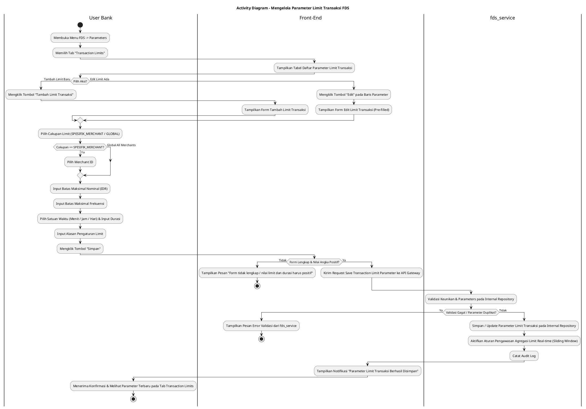
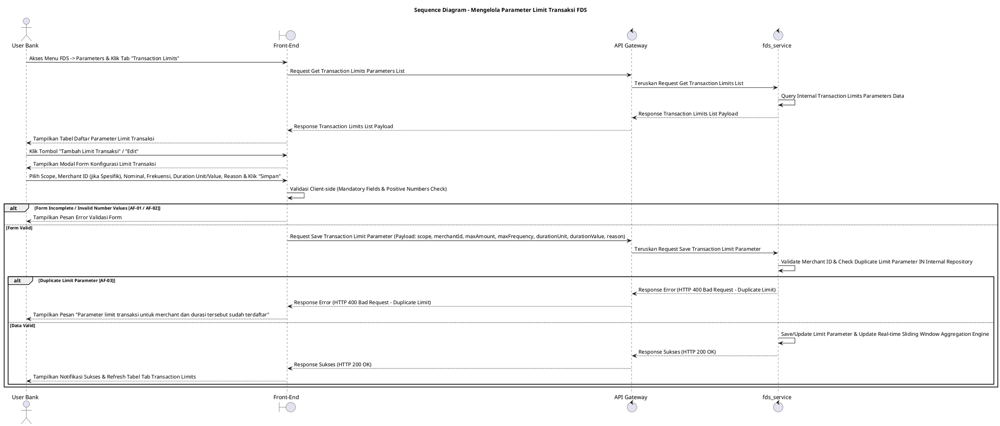

# 1 Deskripsi Use Case

**Tabel 1: Deskripsi Use Case Mengelola Parameter Limit Transaksi FDS**

| Elemen Spesifikasi | Deskripsi Detail |
| --- | --- |
| ID Use Case | UC-BOH-038 |
| Nama Use Case | Mengelola Parameter Limit Transaksi FDS |
| Penjelasan Singkat | Fitur Web Back Office Hibank pada menu FDS yang memfasilitasi Tim Fraud Analyst untuk mengatur dan mengelola parameter limit transaksi (agregasi nominal maupun frekuensi) baik yang berlaku spesifik untuk satu entitas merchant tertentu (*Merchant-Specific*) maupun berlaku secara umum (*Global All Merchants*) dalam rentang durasi waktu dinamis (menit, jam, atau hari) melalui `fds_service`. |
| Aktor Utama | User Bank (Fraud Risk / Anti-Money Laundering Analyst) |
| Aktor Pendukung | fds_service (Fraud Detection System Service) |
| Deskripsi Singkat | User Bank melakukan otentikasi login SSO ke Web Back Office Hibank dan mengakses menu **FDS** -> **Parameters**. Sistem menampilkan halaman pengelolaan parameter FDS dengan beberapa tab. User Bank memilih tab **Transaction Limits**. Sistem menampilkan tabel daftar parameter limit transaksi terdaftar yang memuat cakupan (*scope*: Specific Merchant / Global), batasan agregasi (maksimal nominal & maksimal frekuensi), durasi interval (menit, jam, hari), serta status keaktifannya dari `fds_service`. User Bank mengklik tombol **"Tambah Limit Transaksi"** (atau mengklik **"Edit"** pada baris parameter yang sudah ada). Sistem menampilkan modal/formulir konfigurasi limit transaksi. User Bank memilih **Cakupan Limit** (`SPESIFIK_MERCHANT` dengan memilih Merchant ID tertentu, atau `GLOBAL` untuk seluruh merchant), menginput **Batas Maksimal Nominal** (*max amount limit*), menginput **Batas Maksimal Frekuensi** (*max frequency limit*), menentukan **Satuan Waktu & Durasi Interval** (misal: 15 Menit, 1 Jam, 1 Hari), serta menginput **Alasan Pengaturan Limit**. User Bank mengklik tombol **"Simpan"**. Front-End memvalidasi kelengkapan form dan mengirim request ke API Gateway. Service `fds_service` memvalidasi keunikan serta kelayakan parameter limit pada repositori internal FDS. Setelah validasi sukses, `fds_service` menyimpan konfigurasi limit transaksi tersebut dan memperbarui mesin pengawasan transaksi *real-time*. Front-End memperbarui tabel tab Transaction Limits dan menyajikan notifikasi konfirmasi sukses. |
| Pre-condition | 1. User Bank telah berhasil login SSO ke Web Back Office Hibank dan memiliki kewenangan otoritas *Fraud Analyst*. 2. Service `fds_service` beroperasi dan terhubung dengan API Gateway. |
| Post-condition | 1. Parameter limit transaksi (nominal, frekuensi, cakupan, dan durasi interval) berhasil disimpan/diperbarui pada repositori internal `fds_service`. 2. Mesin FDS secara *real-time* mengawasi dan menolak/menandai transaksi yang melampaui ambang batas agregasi nominal atau frekuensi sesuai cakupan dan durasi yang ditetapkan. 3. Alasan pengesetan dan ID pengubah tercatat pada jejak audit FDS. 4. Front-End menyajikan data parameter limit transaksi terbaru pada tab Transaction Limits halaman Parameters FDS. |
| Trigger | User Bank mengklik menu **FDS** -> **Parameters**, memilih tab **Transaction Limits**, mengklik tombol **"Tambah Limit Transaksi"** (atau tombol **"Edit"**), memilih cakupan, mengisi batasan agregasi & durasi interval dinamis, menginput alasan, lalu mengklik **"Simpan"**. |
| Nama Tabel | Tidak dapat diekspose (Dikelola secara internal di dalam `fds_service`) |
| Integrasi | 1. **Web Back Office Hibank UI:** Antarmuka tab Transaction Limits pada halaman Parameters FDS, formulir pengesetan limit agregasi nominal/frekuensi, dan pemilih durasi waktu dinamis. 2. **fds_service:** Microservice terisolasi pengelola repositori limit transaksi, kalkulator agregasi *sliding window* (menit/jam/hari), serta eksekusi penolakan/pemberian alert transaksi melampaui limit. |
| Asumsi | 1. Pengesetan limit transaksi berfungsi sebagai pencegahan kecurangan (*fraud prevention*) guna membatasi dampak akumulasi transaksi abnormal dalam waktu singkat. 2. Durasi interval dihitung secara dinamis berbasis *sliding window* waktu (menit, jam, atau hari). 3. Seluruh repositori database FDS terisolasi secara internal di dalam `fds_service` demi keamanan arsitektur. |
| Keterbatasan | 1. Cakupan limit dibatasi pada 2 kategori utama: `SPESIFIK_MERCHANT` (Wajib memilih Merchant ID yang valid) dan `GLOBAL` (Berlaku untuk seluruh merchant terdaftar). 2. Satuan rentang durasi waktu didukung untuk 3 opsi dinamis: `MENIT`, `JAM`, dan `HARI`. 3. Batas nominal dan frekuensi wajib bernilai angka positif lebih besar dari nol. |
| Aturan Bisnis/Sistem | 1. **Limit Scope Standard:** Pengesetan limit transaksi WAJIB memilih salah satu Cakupan: **`SPESIFIK_MERCHANT`** (Wajib mengidentifikasi `merchant_id` yang terdaftar) atau **`GLOBAL`** (Berlaku terpusat untuk seluruh entitas merchant). 2. **Aggregation Type Standard:** Parameter limit WAJIB mendukung pengesetan **Batas Maksimal Nominal** (dalam mata uang IDR) dan/atau **Batas Maksimal Frekuensi Transaksi** (jumlah kali transaksi). 3. **Dynamic Time Window Standard:** Perhitungan akumulasi transaksi dilakukan secara dinamis berdasarkan rentang durasi yang ditentukan (`duration_value` dan `duration_unit` dari opsi: `MENIT`, `JAM`, atau `HARI`). 4. **Internal Encapsulation Standard:** Data tabel internal `fds_service` DILARANG diekspose secara langsung ke Front-End; komunikasi wajib melalui API terisolasi. 5. **Mandatory Reason & Audit Trail:** Pengisian Alasan Pengaturan Limit bersifat WAJIB, dan setiap tindakan mencatat `created_by` / `updated_by` (ID User Bank), cakupan, merchant_id (jika ada), nominal, frekuensi, durasi, alasan, dan timestamp pada jejak audit FDS. |
| Session Idle | 15 Menit |

# 2 Main Flow

**Tabel 2: Main Flow Mengelola Parameter Limit Transaksi FDS**

| No. | Aktivitas | Deskripsi |
| ---: | --- | --- |
| 1 | Membuka Menu FDS | User Bank melakukan login SSO dan mengklik menu utama **FDS**. |
| 2 | Memilih Menu Parameters | User Bank memilih sub-menu **Parameters**. |
| 3 | Memilih Tab Transaction Limits | User Bank mengklik tab **Transaction Limits** pada halaman Parameters FDS. |
| 4 | Menampilkan List Parameter Limit | Sistem menampilkan tabel daftar parameter limit transaksi dari `fds_service` beserta cakupan, merchant ID, limit nominal, limit frekuensi, durasi interval, dan alasannya. |
| 5 | Memilih Aksisi Tambah atau Edit | User Bank mengklik tombol **"Tambah Limit Transaksi"** (atau tombol **"Edit"** pada baris parameter yang sudah ada). |
| 6 | Menampilkan Form Limit Transaksi | Sistem menampilkan modal/form pengesetan limit transaksi yang memuat radio button Cakupan (`SPESIFIK_MERCHANT` / `GLOBAL`), dropdown Merchant ID (jika Spesifik), input Limit Nominal, input Limit Frekuensi, dropdown Satuan Waktu (Menit/Jam/Hari), input Durasi Interval, dan textarea Alasan Pengaturan Limit. |
| 7 | Mengisi Form Konfigurasi Limit | User Bank memilih Cakupan Limit (jika Spesifik Merchant, memilih Merchant ID), menginput Batas Maksimal Nominal, Batas Maksimal Frekuensi, memilih Satuan Waktu (Menit/Jam/Hari) & Nilai Durasi, serta memasukkan Alasan Pengaturan Limit. |
| 8 | Mengklik Tombol Simpan | User Bank mengklik tombol **"Simpan"**. |
| 9 | Memvalidasi Request Limit | Front-End memvalidasi kelengkapan form & format angka positif, lalu mengirim request pembuatan/pembaruan parameter limit ke API Gateway. |
| 10 | Menyimpan & Update Engine FDS | Service `fds_service` memvalidasi keunikan serta parameter limit pada repositori internal FDS, menyimpan konfigurasi baru, dan mengaktifkan aturan agregasi limit *real-time*. |
| 11 | Menampilkan Konfirmasi Berhasil | Front-End memperbarui tabel tab Transaction Limits dan menampilkan notifikasi konfirmasi bahwa parameter limit transaksi berhasil disimpan. |
| 12 | Use Case Selesai | Proses pengelolaan parameter limit transaksi FDS selesai dilaksanakan. |

# 3 Alternative Flow

**Tabel 3: Alternative Flow Mengelola Parameter Limit Transaksi FDS**

| Kode | Alternative Flow | Deskripsi |
| --- | --- | --- |
| AF-01 | Kolom Mandatory / Alasan Kosong | Pada langkah 7-9, apabila Merchant ID (pada cakupan Spesifik), nilai limit, durasi waktu, atau alasan dikosongkan, Sistem menolak request dan Front-End menampilkan `Seluruh kolom konfigurasi limit dan alasan wajib diisi`. |
| AF-02 | Nilai Nominal / Frekuensi Tidak Valid | Pada langkah 7-9, apabila nilai nominal, frekuensi, atau durasi yang dimasukkan bernilai 0 atau negatif, Sistem menolak request dan Front-End menampilkan `Nilai limit dan durasi harus bernilai angka positif lebih besar dari nol`. |
| AF-03 | Parameter Limit Sudah Terdaftar | Pada langkah 10, apabila menginput parameter limit untuk Merchant ID yang sama dengan durasi interval yang identik, `fds_service` membatalkan transaksi dan Front-End menampilkan `Parameter limit transaksi untuk merchant dan durasi tersebut sudah terdaftar`. |
| AF-04 | Service FDS Tidak Merespon / Timeout | Pada langkah 10, apabila `fds_service` mengalami kendala koneksi atau timeout, API Gateway mengembalikan HTTP 500/504 dan Front-End menampilkan `Gagal memproses pengesetan limit transaksi pada fds_service`. |

# 4 Status Front-End

**Tabel 4: Status Front-End Mengelola Parameter Limit Transaksi FDS**

| No. | Nama Status | Deskripsi Tampilan Front-End |
| ---: | --- | --- |
| 1 | IDLE | Tab Transaction Limits menyajikan tabel daftar parameter limit dan modal pengesetan siap menerima masukan konfigurasi. |
| 2 | LOADING | Indikator memuat (*spinner*) ditampilkan pada tombol Simpan saat request pengesetan limit transaksi sedang diproses server. |
| 3 | SUCCESS | Modal/toast konfirmasi menampilkan pesan sukses parameter limit transaksi berhasil disimpan dan data tabel diperbarui. |
| 4 | ERROR | Pesan kesalahan ditampilkan pada UI akibat input kosong, nilai non-positif, duplikasi parameter, atau gangguan server. |

# 5 Activity Diagram Mengelola Parameter Limit Transaksi FDS

# 6 Sequence Diagram Mengelola Parameter Limit Transaksi FDS

# 7 Response Code

**Tabel 5: Response Code Mengelola Parameter Limit Transaksi FDS**

| No. | HTTP Status | Response Code | Nama Response | Deskripsi | Respons Front-End |
| ---: | ---: | --- | --- | --- | --- |
| 1 | 200 | 200XX00 | SUCCESS_SAVE_TRANSACTION_LIMIT | Parameter limit transaksi berhasil disimpan dan mesin pengawasan agregasi FDS diperbarui. | Menampilkan pesan notifikasi sukses dan memperbarui tabel tab Transaction Limits. |
| 2 | 400 | 400XX00 | INVALID_TRANSACTION_LIMIT_INPUT | Cakupan, nominal, frekuensi, durasi waktu, atau alasan pengaturan limit tidak valid / kosong. | Menampilkan pesan kesalahan validasi input. |
| 3 | 400 | 400XX01 | DUPLICATE_TRANSACTION_LIMIT | Parameter limit transaksi untuk merchant dan interval durasi yang dimasukkan sudah terdaftar. | Menampilkan pesan kesalahan `Parameter limit transaksi untuk merchant dan durasi tersebut sudah terdaftar`. |
| 4 | 404 | 404XX00 | MERCHANT_NOT_FOUND | Merchant ID yang dipilih pada cakupan spesifik tidak ditemukan di database. | Menampilkan pesan kesalahan `Merchant ID yang dipilih tidak valid atau tidak ditemukan`. |
| 5 | 500 | 500XX00 | FDS_SERVICE_ERROR | Terjadi kegagalan internal pada `fds_service` saat mengeksekusi pengesetan limit transaksi. | Menampilkan pesan kesalahan `Gagal memproses pengesetan limit transaksi pada fds_service`. |

# 8 Desain Antarmuka

**Tabel 6: Desain Antarmuka Mengelola Parameter Limit Transaksi FDS**

| Halaman | Komponen dan State Utama |
| --- | --- |
| Halaman Parameters FDS (Tab Transaction Limits) | 1. **Navigasi Tab:** Tab **Blacklist**, Tab **Whitelist**, Tab **Suspects**, Tab **Transaction Limits** (Active). 2. **Tabel Parameter Limit Transaksi:** Kolom No, Cakupan (`SPESIFIK_MERCHANT` / `GLOBAL`), Merchant ID / Name, Batas Nominal (IDR), Batas Frekuensi, Rentang Waktu (mis: 15 Menit / 1 Jam / 1 Hari), Alasan, Status, dan Aksi (**Edit**). 3. **Tombol "Tambah Limit Transaksi":** Tombol pemicu modal pengesetan limit transaksi baru (Primary Button). |
| Modal Form Konfigurasi Limit Transaksi | 1. **Radio Button Cakupan:** Opsi **Spesifik Merchant** (`SPESIFIK_MERCHANT`) atau **Global (Seluruh Merchant)** (`GLOBAL`). 2. **Dropdown Search Merchant ID:** Pilihan Merchant ID (Aktif jika Spesifik Merchant). 3. **Field Batas Maksimal Nominal (IDR):** Currency input angka nominal. 4. **Field Batas Maksimal Frekuensi:** Number input frekuensi kali transaksi. 5. **Dropdown Satuan Waktu:** Pilihan `MENIT`, `JAM`, atau `HARI`. 6. **Field Nilai Durasi Interval:** Number input durasi waktu (misal: 15, 1, 24). 7. **Textarea Alasan Pengaturan Limit:** Input wajib alasan pengesetan parameter limit. 8. **Tombol Aksi:** Tombol **"Simpan"** (Primary) dan **"Batal"** (Secondary). |
