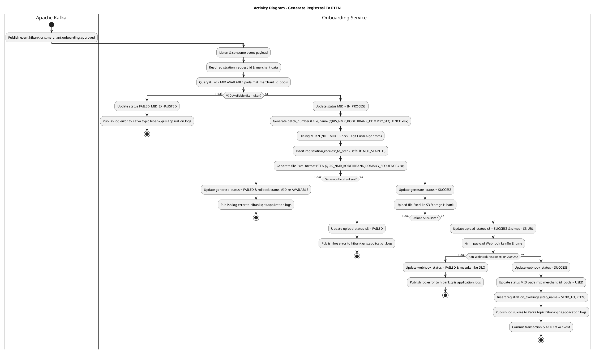
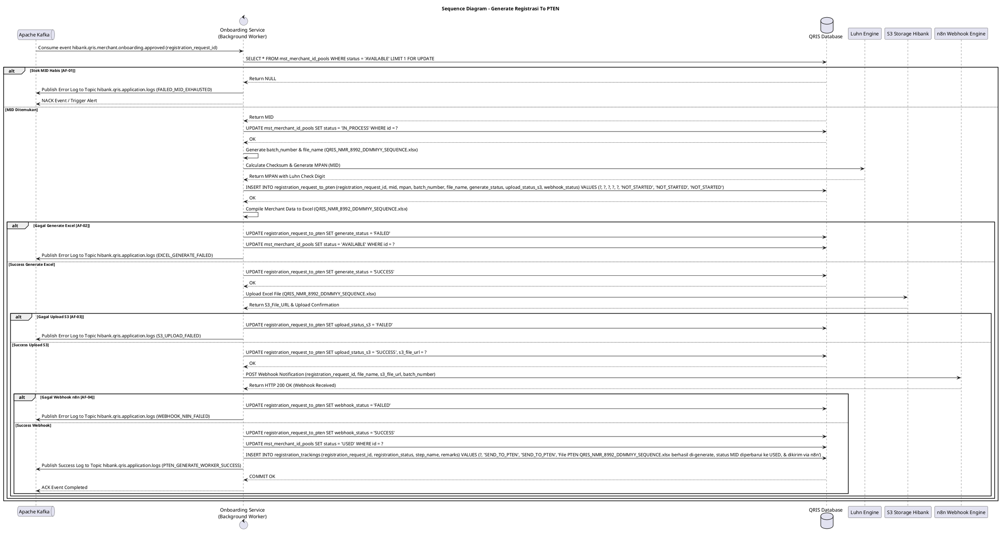

# 1 Deskripsi Use Case

**Tabel 1: Deskripsi Use Case Generate Registrasi To PTEN**

| Elemen Spesifikasi | Deskripsi Detail |
| --- | --- |
| ID Use Case | UC-BOH-004 |
| Nama Use Case | Generate Registrasi To PTEN |
| Penjelasan Singkat | Proses otomatisasi latar belakang (event-driven background consumer) pada Onboarding Service yang mendengarkan event approval Bank dari Kafka Topic, mengalokasikan MID dari pool database, meng-generate MPAN dengan algoritma Luhn, meng-generate `batch_number` untuk penamaan berkas Excel (`QRIS_NMR_KODEHIBANK_DDMMYY_SEQUENCE.xlsx`), mengunggah ke S3 Storage Hibank, memicu webhook n8n, memperbarui status MID menjadi `USED`, serta memublikasikan log transaksi ke Kafka Topic `hibank.qris.application.logs`. |
| Aktor Utama | Sistem (Onboarding Service - Background Worker) |
| Aktor Pendukung | Apache Kafka Broker, Object Storage S3 Hibank, n8n Automation Engine |
| Deskripsi Singkat | Onboarding Service mendengarkan (*listen/consume*) event payload dari Kafka Topic `hibank.qris.merchant.onboarding.approved`. Sistem membaca `registration_request_id`, mengambil Merchant ID (`mid`) dari tabel `mst_merchant_id_pools` berstatus `AVAILABLE`, dan memperbarui status MID menjadi `IN_PROCESS`. Sistem meng-generate `batch_number` sesuai format penamaan resmi PTEN `QRIS_NMR_KODEHIBANK_DDMMYY_SEQUENCE.xlsx` serta menghitung `MPAN` (*Merchant PAN*) berbasis MID dan *check digit* menggunakan **Luhn Algorithm**. Data registrasi disimpan ke tabel `registration_request_to_pten` (dengan nilai default `generate_status = 'NOT_STARTED'`, `upload_status_s3 = 'NOT_STARTED'`, dan `webhook_status = 'NOT_STARTED'`). Selanjutnya, sistem meng-generate berkas Excel sesuai format standar PTEN dengan nama file `QRIS_NMR_KODEHIBANK_DDMMYY_SEQUENCE.xlsx`, memperbarui `generate_status = 'SUCCESS'`, mengunggah berkas Excel ke **S3 Object Storage milik Hibank**, memperbarui `upload_status_s3 = 'SUCCESS'`, serta mengonfirmasi pengiriman ke PTEN via **n8n Webhook**, memperbarui `webhook_status = 'SUCCESS'`. Setelah seluruh proses selesai, sistem memperbarui status MID pada `mst_merchant_id_pools` dari `IN_PROCESS` menjadi `USED`, memublikasikan log eksekusi ke Kafka Topic `hibank.qris.application.logs`, dan mencatat riwayat pada `registration_trackings` (`step_name = 'SEND_TO_PTEN'`). |
| Pre-condition | 1. Permohonan registrasi merchant telah disetujui oleh User Approver Bank (`registration_status = 'APPROVED_BY_BANK'`). 2. Event pendaftaran berhasil dipublikasikan ke Kafka Topic `hibank.qris.merchant.onboarding.approved`. 3. Terdapat stok MID berstatus `AVAILABLE` pada tabel `mst_merchant_id_pools`. |
| Post-condition | 1. Stok MID pada `mst_merchant_id_pools` teralokasi dan statusnya berhasil diperbarui dari `IN_PROCESS` menjadi `USED`. 2. Berkas Excel registrasi PTEN berhasil dibuat dengan format penamaan baku `QRIS_NMR_KODEHIBANK_DDMMYY_SEQUENCE.xlsx`. 3. Nilai `MPAN` berbasis **Luhn Algorithm** dan `batch_number` berhasil di-generate. 4. Record baru tersimpan pada tabel `registration_request_to_pten` dengan seluruh flag `generate_status`, `upload_status_s3`, dan `webhook_status` bernilai `SUCCESS`. 5. Berkas Excel tersimpan aman di S3 Object Storage Hibank. 6. Webhook n8n berhasil terpicu untuk memproses registrasi lebih lanjut ke portal PTEN. 7. Log aktivitas worker berhasil dipublikasikan ke Kafka Topic `hibank.qris.application.logs`. 8. Rekam jejak ditambahkan pada `registration_trackings` (`step_name = 'SEND_TO_PTEN'`). |
| Trigger | Event baru diterima dari Kafka Topic `hibank.qris.merchant.onboarding.approved`. |
| Nama Tabel | registration_requests, mst_merchant_id_pools, registration_request_to_pten, registration_trackings |
| Integrasi | 1. **Apache Kafka Message Broker:** Consumes event approval (`hibank.qris.merchant.onboarding.approved`) dan publishes application logs ke topic `hibank.qris.application.logs`. 2. **Luhn Algorithm Engine:** Formula perhitungan 1-digit checksum Luhn untuk validasi struktur MPAN QRIS baku. 3. **Hibank S3 Object Storage:** Penyimpanan terenkripsi berkas Excel format PTEN (`QRIS_NMR_KODEHIBANK_DDMMYY_SEQUENCE.xlsx`). 4. **n8n Workflow Engine:** Layanan otomatisasi webhook untuk meneruskan berkas registrasi ke PTEN. |
| Asumsi | 1. Format file Excel dan struktur kolom sesuai spesifikasi baku PTEN (Penyelenggara Transfer Dana & Sistem Pembayaran). 2. Service n8n aktif dan siap menerima payload webhook dari Onboarding Service. |
| Keterbatasan | 1. Apabila stok MID berstatus `AVAILABLE` pada `mst_merchant_id_pools` habis (0 record), proses generasi dihentikan dan sistem memublikasikan log error ke `hibank.qris.application.logs` serta memicu *alert notification* ke tim infrastruktur. 2. Pengunggah file ke S3 dan pemicu webhook n8n bergantung pada ketersediaan jaringan ke S3 Storage dan endpoint n8n. |
| Aturan Bisnis/Sistem | 1. **Automated Kafka Event Consumption:** Service berjalan otomatis sebagai background consumer tanpa intervensi manual user. 2. **Centralized Application Logging via Kafka:** Seluruh log eksekusi worker background (berhasil, warning, maupun error) WAJIB dipublikasikan secara asinkron ke Kafka Topic `hibank.qris.application.logs`. 3. **Batch Number & File Naming Convention:** Generasi berkas Excel WAJIB menggunakan format baku penamaan file PTEN: `QRIS_NMR_KODEHIBANK_DDMMYY_SEQUENCE.xlsx` (contoh: `QRIS_NMR_8992_020826_00001.xlsx` dengan `KODEHIBANK = 8992`). 4. **Atomic MID Allocation & Status Lifecycle:** Pengambilan MID dari `mst_merchant_id_pools` WAJIB menggunakan transaksi *atomic lock* (`SELECT ... FOR UPDATE`) untuk mencegah duplikasi pemakaian MID (*race condition*). Status MID diubah pertama kali menjadi `IN_PROCESS`. Setelah proses generasi file Excel, upload S3, dan pengiriman webhook n8n berhasil, status MID pada `mst_merchant_id_pools` diperbarui secara permanen dari `IN_PROCESS` menjadi `USED`. 5. **MPAN Generation via Luhn Algorithm:** MPAN dibentuk dari kombinasi *National Identifier (NII)* Hibank + MID + 1-digit *check digit* yang dihitung secara presisi menggunakan **Luhn Checksum Algorithm** (ISO/IEC 7812-1). 6. **Default Status Initialization:** Saat insert awal ke tabel `registration_request_to_pten`, kolom status diinisialisasi otomatis: &nbsp;&nbsp;- `generate_status = 'NOT_STARTED'` &nbsp;&nbsp;- `upload_status_s3 = 'NOT_STARTED'` &nbsp;&nbsp;- `webhook_status = 'NOT_STARTED'` 7. **Sequential Processing & Status Update:** &nbsp;&nbsp;a. **Tahap 1 Generate Excel:** Setelah file Excel berhasil disusun, update `generate_status = 'SUCCESS'`. &nbsp;&nbsp;b. **Tahap 2 Upload S3:** Setelah file berhasil diunggah ke S3 Hibank, update `upload_status_s3 = 'SUCCESS'`. &nbsp;&nbsp;c. **Tahap 3 Webhook n8n:** Setelah payload webhook diterima n8n dengan respon HTTP 200 OK, update `webhook_status = 'SUCCESS'`. &nbsp;&nbsp;d. **Tahap 4 MID Finalization:** Setelah webhook sukses, update status MID pada `mst_merchant_id_pools` menjadi `USED`. 8. **Tracking Timeline Update:** Setelah seluruh tahap generasi, webhook, dan update status MID `USED` sukses, Onboarding Service memperbarui rekam jejak pada `registration_trackings` (`step_name = 'SEND_TO_PTEN'`) serta memublikasikan log sukses ke Kafka Topic `hibank.qris.application.logs`. |
| Session Idle | 15 Menit |

# 2 Main Flow

**Tabel 2: Main Flow Generate Registrasi To PTEN**

| No. | Aktivitas | Deskripsi |
| ---: | --- | --- |
| 1 | Menerima Event Kafka Approval | Onboarding Service mendengarkan dan menerima payload event dari Kafka Topic `hibank.qris.merchant.onboarding.approved`. |
| 2 | Membaca Data Registration Request | Onboarding Service mendeskripsikan payload event dan mengambil `registration_request_id` serta data detail merchant terkait. |
| 3 | Mengambil & Mengunci MID Available | Onboarding Service melakukan *query lock* ke `mst_merchant_id_pools` untuk mengambil 1 MID berstatus `AVAILABLE`, lalu memperbarui status MID tersebut menjadi `IN_PROCESS`. |
| 4 | Generating Batch Number & File Name | Onboarding Service meng-generate `batch_number` sekuensial harian dan menentukan nama berkas Excel baku: `QRIS_NMR_KODEHIBANK_DDMMYY_SEQUENCE.xlsx` (misal dengan `KODEHIBANK = 8992`: `QRIS_NMR_8992_020826_00001.xlsx`). |
| 5 | Calculating MPAN via Luhn Algorithm | Onboarding Service menghitung `MPAN` (*Merchant PAN*) menggunakan algoritma **Luhn Algorithm** berbasis MID yang telah dialokasikan. |
| 6 | Menginisialisasi Record Registrasi PTEN | Onboarding Service memasukkan record baru ke tabel `registration_request_to_pten` (menyimpan `batch_number` & `file_name`) dengan status default `generate_status = 'NOT_STARTED'`, `upload_status_s3 = 'NOT_STARTED'`, dan `webhook_status = 'NOT_STARTED'`. |
| 7 | Generating Berkas Excel PTEN | Onboarding Service mengompilasi data merchant ke dalam berkas Excel `QRIS_NMR_KODEHIBANK_DDMMYY_SEQUENCE.xlsx` sesuai format baku spesifikasi PTEN, lalu memperbarui `generate_status = 'SUCCESS'` pada `registration_request_to_pten`. |
| 8 | Mengunggah Berkas Excel ke S3 Hibank | Onboarding Service mengunggah berkas Excel `QRIS_NMR_KODEHIBANK_DDMMYY_SEQUENCE.xlsx` ke bucket S3 Object Storage Hibank, mendapatkan S3 File URL, lalu memperbarui `upload_status_s3 = 'SUCCESS'` dan menyimpan URL S3 ke database. |
| 9 | Mengirimkan Webhook ke n8n Engine | Onboarding Service mengontak endpoint webhook **n8n** membawa payload metadata registrasi, nama file Excel, dan URL S3 untuk diteruskan ke portal PTEN. |
| 10 | Memperbarui Status Webhook, MID, Log & Trackings | Setelah mendapat konfirmasi sukses dari n8n, Onboarding Service memperbarui `webhook_status = 'SUCCESS'` pada `registration_request_to_pten`, memperbarui status MID pada `mst_merchant_id_pools` dari `IN_PROCESS` menjadi `USED`, memublikasikan log ke Kafka Topic `hibank.qris.application.logs`, dan menambahkan entri riwayat pada `registration_trackings` (`step_name = 'SEND_TO_PTEN'`). |
| 11 | Use Case Selesai | Proses generasi berkas PTEN (`QRIS_NMR_KODEHIBANK_DDMMYY_SEQUENCE.xlsx`) dan alokasi MID final (`USED`) selesai sepenuhnya, lalu event di-ack (*acknowledge*) pada Kafka Cluster. |

# 3 Alternative Flow

**Tabel 3: Alternative Flow Generate Registrasi To PTEN**

| Kode | Alternative Flow | Deskripsi |
| --- | --- | --- |
| AF-01 | Stok MID Pools Habis (No Available MID) | Pada langkah 3, apabila tidak terdapat stok MID berstatus `AVAILABLE` di `mst_merchant_id_pools`, Sistem membatalkan proses, meng-update status permintaan menjadi `FAILED_MID_EXHAUSTED`, memublikasikan log error ke Kafka Topic `hibank.qris.application.logs`, dan mengirimi alert ke tim Operasional Bank. |
| AF-02 | Gagal Generasi File Excel PTEN | Pada langkah 7, apabila terjadi error kompilasi file Excel `QRIS_NMR_KODEHIBANK_DDMMYY_SEQUENCE.xlsx` (misal format data corrupted), Sistem memperbarui `generate_status = 'FAILED'`, mengembalikan status MID dari `IN_PROCESS` menjadi `AVAILABLE` pada `mst_merchant_id_pools`, memublikasikan log error ke `hibank.qris.application.logs`, dan menjadwalkan ulang retry otomatis. |
| AF-03 | Gagal Upload ke S3 Object Storage | Pada langkah 8, apabila koneksi ke S3 Object Storage Hibank mengalami timeout atau error kredensial, Sistem memperbarui `upload_status_s3 = 'FAILED'`, memublikasikan log error ke `hibank.qris.application.logs`, mempertahankan status MID `IN_PROCESS`, dan memicu mekanisme retry eksponensial (*exponential backoff retry*). |
| AF-04 | Gagal Pengiriman Webhook ke n8n Engine | Pada langkah 9, apabila endpoint n8n tidak merespon (HTTP 5xx / Timeout), Sistem memperbarui `webhook_status = 'FAILED'`, memublikasikan log error ke `hibank.qris.application.logs`, mempertahankan status MID `IN_PROCESS`, dan mendaftarkan permintaan ke antrean *dead-letter queue (DLQ)* untuk dikirim ulang. |

# 4 Status Front-End

**Tabel 4: Status Front-End / Process Execution Status Generate Registrasi To PTEN**

| No. | Nama Status | Deskripsi Status Eksekusi Process Worker |
| ---: | --- | --- |
| 1 | NOT_STARTED | State awal record saat dimasukkan ke tabel `registration_request_to_pten`. |
| 2 | IN_PROCESS | State saat Onboarding Service sedang mengalokasikan MID (`IN_PROCESS`), meng-generate nama file `QRIS_NMR_KODEHIBANK_DDMMYY_SEQUENCE.xlsx`, menghitung MPAN Luhn, atau mengompilasi Excel. |
| 3 | GENERATE_SUCCESS | Flag `generate_status = 'SUCCESS'` ketika berkas Excel format PTEN `QRIS_NMR_KODEHIBANK_DDMMYY_SEQUENCE.xlsx` selesai dibuat. |
| 4 | UPLOAD_S3_SUCCESS | Flag `upload_status_s3 = 'SUCCESS'` ketika berkas Excel berhasil diunggah ke S3 Storage Hibank. |
| 5 | WEBHOOK_SUCCESS | Flag `webhook_status = 'SUCCESS'` ketika n8n webhook berhasil menerima payload. |
| 6 | MID_USED | Status akhir alokasi MID pada `mst_merchant_id_pools` diperbarui dari `IN_PROCESS` menjadi `USED`. |
| 7 | FAILED_RETRYABLE | State kegagalan sementara yang akan di-retry otomatis oleh background job dan dicatat di `hibank.qris.application.logs`. |

# 5 Activity Diagram Generate Registrasi To PTEN

# 6 Sequence Diagram Generate Registrasi To PTEN

# 7 Response Code

**Tabel 5: Response Code / Worker Execution Status Code**

| No. | Internal Code | Status Name | Deskripsi | Aksi Sistem |
| ---: | --- | --- | --- | --- |
| 1 | 200ONB01 | PTEN_GENERATE_SUCCESS | File Excel `QRIS_NMR_KODEHIBANK_DDMMYY_SEQUENCE.xlsx` format PTEN berhasil di-generate dan `generate_status` di-update menjadi `SUCCESS`. | Melanjutkan ke proses upload S3 Object Storage. |
| 2 | 200ONB02 | PTEN_S3_UPLOAD_SUCCESS | File Excel `QRIS_NMR_KODEHIBANK_DDMMYY_SEQUENCE.xlsx` berhasil diunggah ke S3 Object Storage Hibank dan `upload_status_s3` di-update menjadi `SUCCESS`. | Melanjutkan ke pengiriman webhook n8n. |
| 3 | 200ONB03 | PTEN_WEBHOOK_DELIVERED | Payload Webhook beserta `file_name` berhasil diterima n8n engine (HTTP 200 OK), `webhook_status` di-update `SUCCESS`, status MID pada `mst_merchant_id_pools` di-update menjadi `USED`, `registration_trackings` (`SEND_TO_PTEN`) di-insert, dan log dipublikasikan ke `hibank.qris.application.logs`. | Menyelesaikan transaksi & ACK Kafka event. |
| 4 | 400ONB01 | ERR_MID_EXHAUSTED | Stok Merchant ID (`mid`) berstatus `AVAILABLE` pada `mst_merchant_id_pools` kosong. | Menghentikan alur, memublikasikan log error ke `hibank.qris.application.logs`, & mengirim alert operasional. |
| 5 | 500ONB01 | ERR_EXCEL_GENERATE_FAILED | Terjadi kesalahan kompilasi struktur data Excel PTEN. | Set `generate_status = 'FAILED'`, kembalikan status MID ke `AVAILABLE`, memublikasikan log error ke `hibank.qris.application.logs`, & trigger retry worker. |
| 6 | 500ONB02 | ERR_S3_UPLOAD_FAILED | Gagal mengunggah berkas `QRIS_NMR_KODEHIBANK_DDMMYY_SEQUENCE.xlsx` ke S3 Storage Hibank. | Set `upload_status_s3 = 'FAILED'`, memublikasikan log error ke `hibank.qris.application.logs`, & trigger retry worker. |
| 7 | 500ONB03 | ERR_WEBHOOK_N8N_FAILED | Endpoint n8n webhook gagal merespon atau timeout. | Set `webhook_status = 'FAILED'`, memublikasikan log error ke `hibank.qris.application.logs`, & masukan ke DLQ. |

# 8 Desain Antarmuka

**Tabel 6: Desain Antarmuka / Status Monitor Dashboard Batch PTEN**

| Halaman | Komponen dan State Utama |
| --- | --- |
| Dashboard Monitoring Batch PTEN (Back Office Hibank) | - Tabel Status Batch Registrasi PTEN (`registration_request_to_pten`). - Kolom: `batch_number`, Nama File (`QRIS_NMR_KODEHIBANK_DDMMYY_SEQUENCE.xlsx`), `registration_number`, `mid`, `mpan`, `generate_status`, `upload_status_s3`, `webhook_status`, Status MID (`USED`), Tanggal Eksekusi. - Indicator Badges: &nbsp;&nbsp;* `generate_status`: `NOT_STARTED` (Gray), `SUCCESS` (Green), `FAILED` (Red). &nbsp;&nbsp;* `upload_status_s3`: `NOT_STARTED` (Gray), `SUCCESS` (Green), `FAILED` (Red). &nbsp;&nbsp;* `webhook_status`: `NOT_STARTED` (Gray), `SUCCESS` (Green), `FAILED` (Red). &nbsp;&nbsp;* `mid_status`: `USED` (Blue). - Link Aksi **"Download File S3"** & Tombol **"Retry Batch"** (hanya aktif jika status `FAILED`). |
