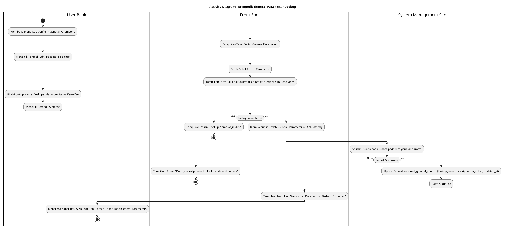
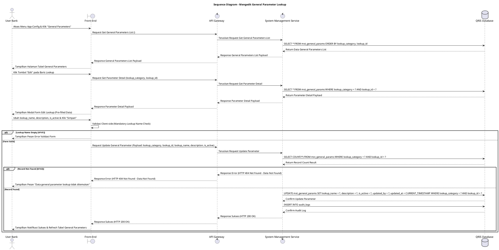

# 1 Deskripsi Use Case

**Tabel 1: Deskripsi Use Case Mengedit General Parameter Lookup**

| Elemen Spesifikasi | Deskripsi Detail |
| --- | --- |
| ID Use Case | UC-BOH-041 |
| Nama Use Case | Mengedit General Parameter Lookup |
| Penjelasan Singkat | Fitur Web Back Office Hibank pada menu App-Config yang memfasilitasi User Bank (System Administrator) untuk memperbarui informasi Lookup Name, Deskripsi, dan Status Keaktifan pada data *lookup* / parameter umum terdaftar di tabel `mst_general_params` melalui System Management Service. |
| Aktor Utama | User Bank (System Administrator / Back Office Hibank User) |
| Aktor Pendukung | System Management Service (`system_management_service`) |
| Deskripsi Singkat | User Bank melakukan otentikasi login SSO ke Web Back Office Hibank dan mengakses menu **App-Config** -> **General Parameters**. Sistem menampilkan halaman daftar data *lookup* / parameter umum terdaftar dari tabel `mst_general_params`. User Bank memilih salah satu data lookup yang ingin diubah, lalu mengklik tombol aksi **"Edit"**. Sistem menampilkan modal formulir pengeditan general parameter yang terisi (*pre-filled*) dengan data terkini. Kategori Data Lookup (*lookup_category*) dan Lookup ID (*lookup_id*) terkunci (*read-only*). User Bank memperbarui Lookup Name (*lookup_name*), Deskripsi (*description*), dan/atau menukar Status Keaktifan (*is_active*), lalu mengklik tombol **"Simpan"**. Front-End memvalidasi kelengkapan form dan mengirimkan request pembaruan ke API Gateway. System Management Service memvalidasi keberadaan data pada tabel `mst_general_params`. Setelah validasi sukses, service memperbarui record parameter lookup pada tabel **`mst_general_params`** dan mencatat jejak perubahan ke tabel **`audit_logs`**. Front-End memperbarui tabel daftar general parameters dan menyajikan notifikasi konfirmasi bahwa data lookup berhasil diperbarui. |
| Pre-condition | 1. User Bank telah berhasil login SSO ke Web Back Office Hibank dan memiliki hak akses pengelolaan konfigurasi sistem (`APP_CONFIG_ADMIN`). 2. Data parameter lookup yang akan diubah telah terdaftar pada tabel `mst_general_params`. |
| Post-condition | 1. Data Lookup Name (`lookup_name`), Deskripsi (`description`), dan Status Keaktifan (`is_active`) berhasil diperbarui pada tabel `mst_general_params`. 2. Perubahan parameter lookup langsung berdampak pada microservice yang mengkonsumsi referensi data konfigurasi tersebut. 3. Front-End memperbarui dan menampilkan data lookup terbaru pada daftar General Parameters. |
| Trigger | User Bank mengklik menu **App-Config** -> **General Parameters**, mengklik tombol **"Edit"** pada baris data lookup, mengubah Lookup Name, Deskripsi, atau Status Keaktifan, lalu mengklik **"Simpan"**. |
| Nama Tabel | mst_general_params, audit_logs |
| Integrasi | 1. **Web Back Office Hibank UI:** Antarmuka daftar General Parameters, tombol aksi pengeditan, dan modal formulir pembaruan data lookup. 2. **System Management Service (`system_management_service`):** Microservice backend pengelola pembaruan, validasi data, dan pencatatan audit log general parameters. |
| Asumsi | 1. Kategori Data Lookup (`lookup_category`) dan Lookup ID (`lookup_id`) tidak dapat diubah setelah data dibuat demi menjaga integritas relasi referensi antar sistem. 2. Pembaruan status menjadi nonaktif (`is_active = false`) menyembunyikan opsi lookup dari pilihan transaksi baru tanpa menghapus record historis. |
| Keterbatasan | 1. Pengeditan hanya diizinkan untuk kolom Lookup Name, Deskripsi, dan Status Keaktifan. 2. Kolom Lookup Name tidak boleh dikosongkan saat menyimpan perubahan. |
| Aturan Bisnis/Sistem | 1. **Immutable Identifier Constraint:** Kategori Data Lookup (`lookup_category`) dan Lookup ID (`lookup_id`) bersifat *READ-ONLY* (*immutable*) dan DILARANG diubah demi menjaga integritas data. 2. **Mandatory Input Fields Constraint:** Kolom Lookup Name (`lookup_name`) bersifat WAJIB diisi (*mandatory*) dan tidak boleh kosong. 3. **Toggle Status Modification:** Status Keaktifan (`is_active`) dapat diubah antara Aktif (`true`) dan Nonaktif (`false`). 4. **Real-time Propagation Standard:** Perubahan data general parameter lookup wajib berlaku secara *real-time* bagi seluruh service pengonsumsi data konfigurasi. 5. **Audit Trail Standard:** Setiap tindakan pengeditan general parameter lookup mencatat `lookup_id`, `lookup_category`, rincian nilai sebelum dan sesudah perubahan, `updated_by` (ID User Bank), dan timestamp pada `audit_logs`. |
| Session Idle | 15 Menit |

# 2 Main Flow

**Tabel 2: Main Flow Mengedit General Parameter Lookup**

| No. | Aktivitas | Deskripsi |
| ---: | --- | --- |
| 1 | Membuka Menu General Parameters | User Bank melakukan login SSO dan mengklik menu **App-Config** -> **General Parameters** pada navigasi Back Office Hibank. |
| 2 | Menampilkan Daftar General Parameters | Sistem menampilkan halaman daftar data lookup dari `mst_general_params` beserta tombol aksi **"Edit"** pada tiap baris data. |
| 3 | Memilih Tombol Edit | User Bank mengklik tombol **"Edit"** pada salah satu baris data lookup yang ingin diperbarui. |
| 4 | Menampilkan Form Edit Lookup | Sistem menampilkan modal formulir pengeditan yang terisi (*pre-filled*) dengan data terkini (Lookup Category & ID *read-only*). |
| 5 | Mengubah Data Lookup | User Bank menyesuaikan Lookup Name, Deskripsi, dan/atau memilih Status Keaktifan (Active/Inactive). |
| 6 | Mengklik Tombol Simpan | User Bank mengklik tombol **"Simpan"**. |
| 7 | Memvalidasi Form Client-side | Front-End memvalidasi kelengkapan form dan format inputan, lalu mengirim request pembaruan ke API Gateway. |
| 8 | Memvalidasi & Update Data | System Management Service memvalidasi keberadaan `lookup_id` & `lookup_category`, memperbarui record pada `mst_general_params`, dan mencatat `audit_logs`. |
| 9 | Menampilkan Konfirmasi Berhasil | Front-End memperbarui tabel daftar general parameters dan menampilkan notifikasi konfirmasi bahwa perubahan data lookup berhasil disimpan. |
| 10 | Use Case Selesai | Proses pengeditan general parameter lookup selesai dilaksanakan. |

# 3 Alternative Flow

**Tabel 3: Alternative Flow Mengedit General Parameter Lookup**

| Kode | Alternative Flow | Deskripsi |
| --- | --- | --- |
| AF-01 | Lookup Name Dikosongkan | Pada langkah 6-7, apabila Lookup Name dikosongkan oleh User Bank, Sistem menolak request dan Front-End menampilkan `Lookup Name wajib diisi`. |
| AF-02 | Data Lookup Tidak Ditemukan | Pada langkah 8, apabila record parameter lookup tidak ditemukan atau telah dihapus di database, System Management Service membatalkan pembaruan dan Front-End menampilkan `Data general parameter lookup tidak ditemukan`. |
| AF-03 | Gagal Terhubung ke Database Server | Pada langkah 8, apabila koneksi database terputus total, Sistem mengembalikan HTTP status 500 dan Front-End menampilkan `Terjadi kendala internal pada server`. |

# 4 Status Front-End

**Tabel 4: Status Front-End Mengedit General Parameter Lookup**

| No. | Nama Status | Deskripsi Tampilan Front-End |
| ---: | --- | --- |
| 1 | IDLE | Halaman General Parameters menyajikan tabel daftar lookup dan modal form edit terisi siap diubah. |
| 2 | LOADING | Indikator memuat (*spinner*) ditampilkan pada tombol Simpan saat request pembaruan data lookup sedang diproses server. |
| 3 | SUCCESS | Modal/toast konfirmasi menampilkan pesan sukses data lookup berhasil diperbarui dan tabel daftar diperbarui. |
| 4 | ERROR | Pesan kesalahan ditampilkan pada UI akibat Lookup Name kosong, data tidak ditemukan, atau gangguan server. |

# 5 Activity Diagram Mengedit General Parameter Lookup

# 6 Sequence Diagram Mengedit General Parameter Lookup

# 7 Response Code

**Tabel 5: Response Code Mengedit General Parameter Lookup**

| No. | HTTP Status | Response Code | Nama Response | Deskripsi | Respons Front-End |
| ---: | ---: | --- | --- | --- | --- |
| 1 | 200 | 200XX00 | SUCCESS_UPDATE_GENERAL_PARAMETER | Data general parameter lookup berhasil diperbarui pada tabel `mst_general_params`. | Menampilkan pesan notifikasi sukses dan memperbarui tabel general parameters. |
| 2 | 400 | 400XX00 | INVALID_PARAMETER_UPDATE_INPUT | Lookup Name kosong atau format input tidak valid. | Menampilkan pesan kesalahan validasi input. |
| 3 | 404 | 404XX00 | GENERAL_PARAMETER_NOT_FOUND | Record parameter lookup yang akan diubah tidak ditemukan pada database. | Menampilkan pesan kesalahan `Data general parameter lookup tidak ditemukan`. |
| 4 | 500 | 500XX00 | SYSTEM_INTERNAL_ERROR | Terjadi kegagalan internal server saat mengeksekusi pengeditan data lookup. | Menampilkan pesan kesalahan `Terjadi kendala internal pada server`. |

# 8 Desain Antarmuka

**Tabel 6: Desain Antarmuka Mengedit General Parameter Lookup**

| Halaman | Komponen dan State Utama |
| --- | --- |
| Halaman App-Config General Parameters | 1. **Navigasi Menu:** Menu **App-Config** -> Submenu **General Parameters**. 2. **Filter & Search:** Input pencarian nama/ID lookup dan dropdown filter kategori. 3. **Tabel General Parameters:** Kolom No, Kategori Lookup, Lookup ID, Nama Lookup, Deskripsi, Status (`is_active`), dan Aksi. 4. **Tombol "Edit":** Tombol pemicu modal formulir pengeditan data lookup pada tiap baris data (Ikon Pencil / Primary Accent Button). |
| Modal Form Edit General Parameter | 1. **Field Kategori Data Lookup (`lookup_category`):** Text Input (*Disabled / Read-only*). 2. **Field Lookup ID (`lookup_id`):** Text Input (*Disabled / Read-only*). 3. **Field Lookup Name (`lookup_name`):** Text Input (Editable, Mandatory). 4. **Field Deskripsi (`description`):** Textarea Input (Editable, Optional). 5. **Toggle/Dropdown Status (`is_active`):** Switch / Dropdown Pilihan Status (Aktif / Nonaktif). 6. **Tombol Aksi:** Tombol **"Simpan"** (Primary Button) dan **"Batal"** (Secondary Button). |
