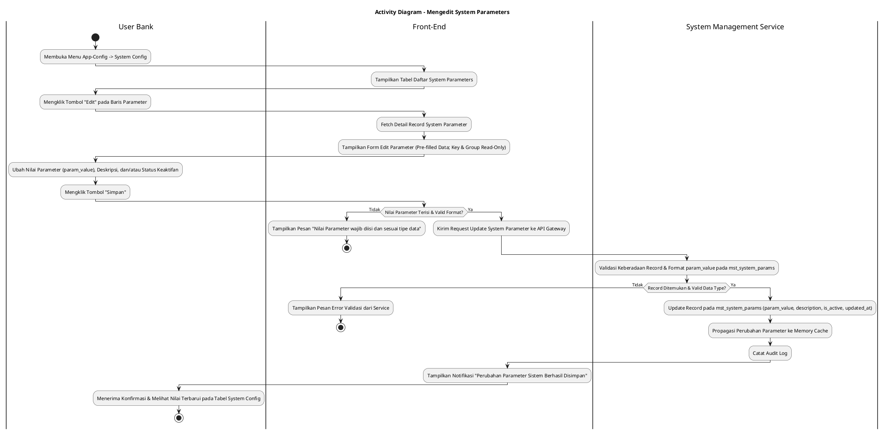
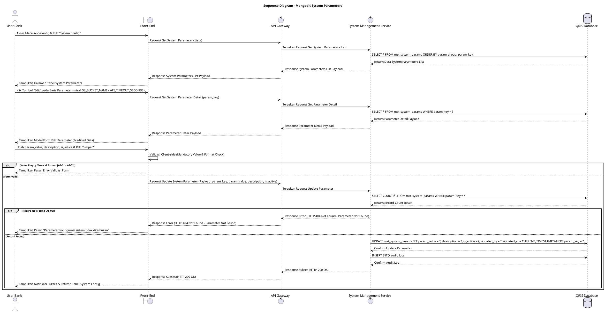

# 1 Deskripsi Use Case

**Tabel 1: Deskripsi Use Case Mengedit System Parameters**

| Elemen Spesifikasi | Deskripsi Detail |
| --- | --- |
| ID Use Case | UC-BOH-042 |
| Nama Use Case | Mengedit System Parameters |
| Penjelasan Singkat | Fitur Web Back Office Hibank pada menu App-Config yang memfasilitasi User Bank (System Administrator) untuk memperbarui nilai parameter konfigurasi sistem (*system parameters*) seperti waktu kedaluwarsa/timeout API, nama bucket S3 storage, dan parameter batas sistem lainnya pada tabel `mst_system_params` melalui System Management Service. |
| Aktor Utama | User Bank (System Administrator / Back Office Hibank User) |
| Aktor Pendukung | System Management Service (`system_management_service`) |
| Deskripsi Singkat | User Bank melakukan otentikasi login SSO ke Web Back Office Hibank dan mengakses menu **App-Config** -> **System Config**. Sistem menampilkan halaman daftar parameter konfigurasi sistem terdaftar dari tabel `mst_system_params` (seperti `API_TIMEOUT_SECONDS`, `S3_BUCKET_NAME`, `SESSION_TIMEOUT_MINUTES`, dll.) beserta opsi filter grup parameter. User Bank memilih salah satu parameter sistem yang ingin diubah, lalu mengklik tombol aksi **"Edit"**. Sistem menampilkan modal formulir pengeditan system parameter yang terisi (*pre-filled*) dengan data terkini. Kunci Parameter (*param_key*) dan Grup Parameter (*param_group*) terkunci (*read-only*). User Bank memperbarui Nilai Parameter (*param_value*), Deskripsi (*description*), dan/atau menukar Status Keaktifan (*is_active*), lalu mengklik tombol **"Simpan"**. Front-End memvalidasi kelengkapan form dan format data, lalu mengirimkan request pembaruan ke API Gateway. System Management Service memvalidasi keberadaan data dan keabsahan format nilai pada tabel `mst_system_params`. Setelah validasi sukses, service memperbarui record parameter pada tabel **`mst_system_params`** dan mencatat jejak perubahan ke tabel **`audit_logs`**. Front-End memperbarui tabel daftar system parameters dan menyajikan notifikasi konfirmasi bahwa konfigurasi sistem berhasil diperbarui. |
| Pre-condition | 1. User Bank telah berhasil login SSO ke Web Back Office Hibank dan memiliki kewenangan *System Administrator* (`APP_CONFIG_ADMIN`). 2. Parameter konfigurasi sistem yang akan diubah telah terdaftar pada tabel `mst_system_params`. |
| Post-condition | 1. Nilai Parameter (`param_value`), Deskripsi (`description`), dan Status Keaktifan (`is_active`) berhasil diperbarui pada tabel `mst_system_params`. 2. Perubahan nilai parameter sistem langsung berdampak secara *real-time* bagi seluruh microservice pengonsumsi variabel konfigurasi (seperti durasi timeout API atau lokasi bucket S3). 3. Front-End memperbarui dan menampilkan nilai parameter sistem terbaru pada daftar System Config. |
| Trigger | User Bank mengklik menu **App-Config** -> **System Config**, mengklik tombol **"Edit"** pada baris parameter sistem (misal: `S3_BUCKET_NAME` atau `API_TIMEOUT_SECONDS`), mengubah Nilai Parameter, lalu mengklik **"Simpan"**. |
| Nama Tabel | mst_system_params, audit_logs |
| Integrasi | 1. **Web Back Office Hibank UI:** Antarmuka daftar System Config, tombol aksi pengeditan, dan modal formulir pembaruan nilai parameter sistem. 2. **System Management Service (`system_management_service`):** Microservice backend pengelola pembaruan, validasi data, pencatatan audit log, dan sinkronisasi konfigurasi sistem. |
| Asumsi | 1. Kunci Parameter (`param_key`) bersifat unik dan tidak dapat diubah setelah didefinisikan untuk menjamin integritas pembacaan variabel variabel lingkungan di level microservice. 2. Pembaruan nilai parameter sistem seperti batas timeout atau lokasi bucket S3 dipropagasi secara *real-time* tanpa memerlukan *restart* aplikasi backend. |
| Keterbatasan | 1. Kunci Parameter (`param_key`) dan Grup Parameter (`param_group`) bersifat *read-only* dan DILARANG diubah. 2. Pengisian Nilai Parameter (`param_value`) wajib mematuhi tipe data dan batasan validasi numerik/string yang ditetapkan untuk kunci parameter tersebut. |
| Aturan Bisnis/Sistem | 1. **Immutable Parameter Key Constraint:** Kunci Parameter (`param_key`) dan Grup Parameter (`param_group`) bersifat *READ-ONLY* (*immutable*) dan DILARANG diubah demi integritas referensi variabel sistem. 2. **Mandatory Input Fields Constraint:** Kolom Nilai Parameter (`param_value`) bersifat WAJIB diisi (*mandatory*) dan tidak boleh kosong. 3. **Data Type Validation Standard:** Nilai Parameter (`param_value`) WAJIB mematuhi format tipe data kunci parameter (misal: `API_TIMEOUT_SECONDS` wajib berformat numerik bulat positif, `S3_BUCKET_NAME` wajib berformat nama bucket S3 valid tanpa karakter ilegal). 4. **Real-time Propagation Standard:** Perubahan nilai parameter sistem pada `mst_system_params` WAJIB secara otomatis memperbarui *cache* variabel sistem pada `system_management_service` untuk langsung digunakan microservice terkait. 5. **Audit Trail Standard:** Setiap tindakan pengeditan parameter sistem mencatat `param_key`, `param_group`, rincian nilai sebelum dan sesudah perubahan, `updated_by` (ID User Bank), dan timestamp pada `audit_logs`. |
| Session Idle | 15 Menit |

# 2 Main Flow

**Tabel 2: Main Flow Mengedit System Parameters**

| No. | Aktivitas | Deskripsi |
| ---: | --- | --- |
| 1 | Membuka Menu System Config | User Bank melakukan login SSO dan mengklik menu **App-Config** -> **System Config** pada navigasi Back Office Hibank. |
| 2 | Menampilkan Daftar System Parameters | Sistem menampilkan halaman daftar parameter sistem dari `mst_system_params` (seperti `API_TIMEOUT_SECONDS`, `S3_BUCKET_NAME`, dll.) beserta tombol aksi **"Edit"**. |
| 3 | Memilih Tombol Edit Parameter | User Bank mengklik tombol **"Edit"** pada salah satu baris parameter sistem yang ingin diubah. |
| 4 | Menampilkan Form Edit Parameter | Sistem menampilkan modal formulir pengeditan yang terisi (*pre-filled*) dengan data terkini (`param_key` & `param_group` *read-only*). |
| 5 | Mengubah Nilai Parameter Sistem | User Bank memperbarui Nilai Parameter (`param_value`), Deskripsi (`description`), dan/atau Status Keaktifan (`is_active`). |
| 6 | Mengklik Tombol Simpan | User Bank mengklik tombol **"Simpan"**. |
| 7 | Memvalidasi Form Client-side | Front-End memvalidasi kelengkapan form dan tipe data inputan, lalu mengirim request pembaruan ke API Gateway. |
| 8 | Memvalidasi & Update Parameter | System Management Service memvalidasi keberadaan `param_key`, memverifikasi tipe data `param_value`, memperbarui record pada `mst_system_params`, dan mencatat `audit_logs`. |
| 9 | Menampilkan Konfirmasi Berhasil | Front-End memperbarui tabel daftar system parameters dan menampilkan notifikasi konfirmasi bahwa konfigurasi sistem berhasil disimpan. |
| 10 | Use Case Selesai | Proses pengeditan parameter konfigurasi sistem selesai dilaksanakan. |

# 3 Alternative Flow

**Tabel 3: Alternative Flow Mengedit System Parameters**

| Kode | Alternative Flow | Deskripsi |
| --- | --- | --- |
| AF-01 | Nilai Parameter Dikosongkan | Pada langkah 6-7, apabila Nilai Parameter (`param_value`) dikosongkan oleh User Bank, Sistem menolak request dan Front-End menampilkan `Nilai Parameter wajib diisi`. |
| AF-02 | Tipe Data Nilai Parameter Tidak Valid | Pada langkah 6-7 atau 8, apabila `param_value` tidak sesuai dengan aturan kunci (misal: memasukkan teks pada `API_TIMEOUT_SECONDS` yang membutuhkan numerik), Sistem menolak request dan Front-End menampilkan `Nilai Parameter tidak sesuai dengan tipe data yang dipersyaratkan`. |
| AF-03 | Parameter Sistem Tidak Ditemukan | Pada langkah 8, apabila kunci parameter tidak ditemukan pada database, System Management Service membatalkan pembaruan dan Front-End menampilkan `Parameter konfigurasi sistem tidak ditemukan`. |
| AF-04 | Gagal Terhubung ke Database Server | Pada langkah 8, apabila koneksi database terputus total, Sistem mengembalikan HTTP status 500 dan Front-End menampilkan `Terjadi kendala internal pada server`. |

# 4 Status Front-End

**Tabel 4: Status Front-End Mengedit System Parameters**

| No. | Nama Status | Deskripsi Tampilan Front-End |
| ---: | --- | --- |
| 1 | IDLE | Halaman System Config menyajikan tabel daftar parameter sistem dan modal form edit terisi siap diubah. |
| 2 | LOADING | Indikator memuat (*spinner*) ditampilkan pada tombol Simpan saat request pembaruan nilai parameter sedang diproses server. |
| 3 | SUCCESS | Modal/toast konfirmasi menampilkan pesan sukses konfigurasi sistem berhasil diperbarui dan tabel daftar diperbarui. |
| 4 | ERROR | Pesan kesalahan ditampilkan pada UI akibat nilai parameter kosong, format tipe data tidak sesuai, atau gangguan server. |

# 5 Activity Diagram Mengedit System Parameters

# 6 Sequence Diagram Mengedit System Parameters

# 7 Response Code

**Tabel 5: Response Code Mengedit System Parameters**

| No. | HTTP Status | Response Code | Nama Response | Deskripsi | Respons Front-End |
| ---: | ---: | --- | --- | --- | --- |
| 1 | 200 | 200XX00 | SUCCESS_UPDATE_SYSTEM_PARAMETER | Parameter konfigurasi sistem berhasil diperbarui pada tabel `mst_system_params`. | Menampilkan pesan notifikasi sukses dan memperbarui tabel system config. |
| 2 | 400 | 400XX00 | INVALID_SYSTEM_PARAM_VALUE | Nilai Parameter (`param_value`) kosong atau format tipe data tidak sesuai. | Menampilkan pesan kesalahan validasi input. |
| 3 | 404 | 404XX00 | SYSTEM_PARAMETER_NOT_FOUND | Kunci parameter sistem yang akan diubah tidak ditemukan pada database. | Menampilkan pesan kesalahan `Parameter konfigurasi sistem tidak ditemukan`. |
| 4 | 500 | 500XX00 | SYSTEM_INTERNAL_ERROR | Terjadi kegagalan internal server saat mengeksekusi pengeditan parameter sistem. | Menampilkan pesan kesalahan `Terjadi kendala internal pada server`. |

# 8 Desain Antarmuka

**Tabel 6: Desain Antarmuka Mengedit System Parameters**

| Halaman | Komponen dan State Utama |
| --- | --- |
| Halaman App-Config System Config | 1. **Navigasi Menu:** Menu **App-Config** -> Submenu **System Config**. 2. **Filter & Search:** Input pencarian kunci/nama parameter dan dropdown filter grup parameter (`param_group`). 3. **Tabel System Parameters:** Kolom No, Kunci Parameter (`param_key`), Nilai Parameter (`param_value`), Grup (`param_group`), Deskripsi, Status (`is_active`), dan Aksi. 4. **Tombol "Edit":** Tombol pemicu modal pengeditan nilai parameter pada tiap baris data (Ikon Pencil / Primary Accent Button). |
| Modal Form Edit System Parameter | 1. **Field Kunci Parameter (`param_key`):** Text Input (*Disabled / Read-only*). 2. **Field Grup Parameter (`param_group`):** Text Input (*Disabled / Read-only*). 3. **Field Nilai Parameter (`param_value`):** Text Input / Textarea Input (Editable, Mandatory, Validated Data Type). 4. **Field Deskripsi (`description`):** Textarea Input (Editable, Optional). 5. **Toggle Status (`is_active`):** Switch Pilihan Status (Aktif / Nonaktif). 6. **Tombol Aksi:** Tombol **"Simpan"** (Primary Button) dan **"Batal"** (Secondary Button). |
