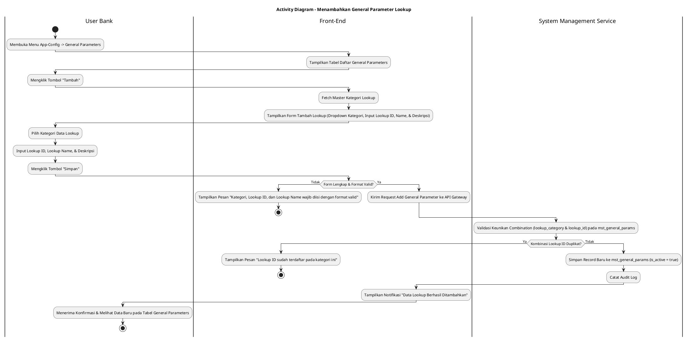
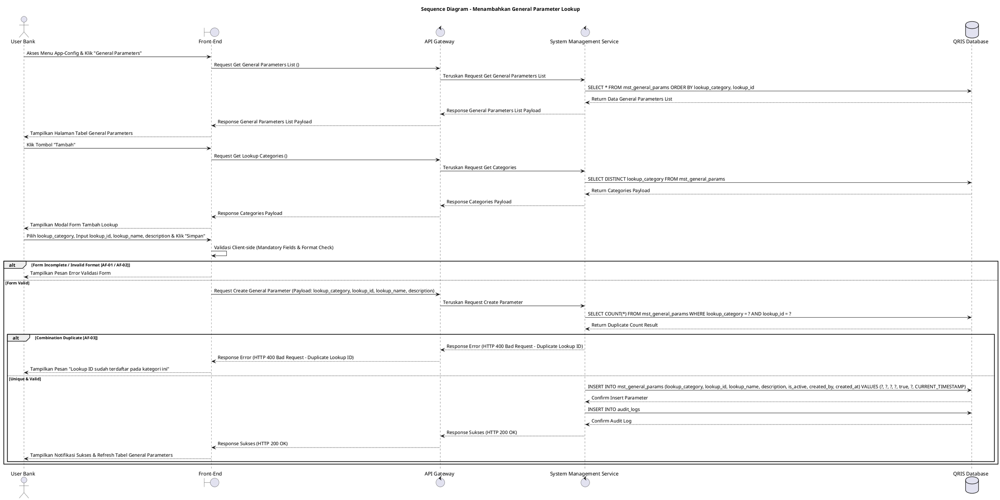

# 1 Deskripsi Use Case

**Tabel 1: Deskripsi Use Case Menambahkan General Parameter Lookup**

| Elemen Spesifikasi | Deskripsi Detail |
| --- | --- |
| ID Use Case | UC-BOH-044 |
| Nama Use Case | Menambahkan General Parameter Lookup |
| Penjelasan Singkat | Fitur Web Back Office Hibank pada menu App-Config yang memfasilitasi User Bank (System Administrator) untuk menambahkan data *lookup* / parameter umum baru dengan menginput Kategori Data Lookup, Lookup ID, Lookup Name, dan Deskripsi pada tabel `mst_general_params` melalui System Management Service. |
| Aktor Utama | User Bank (System Administrator / Back Office Hibank User) |
| Aktor Pendukung | System Management Service (`system_management_service`) |
| Deskripsi Singkat | User Bank melakukan otentikasi login SSO ke Web Back Office Hibank dan mengakses menu **App-Config** -> **General Parameters**. Sistem menampilkan halaman daftar data *lookup* / parameter umum terdaftar dari tabel `mst_general_params` beserta tombol aksi **"Tambah"**. User Bank mengklik tombol **"Tambah"** sehingga sistem menampilkan modal formulir penambahan parameter lookup baru. User Bank memilih Kategori Data Lookup (*lookup_category*), menginput Lookup ID (*lookup_id*), Lookup Name (*lookup_name*), dan Deskripsi (*description*), lalu mengklik tombol **"Simpan"**. Front-End memvalidasi kelengkapan form dan mengirimkan request ke API Gateway. System Management Service memvalidasi keunikan kombinasi `lookup_category` dan `lookup_id` pada tabel `mst_general_params`. Setelah validasi sukses, service menyimpan data parameter lookup baru ke tabel **`mst_general_params`** dan mencatat jejak aktivitas ke tabel **`audit_logs`**. Front-End memperbarui tabel daftar general parameters dan menyajikan notifikasi konfirmasi bahwa data lookup berhasil ditambahkan. |
| Pre-condition | 1. User Bank telah berhasil login SSO ke Web Back Office Hibank dan memiliki hak akses pengelolaan konfigurasi sistem (`APP_CONFIG_ADMIN`). 2. Master daftar kategori data lookup yang berlaku telah terdefinisi pada sistem. |
| Post-condition | 1. Record parameter lookup baru berhasil tersimpan pada tabel `mst_general_params` dengan status aktif (`is_active = true`). 2. Parameter lookup baru siap digunakan oleh microservice terkait sebagai referensi data terkonfigurasi. 3. Front-End memperbarui dan menampilkan data lookup baru pada daftar General Parameters. |
| Trigger | User Bank mengklik menu **App-Config** -> **General Parameters**, mengklik tombol **"Tambah"**, memilih Kategori Data Lookup, mengisi Lookup ID, Lookup Name, Deskripsi, lalu mengklik **"Simpan"**. |
| Nama Tabel | mst_general_params, audit_logs |
| Integrasi | 1. **Web Back Office Hibank UI:** Antarmuka daftar General Parameters, tombol aksi penambahan, dan modal formulir penambahan data lookup. 2. **System Management Service (`system_management_service`):** Microservice backend pengelola pendaftaran, validasi keunikan, dan distribusi data konfigurasi general parameters. |
| Asumsi | 1. Kombinasi pasangan Kategori Data Lookup (`lookup_category`) dan Lookup ID (`lookup_id`) bersifat unik dalam repositori sistem. 2. Parameter lookup baru yang berhasil disimpan langsung berstatus aktif dan tersedia bagi aplikasi peramban maupun service pendukung. |
| Keterbatasan | 1. Kombinasi `lookup_category` dan `lookup_id` tidak boleh duplikat dengan data lookup yang sudah ada. 2. Penambahan data lookup wajib memilih kategori terdaftar yang valid dan mengisi seluruh kolom mandatory. |
| Aturan Bisnis/Sistem | 1. **Lookup Identification Uniqueness Standard:** Kombinasi `lookup_category` dan `lookup_id` WAJIB unik dan tidak *case-sensitive* pada tabel `mst_general_params`. 2. **Mandatory Input Fields Constraint:** Pemilihan Kategori Data Lookup (`lookup_category`), pengisian Lookup ID (`lookup_id`), dan Lookup Name (`lookup_name`) bersifat WAJIB (*mandatory*). 3. **Lookup ID Format Standard:** Lookup ID (`lookup_id`) WAJIB diinput dalam format *UPPERCASE_SNAKE_CASE* tanpa karakter spesial khusus demi konsistensi referensi API. 4. **Default Initial Active Status:** Setiap data lookup baru yang ditambahkan WAJIB secara otomatis diset berstatus aktif (`is_active = true`). 5. **Audit Trail Standard:** Setiap tindakan penambahan general parameter lookup mencatat `lookup_id`, `lookup_category`, `created_by` (ID User Bank), dan timestamp pada `audit_logs`. |
| Session Idle | 15 Menit |

# 2 Main Flow

**Tabel 2: Main Flow Menambahkan General Parameter Lookup**

| No. | Aktivitas | Deskripsi |
| ---: | --- | --- |
| 1 | Membuka Menu General Parameters | User Bank melakukan login SSO dan mengklik menu **App-Config** -> **General Parameters** pada navigasi Back Office Hibank. |
| 2 | Menampilkan Daftar General Parameters | Sistem menampilkan halaman daftar data lookup dari `mst_general_params` beserta tombol aksi **"Tambah"**. |
| 3 | Memilih Tombol Tambah | User Bank mengklik tombol **"Tambah"**. |
| 4 | Menampilkan Form Tambah Lookup | Sistem menampilkan modal formulir penambahan data lookup yang berisi dropdown Kategori Data Lookup, input Lookup ID, Lookup Name, dan Deskripsi. |
| 5 | Mengisi Data Form Lookup | User Bank memilih Kategori Data Lookup, menginput Lookup ID, Lookup Name, dan Deskripsi. |
| 6 | Mengklik Tombol Simpan | User Bank mengklik tombol **"Simpan"**. |
| 7 | Memvalidasi Form Client-side | Front-End memvalidasi kelengkapan form dan format inputan, lalu mengirim request pembuatan data lookup ke API Gateway. |
| 8 | Memvalidasi & Menyimpan Data | System Management Service memvalidasi keunikan kombinasi `lookup_category` & `lookup_id`, lalu menyimpan record baru ke `mst_general_params` (`is_active = true`) dan mencatat `audit_logs`. |
| 9 | Menampilkan Konfirmasi Berhasil | Front-End memperbarui tabel daftar general parameters dan menampilkan notifikasi konfirmasi bahwa data lookup berhasil disimpan. |
| 10 | Use Case Selesai | Proses penambahan general parameter lookup selesai dilaksanakan. |

# 3 Alternative Flow

**Tabel 3: Alternative Flow Menambahkan General Parameter Lookup**

| Kode | Alternative Flow | Deskripsi |
| --- | --- | --- |
| AF-01 | Kolom Mandatory Dikirim Kosong | Pada langkah 6-7, apabila Kategori Data Lookup, Lookup ID, atau Lookup Name dikosongkan, Sistem menolak request dan Front-End menampilkan `Kategori, Lookup ID, dan Lookup Name wajib diisi`. |
| AF-02 | Format Lookup ID Tidak Valid | Pada langkah 6-7, apabila format `lookup_id` mengandung spasi atau karakter spesial terlarang, Sistem menolak request dan Front-End menampilkan `Lookup ID harus berformat UPPERCASE_SNAKE_CASE tanpa spasi`. |
| AF-03 | Kombinasi Lookup ID Sudah Terdaftar | Pada langkah 8, apabila kombinasi `lookup_category` dan `lookup_id` yang diinput sudah ada pada `mst_general_params`, System Management Service membatalkan transaksi dan Front-End menampilkan `Lookup ID sudah terdaftar pada kategori ini`. |
| AF-04 | Gagal Terhubung ke Database Server | Pada langkah 8, apabila koneksi database terputus total, Sistem mengembalikan HTTP status 500 dan Front-End menampilkan `Terjadi kendala internal pada server`. |

# 4 Status Front-End

**Tabel 4: Status Front-End Menambahkan General Parameter Lookup**

| No. | Nama Status | Deskripsi Tampilan Front-End |
| ---: | --- | --- |
| 1 | IDLE | Halaman General Parameters menyajikan tabel daftar lookup dan modal form tambah siap menerima masukan. |
| 2 | LOADING | Indikator memuat (*spinner*) ditampilkan pada tombol Simpan saat request pembuatan data lookup sedang diproses server. |
| 3 | SUCCESS | Modal/toast konfirmasi menampilkan pesan sukses data lookup berhasil disimpan dan tabel daftar diperbarui. |
| 4 | ERROR | Pesan kesalahan ditampilkan pada UI akibat kolom mandatory kosong, format ID tidak sesuai, atau duplikasi lookup ID. |

# 5 Activity Diagram Menambahkan General Parameter Lookup

# 6 Sequence Diagram Menambahkan General Parameter Lookup

# 7 Response Code

**Tabel 5: Response Code Menambahkan General Parameter Lookup**

| No. | HTTP Status | Response Code | Nama Response | Deskripsi | Respons Front-End |
| ---: | ---: | --- | --- | --- | --- |
| 1 | 200 | 200XX00 | SUCCESS_CREATE_GENERAL_PARAMETER | Data general parameter lookup baru berhasil disimpan pada tabel `mst_general_params`. | Menampilkan pesan notifikasi sukses dan memperbarui tabel general parameters. |
| 2 | 400 | 400XX00 | INVALID_PARAMETER_INPUT | Kategori Data Lookup, Lookup ID, atau Lookup Name kosong / tidak valid. | Menampilkan pesan kesalahan validasi input. |
| 3 | 400 | 400XX01 | DUPLICATE_LOOKUP_ID | Kombinasi `lookup_category` dan `lookup_id` yang dimasukkan sudah terdaftar pada sistem. | Menampilkan pesan kesalahan `Lookup ID sudah terdaftar pada kategori ini`. |
| 4 | 500 | 500XX00 | SYSTEM_INTERNAL_ERROR | Terjadi kegagalan internal server saat mengeksekusi penambahan data lookup. | Menampilkan pesan kesalahan `Terjadi kendala internal pada server`. |

# 8 Desain Antarmuka

**Tabel 6: Desain Antarmuka Menambahkan General Parameter Lookup**

| Halaman | Komponen dan State Utama |
| --- | --- |
| Halaman App-Config General Parameters | 1. **Navigasi Menu:** Menu **App-Config** -> Submenu **General Parameters**. 2. **Filter & Search:** Input pencarian nama/ID lookup dan dropdown filter kategori. 3. **Tabel General Parameters:** Kolom No, Kategori Lookup, Lookup ID, Nama Lookup, Deskripsi, Status (`is_active`), dan Aksi. 4. **Tombol "Tambah":** Tombol pemicu modal formulir penambahan data lookup baru (Primary Button). |
| Modal Form Tambah General Parameter | 1. **Dropdown Kategori Data Lookup (`lookup_category`):** Dropdown pilihan kategori lookup terdaftar (Mandatory). 2. **Field Lookup ID (`lookup_id`):** Text Input (Mandatory, Format *UPPERCASE_SNAKE_CASE*). 3. **Field Lookup Name (`lookup_name`):** Text Input (Mandatory). 4. **Field Deskripsi (`description`):** Textarea Input (Optional). 5. **Tombol Aksi:** Tombol **"Simpan"** (Primary Button) dan **"Batal"** (Secondary Button). |
