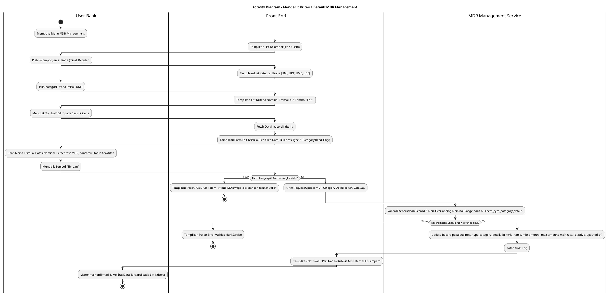
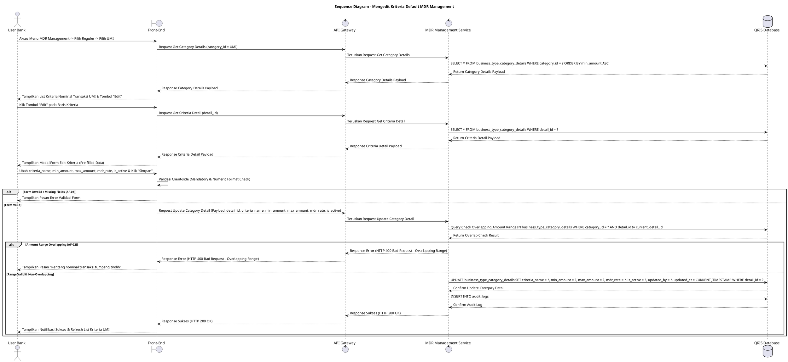

# 1 Deskripsi Use Case

**Tabel 1: Deskripsi Use Case Mengedit Kriteria Default MDR Management**

| Elemen Spesifikasi | Deskripsi Detail |
| --- | --- |
| ID Use Case | UC-BOH-044 |
| Nama Use Case | Mengedit Kriteria Default MDR Management |
| Penjelasan Singkat | Fitur Web Back Office Hibank pada menu Default MDR Management yang memfasilitasi User Bank (MDR Administrator) untuk memperbarui informasi kriteria aturan batas nominal transaksi (*MDR rules*) seperti Nama Kriteria, Rentang Nominal, Tarif MDR, dan Status Keaktifan pada tabel `business_type_category_details` melalui MDR Management Service. |
| Aktor Utama | User Bank (MDR Administrator / Back Office Hibank User) |
| Aktor Pendukung | MDR Management Service (`mdr_management_service`) |
| Deskripsi Singkat | User Bank melakukan otentikasi login SSO ke Web Back Office Hibank dan mengakses menu **MDR Management**. Sistem menampilkan daftar kelompok jenis usaha dari tabel `business_type`. User Bank memilih kelompok (misal: **Reguler**), lalu memilih kategori jenis usaha (seperti **UMI** pada `business_type_categories`). Sistem menampilkan daftar kriteria batas nominal transaksi terdaftar dari tabel `business_type_category_details`. User Bank memilih salah satu kriteria nominal transaksi yang ingin diubah, lalu mengklik tombol aksi **"Edit"**. Sistem menampilkan modal formulir pengeditan kriteria MDR yang terisi (*pre-filled*) dengan data terkini. Jenis Usaha dan Kategori Usaha terkunci (*read-only*). User Bank menyesuaikan Nama Kriteria (*criteria_name*), Batas Nominal Transaksi (*min_amount* / *max_amount*), Persentase Tarif MDR (*mdr_rate*), dan/atau menukar Status Keaktifan (*is_active*), lalu mengklik tombol **"Simpan"**. Front-End memvalidasi kelengkapan form dan format data, lalu mengirimkan request pembaruan ke API Gateway. MDR Management Service memvalidasi keberadaan data serta memastikan penyesuaian rentang nominal transaksi tidak tumpang tindih (*overlapping*) dengan kriteria lain pada kategori usaha yang sama di tabel `business_type_category_details`. Setelah validasi sukses, service memperbarui record kriteria pada tabel **`business_type_category_details`** dan mencatat jejak perubahan ke tabel **`audit_logs`**. Front-End memperbarui daftar kriteria nominal transaksi dan menyajikan notifikasi konfirmasi sukses. |
| Pre-condition | 1. User Bank telah berhasil login SSO ke Web Back Office Hibank dan memiliki otoritas pengelolaan MDR (`MDR_ADMIN`). 2. Record kriteria nominal transaksi yang akan diubah telah terdaftar pada tabel `business_type_category_details`. |
| Post-condition | 1. Data Nama Kriteria (`criteria_name`), Rentang Nominal Transaksi (`min_amount`, `max_amount`), Tarif MDR (`mdr_rate`), dan Status Keaktifan (`is_active`) berhasil diperbarui pada tabel `business_type_category_details`. 2. Pembaruan kriteria MDR langsung berlaku secara *real-time* untuk perhitungan komisi transaksi QRIS merchant pada kategori usaha terkait. 3. Front-End menyajikan data kriteria MDR terbaru pada daftar detail kategori usaha. |
| Trigger | User Bank mengklik menu **MDR Management**, memilih jenis usaha, memilih kategori (misal: **UMI**), mengklik tombol **"Edit"** pada baris kriteria nominal transaksi, memperbarui data, lalu mengklik **"Simpan"**. |
| Nama Tabel | business_type, business_type_categories, business_type_category_details, audit_logs |
| Integrasi | 1. **Web Back Office Hibank UI:** Antarmuka navigasi jenis usaha, halaman daftar kriteria nominal MDR, tombol aksi edit, dan modal formulir pengeditan kriteria. 2. **MDR Management Service (`mdr_management_service`):** Microservice backend pengelola pembaruan aturan MDR, validasi rentang nominal, dan pencatatan audit log. |
| Asumsi | 1. Jenis Usaha (`business_type_id`) dan Kategori Usaha (`category_id`) tidak dapat diubah setelah kriteria dibuat untuk menjaga hierarki pengelompokan data. 2. Perubahan tarif MDR berlaku secara *real-time* bagi transaksi QRIS baru yang diproses setelah pembaruan disimpan. |
| Keterbatasan | 1. Pengeditan rentang nominal transaksi dilarang bertabrakan (*overlapping*) dengan kriteria nominal transaksi lain yang terdaftar pada kategori usaha yang sama. 2. Seluruh kolom Nama Kriteria, Batas Nominal Transaksi, dan Persentase Tarif MDR bersifat wajib diisi (*mandatory*). |
| Aturan Bisnis/Sistem | 1. **Immutable Category Hierarchy Constraint:** Jenis Usaha (`business_type_id`) dan Kategori Usaha (`category_id`) bersifat *READ-ONLY* (*immutable*) dan DILARANG diubah pada form pengeditan kriteria. 2. **No Overlapping Nominal Range Constraint:** Apabila rentang nominal transaksi (*min_amount* / *max_amount*) diubah, rentang baru DILARANG saling tumpang tindih (*overlap*) dengan kriteria lain pada kategori usaha yang sama di tabel `business_type_category_details`. 3. **Mandatory Input Fields Constraint:** Nama Kriteria, Batas Nominal Transaksi, dan Persentase MDR bersifat WAJIB diisi (*mandatory*). 4. **Real-time Rules Propagation Standard:** Pembaruan tarif dan rentang kriteria MDR WAJIB dipropagasi secara *real-time* ke mesin perhitungan komisi transaksi. 5. **Audit Trail Standard:** Setiap tindakan pengeditan kriteria MDR mencatat `detail_id`, `category_id`, rincian nilai sebelum dan sesudah perubahan, `updated_by` (ID User Bank), dan timestamp pada `audit_logs`. |
| Session Idle | 15 Menit |

# 2 Main Flow

**Tabel 2: Main Flow Mengedit Kriteria Default MDR Management**

| No. | Aktivitas | Deskripsi |
| ---: | --- | --- |
| 1 | Membuka Menu MDR Management | User Bank melakukan login SSO dan mengklik menu **MDR Management** pada navigasi Back Office Hibank. |
| 2 | Menampilkan List Jenis Usaha | Sistem menampilkan halaman utama MDR Management yang berisi daftar kelompok jenis usaha dari `business_type`. |
| 3 | Memilih Kelompok Jenis Usaha | User Bank mengklik salah satu kelompok jenis usaha (seperti **Reguler**). |
| 4 | Menampilkan Detail Kategori Usaha | Sistem menampilkan daftar kategori jenis usaha (seperti **UMI**, **UKE**, **UME**, **UBE**) dari `business_type_categories`. |
| 5 | Memilih Kategori Usaha | User Bank mengklik kategori usaha yang ingin dikelola (misal: **UMI**). |
| 6 | Menampilkan List Kriteria Nominal | Sistem menampilkan daftar kriteria nominal transaksi dari `business_type_category_details` beserta tombol aksi **"Edit"** pada tiap baris. |
| 7 | Memilih Tombol Edit Kriteria | User Bank mengklik tombol **"Edit"** pada salah satu baris kriteria nominal transaksi. |
| 8 | Menampilkan Form Edit Kriteria | Sistem menampilkan modal formulir pengeditan yang terisi (*pre-filled*) dengan data terkini (Jenis Usaha & Kategori *read-only*). |
| 9 | Mengubah Data Kriteria MDR | User Bank menyesuaikan Nama Kriteria, Batas Nominal Transaksi, Persentase Tarif MDR, dan/atau Status Keaktifan. |
| 10 | Mengklik Tombol Simpan | User Bank mengklik tombol **"Simpan"**. |
| 11 | Memvalidasi Form Client-side | Front-End memvalidasi kelengkapan form dan format angka, lalu mengirim request pembaruan ke API Gateway. |
| 12 | Memvalidasi & Update Record | MDR Management Service memvalidasi keberadaan `detail_id`, memastikan tidak ada *overlapping* rentang nominal baru, memperbarui `business_type_category_details`, dan mencatat `audit_logs`. |
| 13 | Menampilkan Konfirmasi Berhasil | Front-End memperbarui tabel daftar kriteria nominal transaksi dan menampilkan notifikasi konfirmasi bahwa perubahan kriteria MDR berhasil disimpan. |
| 14 | Use Case Selesai | Proses pengeditan kriteria default MDR management selesai dilaksanakan. |

# 3 Alternative Flow

**Tabel 3: Alternative Flow Mengedit Kriteria Default MDR Management**

| Kode | Alternative Flow | Deskripsi |
| --- | --- | --- |
| AF-01 | Kolom Mandatory Dikosongkan | Pada langkah 10-11, apabila Nama Kriteria, Batas Nominal, atau Tarif MDR dikosongkan, Sistem menolak request dan Front-End menampilkan `Seluruh kolom kriteria MDR wajib diisi`. |
| AF-02 | Rentang Nominal Transaksi Tumpang Tindih (Overlapping) | Pada langkah 12, apabila rentang nominal transaksi baru yang diubah tumpang tindih dengan kriteria lain pada kategori yang sama, MDR Management Service membatalkan pembaruan dan Front-End menampilkan `Rentang nominal transaksi tumpang tindih dengan kriteria yang sudah ada`. |
| AF-03 | Kriteria MDR Tidak Ditemukan | Pada langkah 12, apabila record kriteria tidak ditemukan pada database, Sistem membatalkan pembaruan dan Front-End menampilkan `Data kriteria MDR tidak ditemukan`. |
| AF-04 | Gagal Terhubung ke Database Server | Pada langkah 12, apabila koneksi database terputus total, Sistem mengembalikan HTTP status 500 dan Front-End menampilkan `Terjadi kendala internal pada server`. |

# 4 Status Front-End

**Tabel 4: Status Front-End Mengedit Kriteria Default MDR Management**

| No. | Nama Status | Deskripsi Tampilan Front-End |
| ---: | --- | --- |
| 1 | IDLE | Halaman detail kriteria kategori usaha menyajikan daftar kriteria nominal transaksi dan modal form edit terisi siap diubah. |
| 2 | LOADING | Indikator memuat (*spinner*) ditampilkan pada tombol Simpan saat request pembaruan kriteria MDR sedang diproses server. |
| 3 | SUCCESS | Modal/toast konfirmasi menampilkan pesan sukses perubahan kriteria MDR berhasil disimpan dan tabel daftar diperbarui. |
| 4 | ERROR | Pesan kesalahan ditampilkan pada UI akibat kolom mandatory kosong, rentang nominal overlapping, atau gangguan server. |

# 5 Activity Diagram Mengedit Kriteria Default MDR Management

# 6 Sequence Diagram Mengedit Kriteria Default MDR Management

# 7 Response Code

**Tabel 5: Response Code Mengedit Kriteria Default MDR Management**

| No. | HTTP Status | Response Code | Nama Response | Deskripsi | Respons Front-End |
| ---: | ---: | --- | --- | --- | --- |
| 1 | 200 | 200XX00 | SUCCESS_UPDATE_MDR_CRITERIA | Kriteria nominal transaksi MDR berhasil diperbarui pada tabel `business_type_category_details`. | Menampilkan pesan notifikasi sukses dan memperbarui tabel list kriteria. |
| 2 | 400 | 400XX00 | INVALID_CRITERIA_UPDATE_INPUT | Kolom kriteria, nominal batas, atau persentase tarif MDR kosong / tidak valid. | Menampilkan pesan kesalahan validasi input. |
| 3 | 400 | 400XX01 | OVERLAPPING_NOMINAL_RANGE | Perubahan rentang nominal transaksi tumpang tindih dengan kriteria lain pada kategori yang sama. | Menampilkan pesan kesalahan `Rentang nominal transaksi tumpang tindih dengan kriteria yang sudah ada`. |
| 4 | 404 | 404XX00 | MDR_CRITERIA_NOT_FOUND | Record kriteria nominal transaksi yang akan diubah tidak ditemukan pada database. | Menampilkan pesan kesalahan `Data kriteria MDR tidak ditemukan`. |
| 5 | 500 | 500XX00 | SYSTEM_INTERNAL_ERROR | Terjadi kegagalan internal server saat mengeksekusi pengeditan kriteria MDR. | Menampilkan pesan kesalahan `Terjadi kendala internal pada server`. |

# 8 Desain Antarmuka

**Tabel 6: Desain Antarmuka Mengedit Kriteria Default MDR Management**

| Halaman | Komponen dan State Utama |
| --- | --- |
| Halaman Detail Kriteria UMI | 1. **Tabel Kriteria Nominal Transaksi:** Kolom No, Nama Kriteria, Rentang Nominal Transaksi, Tarif MDR (%), Status (`is_active`), dan Aksi. 2. **Tombol "Edit":** Tombol pemicu modal pengeditan kriteria MDR pada tiap baris data (Ikon Pencil / Primary Accent Button). |
| Modal Form Edit Kriteria MDR | 1. **Field Jenis Usaha (`business_type_name`):** Text Input (*Disabled / Read-only*). 2. **Field Kategori Usaha (`category_name`):** Text Input (*Disabled / Read-only*, e.g. UMI). 3. **Field Nama Kriteria (`criteria_name`):** Text Input (Editable, Mandatory). 4. **Dropdown Operator Perbandingan:** Dropdown pilihan (`<=`, `>`, `BETWEEN`). 5. **Field Batas Nominal Transaksi (`min_amount` / `max_amount`):** Currency/Number Input (Editable, Mandatory). 6. **Field Persentase MDR (`mdr_rate`):** Percentage Input (Editable, Mandatory). 7. **Toggle Status (`is_active`):** Switch Pilihan Status (Aktif / Nonaktif). 8. **Tombol Aksi:** Tombol **"Simpan"** (Primary Button) dan **"Batal"** (Secondary Button). |
