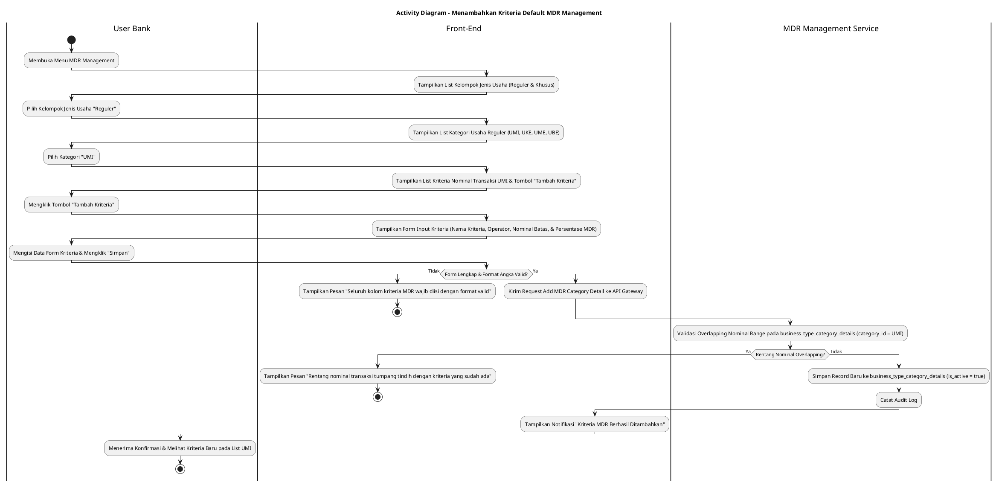
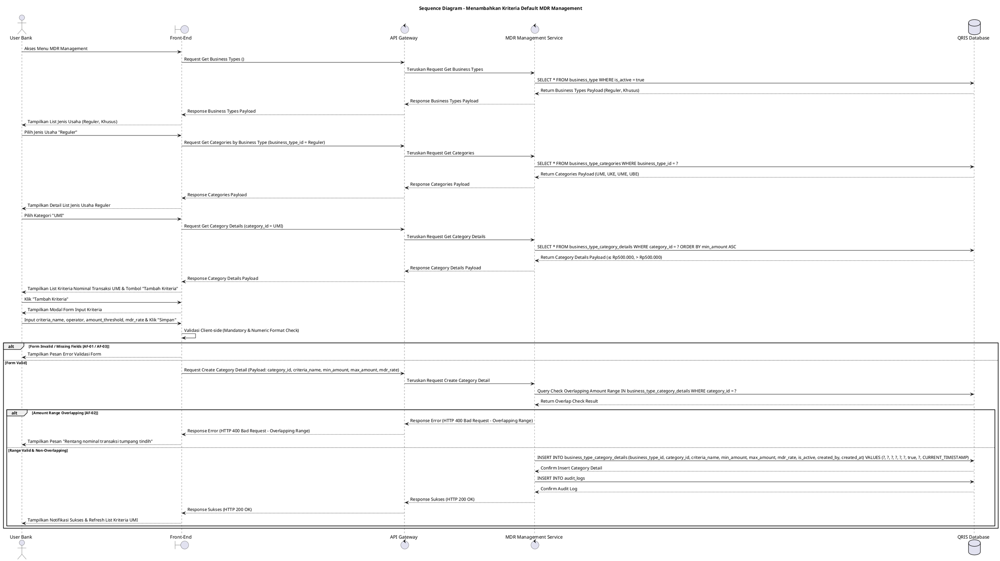

# 1 Deskripsi Use Case

**Tabel 1: Deskripsi Use Case Menambahkan Kriteria Default MDR Management**

| Elemen Spesifikasi | Deskripsi Detail |
| --- | --- |
| ID Use Case | UC-BOH-047 |
| Nama Use Case | Menambahkan Kriteria Default MDR Management |
| Penjelasan Singkat | Fitur Web Back Office Hibank pada menu Default MDR Management yang memfasilitasi User Bank (MDR Administrator) untuk mendaftarkan kriteria aturan batas nominal transaksi (*MDR rules*) baru pada kategori jenis usaha tertentu (seperti UMI pada jenis usaha Reguler) pada tabel `business_type`, `business_type_categories`, dan `business_type_category_details` melalui MDR Management Service. |
| Aktor Utama | User Bank (MDR Administrator / Back Office Hibank User) |
| Aktor Pendukung | MDR Management Service (`mdr_management_service`) |
| Deskripsi Singkat | User Bank melakukan otentikasi login SSO ke Web Back Office Hibank dan mengakses menu **MDR Management**. Sistem menampilkan daftar kelompok jenis usaha (seperti **Reguler** dan **Khusus**) dari tabel `business_type`. User Bank memilih kelompok **Reguler**, sehingga sistem menyajikan daftar kategori jenis usaha reguler yaitu **UMI** (Usaha Mikro), **UKE** (Usaha Kecil), **UME** (Usaha Menengah), dan **UBE** (Usaha Besar) dari tabel `business_type_categories`. User Bank memilih kategori **UMI** (Usaha Mikro). Sistem menampilkan daftar kriteria batas nominal transaksi terdaftar (misal: *Nominal Transaksi ≤ Rp500.000,00* dan *Nominal Transaksi > Rp500.000,00*) dari tabel `business_type_category_details` beserta tombol **"Tambah Kriteria"**. User Bank mengklik tombol **"Tambah Kriteria"** sehingga sistem menampilkan modal formulir penambahan kriteria nominal transaksi. User Bank menginput Nama Kriteria, Operator Perbandingan (`<=` atau `>`), Batas Nominal Transaksi (*min_amount* / *max_amount*), Persentase Tarif MDR, serta alokasi bagi hasil, lalu mengklik tombol **"Simpan"**. Front-End memvalidasi kelengkapan form dan mengirimkan request ke API Gateway. MDR Management Service memvalidasi keabsahan data serta memastikan tidak terjadi tumpang tindih (*overlapping*) rentang nominal transaksi pada kategori UMI di tabel `business_type_category_details`. Setelah validasi sukses, service menyimpan record kriteria baru ke tabel **`business_type_category_details`** dan mencatat jejak aktivitas ke tabel **`audit_logs`**. Front-End memperbarui daftar kriteria nominal transaksi pada halaman detail UMI dan menyajikan notifikasi konfirmasi sukses. |
| Pre-condition | 1. User Bank telah berhasil login SSO ke Web Back Office Hibank dan memiliki otoritas pengelolaan MDR (`MDR_ADMIN`). 2. Data kelompok jenis usaha (`business_type`) dan kategori usaha (`business_type_categories`) telah terdaftar pada database. |
| Post-condition | 1. Record kriteria batas nominal transaksi MDR baru berhasil disimpan pada tabel `business_type_category_details`. 2. Kriteria MDR baru langsung berlaku sebagai aturan acuan perhitungan skema MDR untuk transaksi QRIS merchant dengan kategori usaha terkait. 3. Front-End menyajikan data kriteria baru pada daftar detail kategori usaha UMI. |
| Trigger | User Bank mengklik menu **MDR Management**, memilih jenis usaha **Reguler**, memilih kategori **UMI**, mengklik tombol **"Tambah Kriteria"**, mengisi data kriteria nominal transaksi, lalu mengklik **"Simpan"**. |
| Nama Tabel | business_type, business_type_categories, business_type_category_details, audit_logs |
| Integrasi | 1. **Web Back Office Hibank UI:** Antarmuka navigasi hierarki jenis usaha, halaman detail kriteria nominal MDR, dan modal formulir penambahan kriteria. 2. **MDR Management Service (`mdr_management_service`):** Microservice backend pengelola hirarki jenis usaha, aturan komisi MDR, dan pencatatan audit log. |
| Asumsi | 1. Kelompok jenis usaha dibedakan secara struktural menjadi Reguler dan Khusus. 2. Kategori jenis usaha Reguler mencakup UMI (Usaha Mikro), UKE (Usaha Kecil), UME (Usaha Menengah), dan UBE (Usaha Besar). 3. Setiap kriteria nominal transaksi MDR ditentukan berdasarkan rentang batas nilai transaksi rupiah (seperti <= Rp500.000,00 atau > Rp500.000,00). |
| Keterbatasan | 1. Rentang nominal transaksi pada kriteria baru dilarang bertabrakan (*overlapping*) dengan kriteria nominal transaksi lain yang sudah terdaftar pada kategori usaha yang sama. 2. Seluruh kolom batas nominal dan persentase tarif MDR bersifat wajib diisi (*mandatory*). |
| Aturan Bisnis/Sistem | 1. **Hierarchical Relational Integrity Standard:** Setiap record kriteria detail pada `business_type_category_details` WAJIB terhubung secara eksplisit ke `category_id` di `business_type_categories` dan `business_type_id` di `business_type`. 2. **No Overlapping Nominal Range Constraint:** Rentang nominal transaksi (*min_amount* s.d *max_amount*) pada kriteria baru DILARANG saling tumpang tindih (*overlap*) dengan kriteria yang telah ada pada kategori usaha yang sama. 3. **Mandatory Fields Constraint:** Nama Kriteria, Operator Perbandingan, Nominal Batas Transaksi, dan Persentase MDR bersifat WAJIB diisi (*mandatory*). 4. **Default Active Status:** Kriteria MDR baru yang ditambahkan secara otomatis ditetapkan berstatus aktif (`is_active = true`). 5. **Audit Trail Standard:** Setiap tindakan penambahan kriteria MDR mencatat `detail_id`, `category_id`, `business_type_id`, rentang nominal, tarif MDR, `created_by` (ID User Bank), dan timestamp pada `audit_logs`. |
| Session Idle | 15 Menit |

# 2 Main Flow

**Tabel 2: Main Flow Menambahkan Kriteria Default MDR Management**

| No. | Aktivitas | Deskripsi |
| ---: | --- | --- |
| 1 | Membuka Menu MDR Management | User Bank melakukan login SSO dan mengklik menu **MDR Management** pada navigasi Back Office Hibank. |
| 2 | Menampilkan List Jenis Usaha | Sistem menampilkan halaman utama MDR Management yang berisi daftar kelompok jenis usaha (seperti **Reguler** dan **Khusus**) dari `business_type`. |
| 3 | Memilih Jenis Usaha Reguler | User Bank mengklik pilihan kelompok jenis usaha **Reguler**. |
| 4 | Menampilkan Detail List Jenis Usaha Reguler | Sistem menampilkan daftar kategori jenis usaha reguler yaitu **UMI** (Usaha Mikro), **UKE** (Usaha Kecil), **UME** (Usaha Menengah), dan **UBE** (Usaha Besar) dari `business_type_categories`. |
| 5 | Memilih Kategori UMI | User Bank mengklik kategori **UMI** (Usaha Mikro). |
| 6 | Menampilkan List Kriteria Nominal Transaksi | Sistem menampilkan daftar kriteria nominal transaksi untuk UMI (misal: *Nominal Transaksi ≤ Rp500.000,00* dan *Nominal Transaksi > Rp500.000,00*) dari `business_type_category_details` beserta tombol **"Tambah Kriteria"**. |
| 7 | Memilih Tombol Tambah Kriteria | User Bank mengklik tombol **"Tambah Kriteria"**. |
| 8 | Menampilkan Form Input Kriteria | Sistem menampilkan modal formulir penambahan kriteria yang berisi input Nama Kriteria, Operator Perbandingan (`<=` / `>`), Batas Nominal Transaksi, dan Persentase MDR. |
| 9 | Mengisi Form & Mengklik Simpan | User Bank mengisi data kriteria nominal transaksi, lalu mengklik tombol **"Simpan"**. |
| 10 | Memvalidasi Form Client-side | Front-End memvalidasi kelengkapan form dan format angka, lalu mengirim request ke API Gateway. |
| 11 | Memvalidasi & Menyimpan Record | MDR Management Service memvalidasi tidak ada *overlapping* rentang nominal pada kategori UMI, menyimpan record baru ke `business_type_category_details`, dan mencatat `audit_logs`. |
| 12 | Menampilkan Konfirmasi Berhasil | Front-End memperbarui tabel daftar kriteria nominal transaksi UMI dan menampilkan notifikasi konfirmasi bahwa kriteria MDR berhasil ditambahkan. |
| 13 | Use Case Selesai | Proses penambahan kriteria default MDR management selesai dilaksanakan. |

# 3 Alternative Flow

**Tabel 3: Alternative Flow Menambahkan Kriteria Default MDR Management**

| Kode | Alternative Flow | Deskripsi |
| --- | --- | --- |
| AF-01 | Kolom Mandatory Dikirim Kosong | Pada langkah 9-10, apabila Nama Kriteria, Operator, Batas Nominal, atau Tarif MDR dikosongkan, Sistem menolak request dan Front-End menampilkan `Seluruh kolom kriteria MDR wajib diisi`. |
| AF-02 | Rentang Nominal Transaksi Tumpang Tindih (Overlapping) | Pada langkah 11, apabila rentang nominal transaksi yang diinput tumpang tindih dengan kriteria yang sudah ada pada kategori UMI, MDR Management Service membatalkan penyimpanan dan Front-End menampilkan `Rentang nominal transaksi tumpang tindih dengan kriteria yang sudah ada`. |
| AF-03 | Nilai Nominal Transaksi Tidak Valid | Pada langkah 9-10, apabila batas nominal bernilai negatif atau format bukan angka, Sistem menolak request dan Front-End menampilkan `Nominal transaksi harus berupa angka positif valid`. |
| AF-04 | Gagal Terhubung ke Database Server | Pada langkah 11, apabila koneksi database terputus total, Sistem mengembalikan HTTP status 500 dan Front-End menampilkan `Terjadi kendala internal pada server`. |

# 4 Status Front-End

**Tabel 4: Status Front-End Menambahkan Kriteria Default MDR Management**

| No. | Nama Status | Deskripsi Tampilan Front-End |
| ---: | --- | --- |
| 1 | IDLE | Halaman detail kriteria kategori UMI menyajikan daftar kriteria nominal transaksi dan modal form tambah siap menerima inputan. |
| 2 | LOADING | Indikator memuat (*spinner*) ditampilkan pada tombol Simpan saat request pembuatan kriteria MDR sedang diproses server. |
| 3 | SUCCESS | Modal/toast konfirmasi menampilkan pesan sukses kriteria MDR baru berhasil disimpan dan tabel daftar diperbarui. |
| 4 | ERROR | Pesan kesalahan ditampilkan pada UI akibat kolom mandatory kosong, rentang nominal overlapping, atau gangguan server. |

# 5 Activity Diagram Menambahkan Kriteria Default MDR Management

# 6 Sequence Diagram Menambahkan Kriteria Default MDR Management

# 7 Response Code

**Tabel 5: Response Code Menambahkan Kriteria Default MDR Management**

| No. | HTTP Status | Response Code | Nama Response | Deskripsi | Respons Front-End |
| ---: | ---: | --- | --- | --- | --- |
| 1 | 200 | 200XX00 | SUCCESS_CREATE_MDR_CRITERIA | Kriteria nominal transaksi MDR baru berhasil disimpan pada tabel `business_type_category_details`. | Menampilkan pesan notifikasi sukses dan memperbarui tabel list kriteria. |
| 2 | 400 | 400XX00 | INVALID_CRITERIA_INPUT | Kolom kriteria, nominal batas, atau persentase tarif MDR kosong / tidak valid. | Menampilkan pesan kesalahan validasi input. |
| 3 | 400 | 400XX01 | OVERLAPPING_NOMINAL_RANGE | Rentang nominal transaksi yang diinput tumpang tindih dengan kriteria lain pada kategori UMI. | Menampilkan pesan kesalahan `Rentang nominal transaksi tumpang tindih dengan kriteria yang sudah ada`. |
| 4 | 500 | 500XX00 | SYSTEM_INTERNAL_ERROR | Terjadi kegagalan internal server saat mengeksekusi penambahan kriteria MDR. | Menampilkan pesan kesalahan `Terjadi kendala internal pada server`. |

# 8 Desain Antarmuka

**Tabel 6: Desain Antarmuka Menambahkan Kriteria Default MDR Management**

| Halaman | Komponen dan State Utama |
| --- | --- |
| Halaman Utama MDR Management | 1. **Daftar Jenis Usaha:** Kartu/Opsi pilihan **Reguler** dan **Khusus** (berasal dari `business_type`). 2. **Breadcrumb Navigasi:** Navigasi lokasi aktif menu MDR Management. |
| Halaman Detail Jenis Usaha Reguler | 1. **Daftar Kategori Usaha Reguler:** Tab/Opsi pilihan **UMI** (Usaha Mikro), **UKE** (Usaha Kecil), **UME** (Usaha Menengah), dan **UBE** (Usaha Besar) (berasal dari `business_type_categories`). 2. **Panel Informasi:** Penjelasan singkat kategori skema MDR reguler. |
| Halaman Detail Kriteria UMI | 1. **Tabel Kriteria Nominal Transaksi:** Kolom No, Nama Kriteria, Rentang Nominal Transaksi (misal: `≤ Rp500.000,00` dan `> Rp500.000,00`), Tarif MDR (%), Status, dan Aksi. 2. **Tombol "Tambah Kriteria":** Tombol pemicu modal penambahan kriteria MDR baru (Primary Button). |
| Modal Form Input Kriteria MDR | 1. **Field Nama Kriteria (`criteria_name`):** Text Input (Mandatory). 2. **Dropdown Operator Perbandingan:** Dropdown pilihan (`<=`, `>`, `BETWEEN`). 3. **Field Batas Nominal Transaksi (`min_amount` / `max_amount`):** Currency/Number Input (Mandatory, e.g. Rp 500.000,00). 4. **Field Persentase MDR (`mdr_rate`):** Percentage Input (Mandatory, e.g. 0,30%). 5. **Tombol Aksi:** Tombol **"Simpan"** (Primary Button) dan **"Batal"** (Secondary Button). |
