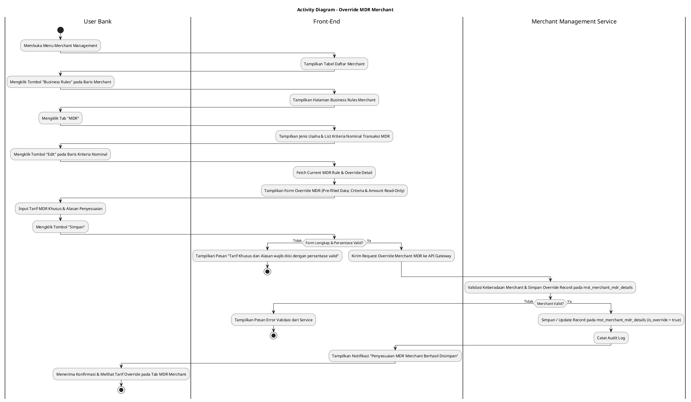
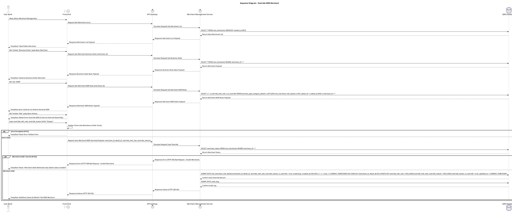

# 1 Deskripsi Use Case

**Tabel 1: Deskripsi Use Case Override MDR Merchant**

| Elemen Spesifikasi | Deskripsi Detail |
| --- | --- |
| ID Use Case | UC-BOH-049 |
| Nama Use Case | Override MDR Merchant |
| Penjelasan Singkat | Fitur Web Back Office Hibank pada menu Merchant Management yang memfasilitasi User Bank (MDR Administrator) untuk melakukan penyesuaian khusus (*override*) tarif MDR transaksi QRIS bagi merchant tertentu pada tabel `mst_merchants` dan `mst_merchant_mdr_details` melalui Merchant Management Service. |
| Aktor Utama | User Bank (MDR Administrator / Merchant Administrator / Back Office Hibank User) |
| Aktor Pendukung | Merchant Management Service (`merchant_management_service`), MDR Management Service (`mdr_management_service`) |
| Deskripsi Singkat | User Bank melakukan otentikasi login SSO ke Web Back Office Hibank dan mengakses menu **Merchant Management**. Sistem menampilkan halaman daftar merchant terdaftar dari tabel `mst_merchants`. User Bank memilih salah satu merchant, lalu mengklik tombol aksi **"Business Rules"**. Sistem menampilkan halaman pengelolaan aturan bisnis merchant yang memiliki beberapa tab. User Bank memilih tab **MDR**. Sistem menampilkan informasi jenis usaha merchant (misal: **UMI** atau **UKE**) beserta daftar kriteria nominal transaksi MDR yang berlaku dari `business_type_category_details` atau `mst_merchant_mdr_details`. User Bank memilih salah satu baris kriteria nominal transaksi yang ingin disesuaikan secara khusus, lalu mengklik tombol **"Edit"** (atau Override). Sistem menampilkan modal formulir penyesuaian tarif MDR khusus merchant. Nama Kriteria dan Batas Nominal Transaksi terkunci (*read-only*). User Bank menginput Tarif MDR Khusus (*override_mdr_rate*) dan Alasan Penyesuaian (*override_reason*), lalu mengklik tombol **"Simpan"**. Front-End memvalidasi kelengkapan form dan mengirimkan request ke API Gateway. Merchant Management Service memvalidasi keberadaan `merchant_id` dan keabsahan tarif *override*. Setelah validasi sukses, service menyimpan record penyesuaian ke tabel **`mst_merchant_mdr_details`** dengan status aktif (`is_override = true`) dan mencatat jejak perubahan ke tabel **`audit_logs`**. Tarif MDR khusus ini secara otomatis akan mengesampingkan (*override*) tarif MDR standar default untuk merchant tersebut. Front-End memperbarui tampilan tab MDR merchant dan menyajikan notifikasi konfirmasi sukses. |
| Pre-condition | 1. User Bank telah berhasil login SSO ke Web Back Office Hibank dan memiliki kewenangan penyesuaian MDR merchant (`MERCHANT_ADMIN` / `MDR_ADMIN`). 2. Data merchant terpilih terdaftar aktif pada tabel `mst_merchants`. |
| Post-condition | 1. Record tarif MDR khusus merchant (*override rate*) berhasil disimpan pada tabel `mst_merchant_mdr_details`. 2. Perhitungan komisi/MDR transaksi QRIS untuk merchant terpilih secara otomatis menggunakan tarif *override* menggantikan tarif default. 3. Front-End memperbarui daftar kriteria MDR pada tab MDR halaman Business Rules merchant. |
| Trigger | User Bank mengklik menu **Merchant Management**, mengklik tombol **"Business Rules"** pada baris merchant, mengklik tab **MDR**, mengklik tombol **"Edit"** pada baris kriteria nominal transaksi, mengisi tarif MDR khusus & alasan, lalu mengklik **"Simpan"**. |
| Nama Tabel | mst_merchants, mst_merchant_mdr_details, business_type_category_details, audit_logs |
| Integrasi | 1. **Web Back Office Hibank UI:** Antarmuka daftar merchant, halaman Business Rules merchant (Tab MDR), dan modal formulir penyesuaian *override* MDR. 2. **Merchant Management Service (`merchant_management_service`):** Microservice backend pengelola konfigurasi merchant, penyesuaian aturan bisnis, dan pencatatan audit log. |
| Asumsi | 1. Tarif MDR hasil *override* berlaku khusus untuk merchant bersangkutan dan tidak memengaruhi skema MDR merchant lainnya. 2. Apabila record *override* dinonaktifkan atau belum dibuat pada `mst_merchant_mdr_details`, sistem secara otomatis kembali menggunakan tarif MDR default dari `business_type_category_details`. |
| Keterbatasan | 1. Penyesuaian *override* MDR memerlukan pengisian Alasan Penyesuaian (*override_reason*) yang wajib diisi (*mandatory*). 2. Nilai tarif MDR *override* wajib berupa angka persentase valid (0.00% s.d 100.00%). |
| Aturan Bisnis/Sistem | 1. **Merchant-Specific Override Priority:** Dalam kalkulasi komisi transaksi QRIS, sistem WAJIB mengutamakan tarif *override* pada `mst_merchant_mdr_details` jika berstatus aktif (`is_override = true`) dibandingkan tarif default `business_type_category_details`. 2. **Mandatory Reason Constraint:** Pengisian Alasan Penyesuaian (*override_reason*) bersifat WAJIB (*mandatory*) saat mengonfirmasi tindakan *override* MDR. 3. **ReadOnly Base Criteria:** Nama Kriteria dan Rentang Batas Nominal Transaksi bersifat *READ-ONLY* pada form *override* untuk mencegah perubahan struktur rentang kriteria baku. 4. **Audit Trail Standard:** Setiap tindakan *override* MDR merchant mencatat `merchant_id`, `criteria_detail_id`, tarif MDR awal, tarif MDR *override*, alasan penyesuaian, `updated_by` (ID User Bank), dan timestamp pada `audit_logs`. |
| Session Idle | 15 Menit |

# 2 Main Flow

**Tabel 2: Main Flow Override MDR Merchant**

| No. | Aktivitas | Deskripsi |
| ---: | --- | --- |
| 1 | Membuka Menu Merchant Management | User Bank melakukan login SSO dan mengklik menu **Merchant Management** pada navigasi Back Office Hibank. |
| 2 | Menampilkan Daftar Merchant | Sistem menampilkan halaman daftar merchant terdaftar dari `mst_merchants` beserta tombol aksi **"Business Rules"** pada tiap baris merchant. |
| 3 | Memilih Tombol Business Rules | User Bank mengklik tombol **"Business Rules"** pada salah satu baris merchant. |
| 4 | Menampilkan Halaman Business Rules | Sistem menampilkan halaman Business Rules merchant yang memuat beberapa tab navigasi aturan bisnis. |
| 5 | Memilih Tab MDR | User Bank mengklik tab **MDR**. |
| 6 | Menampilkan List Kriteria MDR Merchant | Sistem menampilkan jenis usaha merchant (misal: **UMI** / **UKE**) dan daftar kriteria nominal transaksi MDR beserta tarif saat ini dari `business_type_category_details` / `mst_merchant_mdr_details`. |
| 7 | Memilih Tombol Edit Kriteria | User Bank mengklik tombol **"Edit"** pada salah satu baris kriteria nominal transaksi yang ingin disesuaikan. |
| 8 | Menampilkan Form Override MDR | Sistem menampilkan modal formulir penyesuaian MDR khusus merchant yang terisi (*pre-filled*) dengan data kriteria baku (`criteria_name` & rentang nominal *read-only*). |
| 9 | Mengisi Tarif Override & Alasan | User Bank menginput Tarif MDR Khusus (*override_mdr_rate*) dan Alasan Penyesuaian (*override_reason*). |
| 10 | Mengklik Tombol Simpan | User Bank mengklik tombol **"Simpan"**. |
| 11 | Memvalidasi Form Client-side | Front-End memvalidasi kelengkapan form dan format persentase, lalu mengirim request ke API Gateway. |
| 12 | Memvalidasi & Menyimpan Override | Merchant Management Service memvalidasi keberadaan `merchant_id`, menyimpan record ke `mst_merchant_mdr_details` (`is_override = true`), dan mencatat `audit_logs`. |
| 13 | Menampilkan Konfirmasi Berhasil | Front-End memperbarui tabel daftar kriteria pada tab MDR merchant dan menyajikan notifikasi konfirmasi bahwa penyesuaian MDR merchant berhasil disimpan. |
| 14 | Use Case Selesai | Proses penyesuaian *override* MDR merchant selesai dilaksanakan. |

# 3 Alternative Flow

**Tabel 3: Alternative Flow Override MDR Merchant**

| Kode | Alternative Flow | Deskripsi |
| --- | --- | --- |
| AF-01 | Tarif Override atau Alasan Kosong | Pada langkah 9-10, apabila Tarif MDR Khusus atau Alasan Penyesuaian dikosongkan, Sistem menolak request dan Front-End menampilkan `Tarif MDR Khusus dan Alasan Penyesuaian wajib diisi`. |
| AF-02 | Merchant Tidak Ditemukan / Nonaktif | Pada langkah 12, apabila data merchant tidak ditemukan atau berstatus nonaktif, Merchant Management Service membatalkan transaksi dan Front-End menampilkan `Merchant tidak ditemukan atau dalam status nonaktif`. |
| AF-03 | Gagal Terhubung ke Database Server | Pada langkah 12, apabila koneksi database terputus total, Sistem mengembalikan HTTP status 500 dan Front-End menampilkan `Terjadi kendala internal pada server`. |

# 4 Status Front-End

**Tabel 4: Status Front-End Override MDR Merchant**

| No. | Nama Status | Deskripsi Tampilan Front-End |
| ---: | --- | --- |
| 1 | IDLE | Tab MDR pada halaman Business Rules merchant menyajikan daftar kriteria nominal transaksi dan modal form override terisi siap diubah. |
| 2 | LOADING | Indikator memuat (*spinner*) ditampilkan pada tombol Simpan saat request penyesuaian MDR merchant sedang diproses server. |
| 3 | SUCCESS | Modal/toast konfirmasi menampilkan pesan sukses penyesuaian tarif MDR khusus merchant berhasil disimpan dan data diperbarui. |
| 4 | ERROR | Pesan kesalahan ditampilkan pada UI akibat tarif/alasan kosong atau gangguan server. |

# 5 Activity Diagram Override MDR Merchant

# 6 Sequence Diagram Override MDR Merchant

# 7 Response Code

**Tabel 5: Response Code Override MDR Merchant**

| No. | HTTP Status | Response Code | Nama Response | Deskripsi | Respons Front-End |
| ---: | ---: | --- | --- | --- | --- |
| 1 | 200 | 200XX00 | SUCCESS_OVERRIDE_MERCHANT_MDR | Penyesuaian tarif MDR khusus merchant berhasil disimpan pada tabel `mst_merchant_mdr_details`. | Menampilkan pesan notifikasi sukses dan memperbarui tabel list kriteria MDR merchant. |
| 2 | 400 | 400XX00 | INVALID_OVERRIDE_INPUT | Tarif MDR Khusus atau Alasan Penyesuaian kosong / tidak valid. | Menampilkan pesan kesalahan validasi input. |
| 3 | 400 | 400XX01 | MERCHANT_NOT_FOUND_OR_INACTIVE | Merchant yang dipilih tidak ditemukan atau berstatus nonaktif. | Menampilkan pesan kesalahan `Merchant tidak ditemukan atau dalam status nonaktif`. |
| 4 | 500 | 500XX00 | SYSTEM_INTERNAL_ERROR | Terjadi kegagalan internal server saat mengeksekusi penyesuaian MDR merchant. | Menampilkan pesan kesalahan `Terjadi kendala internal pada server`. |

# 8 Desain Antarmuka

**Tabel 6: Desain Antarmuka Override MDR Merchant**

| Halaman | Komponen dan State Utama |
| --- | --- |
| Halaman Daftar Merchant | 1. **Tabel Merchant:** Kolom No, ID Merchant, Nama Merchant, Kategori Usaha, Status, dan Aksi. 2. **Tombol "Business Rules":** Tombol pemicu navigasi ke halaman aturan bisnis merchant (Primary Accent Button). |
| Halaman Business Rules Merchant (Tab MDR) | 1. **Navigasi Tab:** Tab Informasi Umum, Tab **MDR** (Active), Tab Limit Transaksi, Tab Terminal. 2. **Informasi Jenis Usaha Merchant:** Label jenis/kategori usaha merchant (misal: UMI / UKE). 3. **Tabel Kriteria MDR Merchant:** Kolom No, Nama Kriteria, Batas Nominal Transaksi, Tarif Default (%), Tarif Override (%), Status Override, dan Aksi. 4. **Tombol "Edit":** Tombol pemicu modal penyesuaian *override* MDR pada tiap baris kriteria (Ikon Pencil). |
| Modal Form Override MDR Merchant | 1. **Field Kriteria & Nominal:** Text Input (*Disabled / Read-only*, menampilkan Nama Kriteria & Rentang Nominal). 2. **Field Tarif MDR Khusus (`override_mdr_rate`):** Percentage Input (Editable, Mandatory, e.g. 0,25%). 3. **Field Alasan Penyesuaian (`override_reason`):** Textarea Input (Editable, Mandatory). 4. **Tombol Aksi:** Tombol **"Simpan"** (Primary Button) dan **"Batal"** (Secondary Button). |
