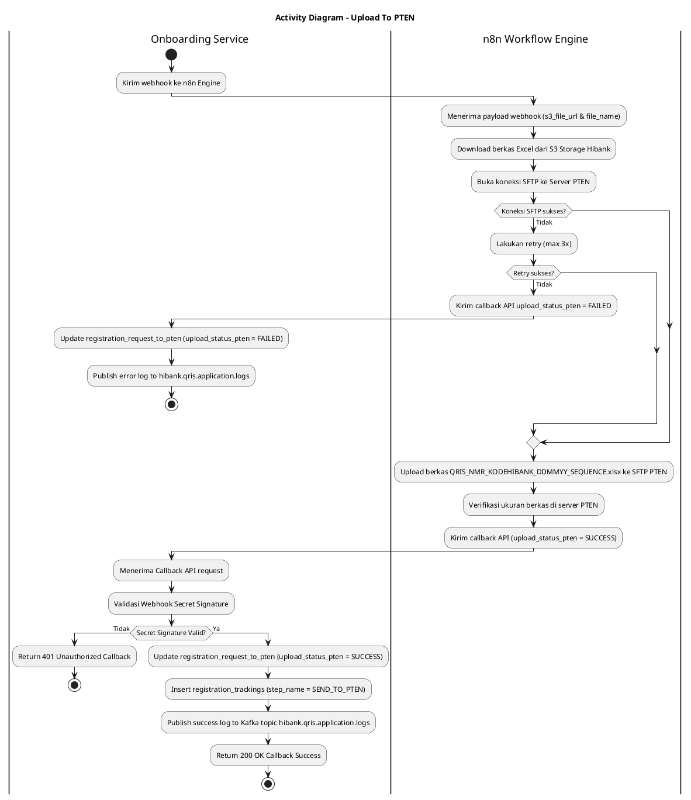
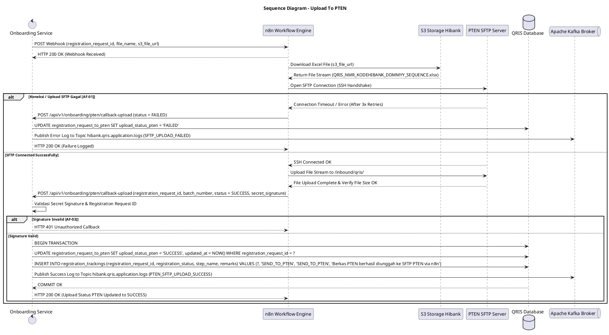

# 1 Deskripsi Use Case

**Tabel 1: Deskripsi Use Case Upload To PTEN**

| Elemen Spesifikasi | Deskripsi Detail |
| --- | --- |
| ID Use Case | UC-BOH-005 |
| Nama Use Case | Upload To PTEN |
| Penjelasan Singkat | Proses otomatisasi transmisi berkas registrasi PTEN oleh n8n Workflow Engine dari S3 Hibank ke Server SFTP PTEN via koneksi terenkripsi, dilanjutkan penganggilan API callback ke Onboarding Service untuk meng-update status `upload_status_pten = 'SUCCESS'` dan memublikasikan log ke Kafka Topic `hibank.qris.application.logs`. |
| Aktor Utama | Sistem (n8n Workflow Engine) |
| Aktor Pendukung | Onboarding Service API, Hibank S3 Object Storage, Server SFTP PTEN, Apache Kafka Broker |
| Deskripsi Singkat | n8n Workflow Engine menerima payload trigger webhook dari Onboarding Service memuat metadata `registration_request_id`, nama berkas `file_name` (`QRIS_NMR_KODEHIBANK_DDMMYY_SEQUENCE.xlsx`), dan `s3_file_url`. n8n mengunduh berkas Excel dari Hibank S3 Storage, kemudian membuka koneksi terenkripsi **SFTP (Secure File Transfer Protocol)** ke server resmi PTEN. n8n mengunggah berkas Excel ke direktori tujuan SFTP PTEN. Setelah transfer SFTP berhasil, n8n memicu endpoint API Callback Onboarding Service (`POST /api/v1/onboarding/pten/callback-upload`). Onboarding Service memvalidasi payload, memperbarui status `upload_status_pten = 'SUCCESS'` pada tabel `registration_request_to_pten`, memublikasikan log transaksi ke Kafka Topic `hibank.qris.application.logs`, serta menambahkan entri rekam jejak pada `registration_trackings` (`step_name = 'SEND_TO_PTEN'`). |
| Pre-condition | 1. Berkas Excel registrasi PTEN (`QRIS_NMR_KODEHIBANK_DDMMYY_SEQUENCE.xlsx`) telah berhasil di-generate dan disimpan di Hibank S3 Storage (`upload_status_s3 = 'SUCCESS'`). 2. Onboarding Service telah berhasil mengirimkan webhook ke n8n (`webhook_status = 'SUCCESS'`). 3. Kredensial dan endpoint server SFTP PTEN terkonfigurasi aktif pada n8n. |
| Post-condition | 1. Berkas Excel registrasi PTEN tersimpan utuh pada server SFTP PTEN. 2. Kolom `upload_status_pten` pada tabel `registration_request_to_pten` diperbarui menjadi `SUCCESS`. 3. Log aktivitas callback berhasil dipublikasikan ke Kafka Topic `hibank.qris.application.logs`. 4. Rekam jejak audit ditambahkan pada `registration_trackings` (`step_name = 'SEND_TO_PTEN'`). |
| Trigger | n8n Workflow Engine menerima payload webhook dari Onboarding Service. |
| Nama Tabel | registration_requests, registration_request_to_pten, registration_trackings |
| Integrasi | 1. **n8n Workflow Engine:** Automasi pengunduhan dari S3, koneksi SFTP, dan pemanggilan Callback API. 2. **PTEN SFTP Server:** Server Secure File Transfer Protocol milik PTEN untuk penerimaan berkas registrasi batch. 3. **Hibank S3 Storage:** Object storage tempat penyimpanan berkas Excel terenkripsi. 4. **Onboarding Service Callback API:** Endpoint REST API untuk penanganan callback pembaruan status dari n8n. 5. **Apache Kafka Message Broker:** Event broker tempat pengiriman log aplikasi via topic `hibank.qris.application.logs`. |
| Asumsi | 1. Server SFTP PTEN beroperasi dengan kredensial SSH Key / Password yang valid. 2. Koneksi jaringan internet antara n8n dan Server SFTP PTEN stabil. |
| Keterbatasan | 1. Apabila koneksi SFTP ke PTEN mengalami timeout/gagal, n8n akan melakukan *retry* maksimal 3 kali sebelum mengembalikan status `FAILED` ke Onboarding Service. 2. Transmisi berkas bergantung penuh pada ketersediaan jalur SFTP PTEN. |
| Aturan Bisnis/Sistem | 1. **Automated SFTP Transmission:** n8n melakukan autentikasi Secure Shell (SSH) ke server SFTP PTEN dan mengunggah berkas Excel `QRIS_NMR_KODEHIBANK_DDMMYY_SEQUENCE.xlsx` ke direktori target yang disepakati (misal: `/inbound/qris/`). 2. **Centralized Application Logging via Kafka:** Seluruh aktivitas callback dan status transmisi SFTP WAJIB dipublikasikan ke Kafka Topic `hibank.qris.application.logs`. 3. **File Integrity Verification:** n8n memverifikasi ukuran berkas (*file size*) pasca upload ke SFTP PTEN untuk memastikan tidak ada kerusakkan file (*file corruption*). 4. **Callback API Integration:** Setelah upload SFTP berhasil, n8n WAJIB memanggil Callback API Onboarding Service dengan menyertakan `registration_request_id`, `batch_number`, `sftp_upload_timestamp`, dan `status = 'SUCCESS'`. 5. **Database & Log Update:** Onboarding Service memproses request callback dari n8n, memperbarui `upload_status_pten = 'SUCCESS'` pada tabel `registration_request_to_pten`, memublikasikan log ke `hibank.qris.application.logs`, serta memperbarui rekam jejak pada `registration_trackings` (`step_name = 'SEND_TO_PTEN'`). 6. **Callback Security Enforcement:** Endpoint Callback API wajib memvalidasi *Webhook Secret Signature* dari n8n untuk mencegah klaim palsu dari pihak tak berwenang (`401XX00 - Unauthorized Callback`). |
| Session Idle | 15 Menit |

# 2 Main Flow

**Tabel 2: Main Flow Upload To PTEN**

| No. | Aktivitas | Deskripsi |
| ---: | --- | --- |
| 1 | Menerima Webhook dari Onboarding Service | n8n Workflow Engine menerima payload webhook dari Onboarding Service berisi `registration_request_id`, `file_name`, `batch_number`, dan `s3_file_url`. |
| 2 | Mengunduh Berkas dari S3 Hibank | n8n mengunduh berkas Excel `QRIS_NMR_KODEHIBANK_DDMMYY_SEQUENCE.xlsx` dari Hibank S3 Object Storage ke dalam memori sementara workflow. |
| 3 | Membuka Koneksi SFTP ke PTEN | n8n membuka koneksi terenkripsi SFTP ke server PTEN menggunakan kredensial SSH resmi. |
| 4 | Mengunggah Berkas ke Server SFTP PTEN | n8n mengunggah berkas Excel ke direktori tujuan pada server SFTP PTEN. |
| 5 | Memverifikasi Berkas Terunggah | n8n memverifikasi keberhasilan transfer file dan integritas ukuran berkas pada server SFTP PTEN. |
| 6 | Memanggil API Callback Status | n8n mengirimkan request Callback API ke Onboarding Service (`POST /api/v1/onboarding/pten/callback-upload`) membawa status `upload_status_pten = 'SUCCESS'`. |
| 7 | Memvalidasi Request Callback API | Onboarding Service memverifikasi *Secret Signature* callback n8n dan `registration_request_id`. |
| 8 | Memperbarui Status Database, Log & Trackings | Onboarding Service memperbarui `upload_status_pten = 'SUCCESS'` pada tabel `registration_request_to_pten`, memublikasikan log ke Kafka Topic `hibank.qris.application.logs`, dan meng-insert entri pada `registration_trackings` (`step_name = 'SEND_TO_PTEN'`). |
| 9 | Use Case Selesai | Onboarding Service mengembalikan respon HTTP 200 OK ke n8n dan proses pengunggahan berkas ke PTEN selesai sepenuhnya. |

# 3 Alternative Flow

**Tabel 3: Alternative Flow Upload To PTEN**

| Kode | Alternative Flow | Deskripsi |
| --- | --- | --- |
| AF-01 | Gagal Koneksi / Upload SFTP PTEN | Pada langkah 3 atau 4, apabila server SFTP PTEN tidak dapat dihubungi atau gagal upload (timeout / permission denied), n8n melakukan retry 3x. Jika tetap gagal, n8n mengontak Callback API dengan status `upload_status_pten = 'FAILED'`, Onboarding Service memublikasikan log error ke `hibank.qris.application.logs`, dan mencatat log kegagalan. |
| AF-02 | Gagal Mengunduh Berkas dari S3 Hibank | Pada langkah 2, apabila berkas di S3 Hibank tidak ditemukan atau koneksi S3 timeout, n8n membatalkan koneksi SFTP dan memicu Callback API dengan status `upload_status_pten = 'FAILED'`. |
| AF-03 | Webhook Secret Signature Callback Invalid | Pada langkah 7, apabila request callback n8n dikirim tanpa secret signature yang cocok, Onboarding Service menolak callback dan mengembalikan `401XX00 - Unauthorized Callback`. |

# 4 Status Front-End

**Tabel 4: Status Front-End / Service Execution Status Upload To PTEN**

| No. | Nama Status | Deskripsi Status Eksekusi Process Worker |
| ---: | --- | --- |
| 1 | SFTP_CONNECTING | n8n sedang melakukan *handshake* SSH/SFTP ke server PTEN. |
| 2 | SFTP_UPLOADING | n8n sedang mengalirkan berkas Excel `QRIS_NMR_KODEHIBANK_DDMMYY_SEQUENCE.xlsx` ke direktori SFTP PTEN. |
| 3 | UPLOAD_PTEN_SUCCESS | Flag `upload_status_pten = 'SUCCESS'` setelah callback n8n diterima, log dipublikasikan ke `hibank.qris.application.logs`, dan diverifikasi oleh Onboarding Service. |
| 4 | UPLOAD_PTEN_FAILED | Flag `upload_status_pten = 'FAILED'` jika terjadi kegagalan koneksi SFTP PTEN setelah batas retry terlampaui. |

# 5 Activity Diagram Upload To PTEN

# 6 Sequence Diagram Upload To PTEN

# 7 Response Code

**Tabel 5: Response Code / Callback API Response Code**

| No. | HTTP Status | Response Code | Nama Response | Deskripsi | Respons System / n8n |
| ---: | ---: | --- | --- | --- | --- |
| 1 | 200 | 200XX00 | PTEN_UPLOAD_CALLBACK_SUCCESS | Callback dari n8n berhasil diproses, `upload_status_pten` diperbarui menjadi `SUCCESS`, dan log dipublikasikan ke `hibank.qris.application.logs`. | n8n menyelesaikan alur workflow dengan sukses. |
| 2 | 200 | 200XX01 | PTEN_UPLOAD_CALLBACK_FAILED_LOGGED | Callback kegagalan dari n8n diterima, status `upload_status_pten` di-update `FAILED`, dan log error dipublikasikan ke `hibank.qris.application.logs`. | Onboarding Service mencatat error log untuk tindak lanjut operasional. |
| 3 | 401 | 401XX00 | UNAUTHORIZED_CALLBACK_SIGNATURE | Request callback dari n8n ditolak karena *Secret Signature* tidak valid. | n8n menerima error autentikasi callback. |
| 4 | 404 | 404XX00 | REGISTRATION_REQUEST_NOT_FOUND | Data `registration_request_id` pada payload callback tidak ditemukan di database. | n8n mencatat error record not found. |
| 5 | 500 | 500XX00 | INTERNAL_ONBOARDING_ERROR | Gangguan internal pada Onboarding Service saat memproses callback API. | n8n melakukan retry pengiriman callback. |

# 8 Desain Antarmuka

**Tabel 6: Desain Antarmuka / Monitor Batch Status SFTP PTEN**

| Halaman | Komponen dan State Utama |
| --- | --- |
| Dashboard Monitoring Batch PTEN (Back Office Hibank) | - Tabel Monitoring Batch Registrasi PTEN (`registration_request_to_pten`). - Kolom: `batch_number`, Nama File (`QRIS_NMR_KODEHIBANK_DDMMYY_SEQUENCE.xlsx`), `upload_status_s3`, `webhook_status`, Status SFTP PTEN (`upload_status_pten`), Tanggal Upload. - Indicator Badges Status `upload_status_pten`: &nbsp;&nbsp;* `NOT_STARTED` (Gray) &nbsp;&nbsp;* `SFTP_UPLOADING` (Yellow/Blue) &nbsp;&nbsp;* `SUCCESS` (Green) &nbsp;&nbsp;* `FAILED` (Red) - Tombol **"Re-trigger SFTP Upload"** (hanya aktif saat status `FAILED`). |
