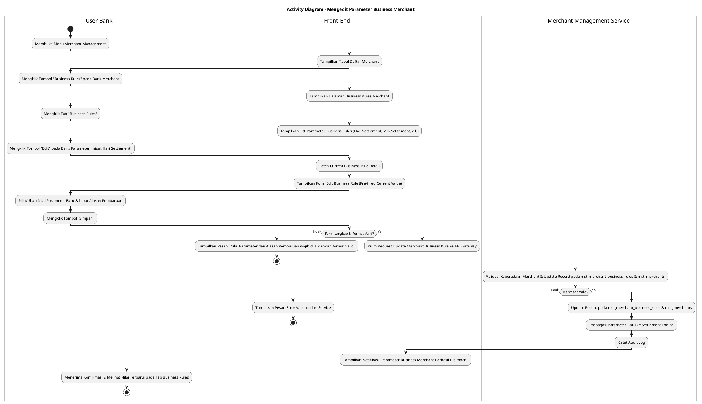
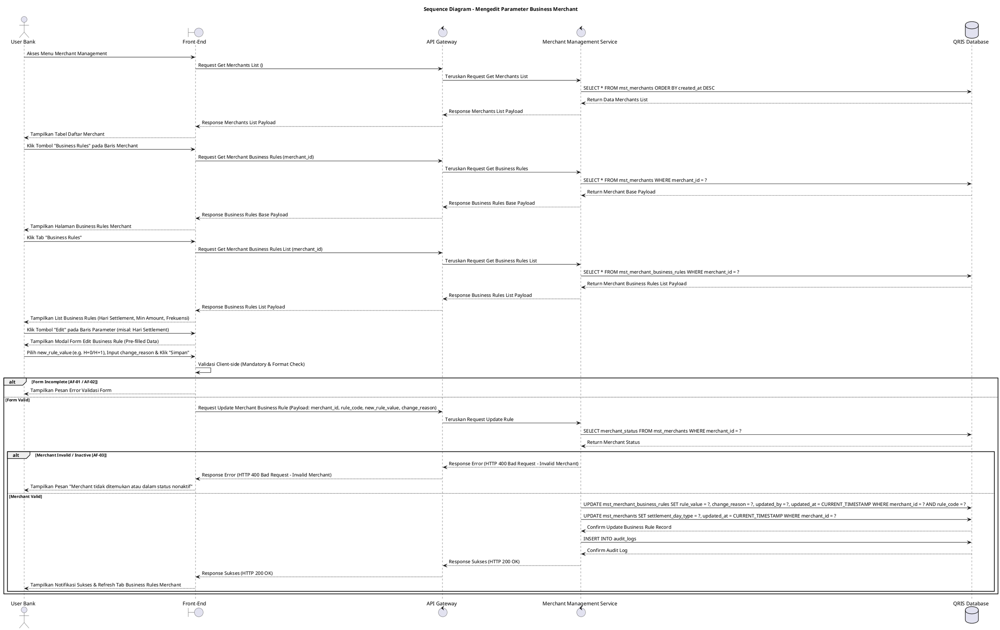

# 1 Deskripsi Use Case

**Tabel 1: Deskripsi Use Case Mengedit Parameter Business Merchant**

| Elemen Spesifikasi | Deskripsi Detail |
| --- | --- |
| ID Use Case | UC-BOH-050 |
| Nama Use Case | Mengedit Parameter Business Merchant |
| Penjelasan Singkat | Fitur Web Back Office Hibank pada menu Merchant Management yang memfasilitasi User Bank (Merchant Administrator) untuk memperbarui parameter aturan bisnis merchant khusus (seperti Hari Settlement/Siklus Penyelesaian Dana `H+0`, `H+1`, minimum batas pencairan, dan frekuensi disbursement) pada tabel `mst_merchants` dan `mst_merchant_business_rules` melalui Merchant Management Service. |
| Aktor Utama | User Bank (Merchant Administrator / Back Office Hibank User) |
| Aktor Pendukung | Merchant Management Service (`merchant_management_service`) |
| Deskripsi Singkat | User Bank melakukan otentikasi login SSO ke Web Back Office Hibank dan mengakses menu **Merchant Management**. Sistem menampilkan halaman daftar merchant terdaftar dari tabel `mst_merchants`. User Bank memilih salah satu merchant, lalu mengklik tombol aksi **"Business Rules"**. Sistem menampilkan halaman pengelolaan aturan bisnis merchant yang memiliki beberapa tab navigasi. User Bank memilih tab **Business Rules** (atau Business Parameters). Sistem menampilkan daftar parameter aturan bisnis merchant terdaftar (seperti Hari Settlement `H+0`/`H+1`, Minimum Settlement Amount, Frekuensi Settlement, dll.) dari tabel `mst_merchant_business_rules` atau `mst_merchants`. User Bank mengklik tombol aksi **"Edit"** pada baris parameter bisnis yang ingin diubah. Sistem menampilkan modal formulir pengeditan parameter bisnis merchant yang terisi (*pre-filled*) dengan data terkini. User Bank menyesuaikan nilai parameter bisnis (seperti mengubah Hari Settlement dari `H+1` ke `H+0`, mengubah Minimum Nominal Settlement, dan menginput Alasan Pembaruan), lalu mengklik tombol **"Simpan"**. Front-End memvalidasi kelengkapan form dan mengirimkan request ke API Gateway. Merchant Management Service memvalidasi keberadaan `merchant_id` dan keabsahan konfigurasi parameter bisnis baru. Setelah validasi sukses, service memperbarui record pada tabel **`mst_merchant_business_rules`** dan/atau **`mst_merchants`**, serta mencatat jejak perubahan ke tabel **`audit_logs`**. Parameter bisnis baru ini secara otomatis berlaku untuk proses operasional settlement dan disbursement merchant terkait. Front-End memperbarui tampilan tab Business Rules merchant dan menyajikan notifikasi konfirmasi sukses. |
| Pre-condition | 1. User Bank telah berhasil login SSO ke Web Back Office Hibank dan memiliki kewenangan pengelolaan merchant (`MERCHANT_ADMIN`). 2. Data merchant terpilih terdaftar aktif pada tabel `mst_merchants`. |
| Post-condition | 1. Data parameter bisnis merchant (seperti Hari Settlement `settlement_day_type`, Minimum Settlement Amount, dan frekuensi pencairan) berhasil diperbarui pada tabel `mst_merchant_business_rules` dan `mst_merchants`. 2. Proses pemrosesan batch settlement dan disbursement otomatis mengikuti parameter aturan bisnis terbaru. 3. Front-End memperbarui dan menampilkan data parameter bisnis terbaru pada tab Business Rules merchant. |
| Trigger | User Bank mengklik menu **Merchant Management**, mengklik tombol **"Business Rules"** pada baris merchant, memilih tab **Business Rules**, mengklik tombol **"Edit"** pada baris parameter bisnis, mengubah nilai (seperti Hari Settlement), lalu mengklik **"Simpan"**. |
| Nama Tabel | mst_merchants, mst_merchant_business_rules, audit_logs |
| Integrasi | 1. **Web Back Office Hibank UI:** Antarmuka daftar merchant, halaman Business Rules merchant (Tab Business Rules), dan modal formulir pengeditan parameter bisnis. 2. **Merchant Management Service (`merchant_management_service`):** Microservice backend pengelola konfigurasi merchant, aturan siklus settlement, dan pencatatan audit log. |
| Asumsi | 1. Pembaruan parameter bisnis seperti Hari Settlement (`H+0`, `H+1`, `H+2`) berlaku untuk transaksi mendatang dan siklus pencairan berikutnya. 2. Nilai default Hari Settlement untuk merchant reguler adalah `H+1` kecuali disesuaikan secara eksplisit oleh User Bank. |
| Keterbatasan | 1. Pengeditan parameter bisnis memerlukan pengisian Alasan Pembaruan (*change_reason*) yang wajib diisi (*mandatory*). 2. Opsi Hari Settlement terbatas pada kode preset valid yang didukung oleh Settlement Engine (`H+0`, `H+1`, `H+2`, `WEEKDAYS_ONLY`). |
| Aturan Bisnis/Sistem | 1. **Settlement Cycle Parameter Standard:** Pilihan Hari Settlement (`settlement_day_type`) WAJIB merujuk pada preset valid yang didukung sistem: `H+0` (Sama Hari), `H+1` (Hari Kerja Berikutnya), `H+2`, atau `WEEKDAYS_ONLY`. 2. **Mandatory Change Reason Constraint:** Pengisian Alasan Pembaruan (*change_reason*) bersifat WAJIB (*mandatory*) saat mengonfirmasi perubahan parameter bisnis merchant. 3. **Real-time Engine Synchronization:** Pembaruan parameter bisnis merchant pada `mst_merchant_business_rules` WAJIB secara otomatis disinkronkan ke Settlement Engine & Disbursement Engine. 4. **Audit Trail Standard:** Setiap tindakan pengeditan parameter bisnis merchant mencatat `merchant_id`, `rule_code`, nilai parameter awal, nilai parameter baru, alasan pembaruan, `updated_by` (ID User Bank), dan timestamp pada `audit_logs`. |
| Session Idle | 15 Menit |

# 2 Main Flow

**Tabel 2: Main Flow Mengedit Parameter Business Merchant**

| No. | Aktivitas | Deskripsi |
| ---: | --- | --- |
| 1 | Membuka Menu Merchant Management | User Bank melakukan login SSO dan mengklik menu **Merchant Management** pada navigasi Back Office Hibank. |
| 2 | Menampilkan Daftar Merchant | Sistem menampilkan halaman daftar merchant terdaftar dari `mst_merchants` beserta tombol aksi **"Business Rules"** pada tiap baris merchant. |
| 3 | Memilih Tombol Business Rules | User Bank mengklik tombol **"Business Rules"** pada salah satu baris merchant. |
| 4 | Menampilkan Halaman Business Rules | Sistem menampilkan halaman Business Rules merchant yang memuat beberapa tab navigasi aturan bisnis. |
| 5 | Memilih Tab Business Rules | User Bank mengklik tab **Business Rules** (atau Business Parameters). |
| 6 | Menampilkan List Business Rules Merchant | Sistem menampilkan daftar parameter aturan bisnis merchant (seperti Hari Settlement `H+0`/`H+1`, Minimum Settlement Amount, dll.) dari `mst_merchant_business_rules` / `mst_merchants`. |
| 7 | Memilih Tombol Edit Parameter | User Bank mengklik tombol **"Edit"** pada salah satu baris parameter bisnis (misal: Hari Settlement). |
| 8 | Menampilkan Form Edit Business Rule | Sistem menampilkan modal formulir pengeditan parameter bisnis merchant yang terisi (*pre-filled*) dengan data terkini. |
| 9 | Mengubah Parameter & Mengisi Alasan | User Bank memilih Nilai Parameter Baru (seperti Hari Settlement `H+0` / `H+1`), menginput Minimum Nominal Settlement (jika ada), dan menginput Alasan Pembaruan (*change_reason*). |
| 10 | Mengklik Tombol Simpan | User Bank mengklik tombol **"Simpan"**. |
| 11 | Memvalidasi Form Client-side | Front-End memvalidasi kelengkapan form dan format data, lalu mengirim request ke API Gateway. |
| 12 | Memvalidasi & Update Record | Merchant Management Service memvalidasi keberadaan `merchant_id`, memperbarui record pada `mst_merchant_business_rules` dan `mst_merchants`, serta mencatat `audit_logs`. |
| 13 | Menampilkan Konfirmasi Berhasil | Front-End memperbarui tabel daftar parameter pada tab Business Rules merchant dan menyajikan notifikasi konfirmasi bahwa perubahan parameter bisnis berhasil disimpan. |
| 14 | Use Case Selesai | Proses pengeditan parameter bisnis merchant selesai dilaksanakan. |

# 3 Alternative Flow

**Tabel 3: Alternative Flow Mengedit Parameter Business Merchant**

| Kode | Alternative Flow | Deskripsi |
| --- | --- | --- |
| AF-01 | Nilai Parameter atau Alasan Kosong | Pada langkah 9-10, apabila Nilai Parameter Baru atau Alasan Pembaruan dikosongkan, Sistem menolak request dan Front-End menampilkan `Nilai Parameter Baru dan Alasan Pembaruan wajib diisi`. |
| AF-02 | Format Minimum Settlement Amount Invalid | Pada langkah 9-10, apabila Minimum Nominal Settlement bernilai negatif atau bukan format angka valid, Sistem menolak request dan Front-End menampilkan `Minimum Nominal Settlement harus berupa angka positif valid`. |
| AF-03 | Merchant Tidak Ditemukan / Nonaktif | Pada langkah 12, apabila data merchant tidak ditemukan atau berstatus nonaktif, Merchant Management Service membatalkan transaksi dan Front-End menampilkan `Merchant tidak ditemukan atau dalam status nonaktif`. |
| AF-04 | Gagal Terhubung ke Database Server | Pada langkah 12, apabila koneksi database terputus total, Sistem mengembalikan HTTP status 500 dan Front-End menampilkan `Terjadi kendala internal pada server`. |

# 4 Status Front-End

**Tabel 4: Status Front-End Mengedit Parameter Business Merchant**

| No. | Nama Status | Deskripsi Tampilan Front-End |
| ---: | --- | --- |
| 1 | IDLE | Tab Business Rules pada halaman aturan bisnis merchant menyajikan daftar parameter dan modal form edit terisi siap diubah. |
| 2 | LOADING | Indikator memuat (*spinner*) ditampilkan pada tombol Simpan saat request pembaruan parameter bisnis sedang diproses server. |
| 3 | SUCCESS | Modal/toast konfirmasi menampilkan pesan sukses parameter bisnis merchant berhasil disimpan dan data diperbarui. |
| 4 | ERROR | Pesan kesalahan ditampilkan pada UI akibat nilai/alasan kosong, format nominal invalid, atau gangguan server. |

# 5 Activity Diagram Mengedit Parameter Business Merchant

# 6 Sequence Diagram Mengedit Parameter Business Merchant

# 7 Response Code

**Tabel 5: Response Code Mengedit Parameter Business Merchant**

| No. | HTTP Status | Response Code | Nama Response | Deskripsi | Respons Front-End |
| ---: | ---: | --- | --- | --- | --- |
| 1 | 200 | 200XX00 | SUCCESS_UPDATE_MERCHANT_BUSINESS_RULE | Parameter aturan bisnis merchant berhasil diperbarui pada tabel `mst_merchant_business_rules` dan `mst_merchants`. | Menampilkan pesan notifikasi sukses dan memperbarui tabel list parameter bisnis merchant. |
| 2 | 400 | 400XX00 | INVALID_BUSINESS_RULE_INPUT | Nilai Parameter Baru atau Alasan Pembaruan kosong / tidak valid. | Menampilkan pesan kesalahan validasi input. |
| 3 | 400 | 400XX01 | MERCHANT_NOT_FOUND_OR_INACTIVE | Merchant yang dipilih tidak ditemukan atau berstatus nonaktif. | Menampilkan pesan kesalahan `Merchant tidak ditemukan atau dalam status nonaktif`. |
| 4 | 500 | 500XX00 | SYSTEM_INTERNAL_ERROR | Terjadi kegagalan internal server saat mengeksekusi pengeditan parameter bisnis merchant. | Menampilkan pesan kesalahan `Terjadi kendala internal pada server`. |

# 8 Desain Antarmuka

**Tabel 6: Desain Antarmuka Mengedit Parameter Business Merchant**

| Halaman | Komponen dan State Utama |
| --- | --- |
| Halaman Daftar Merchant | 1. **Tabel Merchant:** Kolom No, ID Merchant, Nama Merchant, Kategori Usaha, Status, dan Aksi. 2. **Tombol "Business Rules":** Tombol pemicu navigasi ke halaman aturan bisnis merchant (Primary Accent Button). |
| Halaman Business Rules Merchant (Tab Business Rules) | 1. **Navigasi Tab:** Tab Informasi Umum, Tab MDR, Tab **Business Rules** (Active), Tab Limit Transaksi, Tab Terminal. 2. **Tabel Business Rules Merchant:** Kolom No, Nama Parameter (misal: Hari Settlement, Min Settlement Amount), Nilai Saat Ini (misal: `H+1`, `Rp 50.000,00`), Tanggal Diperbarui, dan Aksi. 3. **Tombol "Edit":** Tombol pemicu modal pengeditan parameter bisnis pada tiap baris data (Ikon Pencil). |
| Modal Form Edit Business Rule | 1. **Field Nama Parameter (`rule_name`):** Text Input (*Disabled / Read-only*, e.g. Hari Settlement / Settlement Day Cycle). 2. **Dropdown Nilai Parameter Baru (`rule_value`):** Dropdown pilihan preset valid (e.g. `H+0`, `H+1`, `H+2`, `WEEKDAYS_ONLY`). 3. **Field Minimum Settlement Amount (jika relevan):** Currency Input (e.g. Rp 50.000,00). 4. **Field Alasan Pembaruan (`change_reason`):** Textarea Input (Editable, Mandatory). 5. **Tombol Aksi:** Tombol **"Simpan"** (Primary Button) dan **"Batal"** (Secondary Button). |
