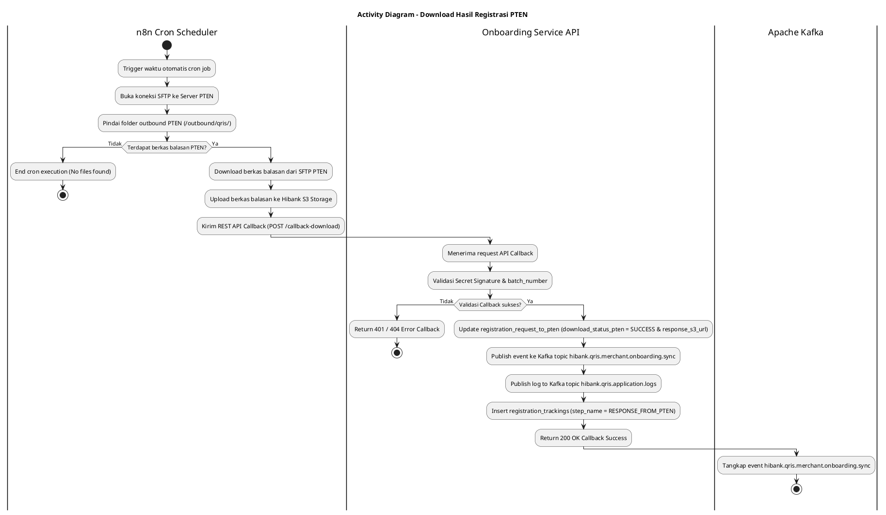
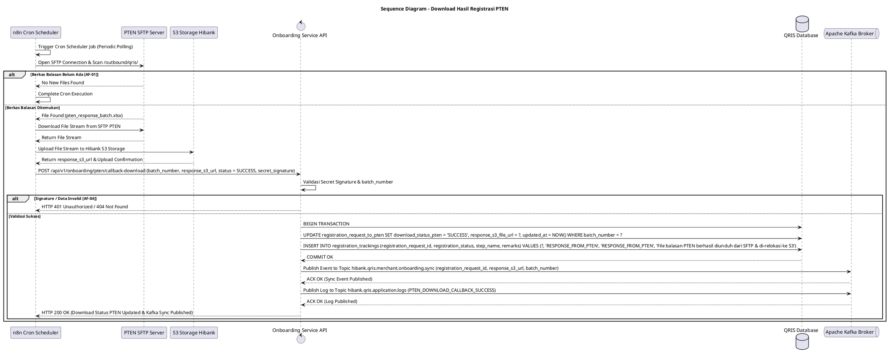

# 1 Deskripsi Use Case

**Tabel 1: Deskripsi Use Case Download Hasil Registrasi PTEN**

| Elemen Spesifikasi | Deskripsi Detail |
| --- | --- |
| ID Use Case | UC-BOH-006 |
| Nama Use Case | Download Hasil Registrasi PTEN |
| Penjelasan Singkat | Proses otomatisasi berkala (cron scheduler) oleh n8n Workflow Engine untuk memeriksa, mengunduh berkas balasan hasil registrasi dari server SFTP PTEN, memindahkannya ke S3 Object Storage Hibank, serta memanggil Callback API Onboarding Service untuk meng-update `download_status_pten = 'SUCCESS'`, memublikasikan Kafka Event `hibank.qris.merchant.onboarding.sync`, dan memublikasikan log aplikasi ke Kafka Topic `hibank.qris.application.logs`. |
| Aktor Utama | Sistem (n8n Workflow Engine - Scheduler) |
| Aktor Pendukung | PTEN SFTP Server, Hibank S3 Object Storage, Onboarding Service API, Apache Kafka Broker |
| Deskripsi Singkat | n8n Workflow Engine menjalankan job penjadwalan berkala (*cron scheduler*) untuk membuka koneksi SFTP ke server PTEN dan memindai direktori balasan hasil registrasi PTEN (`/outbound/qris/`). Apabila ditemukan berkas balasan hasil registrasi merchant, n8n mengunduh berkas tersebut dan mengunggahnya (*transfer*) ke **S3 Object Storage milik Hibank**. Selanjutnya, n8n memicu REST API Callback pada Onboarding Service (`POST /api/v1/onboarding/pten/callback-download`). Onboarding Service memvalidasi payload, memperbarui status `download_status_pten = 'SUCCESS'`, menyimpan URL file S3 balasan pada tabel `registration_request_to_pten`, serta memublikasikan log aplikasi ke Kafka Topic `hibank.qris.application.logs`. Terakhir, Callback API Onboarding Service memublikasikan (*publish*) event pendaftaran ke Kafka Topic `hibank.qris.merchant.onboarding.sync` agar dikonsumsi lebih lanjut oleh Onboarding Service untuk proses pemutakhiran data akhir dan penyiapan akun merchant. |
| Pre-condition | 1. Berkas pengajuan registrasi PTEN telah berhasil diunggah sebelumnya ke SFTP PTEN (`upload_status_pten = 'SUCCESS'`). 2. Server PTEN telah memproses pengajuan dan menerbitkan berkas balasan di direktori SFTP outbound. 3. Cron job scheduler n8n beroperasi aktif. |
| Post-condition | 1. Berkas balasan hasil registrasi PTEN berhasil diunduh dan tersimpan di Hibank S3 Storage. 2. Status `download_status_pten` pada tabel `registration_request_to_pten` diperbarui menjadi `SUCCESS`. 3. Event pendaftaran berhasil dipublikasikan ke Kafka Topic `hibank.qris.merchant.onboarding.sync`. 4. Log aktivitas callback berhasil dipublikasikan ke Kafka Topic `hibank.qris.application.logs`. 5. Rekam jejak audit ditambahkan pada `registration_trackings` (`step_name = 'RESPONSE_FROM_PTEN'`). |
| Trigger | Pemicu waktu otomatis (*cron timer scheduler*) pada n8n Workflow Engine. |
| Nama Tabel | registration_requests, registration_request_to_pten, registration_trackings |
| Integrasi | 1. **n8n Cron Scheduler:** Layanan automasi penjadwalan pemindaian folder SFTP PTEN. 2. **PTEN SFTP Server:** Server Secure File Transfer Protocol milik PTEN penyedia berkas balasan hasil registrasi. 3. **Hibank S3 Storage:** Object storage tempat penyimpanan berkas balasan PTEN. 4. **Onboarding Service REST API:** Endpoint Callback pemutakhiran status download dan pemicu Kafka event. 5. **Apache Kafka Message Broker:** Event broker penerima publikasi event topic `hibank.qris.merchant.onboarding.sync` dan application logs topic `hibank.qris.application.logs`. |
| Asumsi | 1. Berkas balasan dari PTEN memiliki penamaan dan struktur data terstandarisasi yang dapat dipetakan ke `registration_request_id` / `batch_number`. 2. Jalur jaringan SFTP PTEN dan S3 Storage Hibank beroperasi dengan stabil. |
| Keterbatasan | 1. Apabila tidak ditemukan berkas balasan baru pada direktori SFTP PTEN, n8n akan mengakhiri eksekusi cron tanpa memanggil Callback API. 2. Proses sinkronisasi data akhir ke merchant bergantung pada konsumsi Kafka event `hibank.qris.merchant.onboarding.sync`. |
| Aturan Bisnis/Sistem | 1. **Automated Scheduled SFTP Polling:** n8n menjalankan koneksi SSH/SFTP berkala (misal: setiap 15/30 menit) ke folder outbound PTEN (`/outbound/qris/`). 2. **Centralized Application Logging via Kafka:** Seluruh aktivitas polling, callback download, dan event sync WAJIB dipublikasikan ke Kafka Topic `hibank.qris.application.logs`. 3. **S3 File Relocation:** Berkas balasan dari SFTP PTEN WAJIB diunduh dan disimpan secara utuh di bucket S3 Object Storage Hibank sebelum Callback API dipanggil. 4. **Callback API Execution & Status Update:** Setelah berkas balasan berada di S3 Hibank, n8n memanggil API Callback Onboarding Service dengan menyertakan `batch_number`, `response_s3_url`, dan `status = 'SUCCESS'`. Onboarding Service memperbarui status `download_status_pten = 'SUCCESS'` pada `registration_request_to_pten`. 5. **Kafka Sync Event Publication:** Sesaat setelah update database `download_status_pten = 'SUCCESS'` berhasil dikomit (*commit*), API Onboarding Service WAJIB memublikasikan event payload ke Kafka Topic `hibank.qris.merchant.onboarding.sync` secara asinkron. 6. **Timeline Trackings Update:** Onboarding Service mencatat rekam jejak pada `registration_trackings` (`step_name = 'RESPONSE_FROM_PTEN'`) dan memublikasikan log ke `hibank.qris.application.logs`. |
| Session Idle | 15 Menit |

# 2 Main Flow

**Tabel 2: Main Flow Download Hasil Registrasi PTEN**

| No. | Aktivitas | Deskripsi |
| ---: | --- | --- |
| 1 | Pemicu Cron Scheduler n8n | n8n Workflow Engine memicu eksekusi otomatis berdasarkan jadwal cron yang telah ditentukan. |
| 2 | Membuka Koneksi SFTP ke PTEN | n8n membuka koneksi terenkripsi SFTP ke server PTEN dan memindai direktori balasan (`/outbound/qris/`). |
| 3 | Mendeteksi & Mengunduh File Balasan | n8n mendeteksi keberadaan berkas balasan hasil registrasi PTEN dan mengunduh berkas tersebut ke memori workflow. |
| 4 | Mengunggah Berkas Balasan ke S3 Hibank | n8n mengunggah berkas balasan PTEN ke bucket Hibank S3 Object Storage dan mendapatkan `response_s3_url`. |
| 5 | Mengirimkan API Callback Download Status | n8n mengontak endpoint REST API Onboarding Service (`POST /api/v1/onboarding/pten/callback-download`) membawa `batch_number`, `response_s3_url`, dan status download. |
| 6 | Memvalidasi Request API Callback | Onboarding Service memvalidasi payload callback n8n, *Secret Signature*, dan kecocokan `batch_number` pada database. |
| 7 | Memperbarui Database & Status Download | Onboarding Service memperbarui status `download_status_pten = 'SUCCESS'` dan menyimpan `response_s3_url` pada tabel `registration_request_to_pten`. |
| 8 | Memublikasikan Kafka Sync & Log Event | Onboarding Service memublikasikan event payload ke Kafka Topic `hibank.qris.merchant.onboarding.sync` untuk ditangkap oleh worker sinkronisasi Onboarding Service, serta memublikasikan log transaksi ke Kafka Topic `hibank.qris.application.logs`. |
| 9 | Memperbarui Timeline Trackings | Onboarding Service menambahkan entri riwayat pada `registration_trackings` (`step_name = 'RESPONSE_FROM_PTEN'`). |
| 10 | Use Case Selesai | Onboarding Service mengembalikan respon HTTP 200 OK ke n8n dan proses unduh hasil registrasi PTEN selesai. |

# 3 Alternative Flow

**Tabel 3: Alternative Flow Download Hasil Registrasi PTEN**

| Kode | Alternative Flow | Deskripsi |
| --- | --- | --- |
| AF-01 | Berkas Balasan Belum Tersedia di SFTP PTEN | Pada langkah 3, apabila tidak ada berkas balasan baru pada folder outbound SFTP PTEN, n8n mengakhiri eksekusi cron dengan aman tanpa memanggil API Callback. |
| AF-02 | Gagal Upload Berkas Balasan ke S3 Storage Hibank | Pada langkah 4, apabila koneksi ke S3 Object Storage Hibank mengalami error/timeout, n8n membatalkan pemanggilan API Callback dan mencatat log error pada n8n execution history. |
| AF-03 | Kegagalan Publikasi Kafka Event hibank.qris.merchant.onboarding.sync | Pada langkah 8, apabila broker Kafka tidak merespon (timeout / connection refused), Onboarding Service melakukan retry publikasi Kafka dan memublikasikan log error ke `hibank.qris.application.logs`. |
| AF-04 | Webhook Secret Signature Callback Invalid | Pada langkah 6, apabila request callback n8n dikirim tanpa secret signature yang sah, Onboarding Service menolak callback dan mengembalikan `401XX00 - Unauthorized Callback`. |

# 4 Status Front-End

**Tabel 4: Status Front-End / Service Execution Status Download Hasil Registrasi PTEN**

| No. | Nama Status | Deskripsi Status Eksekusi Process Worker |
| ---: | --- | --- |
| 1 | CRON_CHECKING | n8n sedang memindai direktori outbound SFTP PTEN. |
| 2 | FILE_DOWNLOADING | n8n sedang mengunduh berkas balasan hasil registrasi dari SFTP PTEN. |
| 3 | S3_RELOCATING | n8n sedang mengunggah berkas balasan ke S3 Storage Hibank. |
| 4 | DOWNLOAD_PTEN_SUCCESS | Flag `download_status_pten = 'SUCCESS'` setelah API Callback diproses, log dipublikasikan ke `hibank.qris.application.logs`, dan event Kafka `hibank.qris.merchant.onboarding.sync` berhasil dipublikasikan. |
| 5 | KAFKA_SYNC_PUBLISHED | Event payload berhasil terkirim ke Kafka Topic `hibank.qris.merchant.onboarding.sync`. |

# 5 Activity Diagram Download Hasil Registrasi PTEN

# 6 Sequence Diagram Download Hasil Registrasi PTEN

# 7 Response Code

**Tabel 5: Response Code / Callback API Response Code**

| No. | HTTP Status | Response Code | Nama Response | Deskripsi | Respons System / n8n |
| ---: | ---: | --- | --- | --- | --- |
| 1 | 200 | 200XX00 | PTEN_DOWNLOAD_CALLBACK_SUCCESS | API Callback berhasil diproses, `download_status_pten` di-update `SUCCESS`, log dipublikasikan ke `hibank.qris.application.logs`, dan Kafka event `hibank.qris.merchant.onboarding.sync` dipublikasikan. | n8n menyelesaikannya dengan status sukses. |
| 2 | 401 | 401XX00 | UNAUTHORIZED_CALLBACK_SIGNATURE | Request API Callback dari n8n ditolak karena *Secret Signature* tidak sah. | n8n menerima error autentikasi. |
| 3 | 404 | 404XX00 | BATCH_NUMBER_NOT_FOUND | Data `batch_number` pada payload callback tidak ditemukan pada database. | n8n mencatat error record not found. |
| 4 | 500 | 500XX00 | KAFKA_PUBLISH_ERROR | Terjadi kesalahan jaringan saat memublikasikan event ke Kafka Broker. | API Onboarding Service mencatat log error ke `hibank.qris.application.logs` dan memicu alert. |

# 8 Desain Antarmuka

**Tabel 6: Desain Antarmuka / Monitor Batch Status SFTP PTEN**

| Halaman | Komponen dan State Utama |
| --- | --- |
| Dashboard Monitoring Batch PTEN (Back Office Hibank) | - Tabel Monitoring Batch Registrasi PTEN (`registration_request_to_pten`). - Kolom: `batch_number`, Nama File, `upload_status_pten`, Status Download (`download_status_pten`), Response S3 Link, Tanggal Download. - Indicator Badges Status `download_status_pten`: &nbsp;&nbsp;* `NOT_STARTED` (Gray) &nbsp;&nbsp;* `SUCCESS` (Green) &nbsp;&nbsp;* `FAILED` (Red) - Link Aksi **"Download File Balasan S3"** & Tombol **"Re-trigger Polling SFTP"**. |
