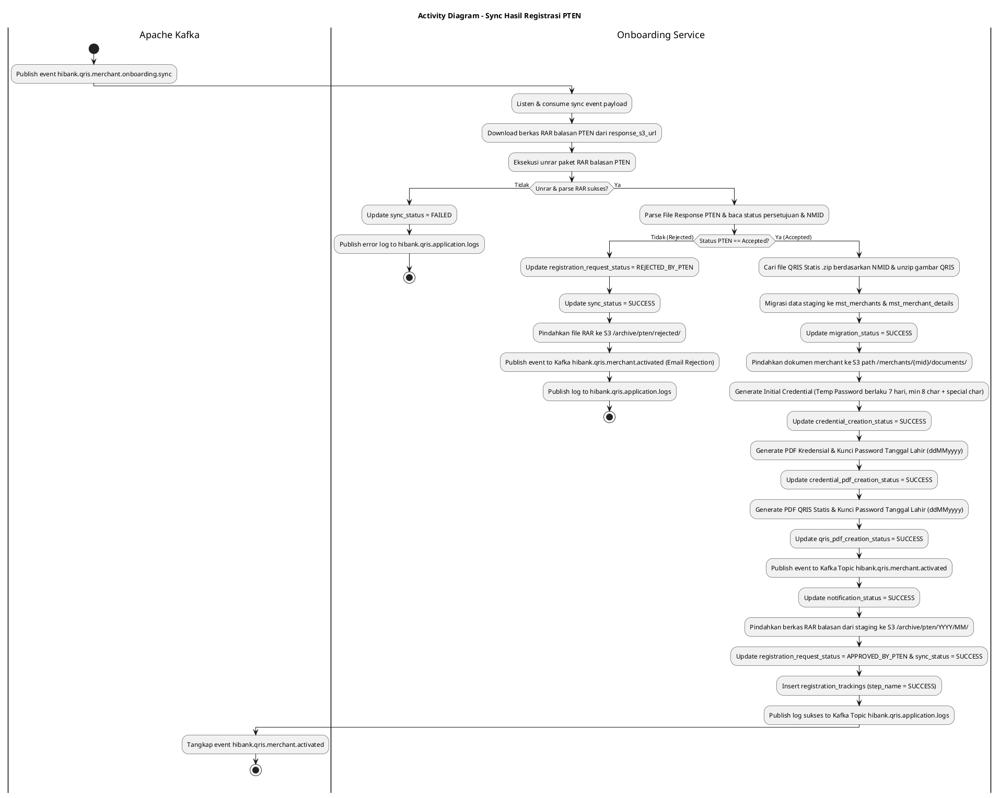
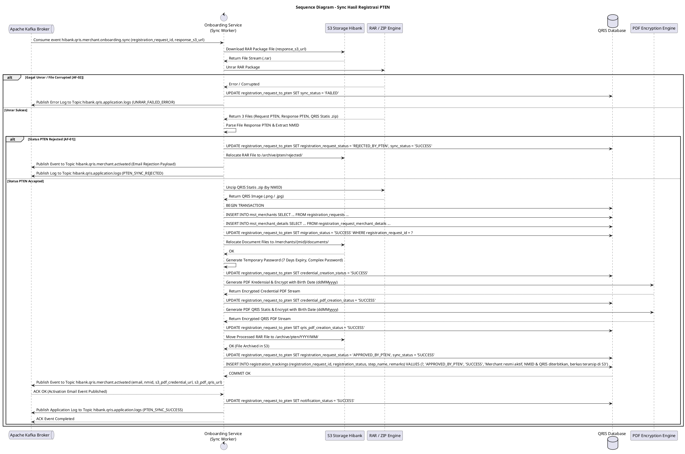

# 1 Deskripsi Use Case

**Tabel 1: Deskripsi Use Case Sync Hasil Registrasi PTEN**

| Elemen Spesifikasi | Deskripsi Detail |
| --- | --- |
| ID Use Case | UC-BOH-007 |
| Nama Use Case | Sync Hasil Registrasi PTEN |
| Penjelasan Singkat | Proses otomatisasi latar belakang (event-driven worker) pada Onboarding Service yang mendengarkan Kafka Topic `hibank.qris.merchant.onboarding.sync`, mengekstrak paket RAR balasan PTEN dari S3, melakukan migrasi data staging ke tabel produksi `mst_merchants`, meng-generate kredensial & PDF terenkripsi tanggal lahir (`ddMMyyyy`), meng-generate PDF QRIS Statis terenkripsi, memicu email notifikasi via Kafka `hibank.qris.merchant.activated`, memindahkan berkas balasan yang telah diproses di S3 ke folder arsip (`/archive/pten/YYYY/MM/`), serta memublikasikan seluruh log transaksi dan error aplikasi ke Kafka Topic `hibank.qris.application.logs`. |
| Aktor Utama | Sistem (Onboarding Service - Background Worker) |
| Aktor Pendukung | Apache Kafka Broker, Object Storage S3 Hibank, Notification Service / Mail Engine |
| Deskripsi Singkat | Onboarding Service mendengarkan event dari Kafka Topic `hibank.qris.merchant.onboarding.sync`. Worker membaca `registration_request_id` dan `response_s3_url`, lalu mengunduh berkas `.rar` balasan PTEN yang memuat 3 file (File Request PTEN, File Response PTEN, dan File QRIS Statis `.zip`). Worker melakukan `unrar`, membaca NMID dari File Response PTEN, dan melakukan `unzip` gambar QRIS Statis. Selanjutnya, worker melakukan migrasi data dari tabel staging (`registration_requests`, `registration_request_merchant_details`, `registration_request_to_pten`, `registration_request_merchant_document_details`, `registration_request_merchant_pic_details`) ke tabel produksi `mst_merchants` dan `mst_merchant_details` (`migration_status = 'SUCCESS'`), memindahkan dokumen PIC/merchant ke folder S3 per MID (`/merchants/{mid}/documents/`), membuat kredensial akun (*temporary password* berlaku 7 hari, kompleksitas min 8 karakter + karakter spesial `@,#,$`), meng-generate berkas **PDF Kredensial** & **PDF QRIS Statis** yang dikunci password tanggal lahir merchant/PIC berformat **`ddMMyyyy`** (`credential_pdf_creation_status = 'SUCCESS'`, `qris_pdf_creation_status = 'SUCCESS'`), memublikasikan event notifikasi email ke Kafka Topic **`hibank.qris.merchant.activated`** (`notification_status = 'SUCCESS'`), memperbarui status registrasi akhir `registration_status = 'APPROVED_BY_PTEN'` (atau `'REJECTED_BY_PTEN'`) dan `sync_status = 'SUCCESS'`, serta memindahkan berkas `.rar` balasan dari staging ke folder arsip S3 Hibank (`/archive/pten/YYYY/MM/`). Apabila terjadi kesalahan eksekusi / error aplikasi pada tahap manapun, rincian error dipublikasikan secara otomatis ke Kafka Topic **`hibank.qris.application.logs`**. |
| Pre-condition | 1. Berkas balasan hasil registrasi PTEN telah berhasil diunduh ke Hibank S3 Storage (`download_status_pten = 'SUCCESS'`). 2. Event sinkronisasi berhasil dipublikasikan ke Kafka Topic `hibank.qris.merchant.onboarding.sync`. |
| Post-condition | 1. Data merchant terdaftar resmi pada tabel produksi `mst_merchants` dan `mst_merchant_details` (`migration_status = 'SUCCESS'`). 2. Dokumen merchant terelokasi di S3 folder `/merchants/{mid}/documents/`. 3. Kredensial pemilik merchant berhasil di-generate dengan masa berlaku *initial password* **7 hari** (`credential_creation_status = 'SUCCESS'`). 4. Berkas PDF Kredensial & PDF QRIS Statis berhasil di-generate dan dikunci password tanggal lahir **`ddMMyyyy`**. 5. Event notifikasi aktivasi merchant dipublikasikan ke Kafka Topic `hibank.qris.merchant.activated` (`notification_status = 'SUCCESS'`). 6. Status pendaftaran diperbarui menjadi `APPROVED_BY_PTEN` (atau `REJECTED_BY_PTEN`) dan `sync_status = 'SUCCESS'`. 7. Berkas `.rar` balasan PTEN yang telah sukses diproses dipindahkan dari staging ke folder arsip S3 Hibank (`/archive/pten/YYYY/MM/`). 8. Seluruh log transaksi (baik sukses maupun error aplikasi) dipublikasikan ke Kafka Topic **`hibank.qris.application.logs`**. 9. Rekam jejak audit ditambahkan pada `registration_trackings` (`step_name = 'SUCCESS'`). |
| Trigger | Event baru diterima dari Kafka Topic `hibank.qris.merchant.onboarding.sync`. |
| Nama Tabel | registration_requests, registration_request_merchant_details, registration_request_merchant_document_details, registration_request_merchant_pic_details, registration_request_to_pten, mst_merchants, mst_merchant_details, registration_trackings |
| Integrasi | 1. **Apache Kafka Message Broker:** Consumes event sync (`hibank.qris.merchant.onboarding.sync`), publishes activation notification (`hibank.qris.merchant.activated`), dan publishes application logs & error logs (`hibank.qris.application.logs`). 2. **RAR & ZIP Extractor Engine:** Layanan dekrompresi berkas `.rar` dan `.zip` aset QRIS Statis. 3. **Hibank S3 Storage:** Pengunduhan paket balasan RAR, relokasi dokumen merchant per MID, dan pengarsipan berkas terproses ke `/archive/pten/YYYY/MM/`. 4. **PDF Generator & Encryption Engine:** Pembuatan dokumen PDF Kredensial dan PDF QRIS Statis yang dikunci dengan password tanggal lahir `ddMMyyyy` (AES-128/256 PDF Security). |
| Asumsi | 1. Berkas `.rar` dari PTEN memuat struktur 3 file valid: File Request PTEN, File Response PTEN (memuat NMID), dan File QRIS Statis `.zip`. 2. Tanggal lahir PIC/merchant tersedia valid berformat `YYYY-MM-DD` di database untuk dikonversi menjadi format password PDF `ddMMyyyy`. |
| Keterbatasan | 1. Apabila status balasan PTEN pada File Response adalah ditolak (*Rejected*), migrasi ke `mst_merchants` dibatalkan, status diperbarui menjadi `REJECTED_BY_PTEN`, dan log dipublikasikan ke `hibank.qris.application.logs`. 2. File PDF Kredensial dan PDF QRIS Statis tidak dapat dibuka tanpa menginputkan tanggal lahir `ddMMyyyy`. |
| Aturan Bisnis/Sistem | 1. **RAR & ZIP Unpacking:** Onboarding Service mengekstrak berkas `.rar` balasan PTEN dari S3. 3 komponen wajib diperiksa: (1) File Request PTEN, (2) File Response PTEN (di-parse untuk ekstraksi NMID), (3) File QRIS Statis `.zip` (di-unzip berdasarkan penamaan NMID). 2. **Production Data Migration:** Jika status PTEN *Accepted*, data dari `registration_requests`, `registration_request_merchant_details`, `registration_request_to_pten`, `registration_request_merchant_document_details`, dan `registration_request_merchant_pic_details` di-migrate secara atomis ke `mst_merchants` dan `mst_merchant_details`. Kolom `migration_status` di-update `SUCCESS`. 3. **S3 Document Relocation:** Seluruh dokumen terunggah pada `registration_request_merchant_pic_details` dipindahkan ke lokasi permanen S3 Hibank dengan struktur path: `/merchants/{mid}/documents/`. 4. **Merchant Initial Credential Security Standard:** &nbsp;&nbsp;- **Masa Berlaku Initial Password:** Di-override khusus menjadi **7 Hari** (wajib diganti pada saat login pertama kali / *First Logon Reset Required*). &nbsp;&nbsp;- **Kriteria Password:** Minimal 8 karakter, wajib kombinasi min 3 dari 4 (Karakter Spesial Wajib `@, #, $`, Huruf Besar `A-Z`, Huruf Kecil `a-z`, Angka `0-9`). Batasan Identitas: Dilarang memuat User ID, Nama Depan, atau Nama Belakang. &nbsp;&nbsp;- **Riwayat & Siklus:** Menyimpan 10 password terakhir. Kedaluwarsa password rutin max 90 hari, peringatan login mulai H-7, force redirect pemblokiran pada hari ke-91. &nbsp;&nbsp;- **Penalti Login Gagal:** Max 5x gagal berturut-turut -> Lockout 15 menit. &nbsp;&nbsp;- **Rate Limit:** Reset password max 3 req/min, Login attempt max 5 attempt/min. &nbsp;&nbsp;- Update `credential_creation_status = 'SUCCESS'`. 5. **Protected PDF Generation (Birth Date Encryption):** &nbsp;&nbsp;a. **PDF Kredensial:** Disusun memuat User ID & Temporary Password, dikunci dengan password tanggal lahir PIC/merchant berformat **`ddMMyyyy`** (misal lahir 15 Agustus 1990 -> password PDF: `15081990`). Update `credential_pdf_creation_status = 'SUCCESS'`. &nbsp;&nbsp;b. **PDF QRIS Statis:** Gambar QRIS Statis hasil unzip dikompilasi ke format PDF ready-to-print, dikunci dengan password tanggal lahir **`ddMMyyyy`**. Update `qris_pdf_creation_status = 'SUCCESS'`. 6. **Email Activation Kafka Event:** Onboarding Service memublikasikan payload event ke Kafka Topic **`hibank.qris.merchant.activated`** berisi alamat email merchant, nomor registrasi, NMID, serta lampiran PDF Kredensial & PDF QRIS Statis terenkripsi. Update `notification_status = 'SUCCESS'`. 7. **Final Status Update:** Update `registration_request_status = 'APPROVED_BY_PTEN'` (atau `'REJECTED_BY_PTEN'`), `sync_status = 'SUCCESS'`, dan insert `registration_trackings` (`step_name = 'SUCCESS'`). 8. **S3 Processed File Archiving:** Setelah seluruh alur sinkronisasi dan publikasi notifikasi selesai dengan sukses (`sync_status = 'SUCCESS'`), Onboarding Service WAJIB memindahkan berkas `.rar` balasan PTEN dari direktori staging S3 ke direktori arsip S3 Hibank dengan struktur path: `/archive/pten/YYYY/MM/` untuk menjamin kerapian storage. 9. **Application Error Logging to Kafka (`hibank.qris.application.logs`):** Apabila terjadi kesalahan eksekusi / *exception* pada tahap manapun (unrar error, ZIP extraction error, database migration failure, S3 relocation failure, credential generation error, PDF encryption failure, atau Kafka event failure), worker WAJIB memublikasikan payload error terstruktur (memuat `registration_request_id`, `error_code`, `error_message`, dan `stack_trace`) ke Kafka Topic **`hibank.qris.application.logs`**. |
| Session Idle | 15 Menit |

# 2 Main Flow

**Tabel 2: Main Flow Sync Hasil Registrasi PTEN**

| No. | Aktivitas | Deskripsi |
| ---: | --- | --- |
| 1 | Menerima Kafka Sync Event | Onboarding Service mendengarkan dan menerima payload event dari Kafka Topic `hibank.qris.merchant.onboarding.sync`. |
| 2 | Mengunduh & Unrar Paket Balasan PTEN | Onboarding Service mengunduh berkas `.rar` dari `response_s3_url` dan melakukan ekstrasi `unrar` untuk mendapatkan 3 komponen file. |
| 3 | Membaca File Response & Ekstraksi NMID | Onboarding Service membaca File Response PTEN, memverifikasi status persetujuan (*Accepted*), dan mengekstrak nomor `NMID`. |
| 4 | Unzip Aset Visual QRIS Statis | Onboarding Service mencari file `.zip` QRIS Statis berdasarkan `NMID` dan melakukan `unzip` gambar QR Code QRIS. |
| 5 | Migrasi Data ke Tabel Produksi | Onboarding Service memindahkan data pendaftaran ke tabel produksi `mst_merchants` dan `mst_merchant_details`, lalu memperbarui `migration_status = 'SUCCESS'`. |
| 6 | Memindahkan Dokumen ke Folder S3 MID | Onboarding Service memindahkan berkas dokumen terunggah ke path S3 permanen: `/merchants/{mid}/documents/`. |
| 7 | Generate Kredensial Initial Merchant | Onboarding Service meng-generate *Temporary Password* (berlaku 7 hari, min 8 karakter + karakter spesial) dan memperbarui `credential_creation_status = 'SUCCESS'`. |
| 8 | Generate PDF Kredensial (Password ddMMyyyy) | Onboarding Service membuat PDF Kredensial dan menguncinya dengan password tanggal lahir **`ddMMyyyy`**, lalu memperbarui `credential_pdf_creation_status = 'SUCCESS'`. |
| 9 | Generate PDF QRIS Statis (Password ddMMyyyy) | Onboarding Service membuat PDF QRIS Statis *ready-to-print* dan menguncinya dengan password tanggal lahir **`ddMMyyyy`**, lalu memperbarui `qris_pdf_creation_status = 'SUCCESS'`. |
| 10 | Publish Event Kafka Email Aktivasi | Onboarding Service memublikasikan event payload ke Kafka Topic **`hibank.qris.merchant.activated`** untuk pengiriman email aktivasi ke merchant, lalu memperbarui `notification_status = 'SUCCESS'`. |
| 11 | Pengarsipan Berkas PTEN di S3 Hibank | Onboarding Service memindahkan berkas `.rar` balasan PTEN yang telah selesai diproses dari folder staging S3 ke folder arsip S3 Hibank: `/archive/pten/YYYY/MM/`. |
| 12 | Update Status Final & Centralized Logging | Onboarding Service memperbarui `registration_request_status = 'APPROVED_BY_PTEN'`, `sync_status = 'SUCCESS'`, memasukkan `registration_trackings` (`step_name = 'SUCCESS'`), dan memublikasikan log eksekusi sukses ke Kafka Topic `hibank.qris.application.logs`. |
| 13 | Use Case Selesai | Seluruh alur sinkronisasi pendaftaran merchant QRIS dan pengarsipan berkas S3 selesai penuh, lalu akun merchant siap digunakan. |

# 3 Alternative Flow

**Tabel 3: Alternative Flow Sync Hasil Registrasi PTEN**

| Kode | Alternative Flow | Deskripsi |
| --- | --- | --- |
| AF-01 | Response PTEN Berstatus Ditolak (REJECTED_BY_PTEN) | Pada langkah 3, apabila File Response PTEN menyatakan pendaftaran ditolak (*Rejected*), Sistem membatalkan migrasi `mst_merchants`, memperbarui `registration_request_status = 'REJECTED_BY_PTEN'`, `sync_status = 'SUCCESS'`, memindahkan file `.rar` balasan ke `/archive/pten/rejected/`, memublikasikan notifikasi email penolakan PTEN via Kafka Topic `hibank.qris.merchant.activated`, dan memublikasikan log transaksi ke `hibank.qris.application.logs`. |
| AF-02 | Berkas RAR Corrupted / File QRIS Statis Tidak Ditemukan | Pada langkah 2 atau 4, apabila berkas `.rar` rusak atau gambar QRIS Statis `.zip` tidak ditemukan, Sistem memperbarui `sync_status = 'FAILED'`, memublikasikan log error aplikasi (stacktrace) ke **`hibank.qris.application.logs`**, dan memicu alert ke tim operasional. |
| AF-03 | Format Tanggal Lahir Invalid untuk Encryption PDF | Pada langkah 8 atau 9, apabila tanggal lahir PIC/merchant kosong atau invalid, Sistem menggunakan fallback default date `01011900`, memublikasikan warning log ke **`hibank.qris.application.logs`**, dan melanjutkan enkripsi PDF. |
| AF-04 | Kegagalan Migrasi Database / S3 Document Relocation | Pada langkah 5 atau 6, apabila terjadi gagal transaksi database atau koneksi S3 timeout, Sistem melakukan rollback transaksi, memperbarui `sync_status = 'FAILED'`, memublikasikan log error ke **`hibank.qris.application.logs`**, dan mendaftarkan job ke antrean retry. |

# 4 Status Front-End

**Tabel 4: Status Front-End / Service Execution Status Sync Hasil Registrasi PTEN**

| No. | Nama Status | Deskripsi Status Eksekusi Process Worker |
| ---: | --- | --- |
| 1 | RAR_UNPACKING | State saat worker sedang melakukan `unrar` berkas balasan PTEN dari S3 Storage. |
| 2 | MIGRATION_SUCCESS | Flag `migration_status = 'SUCCESS'` setelah data tersimpan di `mst_merchants` & `mst_merchant_details`. |
| 3 | CREDENTIAL_SUCCESS | Flag `credential_creation_status = 'SUCCESS'` setelah temporary password (7 hari) selesai di-generate. |
| 4 | CREDENTIAL_PDF_SUCCESS | Flag `credential_pdf_creation_status = 'SUCCESS'` setelah PDF Kredensial terkunci password `ddMMyyyy` selesai dibuat. |
| 5 | QRIS_PDF_SUCCESS | Flag `qris_pdf_creation_status = 'SUCCESS'` setelah PDF QRIS Statis terkunci password `ddMMyyyy` selesai dibuat. |
| 6 | NOTIFICATION_SUCCESS | Flag `notification_status = 'SUCCESS'` setelah event `hibank.qris.merchant.activated` dipublikasikan ke Kafka. |
| 7 | S3_ARCHIVED | State saat berkas `.rar` balasan PTEN selesai dipindahkan dari staging S3 ke folder arsip `/archive/pten/YYYY/MM/`. |
| 8 | SYNC_SUCCESS | Flag `sync_status = 'SUCCESS'` dan `registration_request_status = 'APPROVED_BY_PTEN'` setelah seluruh alur selesai. |
| 9 | LOG_PUBLISHED | Flag saat log sukses atau log error aplikasi berhasil terkirim ke Kafka Topic `hibank.qris.application.logs`. |

# 5 Activity Diagram Sync Hasil Registrasi PTEN

# 6 Sequence Diagram Sync Hasil Registrasi PTEN

# 7 Response Code

**Tabel 5: Response Code / Worker Sync Execution Status Code**

| No. | Internal Code | Status Name | Deskripsi | Aksi Sistem |
| ---: | --- | --- | --- | --- |
| 1 | 200SYNC01 | MIGRATION_SUCCESS | Data merchant berhasil dipindahkan ke tabel produksi `mst_merchants` & `mst_merchant_details`. | Melanjutkan ke pemindahan dokumen S3 & generasi kredensial. |
| 2 | 200SYNC02 | CREDENTIAL_CREATED | Temporary password (masa berlaku 7 hari) berhasil dibuat. | Melanjutkan ke penyusunan PDF Kredensial terenkripsi. |
| 3 | 200SYNC03 | PDF_ENCRYPTED_SUCCESS | PDF Kredensial & PDF QRIS Statis berhasil dibuat dan dikunci dengan password tanggal lahir `ddMMyyyy`. | Melanjutkan ke pengarsipan berkas S3 & publikasi Kafka event. |
| 4 | 200SYNC04 | S3_FILE_ARCHIVED | Berkas `.rar` balasan PTEN yang telah sukses diproses dipindahkan dari staging ke folder arsip S3 `/archive/pten/YYYY/MM/`. | Melanjutkan ke publikasi Kafka event activation. |
| 5 | 200SYNC05 | ACTIVATION_EVENT_PUBLISHED | Event notifikasi email berhasil dipublikasikan ke Kafka Topic `hibank.qris.merchant.activated` dan `notification_status = 'SUCCESS'`. | Menyelesaikan transaksi & publish log ke `hibank.qris.application.logs`. |
| 6 | 400SYNC01 | PTEN_RESPONSE_REJECTED | File Response PTEN menyatakan pendaftaran merchant ditolak oleh PTEN. | Set `registration_request_status = 'REJECTED_BY_PTEN'`, `sync_status = 'SUCCESS'`, arsip file ke `/archive/pten/rejected/`, publish log ke `hibank.qris.application.logs`, & publish event email penolakan. |
| 7 | 500SYNC01 | ERR_RAR_UNPACK_FAILED | Berkas `.rar` balasan PTEN terkorupsi atau tidak dapat di-unrar. | Set `sync_status = 'FAILED'`, memublikasikan log error aplikasi ke `hibank.qris.application.logs`, & trigger alert operasional. |
| 8 | 500SYNC02 | ERR_PDF_ENCRYPTION_FAILED | Gagal meng-generate atau mengunci berkas PDF dengan tanggal lahir `ddMMyyyy`. | Set `sync_status = 'FAILED'`, memublikasikan log error aplikasi ke `hibank.qris.application.logs`, & trigger retry worker. |

# 8 Desain Antarmuka

**Tabel 6: Desain Antarmuka / Monitor Sync Status Merchant Dashboard**

| Halaman | Komponen dan State Utama |
| --- | --- |
| Dashboard Monitoring Batch PTEN & Synchronization (Back Office Hibank) | - Tabel Status Sinkronisasi PTEN (`registration_request_to_pten`). - Kolom: `registration_number`, `mid`, `mpan`, `migration_status`, `credential_creation_status`, `credential_pdf_creation_status`, `qris_pdf_creation_status`, `notification_status`, `registration_request_status`, `sync_status`. - Indicator Badges Status: &nbsp;&nbsp;* `migration_status`: `SUCCESS` (Green), `FAILED` (Red). &nbsp;&nbsp;* `credential_pdf_creation_status`: `SUCCESS` (Green - Lock `ddMMyyyy`). &nbsp;&nbsp;* `qris_pdf_creation_status`: `SUCCESS` (Green - Lock `ddMMyyyy`). &nbsp;&nbsp;* `notification_status`: `SUCCESS` (Green - Event `hibank.qris.merchant.activated`). &nbsp;&nbsp;* `s3_archive_status`: `ARCHIVED` (Blue - `/archive/pten/YYYY/MM/`). &nbsp;&nbsp;* `registration_request_status`: `APPROVED_BY_PTEN` (Green) / `REJECTED_BY_PTEN` (Red). - Link Aksi **"Download PDF Kredensial"** & **"Download PDF QRIS Statis"**. |
