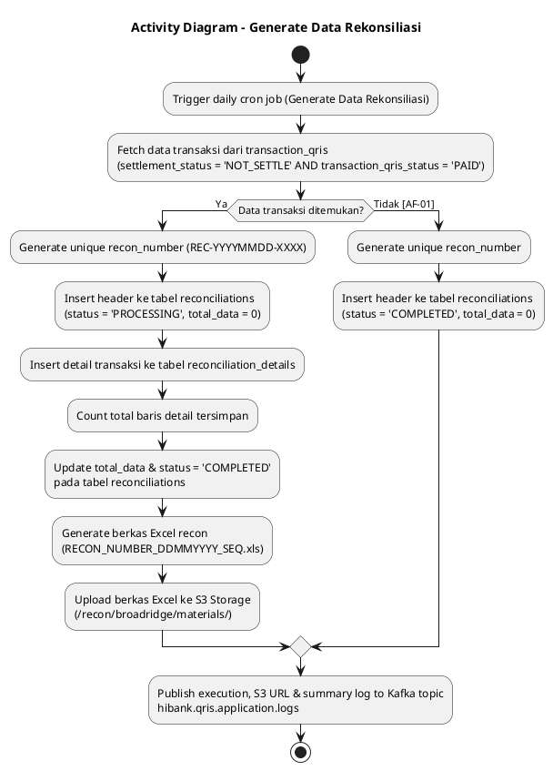
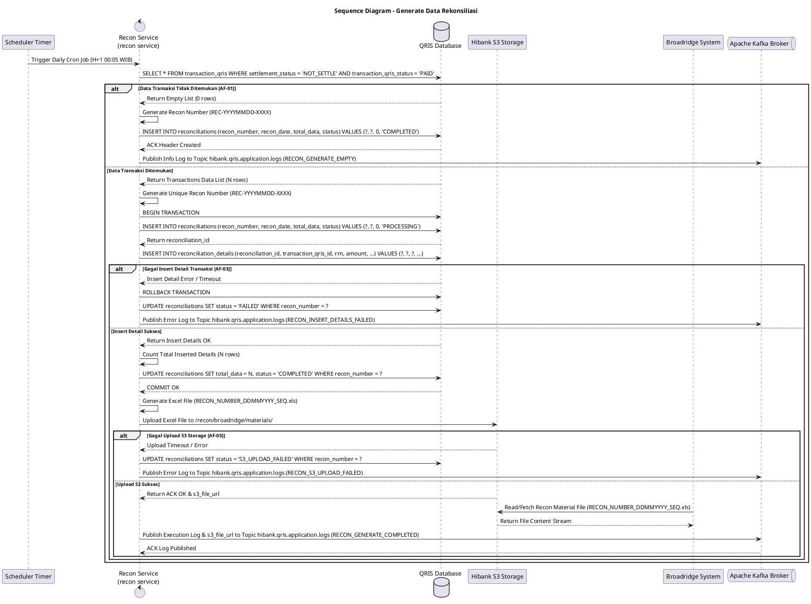

# 1 Deskripsi Use Case

**Tabel 1: Deskripsi Use Case Generate Data Rekonsiliasi**

| Elemen Spesifikasi | Deskripsi Detail |
| --- | --- |
| ID Use Case | UC-BOH-008 |
| Nama Use Case | Generate Data Rekonsiliasi |
| Penjelasan Singkat | Proses otomatisasi oleh `recon service` yang mengeksekusi penarikan data transaksi harian dari tabel `transaction_qris` berdasarkan penjadwalan (*scheduler*). Data yang diambil memuat kriteria `settlement_status = 'NOT_SETTLE'` dan `transaction_qris_status = 'PAID'`. `recon service` memproduksi nomor rekonsiliasi (*recon number*), menyimpan data header ke tabel `reconciliations` dan rincian transaksi ke tabel `reconciliation_details`, lalu menghitung (*count*) serta meng-update `total_data` pada tabel `reconciliations`. Setelah seluruh data tersimpan, `recon service` meng-generate berkas bahan rekonsiliasi berformat Excel dengan format penamaan `RECON_NUMBER_DDMMYYYY_SEQ.xls` dan mengunggahnya ke S3 Storage agar dapat dibaca oleh sistem Broadridge. |
| Aktor Utama | Sistem (`recon service` / Scheduler Service) |
| Aktor Pendukung | QRIS Database, Hibank S3 Object Storage, Broadridge Hibank Engine, Apache Kafka Broker |
| Deskripsi Singkat | Job scheduler otomatis memicu **`recon service`** sesuai dengan jadwal harian. `recon service` mengekstraksi seluruh transaksi harian dari tabel **`transaction_qris`** dengan kriteria `settlement_status = 'NOT_SETTLE'` dan `transaction_qris_status = 'PAID'`. `recon service` kemudian memproduksi *recon number* unik (contoh: `REC-YYYYMMDD-XXXX`), membuat record header pada tabel **`reconciliations`**, dan menyimpan rincian setiap baris transaksi ke tabel **`reconciliation_details`**. Setelah seluruh rincian transaksi tersimpan, `recon service` menghitung (*count*) jumlah baris data yang tersimpan dan memperbarui kolom `total_data` pada tabel **`reconciliations`**. Selanjutnya, `recon service` mengompilasi data transaksi tersebut ke dalam berkas Excel dengan penamaan **`RECON_NUMBER_DDMMYYYY_SEQ.xls`** dan mengunggahnya ke **Hibank S3 Object Storage** (`/recon/broadridge/materials/`) untuk dibaca dan diproses oleh sistem **Broadridge Hibank**. Log eksekusi dan ringkasan pemrosesan dipublikasikan ke Kafka Topic **`hibank.qris.application.logs`**. |
| Pre-condition | 1. Job scheduler harian pada `recon service` aktif dan berjalan sesuai interval/jadwal yang ditentukan. 2. Tabel `transaction_qris` memuat data transaksi QRIS dengan `settlement_status = 'NOT_SETTLE'` dan `transaction_qris_status = 'PAID'`. 3. `recon service` terhubung aktif ke QRIS Database, Hibank S3 Storage, dan Apache Kafka Message Broker. |
| Post-condition | 1. Record header baru dengan *recon number* unik berhasil tersimpan di tabel `reconciliations`. 2. Seluruh rincian baris transaksi target berhasil tersimpan di tabel `reconciliation_details`. 3. Field `total_data` pada tabel `reconciliations` ter-update secara akurat sesuai jumlah data detail yang tersimpan. 4. Berkas bahan rekonsiliasi Excel (`RECON_NUMBER_DDMMYYYY_SEQ.xls`) berhasil di-generate dan diunggah ke S3 Storage untuk dibaca oleh sistem Broadridge. 5. Log eksekusi dan ringkasan proses berhasil dipublikasikan ke Kafka Topic `hibank.qris.application.logs`. |
| Trigger | Penjadwalan otomatis harian (*daily cron timer*) pada `recon service`. |
| Nama Tabel | transaction_qris, reconciliations, reconciliation_details |
| Integrasi | 1. **Recon Service (`recon service`):** Microservice pemrosesan scheduler, penarikan data transaksi, pembuatan *recon number*, pengelolaan tabel `reconciliations` & `reconciliation_details`, pengompilasian file Excel, dan pengunggahan berkas ke S3. 2. **QRIS Database:** Repository utama penyimpanan tabel `transaction_qris`, `reconciliations`, dan `reconciliation_details`. 3. **Hibank S3 Storage:** Repository penyimpanan berkas Excel bahan rekonsiliasi terenkripsi (`/recon/broadridge/materials/`). 4. **Broadridge Hibank:** Sistem rekonsiliasi eksternal yang membaca berkas Excel hasil upload dari S3 Storage. 5. **Apache Kafka Message Broker:** Target pengiriman log eksekusi pada topic `hibank.qris.application.logs`. |
| Asumsi | 1. Transaksi harian yang telah terbayar tetapi belum masuk siklus penyelesaian memiliki `settlement_status = 'NOT_SETTLE'` dan `transaction_qris_status = 'PAID'` di tabel `transaction_qris`. 2. Format *recon number* bersifat unik untuk setiap eksekusi batch rekonsiliasi. |
| Keterbatasan | 1. Jika tidak ada data transaksi yang memenuhi kriteria `NOT_SETTLE` dan `PAID`, header pada `reconciliations` tetap dibuat dengan `total_data = 0` dan tidak ada baris yang dimasukkan ke `reconciliation_details` maupun pengunggahan berkas S3. |
| Aturan Bisnis/Sistem | 1. **Scheduler Automated Trigger:** `recon service` mengeksekusi job penyiapan/generasi data rekonsiliasi harian secara otomatis sesuai jadwal cron (misal H+1 pukul 00:05 WIB). 2. **Transaction Query Filtering:** `recon service` WAJIB memfilter data transaksi pada tabel `transaction_qris` secara presisi menggunakan parameter `settlement_status = 'NOT_SETTLE'` AND `transaction_qris_status = 'PAID'`. 3. **Recon Number Generation & Header Creation:** `recon service` meng-generate *recon number* unik (format: `REC-YYYYMMDD-XXXX`) dan memasukkan record header ke tabel `reconciliations` dengan status awal `PROCESSING` dan `total_data = 0`. 4. **Itemized Storage (`reconciliation_details`):** Seluruh baris transaksi hasil query dipetakan dan disimpan ke tabel `reconciliation_details` terhubung dengan `reconciliation_id` / `recon_number`. 5. **Count & Summary Update:** Setelah seluruh baris tersimpan di `reconciliation_details`, `recon service` melakukan penghitungan sekuensial (*count*) dan meng-update kolom `total_data` serta mengeset status `COMPLETED` pada tabel `reconciliations`. 6. **Excel Recon File Generation & S3 Upload for Broadridge:** Setelah data tersimpan di `reconciliation_details` dan `total_data` ter-update, `recon service` WAJIB meng-generate berkas Excel dengan penamaan terstandar `RECON_NUMBER_DDMMYYYY_SEQ.xls` (contoh: `REC20260812001_12082026_01.xls`) dan mengunggahnya ke S3 Storage path `/recon/broadridge/materials/YYYY/MM/DD/` agar dapat langsung diakses/dibaca oleh sistem Broadridge. 7. **Centralized Kafka Application Logging:** `recon service` WAJIB memublikasikan log transaksi (termasuk recon number, total_data tersimpan, S3 file URL, waktu mulai & selesai) ke Kafka Topic `hibank.qris.application.logs`. |
| Session Idle | 15 Menit |

# 2 Main Flow

**Tabel 2: Main Flow Generate Data Rekonsiliasi**

| No. | Aktivitas | Deskripsi |
| ---: | --- | --- |
| 1 | Pemicu Job Scheduler | `recon service` memicu job harian otomatis sesuai jadwal timer/cron untuk generasi data rekonsiliasi. |
| 2 | Query Data Transaksi Target | `recon service` melakukan query ke tabel `transaction_qris` untuk mengambil transaksi dengan kondisi `settlement_status = 'NOT_SETTLE'` dan `transaction_qris_status = 'PAID'`. |
| 3 | Generate Recon Number | `recon service` meng-generate nomor rekonsiliasi unik (*recon number*). |
| 4 | Menyimpan Header Rekonsiliasi | `recon service` memasukkan record baru ke tabel `reconciliations` berisi *recon number*, tanggal rekonsiliasi, dan status awal `PROCESSING`. |
| 5 | Menyimpan Detail Rekonsiliasi | `recon service` menyalin dan menyimpan seluruh data transaksi hasil query ke tabel `reconciliation_details`. |
| 6 | Menghitung & Update Total Data | `recon service` menghitung (*count*) total baris data yang tersimpan di `reconciliation_details`, lalu meng-update kolom `total_data` dan mengeset status `COMPLETED` pada tabel `reconciliations`. |
| 7 | Generate Berkas Excel Rekonsiliasi | `recon service` mengompilasi data rincian transaksi dari `reconciliation_details` ke dalam berkas Excel dengan format penamaan `RECON_NUMBER_DDMMYYYY_SEQ.xls`. |
| 8 | Mengunggah Berkas Excel ke S3 Storage | `recon service` mengunggah berkas Excel `RECON_NUMBER_DDMMYYYY_SEQ.xls` ke Hibank S3 Storage (`/recon/broadridge/materials/`) agar siap dibaca oleh sistem Broadridge. |
| 9 | Memublikasikan Log ke Kafka Broker | `recon service` memublikasikan log eksekusi, URL berkas S3, dan ringkasan jumlah data ke Kafka Topic `hibank.qris.application.logs`. |
| 10 | Use Case Selesai | Proses generasi data rekonsiliasi harian dan pengunggahan berkas Excel ke S3 untuk Broadridge selesai sepenuhnya. |

# 3 Alternative Flow

**Tabel 3: Alternative Flow Generate Data Rekonsiliasi**

| Kode | Alternative Flow | Deskripsi |
| --- | --- | --- |
| AF-01 | Tidak Ada Data Transaksi Target (`NOT_SETTLE` & `PAID`) | Pada langkah 2, apabila query ke `transaction_qris` tidak mengembalikan data, `recon service` tetap membuat header di `reconciliations` dengan `total_data = 0`, mencatat log info ke `hibank.qris.application.logs`, dan mengakhiri proses tanpa generate berkas S3. |
| AF-02 | Gagal Insert Header Rekonsiliasi (`reconciliations`) | Pada langkah 4, apabila terjadi error koneksi database atau konflik unik pada *recon number*, `recon service` menghentikan proses, me-rollback transaksi, dan memublikasikan log error ke `hibank.qris.application.logs`. |
| AF-03 | Gagal Menyimpan Detail Data (`reconciliation_details`) | Pada langkah 5, apabila proses batch insert ke `reconciliation_details` gagal atau mengalami timeout, `recon service` me-rollback simpanan detail, meng-update status header di `reconciliations` menjadi `FAILED`, dan memublikasikan log error ke `hibank.qris.application.logs`. |
| AF-04 | Gagal Update Count Total Data | Pada langkah 6, apabila update kolom `total_data` pada `reconciliations` gagal, `recon service` melakukan retry update hingga 3 kali. Jika tetap gagal, sistem menandai peringatan pada log Kafka `hibank.qris.application.logs`. |
| AF-05 | Gagal Generate / Upload Berkas Excel ke S3 Storage | Pada langkah 7 & 8, apabila `recon service` mengalami kegagalan pembuatan berkas Excel atau timeout upload ke S3 Storage, sistem melakukan retry 3 kali. Jika tetap gagal, `recon service` menandai status `S3_UPLOAD_FAILED` pada `reconciliations`, memublikasikan log error ke `hibank.qris.application.logs`, dan mengirim notifikasi alert operasional. |

# 4 Status Front-End

**Tabel 4: Status Front-End / Service Execution Status Generate Data Rekonsiliasi**

| No. | Nama Status | Deskripsi Status Eksekusi Recon Service |
| ---: | --- | --- |
| 1 | SCHEDULER_TRIGGERED | `recon service` telah terpicu oleh scheduler harian untuk memulai proses generasi. |
| 2 | TRANSACTIONS_FETCHED | Data transaksi dengan status `NOT_SETTLE` dan `PAID` berhasil ditarik dari `transaction_qris`. |
| 3 | RECON_HEADER_CREATED | *Recon number* berhasil di-generate dan record header tersimpan di tabel `reconciliations`. |
| 4 | DETAILS_INSERTED | Rincian data transaksi harian berhasil disimpan ke tabel `reconciliation_details`. |
| 5 | GENERATION_COMPLETED | Penghitungan (*count*) selesai, `total_data` pada `reconciliations` berhasil di-update. |
| 6 | EXCEL_GENERATED | Berkas Excel bahan rekonsiliasi `RECON_NUMBER_DDMMYYYY_SEQ.xls` berhasil disusun oleh `recon service`. |
| 7 | S3_UPLOADED_BROADRIDGE | Berkas Excel berhasil diunggah ke S3 Storage dan siap dibaca oleh sistem Broadridge. |

# 5 Activity Diagram Generate Data Rekonsiliasi

# 6 Sequence Diagram Generate Data Rekonsiliasi

# 7 Response Code

**Tabel 5: Response Code / Recon Service Response Code**

| No. | HTTP Status | Response Code | Nama Response | Deskripsi | Respons System / Scheduler |
| ---: | ---: | --- | --- | --- | --- |
| 1 | 200 | 200XX00 | RECON_GENERATE_SUCCESS | `recon service` berhasil mengambil data `NOT_SETTLE` & `PAID`, meng-generate recon number, menyimpan `reconciliations` & `reconciliation_details`, meng-update `total_data`, serta meng-upload file Excel `RECON_NUMBER_DDMMYYYY_SEQ.xls` ke S3 Storage untuk Broadridge. | Process generasi data rekonsiliasi dan unggah S3 selesai dengan sukses. |
| 2 | 200 | 200XX01 | RECON_GENERATE_EMPTY | Query ke `transaction_qris` tidak menemukan data transaksi target. Header `reconciliations` tersimpan dengan `total_data = 0`. | Job scheduler mengakhiri proses dengan status data kosong. |
| 3 | 400 | 400XX00 | RECON_INVALID_SCHEDULE_PARAM | Parameter tanggal atau pemicuan scheduler tidak valid. | Scheduler menerima error parameter. |
| 4 | 500 | 500XX00 | RECON_GENERATE_INTERNAL_ERROR | Terjadi kesalahan internal database saat pembuatan header, simpan detail ke `reconciliation_details`, atau update `total_data`. | `recon service` memublikasikan log error ke `hibank.qris.application.logs`. |
| 5 | 504 | 504XX00 | RECON_S3_UPLOAD_TIMEOUT | `recon service` mengalami timeout saat mengunggah berkas Excel `RECON_NUMBER_DDMMYYYY_SEQ.xls` ke Hibank S3 Storage. | Worker memublikasikan log error ke `hibank.qris.application.logs` dan memicu retry/alert. |

# 8 Desain Antarmuka

**Tabel 6: Desain Antarmuka / Monitor Recon Generation Dashboard**

| Halaman | Komponen dan State Utama |
| --- | --- |
| Dashboard Generasi Rekonsiliasi (Back Office Hibank) | - Card Summary: **Total Header Rekonsiliasi**, **Total Data Tersimpan (`total_data`)**, **Recon Number Terakhir**, **Status S3 Upload (`S3_UPLOADED_BROADRIDGE`)**. - Status Indicator: &nbsp;&nbsp;* Query `transaction_qris`: `SUCCESS` &nbsp;&nbsp;* Header `reconciliations`: `CREATED` &nbsp;&nbsp;* Detail `reconciliation_details`: `INSERTED` &nbsp;&nbsp;* Summary `total_data`: `UPDATED` &nbsp;&nbsp;* Excel Generation: `COMPLETED` &nbsp;&nbsp;* S3 Upload Broadridge: `SUCCESS` - Tabel Monitoring Batch Rekonsiliasi (`reconciliations` & `reconciliation_details`): &nbsp;&nbsp;* Kolom: Recon Number, Tanggal Recon, Total Data, Nama File Excel (`RECON_NUMBER_DDMMYYYY_SEQ.xls`), Status (`COMPLETED`, `S3_UPLOADED_BROADRIDGE`, `S3_UPLOAD_FAILED`), Tanggal Dibuat. - Badges Status: &nbsp;&nbsp;* `S3_UPLOADED_BROADRIDGE` (Green Badge) &nbsp;&nbsp;* `EXCEL_GENERATING` (Yellow Badge) &nbsp;&nbsp;* `S3_UPLOAD_FAILED` (Red Badge) - Action Buttons: **"Refresh Generation Status"**, **"Download Excel Recon File (`.xls`)"**, & **"View Detail Transactions (`reconciliation_details`)"**. |
